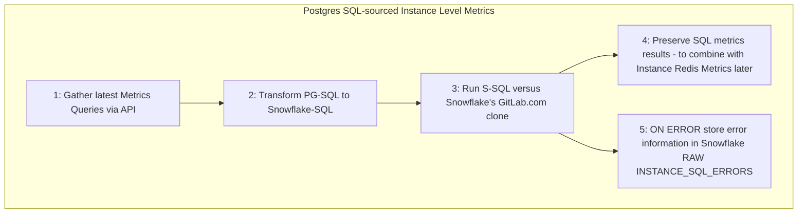
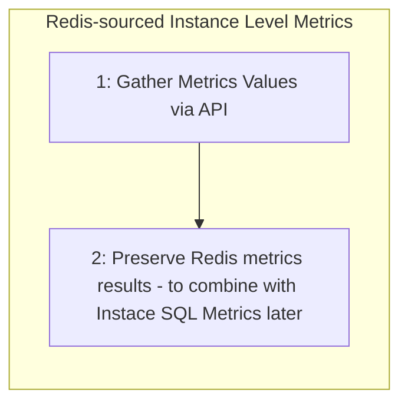
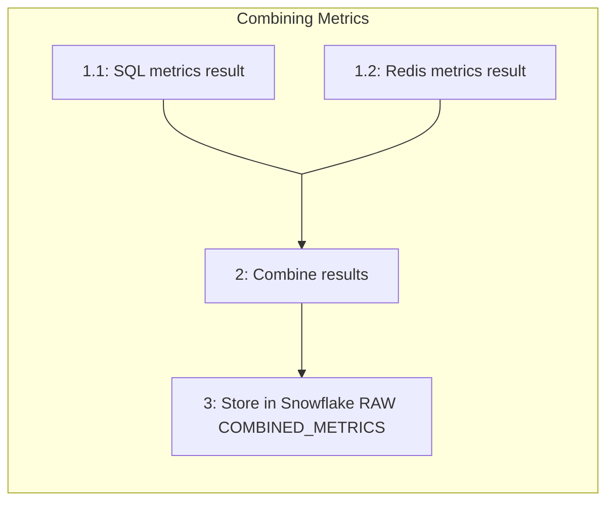
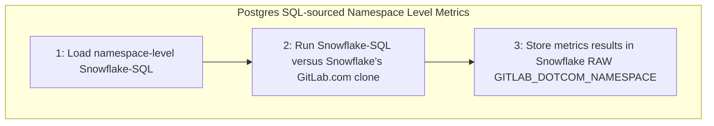
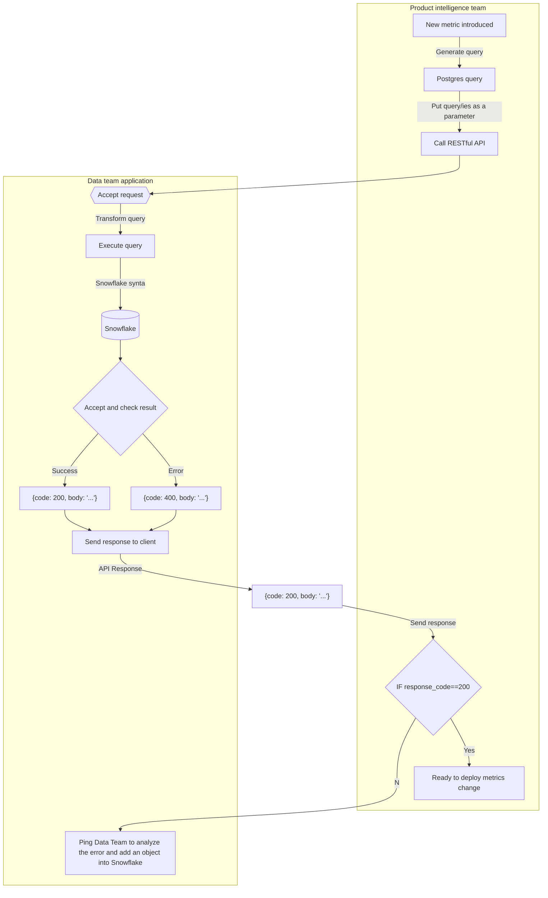

## On this page

- TOC
{:toc}

{::options parse_block_html="true" /}

---
## Service Ping Overview
 
Previously called `Usage Ping`, [Service Ping](https://docs.gitlab.com/ee/development/service_ping/) is a background process that [runs weekly](https://docs.gitlab.com/ee/development/service_ping/#how-service-ping-works) in a GitLab Instance and is responsible for collecting, aggregating, and packaging [a set of metrics](https://docs.gitlab.com/ee/development/service_ping/metrics_dictionary.html#metrics-definition-and-validation) useful for analytics purposes. Metrics are easily extensible, with new metrics changing regularly per the [Metric Lifecycle](https://docs.gitlab.com/ee/development/service_ping/metrics_lifecycle.html). The full set of metrics are defined in the [Metric Dictionary](https://gitlab-org.gitlab.io/growth/product-intelligence/metric-dictionary/). Once metrics are collected from the instance, they are bundled into a JSON payload (the "ping") and posted to the GitLab Versions App where they are then synced to downstream processes such as Snowflake. [Here is an example of a Service Ping Payload](https://docs.gitlab.com/ee/development/service_ping/#example-service-ping-payload). There are two primary variants of Service Ping: Self-Managed Service Ping and SaaS Service Ping. Self-Managed Service Ping runs versus a single-tenant deployment of GitLab, while SaaS Service Ping runs versus the multi-tenant GitLab.com.

### Service Ping Use Cases

Service Ping metics provide insights that help our Product, Support, and Sales teams understand how GitLab is used. For example, the data helps to:

1. Support [GitLab xMAU KPIs](https://about.gitlab.com/handbook/business-technology/data-team/data-catalog/xmau-analysis/) KPI
1. Calculate Stage Monthly Active Users (SMAU), which helps to measure the success of our stages and features
1. Understand which features are or are not being used and provide guidance to customers to help them take advantage of GitLab's rich feature set
1. Compare counts month over month (or week over week) to get a rough sense for how an instance uses different product features
1. Collect other facts that help us classify and understand GitLab installations

### Self-Managed Service Ping

Self-Managed customers setup and run Service Ping to provide analytics for their own deployments (instances) of GitLab. Customers optionally [disable Service Ping](https://docs.gitlab.com/ee/development/service_ping/#disable-service-ping) in which case metrics will not be sent to GitLab. Customers have access to Service Ping data through the console application.

### SaaS Service Ping

GitLab.com (or GitLab SaaS) is essentially a GitLab-hosted multi-tenant version of GitLab. A manually generated version of Service Ping (Manual SaaS Service Ping) has been implemented for SaaS and provides analytics coverge of SaaS equivalent to what we achieve with Self-Managed instances.

However, the current process suffers from two major sets of problems: 

**Performance Problems**

* The process is error-prone and causes resource contention with live customer activity
* The process is slow, and individual metric queries regularly fail
* The process is implemented to run manually during off-peak hours
* The process requires available staffing to manage end-to-end

**Data Coverage Deficiency**

In addition, Manual SaaS Service Ping is only capable of generating instance-level (the entire site) data and does not meet all the needs of Sales, Customer Success, and others who need more granular data from the `namespace` level to measure individual GitLab.com customer adoption.

To solve for these two primary sets of problems, the Data Team is developing "Automated SaaS Service Ping". Automated SaaS Service Ping is a set of programs that run natively in the [Enterprise Data Platform](/handbook/business-technology/data-team/platform/), a system designed for Big Data, Automation, and Scale. With Automated SaaS Service Ping fully operationalized, Manual SaaS Service Ping can be decomissioned. There are two major sub-programs that make up Automated SaaS Service Ping:

* **SaaS Instance Service Ping** - Automated weekly generation of Service Ping for the GitLab.com instance
* **SaaS Namespace Service Ping** - Automated weekly generation of Service Ping for every GitLab.com instance->namespace

#### 4 Types of Service Ping Processes Run Versus 3 Environments

In total, there are 4 types of Service Ping either in production or development:

| **Criteria** | 1. Self-Managed Service Ping | 2. Manual SaaS Service Ping | 3. Automated SaaS Instance Service Ping | 4. Automated SaaS Namespace Service Ping |
| :--- | :--- | :--- | :--- | :--- |
| Where Run | Environment 1: A Customer's Self-Managed Instance | Environment 2: Within GitLab.com Infrastructure | Environment 3: Data Platform Infrastructure | Environment 3: Data Platform Infrastructure |
| Run By | GitLab (Automatically) | Product Intelligence (Manually) | Airflow (Automatically) | Airflow (Automatically) |
| Frequency | Weekly | Weekly | Weekly | Weekly |
| Code Owner | Product Intelligence | Product Intelligence | Data Team | Data Team |
| Source Code | `Ruby`, `SQL` | `Ruby`, `SQL` | `Python`, `SQL`, `dbt` | `Python`, `SQL`, `dbt` |
| Data Granularity | Instance | Instance | Instance | Namespace |
| Development Status | Live-Production | Live-Production | In Development | Live-Production | 

## Automated SaaS Service Ping Implementation

`TL;DR`: 

The Automated SaaS Instance Service Ping process is more stable and faster, with `SQL Based` metrics taking 30 minutes to complete and `Redis Metrics` taking 1 minute. However, the lack of change data capture in the `Postgres Pipeline (PGP) 1.0` towards `Snowflake` results in less accurate data, especially with `all-time` metrics where the errors resulting from a lack of change data capture accumulate overtime. 

The `Manual SaaS Instance Service Ping` process is less stable and slower, with the entire process taking 20 hours and the `counts.ci_internal_pipelines` metric alone taking 12 hours to complete on the `2022-06-06` manual run. However, the Manual process generates more accurate data because it is run on the GitLab.com production database and it captures changes; therefore, the all-time metrics in particular are more accurate with the Manual process. 

In the final analysis, the Automated Process provides more stable data, faster; however, at a lower accuracy rate of the metric counts, in particular the all-time metrics. 

### Process Overview

**Automated SaaS Service Ping** is a collection of [python programs](https://gitlab.com/gitlab-data/analytics/-/blob/master/extract/saas_usage_ping/usage_ping.py) and dbt processes orchestrated with Airflow and scheduled to run weekly within the Enterprise Data Platform. The [Automated SaaS Service Ping Project](https://gitlab.com/gitlab-data/analytics/-/tree/master/extract/saas_usage_ping) stores all source code and configuration files. The program relies on two primary data sources: Redis based counters and SQL-Based postgres tables. Both sources are implemented as automated data pipelines into Snowflake, intended to run independently of the SaaS Service Ping implementation process.
* **SQL-Based** `Postgres` data from SaaS is synced via [pgp](https://gitlab.com/gitlab-data/analytics/-/tree/master/extract/postgres_pipeline) and made available in the `RAW.SAAS_USAGE_PING` schema
* **Redis data** is accessed at program runtime and also stored in the `RAW.SAAS_USAGE_PING` schema

Automated SaaS Service Ping consists of two major data processing phases.
1. **Phase 1** is gathering and generating the metrics as defined in the [Metric Dictionary](https://gitlab-org.gitlab.io/growth/product-intelligence/metric-dictionary/)
2. **Phase 2** is transforming the metrics into Trusted Data Model (FCT and DIM tables) format.

### Phase 1: Metrics Gathering and Generation

#### SaaS Instance Service Ping

SaaS Instance Service Ping runs as described in the Process Overview.

##### Instance SQL-based data flow



For more details on the data flow, check [Service ping README.md](https://gitlab.com/gitlab-data/analytics/-/blob/master/extract/saas_usage_ping/README.md) file.

##### Redis based data flow



##### Combined base data flow



##### SaaS Namespace Service Ping

SaaS Namespace Service Ping produces metrics at a finer-level of granularity than SaaS Instance Service Ping. The process accesses a list of all namespaces in GitLab.com and loops through each namespace to generate ultimate-parent namespace-level usage metrics. The [`namespaces`](https://gitlab.com/gitlab-org/gitlab/-/blob/master/db/structure.sql) table provides input to the program and for efficiency, a SQL set operation is used with SQL `GROUP BY` namespace-id instead of a traditional 1-by-1 namespace loop. **Final metrics output is stored at the ultimate parent namespace level**. A drawback with Namespace Service Ping is that only SQL-sourced metrics are currently available and Redis-sourced metrics such as `analytics_unique_visits.g_analytics_contribution` are currently unavailable.



###### Namespace backfill

This action can be done (primarily) by `AE` and `DE` can support it as well, if needed. The main idea is to have a simple and flexible way to backfill namespace data in a cost-effective fashion.

In order to backfill a `namespace` particular metric (or more of them), you need to properly configure `NAMESPACE_BACKFILL_VAR` in the `Airflow Admin -> Variables` tab.

The example how variable `NAMESPACE_BACKFILL_VAR` should look like:
```json
{
 "start_date": "2022-10-01",
 "end_date": "2022-11-25",
 "metrics_backfill": "['usage_activity_by_stage_monthly.manage.project_imports.git','usage_activity_by_stage_monthly.manage.groups_with_event_streaming_destinations','usage_activity_by_stage_monthly.manage.audit_event_destinations','counts.boards']"
}
```

##### Change the metrics definiton
In case you want to change the metrics type from **database** to **redis** in the metrics definition file, do the following steps:
* Got to metrics definition [page](https://metrics.gitlab.com/)
* Find the metrics you want to change
* Press the link, and you will be redirected to the `.yaml` file
* Press the `edit`/`edit in Web IDE` button and change `data_source: database` to `data_source: redis`
* Put a proper comment and check the option to create a new MR, here is an example of how [the merge request](https://gitlab.com/gitlab-org/gitlab/-/merge_requests/105682/diffs) should look like 
* Assing your new MR to a `PI` team member

The entire process can is explained in the [recorded sesion](https://youtu.be/qSeRqWNchVo)


**Note:** this backfill `DAG` will not load **all-time** metrics even if you define it _(will be skipped)_, as it will not produce an accurate result.

The `saas_usage_ping_backfill` `DAG` will backfill data for the metrics where the following conditions are applied: 
* For the defined period - `start_date` and `end_date` value from `NAMESPACE_BACKFILL_VAR` variable
* `"time_window_query": true`
* Metrics is in the value `metrics_backfill` in the variable `NAMESPACE_BACKFILL_VAR`

**Note:** the `DAG` should have status `ON`. By default, it is in the `OFF` status, as it is not scheduled. After run, turn off the `DAG`. Even if it is turned off, no harm, as the `DAG` will run one time only.

#### Metrics Gathering and Generation Process Pseudo-code

1. Assume the `GitLab.com` `Postgres` source data pipelines are running and fresh up-to-date data is available in Snowflake in `RAW.SAAS_USAGE_PING` and `PREP.SAAS_USAGE_PING` schemas, respectively
1. Begin [Service Ping python program](https://gitlab.com/gitlab-data/analytics/-/blob/master/extract/saas_usage_ping/usage_ping.py)
     1. Start **SQL-based** metrics generation
          1. Start Postgres SQL-sourced Metrics
               1. Grab the latest set of Postgres SQL-sourced (PG-SQL) metric queries from the [Metrics Dictionary API Query Endpoint](https://docs.gitlab.com/ee/api/usage_data.html#export-service-ping-sql-queries)
               1. Transform Instance-Level PG-SQL to Snowflake SQL (S-SQL) using the [python transformer](https://gitlab.com/gitlab-data/analytics/-/blob/master/extract/saas_usage_ping/transform_instance_level_queries_to_snowsql.py)
               1. Run S-SQL versus the SaaS GitLab.com clone data available in the Snowflake Data Warehouse and store the results in `RAW.SAAS_USAGE_PING.INSTANCE_SQL_METRICS`. In case of error, data will land in `RAW.SAAS_USAGE_PING.INSTANCE_SQL_ERRORS` table.
          1. Start **Redis-based** Metrics
                1. Call the Redis API
                1. Data is picked up and stored in a [JSON format](https://gitlab.com/-/snippets/2095831), the approximate size is around 2k lines, usually one file per load (at the moment, it is a weekly load) and the data is stored in `RAW.SAAS_USAGE_PING.INSTANCE_REDIS_METRICS`
     1. Start **Namespace-Level** metrics generation
          1. Grab the latest metrics queries from the [Namespace Queries JSON](https://gitlab.com/gitlab-data/analytics/-/blob/master/extract/saas_usage_ping/usage_ping_namespace_queries.json)
          1. Run the Namespace Queries versus the SaaS GitLab.com clone data available in the Snowflake Data Warehouse and store the results in `RAW.SAAS_USAGE_PING.GITLAB_DOTCOM_NAMESPACE`

### Phase 2: Metrics transformation to Trusted Data Model 

Once all of the source metrics are available in Snowflake `RAW.SAAS_USAGE_PING` schema, we begin dbt processing to transform the data into the Trusted Data Model format.
- [**SQL** based metrics dbt processing](https://dbt.gitlabdata.com/#!/model/model.gitlab_snowflake.saas_usage_ping_instance?g_v=1&g_i=%2Bsaas_usage_ping_instance%2B)
- [**Redis** based metrics dbt processing](https://dbt.gitlabdata.com/#!/model/model.gitlab_snowflake.instance_redis_metrics)
- [**Namespace**-level dbt processing](https://dbt.gitlabdata.com/#!/model/model.gitlab_snowflake.saas_usage_ping_namespace)

#### Known Limitations/Improvements

- Namespace-level Redis-source Metrics are not yet available
- Snowflake has redundant "legacy" service-ping processes and these need to be deprecated

### Service Ping Metrics Types

Within Service Ping, there are 2 main types of metrics supported:

- SQL metrics: metrics sourced from `Postgres` tables
- Redis metrics: metrics sourced from `Redis` based counters

<div style="width: 640px; height: 480px; margin: 10px; position: relative;"><iframe allowfullscreen frameborder="0" style="width:640px; height:480px" src="https://lucid.app/documents/embedded/038a320f-c20c-4f5c-adc6-8b1099d2bd95" id="wH0__OR9I5AZ"></iframe></div>

#### SQL Metrics Implementation

The SQL-based metrics workflow is the most complicated flow. SQL-based metrics are actually created by a SQL query run against the Postgres SQL database of the instance. For large tables, these queries can be very long to run. An example is for example the `counts.ci_builds` metric which is running a `COUNT(*)` on the ci_builds which is one of our largest (see dbt table containing more than 1 billion rows). The goal of this module will be to run against our Snowflake database instead of the postgres SQL database of our SaaS Instance.

The Product Intelligence team has created an API endpoint that enables us to retrieve all the SQL queries to run to calculate the metrics. Here is an example file.

A technical documentation about the API endpoint is available on the [export service ping sql queries](https://docs.gitlab.com/ee/api/usage_data.html#export-service-ping-sql-queries) page.

Let's take a look at a few queries received in the JSON response:

```json 
 "counts": {
    "assignee_lists": "SELECT COUNT("lists"."id") FROM "lists" WHERE "lists"."list_type" = 3",
    "boards": "SELECT COUNT("boards"."id") FROM "boards"",
    "ci_builds": "SELECT COUNT("ci_builds"."id") FROM "ci_builds" WHERE "ci_builds"."type" = 'Ci::Build'",
    "ci_internal_pipelines": "SELECT COUNT("ci_pipelines"."id") FROM "ci_pipelines" WHERE ("ci_pipelines"."source" IN (1, 2, 3, 4, 5, 7, 8, 9, 10, 11, 12, 13) OR "ci_pipelines"."source" IS NULL)",
    "ci_external_pipelines": "SELECT COUNT("ci_pipelines"."id") FROM "ci_pipelines" WHERE "ci_pipelines"."source" = 6",
    "ci_pipeline_config_auto_devops": "SELECT COUNT("ci_pipelines"."id") FROM "ci_pipelines" WHERE "ci_pipelines"."config_source" = 2",
    "ci_pipeline_config_repository": "SELECT COUNT("ci_pipelines"."id") FROM "ci_pipelines" WHERE "ci_pipelines"."config_source" = 1",
    "ci_runners": "SELECT COUNT("ci_runners"."id") FROM "ci_runners"",
    "ci_triggers": "SELECT COUNT("ci_triggers"."id") FROM "ci_triggers""
    ...
```

So the goal would be to be able to run them against tables in Snowflake _(synced from GitLab Saas)_. We need to do so, to have tables that have the same column names and the same granularity as the ones in the Postgres SQL tables.

Here below, you see the way we currently transform the Postgres data in Snowflake:


As highlighted here, we created a `dedupe` layer that is exactly meeting this criteria. `dedupe` layer is handy mechanism in order to avoid duplicates and provide accurate data without any compromise. 

We have then identified the tables against which we can run the SQL-based metrics queries. We will then need to transform the SQL statements to query against these tables.

We have a script running that transforms this SQL statements :

```sql
SELECT COUNT("ci_builds"."id") 
   FROM "ci_builds" 
  WHERE "ci_builds"."type" = 'Ci::Build'
```

to this SQL statement:

```sql
SELECT 'counts.ci_builds'    AS counter_name,  
       COUNT(ci_builds.id)   AS counter_value, 
       TO_DATE(CURRENT_DATE) AS run_day   
  FROM prep.gitlab_dotcom.gitlab_dotcom_ci_builds_dedupe_source AS ci_builds  
 WHERE ci_builds.type = 'Ci::Build'
```

We then run all these queries and store the results in a json that we send them to the table called `RAW.SAAS_USAGE_PING.INSTANCE_SQL_METRICS`. This table has the following columns:

- `query_map`: that stores all the queries run 
- `run_results`: that stores the results returns
- `ping_date`: date when the query got run
- `run_id`: unique identifier of the processing

For any error appeared, data is saved into `RAW.SAAS_USAGE_PING.INSTANCE_SQL_ERRORS` table. This table keeps data in `json` data type. On the top of the table, mechanism is build to incorporate any error in the `Trusted Data Model` and easily make any malfunction in the `SQL` processing visible. 

##### Error handling for SQL based service ping

For error handling solution, refer to [runnbooks Automated Service Ping](https://gitlab.com/gitlab-data/runbooks/-/tree/main/automated_service_ping/triage_issue_troubleshoot.md) article. 

##### New metrics checks

The `Data team` created an app and delivered it to the PI team as they are able to autonomically use it when any of the metrics are changed (SELECT statement) or added. This will prevent the issue with failing the pipeline in production, the common error is related to executing SQL on a non-existing object in the Snowflake database. The example issue should be found in the issue [2022-09-28 dbt-test Failure in test instance_sql_error_rowcount](https://gitlab.com/gitlab-data/analytics/-/issues/14316). Here is the idea of how it is working:




More details on app with the source code should be found in the [service-ping-metrics-check](https://gitlab.com/gitlab-data/service-ping-metrics-check/-/blob/main/README.md) repo.

#### Redis Metrics Implementation

Redis counters are used to record high-frequency occurrences of some arbitrary situation happening in GitLab, that do not create a permanent record in our Database, for example when a user folds or unfolds the side bar. In such cases, the backend engineer will define a name that would represent a given situation, for example navigation_sidebar_opened, and also arbitrarily decide on the moment (by adding dedicated piece of code in existing execution path) when it happens.

The Product Intelligence team has created an API endpoint that allows the Data Team to retrieve all Redis metrics value at any time we want. An example of the JSON Response is available on the page [UsageDataNonSqlMetrics API](https://docs.gitlab.com/ee/api/usage_data.html#usagedatanonsqlmetrics-api). Note that `-3` means that the metrics is not redis so the API doesn't retrieve any value for it. Once the JSON response received, we store it in Snowflake in the table `RAW.SAAS_USAGE_PING.INSTANCE_REDIS_METRICS`. Additional technical documentation about the API endpoint [is available here](https://docs.gitlab.com/ee/api/usage_data.html#usagedatanonsqlmetrics-api). The table has the following columns:

- `jsontext`: that stores all the queries run 
- `ping_date`: date when the query got run
- `run_id`: unique identifier of the processing

### Performance improvements

As a crucial advantage for `service ping` automation worth mentioning significant performance improvement. Graphical comparison is exposed in the picture below.


### Airflow setup

Airflow dag `saas-instance-usage-ping` run every Monday `0700 UTC` that executes all the operations described below:

- fetching the queries from the API Endpoint
- transforming the queries to be able to run them against Snowflake dedupe layer
- run the queries
- store the results in Snowflake 

## From RAW to PROD database and Sisense

We currently do a limited transformation once the data is stored in RAW. In the future, the data flow will look like that:

That means the data set created will be `UNIONED` with the current data pipeline in the model `prep_usage_data_flattened`.

## Reconciliation process - Manual VS Automated Service ping

We might want to add some content and details to this page regarding the known issues that we came across during the reconciliation process:

1. [Full sync is currently not enabled](https://gitlab.com/gitlab-data/analytics/-/issues/10163#note_969406760) for most of the Postgres db tables that read data from Gitlab.com using [PG replica process](https://about.gitlab.com/handbook/business-technology/data-team/platform/pipelines/#gitlab-postgres-database) as `Gitlab.com` production database
does not store deleted records and only holds incremental data.

Related Issues:
1. [Explore option to switch table load for full load (PG Replica)](https://gitlab.com/gitlab-data/analytics/-/issues/11727)
1. [Missing metrics from Automated process when compared to Manual process](https://docs.google.com/spreadsheets/d/1TqvBEzIx6VVH3SkTGvZ0WW6s2DG_1MdF2SQkUUjTJvQ/edit#gid=2137148156), this is due to the reasons as listed in this Issue.
1. The Geo related metrics are missing from Automated process as they are not enabled for `Gitlab.com`
1. We do not have a `100%` match in terms of metric values for metrics in Automated process when compared to Manual process, and these variances could be due to various factors  - run times of the process, History data not available in the new process etc..

Variance Frequency `%s` for `28d`, `all time` and `7d` is available below along with a detailed comparison of the metrics from Automated and manual process for different Ping dates:

1. [28d Metrics Comparison - Ping Date - 2022-06-06](https://docs.google.com/spreadsheets/d/1TqvBEzIx6VVH3SkTGvZ0WW6s2DG_1MdF2SQkUUjTJvQ/edit#gid=316391408)
2. [7d Metrics Comparison - Ping Date - 2022-06-06](https://docs.google.com/spreadsheets/d/1TqvBEzIx6VVH3SkTGvZ0WW6s2DG_1MdF2SQkUUjTJvQ/edit#gid=985361664)
3. [All time Metrics Comparison - Ping Date - 2022-06-06](https://docs.google.com/spreadsheets/d/1TqvBEzIx6VVH3SkTGvZ0WW6s2DG_1MdF2SQkUUjTJvQ/edit#gid=829001693)
4. [28d Metrics Comparison- Ping Date 2022-05-30](https://docs.google.com/spreadsheets/d/1TqvBEzIx6VVH3SkTGvZ0WW6s2DG_1MdF2SQkUUjTJvQ/edit#gid=596264172)
5. [7d Metrics Comparison - Ping Date 2022-05-30](https://docs.google.com/spreadsheets/d/1TqvBEzIx6VVH3SkTGvZ0WW6s2DG_1MdF2SQkUUjTJvQ/edit#gid=1968437392)

There are some broken queries that the `PI` team is working on fixing that directly impact the metrics values in the Automated process [[gitlab-org&5158](https://gitlab.com/groups/gitlab-org/-/epics/5158), [gitlab-org&7451](https://gitlab.com/groups/gitlab-org/-/epics/7451)].

### Useful links

1. [Data KR 1-2 Ship TD: SaaS Service Ping Automation and Deprecate Manual SaaS Service Ping](https://gitlab.com/groups/gitlab-data/-/epics/459)
2. [SaaS Instance-Level Service Ping Automation (replace PI Team Manual Service Ping)](https://gitlab.com/groups/gitlab-data/-/epics/363)
3. [Service Ping Automation data Validation](https://gitlab.com/gitlab-data/analytics/-/issues/10163)
4. [UAT Automated Instance SaaS Service Ping](https://gitlab.com/gitlab-data/analytics/-/issues/12299)
5. [Dashboard for Validation](https://app.periscopedata.com/app/gitlab/917941/SaaS-Service-Ping-Validation)
6. [SQL: Service ping reconciliation - manual VS automated](https://gitlab.com/gitlab-data/analytics/-/snippets/2260497)
7. [API access to single metrics definition](https://docs.gitlab.com/ee/api/usage_data.html#export-metric-definitions-as-a-single-yaml-file)
8. [Automated Service Ping technical documentation](https://gitlab.com/gitlab-data/analytics/-/blob/master/extract/saas_usage_ping/README.md)
