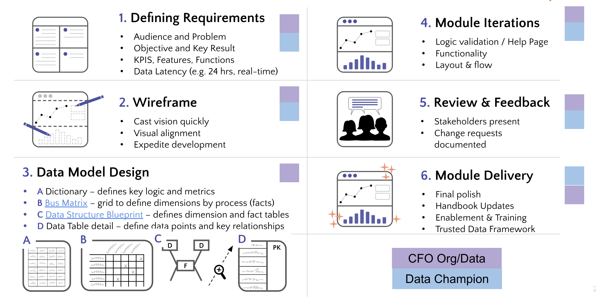

## On this page

{:.no_toc .hidden-md .hidden-lg}

- TOC
{:toc .hidden-md .hidden-lg}

## Data Development at GitLab

GitLab deploys four distinct but interrelated approaches to build data solutions that help drive insights and business decisions. These approaches are complementary to one another and are focused on delivering results at a level of speed, quality, and reliability required by the business, problem being solved, and question being asked. The approaches are complementary and evolutionary in nature, enabling development in an earlier stage to be leveraged in a later stage if required. Data solutions developed at an early stage can be improved and enhanced to a later stage if there is sufficient business need to do so. All analysis follows the well-established [Data Analysis Process](/handbook/business-technology/data-team/organization/analytics/#data-analysis-process).

These four approachs "Explorational', "Ad-Hoc","Business Insights", and "Trusted Data". 

|  | Explorational | Ad-hoc | Business Insights | Trusted Data |
| :-- | :-: | :-: | :-: | :-: |
| When To Use | **Prototyping / Flexible Analysis** |  **Directional / Urgent Analysis** | **Routine / Operational Analysis** | **Mission Critical Analysis** | 
| Manual adding data | optional | N/A| N/A | N/A |
| Creating own data structures | optional | N/A | N/A | N/A | 
| Visualization using [SiSense](/handbook/business-technology/data-team/platform/sisensecdt) | optional | optional | **required** | **required** |
| Built Using the [Enterprise Dimensional Model](/handbook/business-technology/data-team/platform/edw) | optional | optional | optional | **required** |
| Registered in the [Data Catalog](/handbook/business-technology/data-team/data-catalog/) | N/A | optional | **required** | **required** |
| Follows [Trusted Data Development](/handbook/business-technology/data-team/data-development/#trusted-data-development) process | N/A | optional | optional | **required** |
| Tested using the [Trusted Data Framework](/handbook/business-technology/data-team/platform/#tdf) | N/A | optional | optional | **required** |
| Auditable w/linkage to source systems | N/A | optional | optional | **required** |
| 'Trusted Data' Branded |  N/A | N/A |  N/A | **required** |
| 'Business Insights' Branded |  N/A | N/A | required | N/A |

### Explorational Data Development

**Explorational** gives ultimate flexibility to prototype on data solutions. If a new data set needs to be explored and new transformations need to be built in a fast-paced iterative way, the Explorational Data Development can be used. Because of its nature of flexibility, it is not suitable to make mission critical decisions. It's a first step for maturing the data solution.

### Ad-hoc Data Development

**Ad-hoc** is the typical a step of any analysis effort and results in the delivery of a report or dashboard for one-time or limited use. Ad-hoc development is performed when no existing data solution answers the questions being asked. Code developed for ad-hoc analysis is not written to be leveraged in a long-term solution, rather it is mean to deliver results quickly. To complete ad-hoc analysis, Analysts typically write and run SQL queries versus the Enterprise Data Warehouse, extract data to analyze using tools like Sisense or Python, or perhaps leverage existing dashboards. At times, new data may need to be sourced from text files, spreadsheets, or other data sources. 

Most of the time the ad-hoc report solves for the immediate business need and no further action is required. However, sometimes the results of ad-hoc analysis yield results that require additional analysis. And at times, the results of ad-hoc analysis are important enough to warrant developing into a more reliable solution at which point a decision is made to create a Business Insights solution or Trusted Data solution.

### Business Insights Data Development

**Business Insights** constitute the majority of solutions where stable and reliable reports are required, but a structured enterprise dimensional model is not available yet. Business Insights solutions serve as the SSOT for their respective metrics and play an important role in the overall reporting landscape. 

Business Insights solutions differ from ad-hoc reports because they include quality validations such as data testing, code review, and registration in the Data Catalog. Business Insights solutions may leverage portions of the EDM, but will not be based entirely on it. However, when compared to a Trusted Data Solution, a Business Insights solution lacks complete test coverage and EDM coverage.

### Trusted Data Development

**Trusted Data** delivers the most complete, reliable, and accurate analytics available to an enterprise. Over time as an organization matures and value of analytics increases, Trusted Data evolves and development rigor also evolves, but the core steps remain consistent and include requirements gathering, design, iterative wireframing, testing, and operational monitoring.

#### Trusted Data Solution Criteria

All Trusted Data solutions must meet the following criteria:

1. The business problem is defined with clear revenue impact established
1. A [Data project](https://gitlab.com/gitlab-data/analytics/-/issues) Epic is created to manage development
1. Requirements and success criteria are captured and tracked in the Epic
1. Scope is defined for v1.0 and v1.1, with a release cycle established up-front (e.g. weekly, bi-weekly, monthly)
1. A Dashboard Wireframe is created in Lucid or Sisense and shared with users, iterating to "final draft"
1. The Dimensional Data Model is designed and integrated into the [Enterprise Dimensional Model Bus Matrix](https://docs.google.com/spreadsheets/d/1j3lHKR29AT1dH_jWeqEwjeO81RAXUfXauIfbZbX_2ME/edit#gid=742713121)
1. [Trusted Data Tests](https://about.gitlab.com/handbook/business-technology/data-team/platform/dbt-guide/#trusted-data-framework) are created and deployed
1. The solution enters a User Acceptance Testing phase, including data validations to source systems
1. The solution is registered in the [Data Catalog](/handbook/business-technology/data-team/data-catalog/)
1. The solution is deployed, including any required training and user enablement

## Database Implementation 

In any case, data is made available in the `PROD` database, throughout multiple schemas. Data can be read out of multiple schemas in Snowflake and Sisense. 

### Explorational Database Implementation

**Explorational Data Development** takes place in Snowflake in the `PROD` database. Dedicated schemas are made available per department. In the schemas users have read and write permissions in order to create tables, add columns and prototype data solutions. The schemas are prefixed with `EXPLORATIONAL_` or `RESTRICTED_SAFE_EXPLORATIONAL_` if it contains MNPI data.
 
Functional ownership of the schemas resides with the departmental VP (or equivalent). This means that VP needs to provide approval in case of an _Access Request_ and carries the responsibility of proper usage of the data in the schema (i.e. in case of MNPI, PII and sensitive data).

### Ad-Hoc Database Implementation

To make data available for **Ad-Hoc Data Development**, data is untransformed and made available in the Snowflake `PROD` database. The data is made available as an _1 on 1 copy_ from the source. Sometimes, depending on the source and extraction, data is deduplicated.
 
There are dedicated schemas available in the `PROD` database. The schemas for **Ad-Hoc Data Development** are prefixed with `WORKSPACE_` or `RESTRICTED_SAFE_WORKSPACE_` if it contains MNPI data. In order to make data available in the `PROD` database schemas, `dbt` models are created. 

### Business Insights Database Implementation 
Because **Business Insights Data Development** is a combination of **Ad-Hoc Data Development** and **Trusted Data Development** it will leverage both the schemas mentioned for their particular development methodology.

### Trusted Data Database Implementation 
**Trusted data** is only available on the `PROD` database. It follows the EDM methodology. There are dedicated schemas available in the `PROD` database for **Trusted data**. The schemas for **Trusted Data Development** are prefixed with `COMMON_` or `RESTRICTED_SAFE_COMMON_` if it contains MNPI data. In order to make data available in the `PROD` database schemas, `dbt` models are created for transforming the data towards an Enterprise Data Model (fact and dimension tables).

