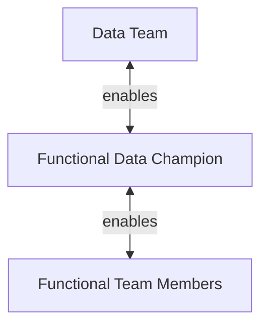

## On this page
{:.no_toc .hidden-md .hidden-lg}

- TOC
{:toc .toc-list-icons .hidden-md .hidden-lg}

---

`This page contains forward-looking content and may not accurately reflect current-state or planned feature sets or capabilities.`

## Overview

The Data Champion Program is a modern solution to develop Data Acumen and Data Capabilities across an organization with existing team members. As opposed to relying on a central Data Team for all data needs, the Data Champion Program uses an inside-out and [train-the-trainer](https://www.toolshero.com/management/train-the-trainer/) approach to develop Data from within functional teams, leveraging expertise, content, and programs created by central Data Team experts.

The goals of the Data Champion Program include:

- Leveraging Data as a key company asset and helping everyone make their best decisions with data
- Creating a path for functional teams to become Data self-sufficient, including Self-Service Dashboard development and SQL Analysis
- Accelerating the adoption of data-driven techniques and approaches
- Improving Data Quality and Data Accountability
- Helping to grow an active Data community

## Approach

The Data Champion approach identifies one individual in each functional team to serve as (a) the Data DRI for their team and (b) as a [stable counterpart](/handbook/leadership/#stable-counterparts) to the Data Team. Data Team leadership and the Data Champion collaboratively develop a **Data Success Plan** to define vision, responsibilities, and objectives, taking into consideration the functional team's unique data needs, aptitudes, and existing data acumen. Among other things, the Plan establishes a training schedule covering GitLab Data Assets (reports, dashboards, data models), Self-Service Capabilities, and the Data Roadmap. To help develop Data Acumen within their team, the Data Champion has a responsibility to promote data practices through a local Data competency center.

## Data Champion Responsibilities

1. Develop a Data Success Plan in coordination with the Data Team
1. Serve as Data DRI for their functional team, capturing all Data requests, including Data Quality problems
1. Prioritize and stack-rank Data Issues and Epics, ensuring the Data Issue Board remains up-to-date
1. Communicate priorities to the Data Team through the Issue Board
1. Develop a Data handbook page geared to their functional team audience, such as [Data For Product Managers](/handbook/business-technology/data-team/programs/data-for-product-managers/)
1. Regularly communicate and cascade data news and practices
1. Helps to improve Data Quality in source systems
1. Watch changes in source systems and help incorporate necessary updates in the Enterprise Data Warehouse

### Requirements

- Devote 1-2 hours per week to the program, flexing time as initiatives develop
- Commitment to developing personal and team Data competencies
- [Intermediate SQL](https://softwareengineering.stackexchange.com/questions/181651/are-these-sql-concepts-for-beginners-intermediate-or-advanced-developers) experience
- Data Visualization experience
- Data Modeling experience; [Zuora Example](https://knowledgecenter.zuora.com/CPQ/A_Zuora_CPQ/A2_Zuora4Salesforce_Object_Model), [Salesforce Example](https://developer.salesforce.com/docs/atlas.en-us.api.meta/api/sforce_api_erd_majors.htm)

## Program Target

| Area                                     | Current State                                                                      | Target State                                                                                                                                                                         |
| ---------------------------------------- | ---------------------------------------------------------------------------------- | ------------------------------------------------------------------------------------------------------------------------------------------------------------------------------------ |
| Data Prioritization for Functional Team  | Data Team                                                                          | Data Champion, supported with [Value Calculator](/handbook/business-technology/data-team/how-we-work/#data-team-value-calculator)                                                           |
| Data Issue Board for Functional Team     | Data Team                                                                          | Data Champion & Data Team maintain                                                                                                                                                   |
| Data DRI for Functional Team             | Does Not Exist                                                                     | Data Champion acts as Data DRI for their Functional Team                                                                                                                             |
| Data _for Functional Team_ Handbook      | No page exists                                                                     | Data Champion and Data Team maintain                                                                                                                                                 |
| Communicate Data News to Functional Team | No regular communication                                                           | Data Champion regularly attends Data Team meetings and passes relevant news to Functional Team                                                                                       |
| Sisense Training                         | Online Tutorials & periodic Live Training by Data Team                             | Data Champion customizes for Functional Team and provides required training                                                                                                          |
| Data Collection and Processing           | Data Team manages all Handbook documentation and helps to update dbt documentation | Data Champion stays up-to-date in source system quality and model changes and communicates necessary updates to Data Team for implementation, including helping to maintain handbook |
| Data Privacy and Protection              | Data, Legal, Security, and Compliance teams responsible for privacy review         | Data Champion helps Data, Legal, Security, and Compliance teams to understand data elements which may require privacy assessment and helps maintain appropriate documentation        |
