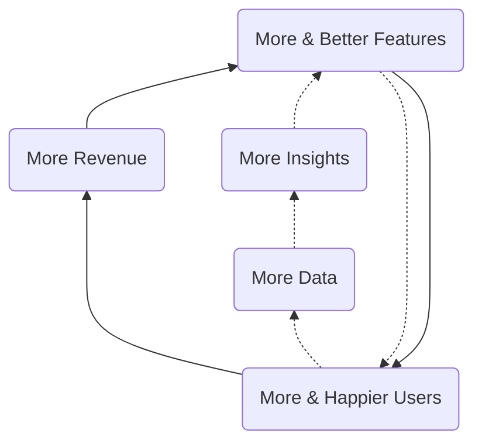
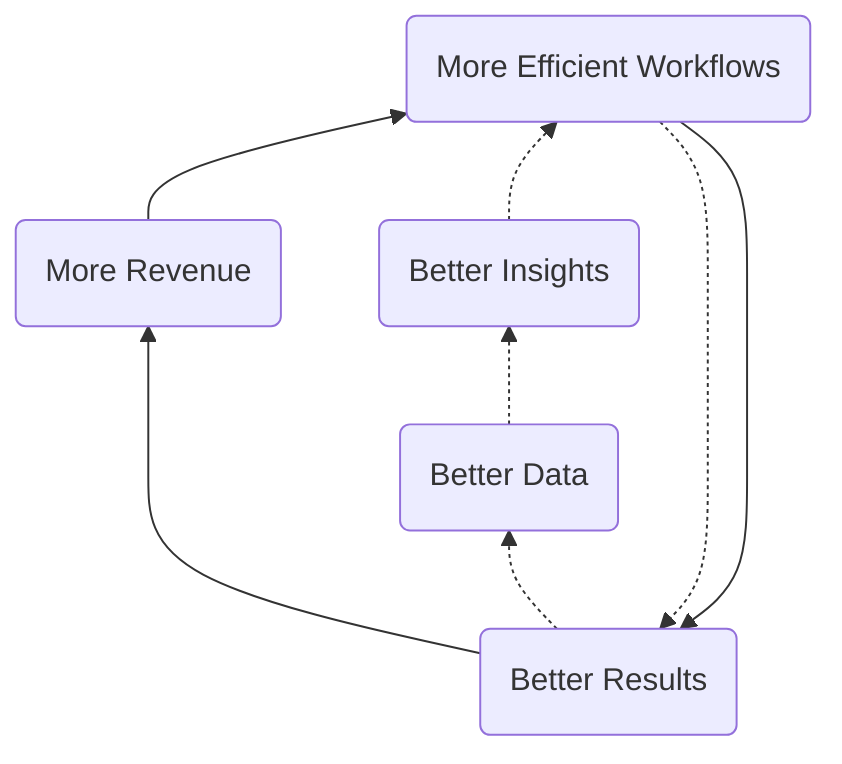
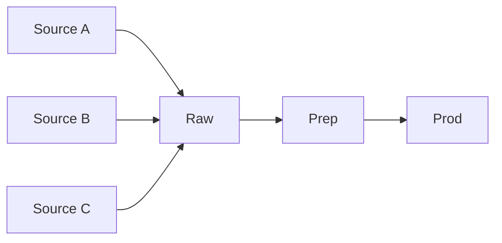
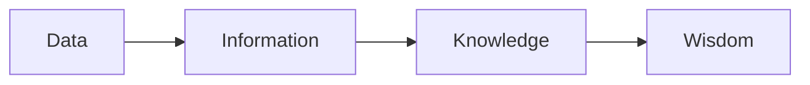

## On this page
{:.no_toc .hidden-md .hidden-lg}

- TOC
{:toc .toc-list-icons .hidden-md .hidden-lg}

---

`This page contains forward-looking content and may not accurately reflect current-state or planned feature sets or capabilities.`

## Data Development Timeline

**How did we get here?** The [Data Development Timeline](/handbook/business-technology/data-team/direction/timeline) page provides coverage of the Data Team's accomplishments and the path we have taken to create today's team, technology platform, and programs.

## FY24 Data Strategy

In November-2022 we held several cross-team sessions to help align on the GitLab data strategy for FY24. Parcipants included Finance, Marketing, Sales Strategy, and Customer Success.

- [FY24 X-Functional Data & Analytics Agenda](https://docs.google.com/document/d/1mHpP2m8Af5Qr7t9RkGBtVVCjYBs6bM-GsjI23jWyJzc/edit#heading=h.roi3bqp13662)
- [FY24 X-Functional Data & Analytics Planning Deck](https://docs.google.com/presentation/d/1UXIKCir35b9ReHBN0rpLaYAshih5gIktgr1JahUedoY/edit#slide=id.g15464c2a8e6_0_0)

Outcomes of the strategy workshops include:
- [360 Customer IQ](https://docs.google.com/presentation/d/1hazljtcmgkhOYaOVTXLhVFzA5IhQxWdee_ocIBRndMs/edit#slide=id.g123a13deda8_0_405) 
- [Customer Journey](https://docs.google.com/presentation/d/1YUpb-6mhKz-Z20cx0wrycjmPqHMNSdPGzAJSyFBITFM/edit)
- [Analytics Platform](https://docs.google.com/presentation/d/1dR7FYFWIvNa2mfLkG2TsJbyVQ7UGJAyWdwMknKbAU5w)
- [Data Customer Zero](https://docs.google.com/presentation/d/1PjaFAEaePZgz2BgB_pgLAY3zy81ugvo0a1gj0en-h54/edit#slide=id.g15464c2a8e6_0_0)
- [FY24 X-Functional Analytics Projects](https://docs.google.com/spreadsheets/d/10QwZQG3PLSuaKt3hfe2gqq9pFEMQb8s0goOgiMzyH1I/edit#gid=0)
- [FY24 UCID Roadmap](https://docs.google.com/spreadsheets/d/1wddU5apO3a2VBuulofSFaKUPFKW8jW4OVQrbOiCfLz0/edit#gid=0)

## FY23 Data Strategy

In November-2021 we held several cross-team sessions to help align on the GitLab data strategy for FY23. Parcipants included Growth, Finance, Marketing, Sales Strategy, and Customer Success.

- [Strategy Worksheet](https://docs.google.com/spreadsheets/d/11fkA6hAGcZGrVj7Ho2LIzHk9JGukG-x77KbC9Unsj0Q/edit#gid=0)
- [Project Team Issue (internal link)](https://gitlab.com/gitlab-data/analytics/-/issues/10588) 

We are in progress of running the exercise for Q4.

## Strategy

As an important step towards achieving our [mission](/handbook/business-technology/data-team/#mission), meeting our [responsibilities](/handbook/business-technology/data-team/#responsibilities), and helping GitLab [become a successful public company](/handbook/being-a-public-company/), we are creating an Enterprise Data Platform (EDP), a single unified data and analytics stack, along with a broad suite of Data Programs such as Self-Serve Data and Data Quality. The EDP will power GitLab's KPIs, cross-functional reporting and analysis, and in general, allow all team members to make better decisions with trusted data. Over time, the EDP will further accelerate GitLab's analytics capabilities with features such as data publishing and products - enriched and aggregated data integrated into business systems or into the GitLab product for use by our customers. This acceleration happens through the development of "Data Flywheels", much like GitLab's [Open Core and Development Spend](https://about.gitlab.com/company/strategy/#dual-flywheels) flywheels.

### 1) Customer Centricity
KPI: Revenue/Efficiency gains from Data Products
Definition:
1. Visibility and deep understanding of how our customers use our product and interact with our teams
1. Focus on the Customer Journey Lifecycle & Related Analytics
1. Build a Better GitLab for our Customers. Be customer zero.

### 2) Data Community
KPI: Data Engagement measured by MAU
Definition:
1. Create a community where everyone can make their best decisions with data built on SSOT Data Architecture and One Data Warehouse
1. Best-in Class Talent, Tenure, and Growth

### 3) GitLab Culture of Data First
KPI: % of Top cross functional & LRO Projects with Measurement plans 
Definition:
1. All product features logged for analysis in a centrally governed way
1. Iteration and experimentation to drive business value
1. Strong visibility into key business results, business processes, product behavior and programs
1. Data Governance across business systems, product, and warehouse so we all speak the same language
1. Be customer zero for ML Ops

### 4) World class data and analytics capabilities
KPI: % Analytics Time on Level 1 / 2 work
Definition:
1. Scalable data platform, data collection, modeling, and visualization
1. Master data management 
1. Create unified data models with robust governance
1. Cutting-edge data and analytics tools available to team members 
1. Integrate advanced analytics with our business processes

## Data Capability Model

The Data Capability Model lists six levels (0-5) that correspond to the data maturity of a company.

It is used to identify target state requirements to support [GitLab's Company Strategy](https://about.gitlab.com/company/strategy).

**To help GitLab become a public company, we need our lead-to-cash and public-facing metrics to reach Level 2 of the capability model.**

| Level                                                                                   | Characteristics                                                                                                                                                                        | Benefits                                                                                              |
| --------------------------------------------------------------------------------------- | -------------------------------------------------------------------------------------------------------------------------------------------------------------------------------------- | ----------------------------------------------------------------------------------------------------- |
| (5)Prescriptive                                                                         | Real-time complex analysis embedded in products, shape actions and perceptions; Data analytics is a strategic differentiator                                                           | New Data Products, Improved Decision ROI                                                              |
| (4)Predictive                                                                           | Data Science” Insight into what is likely to happen, Widespread and effortless analytics production, Enterprise Data Quality and Governance                                            | Reliable Customer Lifetime Value, Expansion & Churn Prediction, Product Embedded Analytics            |
| (3)Strategic                                                                            | Widespread & effortless drillable analysis, Drillable cross-functional scorecards, dashboards, Enterprise Data Warehouse                                                               | Customer 360 & Health Score, Predictable & Trusted Data Reporting, Robust Self-Service & Data @ Scale |
| (2)Advanced: [Reference Solution](/handbook/business-technology/data-team/direction/reference/) | Operational Automated Reports and Dashboards, Reliable and validated data with automated tests, Mixture of manual and automated integration, core integrated data with some Data silos | Trusted Data, Self-Service Data, Key Performance Indicators, Stable platform for expansion            |
| **(1)Reactive**                                                                         | Static lists and reports, Highly focused on history/lagging - last 30/90/365 days, Unpredictable velocity, minimal cross-functional analysis, Data Silos                               | Historical Tabular Reports, Data Visualization                                                        |
| (0)None                                                                                 | Inconsistent report generation, Results not widely trusted, No stable analytics infrastructure                                                                                         |                                                                                                       |

## Quarterly Objectives

### Data Flywheels

#### Customer & Product Intelligence Flywheel

The Customer & Product Intelligence Flywheel is focused on improving the Customer Experience and encompasses the data and analytics involved in user-product interactions, customer use cases, product development, product adoption, and most aspects of the [Customer Journey](https://about.gitlab.com/handbook/customer-success/vision/).

#### Corporate Intelligence

The Corporate Intelligence Flywheel is focused on improving (internal) Business Efficiency and this is accomplished by instrumenting, monitoring, and improving business workflows. Common outputs of Corporate Intelligence teams include performance dashboards, balanced scorecards, KPIs, MBOs, and related data-enabled frameworks.

### Long-Term Direction

Measured in Years, our long-term direction is to extend the EDP with features found in a mature [Enterprise Data Platform](/handbook/business-technology/data-team/direction/#a-complete-enterprise-data-platform) such as master data management, a data lake, and advanced analytics. Also, once we have reached Level 2, we:

- want to find more ways to contribute to open-source data projects
- would like to work with [Meltano](https://meltano.com/) as a data pipeline and processing component
- want to integrate aspects of the EDP with GitLab.com to provide deep analytic capabilities to GitLab's customers
- provide DevOps Industry Benchmark Reports along the lines of [Okta's Business @ Work](https://www.okta.com/businesses-at-work/)
- revisit our overall data tech stack to ensure we have the required elements to reach Level 3

### Measuring Success

We will measure progress towards our short-term direction in the following ways:

1. [Data Team KPIs](/handbook/business-technology/data-team/direction/#data-team-kpis)
1. The business impact of our results as they align to the [Data Value Pyramid](/handbook/business-technology/data-team/direction/#data-value-pyramid)
1. The data features we provide as they map to the [Data Capability Model](/handbook/business-technology/data-team/direction/#data-capability-model)
1. The Data Team Quarterly Report Card

We have not yet defined criteria for measuring long-term progress.

#### Data Team KPIs

1. `All-Time` Number of Self-Service Data Customers Enabled
1. `Monthly` Number of active Self-Service Dashboard Developers
1. `Monthly` Number of active Self-Service SQL Developers
1. `Monthly` % of Dashboard Traffic From User Generated Content

## A Complete Enterprise Data Platform

The following table represents capabilities of a mature Enterprise Data Platform which can solve for the wide range of data and analytics needed by a large business. Not all capabilities listed are required to meet GitLab's short-term needs or known long-term needs. The decision to implement a given capability will be driven by a clear business need and the final result may differ significantly from the reference example.

|                                                                                                                               |                                                                                                    |                                                                                                     |
| ----------------------------------------------------------------------------------------------------------------------------- | -------------------------------------------------------------------------------------------------- | --------------------------------------------------------------------------------------------------- |
| [Data Architecture](https://en.wikipedia.org/wiki/Data_architecture)                                                          | [Data Security](https://en.wikipedia.org/wiki/Data_security)                                       | [Data Quality](https://en.wikipedia.org/wiki/Data_quality)                                          |
| [Descriptive](https://www.kdnuggets.com/2017/07/4-types-data-analytics.html)                                                  | [Diagnostic](https://www.kdnuggets.com/2017/07/4-types-data-analytics.html)                        | [Advanced Analytics](https://www.gartner.com/en/information-technology/glossary/advanced-analytics) |
| [Reporting](https://en.wikipedia.org/wiki/Report)                                                                             | [Dashboarding](https://www.microstrategy.com/us/resources/introductory-guides/business-dashboards) | [Self-Service](https://www.gartner.com/en/information-technology/glossary/self-service-analytics)               |
| [Operational Data Store](https://en.wikipedia.org/wiki/Operational_data_store)                                                | [Data Warehouse](https://en.wikipedia.org/wiki/Data_warehouse)                                     | [Data Lake](https://aws.amazon.com/big-data/datalakes-and-analytics/what-is-a-data-lake/)           |
| [Data Model Standards](https://en.wikipedia.org/wiki/Data_modeling)                                                           | [Enterprise Dimensional Model](https://en.wikipedia.org/wiki/Dimensional_modeling)                 | [Data Marts ](https://en.wikipedia.org/wiki/Data_mart)                                              |
| [Reference Data Management](https://en.wikipedia.org/wiki/Reference_data)                                                     | [Data Enrichment](https://www.redpointglobal.com/blog/what-is-data-enrichment)                     | [Master Data Management](https://en.wikipedia.org/wiki/Master_data)                                 |
| [Data Pipeline](https://www.alooma.com/blog/what-is-a-data-pipeline)                                                          | [Data Transformation](https://en.wikipedia.org/wiki/Data_transformation)                           | [Real-Time Data](https://en.wikipedia.org/wiki/Real-time_data)                                      |
| [Data Exports](https://www.qualtrics.com/support/survey-platform/data-and-analysis-module/data/download-data/export-formats/) | [Data Publishing](https://en.wikipedia.org/wiki/Open_data)                                         | [Data Products](https://hbr.org/2018/10/how-to-build-great-data-products)                           |
| [Data Taxonomy](https://www.nielsen.com/us/en/insights/resource/2019/why-you-need-a-data-taxonomy/)                           | [Data Catalog](https://www.alation.com/blog/what-is-a-data-catalog/)                               | [Data Portal](https://dataportals.org/)                                                             |

### Data Platform FY23 initiatives
 
The following sections describe the Data Platform FY23 initiatives.
 
#### Data Observability
 
Data is landed from different source systems in the `raw` data layer and processed/transformed in the `prep` and `prod` before it becomes available to business users via Sisense, data pumps, queryable in Snowflake and other ways. All transformations are performed by dbt. All the data that is in `raw` changes over time, because data is changed in the source systems and therefore also needs to be processed downstream towards the `prep` and `prod` layer.
 

 
Currently there are about 35 [source systems](/handbook/business-technology/data-team/platform/#data-sources) extracted:
- Data is landed in 1900 different tables
- There are over 1700 dbt models 
- Multiple different end points (including i.e. Sisense, Data Pump, Data Spigot, Qualtrics, Snowflake GUI)
 
Currently there is monitoring available to check failures in the process, from extracting until making it available for the different end points. This is done via our [Trusted Data Framework](/handbook/business-technology/data-team/platform/#tdf) with by default monitors in [Monte-Carlo](/handbook/business-technology/data-team/platform/monte-carlo/), defined tests in [dbt](/handbook/business-technology/data-team/platform/dbt-guide/#trusted-data-framework) and monitored in our [triage](/handbook/business-technology/data-team/how-we-work/triage/) process. 
 
Data observability is a methodology to actively monitor data sets inside a data platform for the existing health status. When the data is healthy, data is trusted and can be used in the decision making process, without facing the risk of making a decision on the wrong information.
 
In FY23-Q2 the Data Platform team implemented the Data Observability tool [Monte-Carlo](https://www.montecarlodata.com/). 
 
- It helps us to find anomalies that we are not actively searching for (find the unknown).
- It reduces costs of implementing new tests.
- It reduces false positives and false negatives.
- It gives a clear overview which we can communicate with business stakeholders -> impact for them.
 
In FY23, the Data Team will continue the implementation by creating new monitors in Monte-Carlo. Migrating existing tests out of dbt towards Monte-Carlo is not on the roadmap, because;
- the Data Team needs to mature in Monte-Carlo,
- monitor as a code is not implemented.

## Data Value Pyramid

We want to help all GitLab teams move up (or left-to-right in the diagram below) the [Data Value Pyramid](https://en.wikipedia.org/wiki/DIKW_pyramid) and turn basic metrics and counts into wisdom that helps them create better products for our customers, run our business more efficiently, and add new capabilities to our business model. Relative to the Data Value Pyramid, we are currently working primarily within the Data and Information stages.

