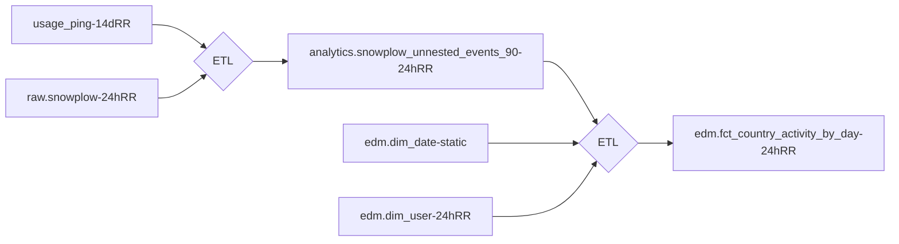

## On this page
{:.no_toc}

- TOC
{:toc}

## Purpose

`This page contains forward-looking content and may not accurately reflect current-state or planned feature sets or capabilities.`

Public companies need to reliably and predictably share key financial, customer, and growth metrics as well as analyze lead-to-cash and product idea-to-adoption processes to continually improve business performance. These activities are supported by capabilities defined in **Level 2** of the [Data Capability Model](/handbook/business-technology/data-team/direction/index.html). To provide a realistic example and to serve as a reference for future development, this page presents the [Level 2 Data Solution](/handbook/business-technology/data-team/direction/#data-capability-model) for 'Product Geolocation Analysis'.

## Solution Overview - Product Geolocation Analysis

Understanding where your product is used around the world is an important step towards developing a more complete understanding of your customers, your product's global reach, and related location-aware insights.

This data solution delivers three [Self-Service Data](/handbook/business-technology/data-team/direction/self-service/) capabilities:

1. Dashboard Viewer - a new Sisense dashboard to visualize GitLab deployments by Country, Territory, Month, and Year (Self-Service Dashboard)
1. Dashboard Developer - a new Sisense data model containing the complete dimensional model components to build new dashboards and link existing dashboards to geolocation data
1. SQL Developer - a new Enterprise Dimensional Model subject area

From a Data Platform perspective, the solution delivers:

1. an extension to the Enterprise Dimensional Model for GeoLocation analysis
1. a new `dim_country` table
1. testing and data validation extensions to the Data Pipeline Health dashboard
1. ERDs, dbt models, and related platform components

Finally, this is the long-term automated solution for several ad-hoc issues completed over the past year, including:

- [Pull customer & user data by Country (internal link)](https://gitlab.com/gitlab-data/analytics/-/issues/3614)
- [Country User Data (internal link)](https://gitlab.com/gitlab-data/analytics/-/issues/4991)
- [Upload GeoLite2 Free Database with Sheetload (internal link)](https://gitlab.com/gitlab-data/analytics/-/issues/3621)

### Knowledge Assessment & Certificates

The Self-Service Data Certificate program is based on the [Learning and Development Certification program](/learn/certifications/public/). The Self-Service Data program provides individual Certificates for each subject-oriented Dashboard Developer or SQL Developer Knowledge Assessment successfully completed. Links to the Knowledge Assessments are located in the appropriate sections below.

### Data Classification

[ORANGE](/handbook/security/data-classification-standard.html#orange)

- IP Address

### Solution Ownership

- Source System Owner: `@rparker2`
- Source System Subject Matter Expert: `@jeromezng`
- Data Team Subject Matter Expert: `@rparker2`

### Key Terms

- Territory - data can be visualized using [GitLab Sales Territories](/handbook/sales/territories/): AMER, APAC, EMEA
- Country - data can be visualized by [ISO Country](https://www.iso.org/iso-3166-country-codes.html)
- IP-to-Geolocation Mapping - mapping an [IP address to its geographic location](https://en.wikipedia.org/wiki/Geolocation) on a map

### Key Metrics, KPIs, and PIs

- number of Usage Pings By Country or Region By Month and Year
- number of GitLab.com Page Views By Country or Region By Month and Year
- KPIs - none defined
- PIs - none defined

## Self-Service Data Solution

### Self-Service Dashboard Viewer

| Dashboard                                 | Purpose                                                            |
| ----------------------------------------- | ------------------------------------------------------------------ |
| Worldwide Product Growth                  | Visualize the adoption of GitLab by country, region, and time.     |
| Data Health Dashboard for Geolocation Data | Data Health of the Geolocation data used to support this solution. |

### Self-Service Dashboard Developer

| Data Space | Description                                                                                                    |
| ---------- | -------------------------------------------------------------------------------------------------------------- |
| Global     | Contains a data model containing a 1-1 relationship with the Product Geolocation Analysis model detailed below |

#### Self-Service Dashboard Developer Certificate

To receive a Certificate, you will need to earn 100% on [the Self-Service Dashboard Developer Knowledge Assessment](https://docs.google.com/forms/d/e/1FAIpQLSeR4BI5RKj9X2fUYGlbtV-L6dUta3oNIWYaDY1X0gPcgzFMHA/viewform?usp=sf_link) and upload a screenshot of your new dashboard when prompted. Upon completion of the Knowledge Assessment, you will be emailed your responses and this email will serve as your Certificate.

### Self-Service SQL Analysis

#### Key Fields and Business Logic

- Data is sourced from usage-ping and snowplow.
- Usage-ping includes information about where the instance is HOSTED, not where the users of the host originate.
- Snowplow includes the best information we have available about where users are originating from.  Because some users deploy GitLab behind [VPNs](https://en.wikipedia.org/wiki/Virtual_private_network) or a similar proxy solution, the IP-to-Geolocation mapping from these sources may not be accurate. But it is still the best data source we have and represents our best source of truth.

#### Entity Relationship Diagrams

| Diagram/Entity                                                                                                     | Grain           | Purpose                                                                                                 | Keywords                                           |
| ------------------------------------------------------------------------------------------------------------------ | --------------- | ------------------------------------------------------------------------------------------------------- | -------------------------------------------------- |
| [Product Geolocation Analysis](https://app.lucidchart.com/documents/view/be5f5dc8-8ad5-4586-af53-93ff5e00f720/0_0) | Activity By Day | Dimensions and Facts that can be used to analyze GitLab usage  by country, territory, and time.         | dim_date, dim_country, fct_country_activity_by_day |
| dim_date                                                                                                           | Day             | Central dimension for all dates.                                                                        |                                                    |
| dim_country                                                                                                        | ISO_Country     | Central dimension for all countries and territories, sourced from ISO-3166 and GitLab Sales Territories |                                                    |

#### Reference SQL

All production SQL in Sisense or dbt must adhere to our [SQL Style Guide](/handbook/business-technology/data-team/platform/sql-style-guide/) for legibility and maintainability.

##### Page views by country by day for NORAM

```sql
SELECT
  f.date_key            AS date_key,
  dc.country_name       AS country_name,
  SUM(f.num_page_views) AS number_of_page_views
FROM fct_country_activity_by_day f
JOIN dim_country dc
  ON f.country_key = f.country_key
WHERE dc.reporting_region = 'NORAM'
```

##### Top 100 namespaces by country in 2020

```sql
SELECT
  dc.country_name       AS country_name,
  f.namespace_key       AS namespace_key,
  SUM(f.num_page_views) AS number_of_total_page_views
FROM fct_country_activity_by_day f
JOIN dim_country dc
  ON f.country_key = f.country_key
WHERE dd.year = 2020
GROUP BY dc.country_name, f.namespace_key
PARTITION BY dc.country_name LIMIT 100
```

#### Self-Service SQL Developer Certificate

To receive a Certificate, you will need to earn 100% on [the Self-Service SQL Developer Knowledge Assessment](https://docs.google.com/forms/d/e/1FAIpQLSc92q0yXvA31XmU-aoOPJl50zkQLrf4svSEkU4wbRQ2isMo8w/viewform?usp=sf_link) and upload a screenshot of your new SQL statement when prompted. Upon completion of the Knowledge Assessment, you will be emailed your responses and this email will serve as your Certificate.

## Data Platform Solution

The overall solution adheres to our [Enterprise Dimensional Model](/handbook/business-technology/data-team/platform/edw/) guidelines.

### Data Lineage

See [dbt documentation](https://www.getdbt.com/) for a complete lineage graph.



### DBT Solution

The [dbt solution](https://www.getdbt.com/) generates a dimensional model from RAW source data.

## Trusted Data Solution

### Enterprise Dimensional Model Validations

| Validation | Expected Result                                              |
| ---------- | ------------------------------------------------------------ |
| 1          | Total number of countries mapped does not exceed 300.        |
| 2          | Percentage of traffic from APAC is not greater than AMER.    |
| 3          | >40,000 # New fct_country_activity_by_day rows added by Day. |

### Source Data Pipeline validations

| Validation | Expected Result                                                           |
| ---------- | ------------------------------------------------------------------------- |
| 1          | New usage_ping data has been uploaded in last 14 days.                    |
| 2          | Total # of accounts represented by usage_ping data >= _expected result_. |
| 3          | Total # of accounts represented by snowplow data >= _expected result_.    |
