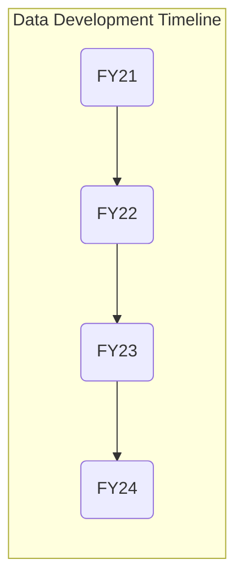

## On this page
{:.no_toc .hidden-md .hidden-lg}

- TOC
{:toc .toc-list-icons .hidden-md .hidden-lg}

---

## Data Development Timeline

--- 
## Fiscal Year 2024

### [FY24 Data Team Objectives and Report Cards](https://gitlab.com/groups/gitlab-data/-/epics/696)

###  FY24 Direction

_Drive Alignment to Best-In-Class Analytics Solutions_

Our FY24 Direction is based around 4 Pillars of Business Impact. These Pillars and other FY24 Data Initiatives are covered in the [FY24 Data Program X-Functional Initiatives Slide deck](https://docs.google.com/presentation/d/1UXIKCir35b9ReHBN0rpLaYAshih5gIktgr1JahUedoY/edit):

#### 1. [360 Customer IQ](https://docs.google.com/presentation/d/1hazljtcmgkhOYaOVTXLhVFzA5IhQxWdee_ocIBRndMs/edit#slide=id.g123a13deda8_0_405) 

- New 360 view of Customer and Account interactions, usage, and expansion
- Best-in-class tool for Sales Teams to understand all of the ways prospects and customers are interacting with GitLab

#### 2. [One Customer Journey](https://docs.google.com/presentation/d/1YUpb-6mhKz-Z20cx0wrycjmPqHMNSdPGzAJSyFBITFM/edit)

- Build Customer Journey Analytics to align all GTM teams on Customer Health and Engagement Indexes.
- [Expand Unified Customer ID](https://docs.google.com/presentation/d/1k64KNU-QdfQfBqwTYKMRqXpgJUHMyGC3Mu-N0Q5LQdg/edit#slide=id.g148196257e6_0_0) with trusted hierarchies, customer interactions, and more complete intent and opportunity signals.
- Expand Data Science products to increase new logo aquisition, improve expansion, and reduce churn & contraction.
- Advance Sales Excellence with Customer Zero experiences.

#### 3. [Best In Class Analytics Platform](https://docs.google.com/presentation/d/1dR7FYFWIvNa2mfLkG2TsJbyVQ7UGJAyWdwMknKbAU5w)

- Multi-Terabyte Big Data DataOps to power a $1 Billion dollar company.
- End-to-end Self-Service through easy-to-use Data Visualization tools, data models, and solution recipes.

#### 4. [Data Customer Zero ](https://docs.google.com/presentation/d/1PjaFAEaePZgz2BgB_pgLAY3zy81ugvo0a1gj0en-h54/edit#slide=id.g15464c2a8e6_0_0)

- Be GitLab Customer Zero for DevOps, DataOps, and MLOps with regular feedback loops into Product.
- Reliable, stable, and auditable Monthly Active User analytics with Trusted Data Models.
- Product Analytics Tools to help Product understand, plan, and act faster.
- Data Science on GitLab MLOps.

## Fiscal Year 2023

###  FY23 Direction

_Help GitLab Make Better Decisions, Faster_

Our FY23 Direction is based around 3 areas of business improvement:

1. **GTM Acceleration**
     - New Data Science propensity models to increase expansion, reduce contraction, and eliminate churn.
     - More efficient and collaborative Global Data Program through Data on GitLab.
     - Trusted Level 2 Data Models for Customer Journey Analytics.
1. **Better Product and More Efficient R&D**
     - Reliable, stable, and auditable Monthly Active User analytics with Trusted Data Models.
     - Product Analytics Tools to help Product understand, plan, and act faster.
     - Data Science on GitLab MLOps.
1. **Billion Dollar Self-Service Platform**
     - Multi-Terabyte Big Data DataOps to power a $1 Billion dollar company.
     - End-to-end Self-Service through easy-to-use Data Visualization tools, data models, and solution recipes.

### [FY23 Data Team Objectives, Newsletters, and Report Cards](https://gitlab.com/groups/gitlab-data/-/epics/427)

#### FY23-Q1

- [FY23-Q1 Objectives and Planning Drumbeat](https://gitlab.com/gitlab-data/managers/-/issues/278) 
- [FY23-Q1 Report Card](https://gitlab.com/gitlab-data/analytics/-/issues/12534)
- Launched [Data Team Internship for Learning program](/handbook/business-technology/data-team/organization/internships) and [FY23-Q1 Data Team Internship Cohort](https://gitlab.com/groups/gitlab-data/-/epics/499)

#### FY23-Q2

- [FY23-Q2 Objectives and Planning Drumbeat](https://gitlab.com/groups/gitlab-data/-/epics/502)
- [FY23-Q2 Data Team Internship Cohort](https://gitlab.com/groups/gitlab-data/-/epics/523)
- Completed [Data Observability Evaluation](/handbook/business-technology/data-team/direction/#data-observability)
- [FY23-Q2 Release Roundup]()

#### FY23-Q3

- [FY23-Q3 Objectives and Planning Drumbeat](https://gitlab.com/groups/gitlab-data/-/epics/588)

#### FY23-Q4

- [FY23-Q4 Objectives and Planning Drumbeat](https://gitlab.com/groups/gitlab-data/-/epics/657)

--- 

## Fiscal Year 2022

### FY22 Direction

_Deliver A Trusted Data Foundation To Help GitLab Be A Public Company_

Our FY22 Direction was to accelerate the development of Trusted Data platform components to help GitLab be a [public company](/handbook/being-a-public-company/) by reaching [Level 2 of the Data Capability Model](/handbook/business-technology/data-team/direction/#data-capability-model).

### FY22-Q4

- [FY22-Q4 Objectives and Planning Drumbeat](https://gitlab.com/gitlab-data/managers/-/issues/264)
- [FY22-Q4 Release Roundup](https://gitlab.com/gitlab-data/managers/-/issues/277)

### FY22-Q3

With [GitLab's IPO on 2021-10-14](https://ir.gitlab.com/), FY22-Q3 turned out to be an incredible quarter for all of GitLab. But business carries on and the Data Team delivered several important projects over the quarter, including a new Solutions Architect Dashboard and new Working Group Issue-Prioritization Dashboard for [Customer Success ](/handbook/business-technology/data-team/data-catalog/index.html#analysis-1), advancements to [SAFE Data Controls](/handbook/business-technology/data-team/platform/safe-data/#accessing-a-safe-dashboard) for the entire company, new [Xactly](https://www.xactlycorp.com/) and [Marketo](https://www.marketo.com/) data for Finance and Marketing, respectively, and our first Data Science predictive model with [Propensity to Expand](/handbook/business-technology/data-team/organization/data-science/#projects) for Sales Strategy. A very solid quarter all around!

- [FY22-Q3 Objectives](https://gitlab.com/gitlab-data/managers/-/issues/260)
- [FY22-Q3 Release Roundup (internal link)](https://gitlab.com/gitlab-data/analytics/-/issues/10090)
- [FY22-Q3 Report Card](https://gitlab.com/gitlab-data/managers/-/issues/274)
- [FY22-Q3 Handbook Jamboree (internal link)](https://gitlab.com/gitlab-data/analytics/-/issues/9868)
- [FY22-Q3 Data Team Handbook Updates (internal link)](https://gitlab.com/gitlab-data/analytics/-/issues/9868)
- [FY22-Q3 Release Roundup (internal link)](https://gitlab.com/gitlab-data/analytics/-/issues/10090)

### FY22-Q2

FY22-Q2 carried forward and completed several multi-quarter initiatives begun in FY22-Q1, including  adding SaaS Usage Data for Gainsight, shipping a new Company Metrics Dashboard, upgrading Data Access controls across the tech stack, and expanding the GTM Hub. The team continued to build-out GTM components of the Trusted Data Models and the investment in the area started to pay off, with increases in efficiency for Dashboard development and analysis as a result of using standard design patterns. A few additional improvements: rollout of the [Planning Drumbeat](/handbook/business-technology/data-team/how-we-work/planning/), a [Handbook Jamboree (internal link)](https://gitlab.com/gitlab-data/analytics/-/issues/9441), 3 [Data 3P Parties](https://docs.google.com/document/d/1cUtE75rbXzLCLpq3SDQS3TtsNTEmAAES6UJoZGoP0-Y/edit#heading=h.qq9lf68vhd66) (Pizza, Pet Peeves, and Predictions), and formalizing [Data Development](/handbook/business-technology/data-team/data-development/#data-development-at-gitlab) approaches.

- [FY22-Q2 Objectives](https://gitlab.com/gitlab-data/managers/-/issues/249)
- [FY22-Q2 Data Team Handbook Updates (internal link)](https://gitlab.com/gitlab-data/analytics/-/issues/8600)
- [FY22-Q2 Retrospective](https://gitlab.com/gitlab-data/managers/-/issues/262)
- [FY22-Q2 Release Roundup](https://gitlab.com/gitlab-data/managers/-/issues/276)

### FY22-Q1

FY22-Q1 was a very important quarter for the Data Team because the team completed many initiatives started earlier in FY21, including the new organization model with [Fusion Teams](/handbook/business-technology/data-team/#data-fusion-teams), the first major release of the Trusted Data solutions and [Sales Funnel Dashboard](/handbook/business-technology/data-team/data-catalog/sales-funnel/), integration of Product Usage Data into Gainsight, among other things. The Team successfully delivered on all major commitments in the quarter and helped position itself for success and scale heading into Q2.

- [FY22-Q1 Objectives](https://gitlab.com/gitlab-data/managers/-/issues/248) 
- [FY22-Q1 Retrospective](https://gitlab.com/gitlab-data/managers/-/issues/259)
- [FY22-Q1 Report Card](https://gitlab.com/gitlab-data/managers/-/issues/258)
- [FY22-Q1 Handbook Jamboree (internal link)](https://gitlab.com/gitlab-data/analytics/-/issues/8281)
- [FY22-Q1 Release Roundup](https://gitlab.com/gitlab-data/managers/-/issues/275)

---

## Fiscal Year 2021

###  FY21 Direction

_Define Data Strategy and Initiate Development of Enterprise Data Programs to move from Level 1 to Level 2_

Measured in Quarters, our FY21 short-term direction was to help GitLab be a [public company](/handbook/being-a-public-company/) by reaching [Level 2 of the Data Capability Model](/handbook/business-technology/data-team/direction/#data-capability-model) with support for GitLab's [KPIs](/company/kpis/) and Self-Serve Data coverage of GitLab's two most important business processes: the _lead-to-cash_ cycle and the _product-release-to-adoption_ cycle.

In priority order, the elements of the EDP we sought to build included:

1. An [Enterprise Dimensional Model](/handbook/business-technology/data-team/platform/edw/) to serve as single-source-of-truth for reporting and analysis, including all of our Sisense dashboards and SQL analysis in Snowflake
1. A [Trusted Data Framework](/handbook/business-technology/data-team/platform/#tdf) to help ensure all of our Data Solutions are thoroughly tested, with automated ongoing validations
1. [Data Visualizations](/handbook/business-technology/data-team/platform/sisensecdt/) to support performance analysis, including [KPIs](/company/kpis/).
1. A [Self-Service Data Program](/handbook/business-technology/data-team/direction/self-service/) to allow all GitLab teams to reliably access trusted data without requiring central Data Team involvement. 

### FY21-Q2

- [FY21-Q2 Objective 1: Finance ARR Data Mart, Dashboards, and Self-Service Training](https://gitlab.com/groups/gitlab-com/business-ops/-/epics/79) 
- [FY21-Q2 Objective 2: Ship automated data pipelines for key available product data sources](https://gitlab.com/groups/gitlab-com/business-ops/-/epics/80) 
- [FY21-Q2 Objective 3: Establish predictable KPI Governance Model and Development Schedule](https://gitlab.com/groups/gitlab-com/business-ops/-/epics/81)
