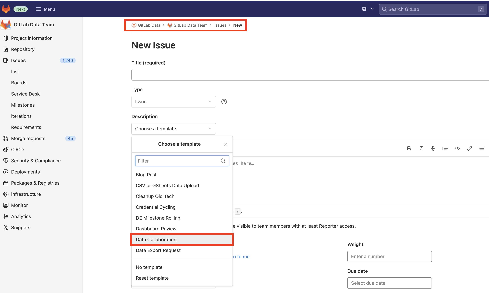

## On this page
{:.no_toc .hidden-md .hidden-lg}

- TOC
{:toc .toc-list-icons .hidden-md .hidden-lg}

{::options parse_block_html="true" /}

----

# Data Collaboration at GitLab 

The mission of the Data Collaboration Team is to enable everyone in the company to work better together using data and data tools.

## Team Structure

- [@mlaanen](https://gitlab.com/mlaanen) - Lead
- [@ttnguyen28](https://gitlab.com/ttnguyen28) - BI DRI
- [@ken_aguilar](https://gitlab.com/ken_aguilar)

## Handbook First

At GitLab we are [Handbook First](https://about.gitlab.com/handbook/handbook-usage/#why-handbook-first) and promote this concept by ensuring the data collaboration team page remains updated with the most accurate information regarding our objectives, processes, and projects. We also strive to keep the handbook updated with useful resources and our data toolset. 

## Data Collaboration Responsibilities 

Of the [Data Team's Responsibilities](https://about.gitlab.com/handbook/business-technology/data-team/#responsibilities), the Data Collaboration Team is **directly responsible** for:

- Administration of our Sisense CDT BI platform
- Initial triage and traffic management of data issues
- Evaluation and selection of new BI platforms
- Future administration of Product Analytics platforms
- Being a **_Center of Excellence_** for business intelligence and data visualization
- Create a directory for data assets and resources for improving the findability of data

Additionally, the Data Collaboration Team **supports** the following responsibilities:

- With **Data Leadership**:
  - Scoping and executing a data analytics strategy that directly impacts business KPIs
  - Broadcasting regular updates about deliverables, ongoing initiatives, and roadmap

## How We Work

Our team is dedicated to improving efficiencies in areas of data access and collaboration to better enhance partnerships across the GitLab organization. Administering platforms / tools that are instrumental in providing data-driven insights is our priority and you can find a list of areas where we can provide assistance in our issue template under GitLab Data (group ID) >> GitLab Data Team (project ID):

Examples of common request types that can be assigned to our team are related to dashboard maintenance and development:
Administrative
- Archiving / Unarchiving a dashboard
- Schedule refresh
- Add / Update users, roles
- Dashboard migration
- Set up a dedicated space

Development 
- Build a new dashboard
- Update a dashboard (logic, visualization)
- Troubleshooting

### Team Roles

- Lead: The primary DRI for a project. Responsible for planning, communication and outreach.
- Analyst: Conduct analysis, build dashboards, and system admin.

Note: roles aren't static and members of the team will be in different roles for different products.

### Data Analytics Tools

- [Sisense for Cloud Data Teams](https://app.periscopedata.com/)
- [Snowflake](http://gitlab.snowflakecomputing.com)
- [Google Data Studio](http://datastudio.google.com)
- [Google Sheets](http://sheets.google.com)
- [PostHog](https://posthog-poc.gitlab.systems/home)
- [Tableau](https://www.tableau.com)

## Key Projects

- [Business Intelligence Tool Implementation (Tableau)](https://gitlab.com/groups/gitlab-data/-/epics/594)
- [Rollout Product Analytics Tool to Growth](https://gitlab.com/groups/gitlab-data/-/epics/514)
- [Data Hub](https://gitlab.com/gitlab-data/functional-analytics-center-of-excellence/-/issues/2)

### Project Structure 

We follow the standard [Data Team Planning Drumbeat](https://about.gitlab.com/handbook/business-technology/data-team/how-we-work/planning/) for OKRs. For ad-hoc requests, please create an issue, add the `Team::Data Collaboration` label, and assign it to one of the [Data Collaboration Team Members](https://about.gitlab.com/handbook/business-technology/data-team/organization/data-collaboration/#team-structure) for evaluation and planning.

### Data Assets Findability

BI Dashboards hub pages per functional area:
- [Go To Market Analytics Hub](https://app.periscopedata.com/app/gitlab:safe-dashboard/919263/Go-To-Market-Analytics-Hub-v1.0)
- [Marketing Analytics Hub](https://app.periscopedata.com/app/gitlab:safe-intermediate-dashboard/969815/Marketing-Analytics-Hub)

Handbook pages:
- [FACE Single Source of Truth Reporting](https://about.gitlab.com/handbook/business-technology/data-team/functional-analytics-center-of-excellence/source-of-truth-fields-for-reporting/)
- [Data Collaboration Hub](https://about.gitlab.com/handbook/business-technology/data-team/data-program-collaboration-hub/)
- [Data Catalog](https://about.gitlab.com/handbook/business-technology/data-team/data-catalog/)

### Current State of Business Intelligence

Currently, analysts and knowledge workers in the company have a few options to analyze structured data from the [data warehouse](https://about.gitlab.com/handbook/business-technology/data-team/platform/#data-warehouse), primarily those listed below:

| Solution | Good for | Limitations | 
| ------ | ------ | ----- |
|[Sisense for Cloud Data Teams](https://about.gitlab.com/handbook/business-technology/data-team/platform/sisensecdt/) | Heavy SQL users to create data visualizations | Difficult to use for non-SQL users, limited filtering capabilities, no data modeling capabilities| 
| [Google Data Studio](https://about.gitlab.com/handbook/business-technology/data-team/platform/#google-data-studio)| Integrations well with other Google products | Limited data modeling and data visualization capabilities, limited access to data | 
| Google Sheets | Easy to use | Limited in how much data it can handle | 
| Solutions specific to business functions, including Gainsight, Salesforce, Google Analytics, etc. | Solves for business function specific use cases | Can't solve for other use cases outside of its primary domain | 

What is missing from all these solutions is a governed way to enable data analytics across the company. None of the platforms currently in use have robust granular access controls, robust data modeling and data governance capabilities, or world class data visualization capabilities. Furthermore, these platforms only enable a subset of out entire team member base to be proficient analyzing data. This impacts us in the following ways:
- Instead of democratizing data analytics, most data analytics work is put on specific team members who face an ever growing backlog of issues and risk becoming bottle necks. 
- The lack of robust granular access controls results in increased overhead to enforce the principle of least privilige, like the need to create our [SAFE intermediate space](https://about.gitlab.com/handbook/business-technology/data-team/platform/safe-data/#what-is-safe-data) due to the lack of row and column level permissions.
- The lack of robust data governance capabilities in the platforms we use for analytics purposes could result in different numbers being displayed for the same metrics.
- The lack of world class data visualization options results in less useable dashboards, as many data visualization [best practices](https://www.perceptualedge.com/articles/Whitepapers/Communicating_Numbers.pdf) can't always be implemented in our current toolset.

[Current Usage of Sisense CDT](https://app.periscopedata.com/app/gitlab/410320/Periscope-Usage!-📈)

### Current State of Product Analytics

Currently, Product Managers and others looking to analyze GitLab product data use either [Snowplow](https://docs.gitlab.com/ee/development/snowplow/index.html) or [Service Ping](https://docs.gitlab.com/ee/development/service_ping/) data. To visualize that data they use SQL in [Sisense for Cloud Data Teams](https://about.gitlab.com/handbook/product/product-intelligence-guide/getting-started/#accessing-the-data-in-sisense) to access the Snowplow and Service Ping data in our Snowflake data warehouse. Although this is sufficient for certain metrics like (xMAU)[https://about.gitlab.com/handbook/business-technology/data-team/data-catalog/xmau-analysis/], it is not well suited for more complicated analysis (like for instance funnel or cohort analysis). 

That means that currently product insights require time and resource-intensive manual SQL, limiting the team’s decision velocity and decision quality. Analysts spend multiple days/weeks building and updating dashboards, and a large portion of their workload is spent helping run SQL queries for less technical team members. To address that need we are in the process of implementing [PostHog](https://posthog.com/) specifically for product analytics.

### Future State of Business Intelligence

**Vision**

To be more successful in harnessing data analytics for better business insights, at least 50% of our survey respondents would like a platform that offers the following, all of which are not currently available in Sisense CDT:
- More dashboarding / visualization choices 
- Self-service capability (no coding required) 
- More intuitiveness / easy to use
- Faster performance / scalability
- Better look and feel
- Drag-and-drop data visualization

The ability to build dashboards quickly based on curated, secured, centralized data models is foundational to our goal in growing data services across GitLab. These capabilities will allow us to serve more stakeholders and seamlessly manage our data processes, so that our reporting is consistent for many organizations within the company. Sisense CDT shines where the only needs are to quickly connect to one data source and build visualizations based on SQL queries, but this structure prevents us from being able to manage metrics and logic effectively or enable less technical users with access to the level of reporting that a BI platform can provide.   

**Pilot Implementation**

We are rolling out a pilot deployment of [Tableau](https://about.gitlab.com/handbook/business-technology/data-team/platform/tableau/) with a limited audience and scope. During this pilot release, the acceptable use for Tableau is limited to:
- Ad-hoc analysis and data exploration
- One-off or temporary dashboards or reporting
- Creating data visualizations for screenshots in presentations
- Dashboard prototyping, mockups and proof-of-value
- Dashboards for specific use cases accessed only by a single-team 

It should not be used for:
- SSOT reporting
- Replacing Sisense for Cloud Data Teams
- Cross-departmental reporting
- Use cases with an audience of greater than 5-10 people
- Embedding data visualizations in the handbook
- Reporting in key meetings

### Future State of Product Analytics

**Vision**

Every member of the Product, Growth, and Analyst teams should be able to self-serve the insights they need to make faster and more impactful decisions to drive business growth and GitLab user success. Analysts should be able to build/update/replicate dashboards in minutes, freeing up their time to uncover high-impact insights because less technical teammates can self-serve their product analysis. They would primarily work in a dedicated product analytics platform for their daily analytics needs. 

**Pilot Implementation**

We are currently running a pilot project with [PostHog](https://posthog.com) and our [Product Intelligence team](https://about.gitlab.com/handbook/product/product-intelligence-guide/). As part of the first iteration we're in the process of loading 3 months of [Snowplow](https://about.gitlab.com/handbook/business-technology/data-team/platform/snowplow/) data into the platform. If successful we'll add additional data and will roll this out to a broader audience within the company. 

## Useful Resources

### Slack Group Name & Channels
- @datacollaborationtriage: Group name for tagging in Slack 
- [#bt-data-collaboration](https://gitlab.slack.com/archives/C036ADU4EH3) - Internal Data Collaboration Team
- [#data-tableau](https://app.slack.com/client/T02592416/C03RMCEHVCP) - Tableau pilot project
- [#product-analytics-platform](https://gitlab.slack.com/archives/C022RCEPK9V) - New Product Analytics tools
- [#bt-data-posthog-pilot](https://gitlab.slack.com/archives/C035VQ1S153) - PostHog Implementation
- [#gitlab-posthog-data](https://gitlab.slack.com/archives/C02QQGGG6FJ) - External Slack channel with PostHog
- [#data-sisense-gitlab-external](https://gitlab.slack.com/archives/C02GG8C3GFK) - External channel with Sisense
- [#ext-gitlab-tableau](https://app.slack.com/client/T02592416/C031QE95QJU) - External channel with Tableau/Salesforce
