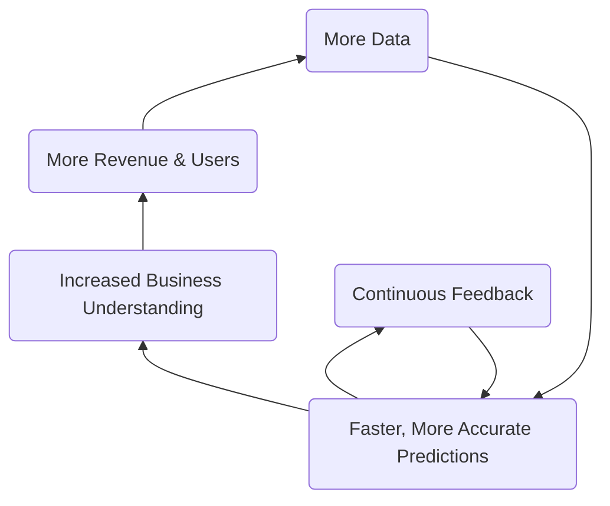
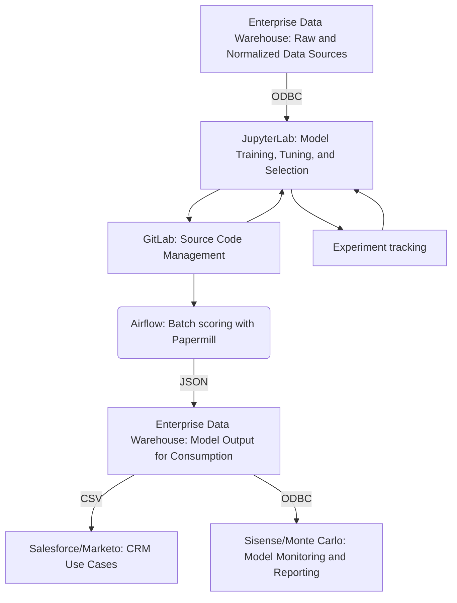

## On this page 
{:.no_toc .hidden-md .hidden-lg}

- TOC
{:toc .toc-list-icons .hidden-md .hidden-lg}

{::options parse_block_html="true" /}

----
**PURPOSE: This page is focused on the operations of GitLab's internal _Data Science Team_. For information about GitLab's Product Data Science Capabilities, please visit [GitLab ModelOps](https://about.gitlab.com/direction/modelops/)**
{: .alert .alert-success}

# The Internal Data Science Team at GitLab

The mission of the Data Science Team is to facilitate **_making better decisions faster_** using **_predictive analytics_**.

## Handbook First

At GitLab we are [Handbook First](/handbook/handbook-usage/#why-handbook-first) and promote this concept by ensuring the data science team page remains updated with the most accurate information regarding data science objectives, processes, and projects. We also strive to keep the handbook updated with useful resources and our data science toolset. 

## Learning About Data Science
Check out this brief overview of what data science is at GitLab:

<!-- blank line -->
<figure class="video_container">
  <iframe src="https://www.youtube.com/embed/wRbNExL0hv8" frameborder="0" allowfullscreen="true"> </iframe>
</figure>
<!-- blank line -->

([Corresponding slides](https://docs.google.com/presentation/d/1Y-V6bZ5w8Ms5yfMiuYCYZs9ald7Q5MxydYhSh9DWwwQ/edit?usp=sharing))

AMAs:
- 2021-09-15 AMA [Recording](https://youtu.be/wRbNExL0hv8), [Presentation](https://docs.google.com/presentation/d/1Y-V6bZ5w8Ms5yfMiuYCYZs9ald7Q5MxydYhSh9DWwwQ/edit#slide=id.g540caf0310_0_0), 
- 2021-12-09 AMA [Recording](http://www.youtube.com/watch?v=46NEQDAz18I), [Presentation](https://docs.google.com/presentation/d/1aUIi52AW798KjmvexPIQ1AcXRKLcWlYd6yW-EW6Zqlo/edit#slide=id.g540caf0310_0_0)

**Want to Learn More?
[Become a Data Science Champion](/handbook/business-technology/data-team/direction/data-champion/), [visit Slack #bt-data-science](https://gitlab.slack.com/archives/C027285JQ4E), [watch a Data Team video](https://www.youtube.com/playlist?list=PL05JrBw4t0KrRVTZY33WEHv8SjlA_-keI). We want to hear from you!**
{: .alert .alert-success}

### Common Data Science Terms 

- **Accuracy** - ability of a Data Science model to capture all correct data points out of all possible data points
- **Algorithm** - sequence of computer-implementable instructions used to solve specific problem
- **Classification** - process of predicting a category for each observation. For example, determining if a picture is of a cat or a dog
- **Clustering** - process of finding natural groupings of observations in dataset. Often used for segmentation of users or customers
- **Data Science (DS)** - interdisciplinary field that uses computer science, statistical techniques and domain expertise to extract insights from data
- **Exploratory Data Analysis (EDA)** - analysis of the data that summarises it's main characteristics (includes statistics and data visualisation)
- **Feature** - single column in dataset that can be used for analysis, such as country or age. Also referred to as variables or attributes
- **Feature Engineering** -  process of selecting, combining and transforming data into features that can be used by machine learning algorithms 
- **Imputation** - process of replacing missing or incorrect data with statistical "best guesses" of the actual values
- **Machine Learning (ML)** - use and development of algorithms without being explicitly programmed to determine patterns in data
- **Model** - a complex set of mathematical formulas that generates predictions
- **Propensity modelling** - building models to predict specific events by analyzing past behaviors of a target audience. 
- **Regression** - a statistical method for predicting an outcome. For example, predicting a person's income, or how likely a customer is to churn
- **Scoring** -  process of generating predictions for the new dataset
- **Training** -  process of applying an algorithm to data to create a model
- **Test Dataset** - deliberately excluding some observations from training the model so they can be used to verify how well the model predicts  
- **Weight** - numerical value assigned to feature that determines it's strength

## Data Science Responsibilities 

Of the [Data Team's Responsibilities](/handbook/business-technology/data-team/#responsibilities), the Data Science Team is **directly responsible** for:

- Delivering _descriptive_, _predictive_, and _prescriptive_ solutions that promote and improve [GitLab's KPIs](https://about.gitlab.com/company/kpis/)
- Being a **_Center of Excellence_** for predictive analytics and supporting other teams in their data science endeavors 
- Developing tooling, processes, and best practices for data science and machine learning

Additionally, the Data Science Team **supports** the following responsibilities:

- With **Data Leadership**:
  - Scoping and executing a data science strategy that directly impacts business KPIs
  - Broadcasting regular updates about deliverables, ongoing initiatives, and roadmap
- With the [**Data Platform Team**](/handbook/business-technology/data-team/organization/engineering/):
  - Defining and championing data quality best practices and programs for GitLab data systems
  - Deploying data science models, ensuring data quality and integrity, shaping datasets to be compatible with machine learning, and brining new datasets online
  - Creating data science pipelines that work natively with the GitLab platform and the Data Team tech stack
- With the [**Data Analytics Team**](/handbook/business-technology/data-team/organization/analytics/):
  - Incorporating data science into analytics initiatives
  - Designing dashboard to enhance the value and impact of the data science models

## How We Work

As a Center of Excellence, the data science team is focused on working collaboratively with other teams in the organization. This means our stakeholders and executive sponsors are usually in other parts of the business (e.g. Sales, Marketing). Working closely with these other teams, we craft a [project plan](https://about.gitlab.com/handbook/business-technology/data-team/organization/data-science/project_dev_approach/#3c-modeling--implementation-plan) that aligns to their business needs, objectives, and priorities. This usually involves working closely with functional analysts within those teams to understand the data, the insights from prior analyses, and implementation hurdles. 

The Data Science flywheel is focused on improving business efficiency and KPIs by creating accurate and reliable predictions. This is done in collaboration with [Functional Analytics Center of Excellence](/handbook/business-technology/data-team/functional-analytics-center-of-excellence/) to ensure the most relevant datasources are utilized, business objectives are met, and results can be quantifiably measured. As business needs change, and as the user-base grows, this flywheel approach will allow the data science team to quickly adapt, iterate, and improve machine learning models.

## Projects

| Name | Maturity | Objective | Sponsor | Status | Deliverables |
| ----- | -----| -----| ----- | ----- | ----- |
| [Propensity to Expand](https://gitlab.com/gitlab-data/data-science-projects/propensity-to-expand) (PtE) | Optimized | Determine which paid accounts are likely to expand their ARR by > 10% in next 3 months; Identify uptier opportunities | Sales | Last update: FY23-Q4, Next update: TBD | [Exec Summary](https://docs.google.com/presentation/d/1Aaf2HzFYrYDPgrZKDHxS9gzep4LHGMlwF5SxYs-her0/edit#slide=id.gf528ae95ed_0_0), [PtE Inspector](https://app.periscopedata.com/app/gitlab:safe-dashboard/951374/PtE-Inspector), [PtE Results Dashboard](https://app.periscopedata.com/app/gitlab:safe-dashboard/1054667/PtE-Performance-Results) |
| [Propensity to Contract](https://gitlab.com/gitlab-data/data-science-projects/propensity-to-contract-and-churn) (PtC) | Optimized | Determine which paid accounts are likely to reduce their ARR by > 10% or leave GitLab permanently in the next 6 months | Customer Success | Last update:  FY23-Q4, Next update: FY24-Q2 |[PtC slide deck](https://docs.google.com/presentation/d/1Gd-GhHhWHHc1N8zJtLGKtNF4W2T9d82Sv_fZ_j2236U/edit#slide=id.g29a70c6c35_0_68), [PtC Inspector](https://app.periscopedata.com/app/gitlab:safe-dashboard/971581/PtC-Inspector), [PtC Results Dashboard](https://app.periscopedata.com/app/gitlab:safe-dashboard/1055609/PtC-Performance-Results)|
| [Propensity to Downtier](https://gitlab.com/gitlab-data/data-science-projects/propensity-to-downtier) | Complete | Determine which Ultimate accounts are likely to downtier to Premium product tier| Customer Success Management | Last update:  FY23-Q4, Next update: FY24-Q1 |[Downtier Executive Read Out](https://docs.google.com/presentation/d/1kcTPP5NKnqTKnOTm2HGSSVsYP3x6TdeKGxv28U702yo/edit#slide=id.g1b861242c79_0_522), [Downtier Read Out](https://docs.google.com/presentation/d/13xcuQE6G3alvHoklWvmDm-MOIb0V7QhckgXCd5IHHuc/edit#slide=id.g123a13deda8_0_405), [Health of Ultimate Accounts Dashboard](https://app.periscopedata.com/app/gitlab:safe-dashboard/1098020/Health-of-Ultimate-Accounts)|
| [Propensity to Purchase](https://gitlab.com/gitlab-data/data-science-projects/propensity-to-purchase)* (PtP) | Viable | Identify which free and trials accounts are likely to become paid accounts | Sales & Marketing | Last Update: FY24-Q1, Next update: FY24-Q2 | [SaaS Trials Model Readout](https://docs.google.com/presentation/d/1EyS9Wq6F0qlQwt5sj7x8VnSSGD1vIy3AcSpMGddZdbk/edit?usp=sharing), [SaaS Free Namespaces Readout](https://docs.google.com/presentation/d/1UNfthItOOfT3L4v5PkZh4z4hVPKdCcn8aQg_raVflxg/edit#slide=id.g12e25a29994_0_0), [SaaS Trials Results Dashboard](https://app.periscopedata.com/app/gitlab:safe-dashboard/1056823/PtPT-Performance-Results) | 
| [Namespace Segmentation](https://gitlab.com/gitlab-data/data-science-projects/namespace-segmentation) | Optimized | v1 - Define groups for paid and free SaaS namespaces based on its product usage and impact on conversions v2 - Defined groups for paid SaaS only | Growth | Last update: FY23-Q3 | [Namespace Segmentation slide deck](https://docs.google.com/presentation/d/1HsyzflYcXedBm75A4Wkdp2TdbV5ikcjr8zEZoUzFN2o/edit#slide=id.g122f5829a10_0_143), [Namespace Segmentation Dashboard](https://app.periscopedata.com/app/gitlab:safe-dashboard/1014510/Draft:-Namespace-Segmentation), [Namespace Segmentation v2 slide deck](https://docs.google.com/presentation/d/1Pmm0g1mUquBR6P_aguGkOiGBVqO1ZtDzIyRrbR-r9jA/edit#slide=id.g29a70c6c35_0_68), [Namespace Segmentation v2 Dashboard](https://app.periscopedata.com/app/gitlab:safe-dashboard/1081864/Namespace-Segmentation-(Paid-only)) |
| Prospect/Lead Scoring | Planned | Identify leads and prospects most likely to convert to closed won opportunities | Marketing & Sales Dev | FY24-Q1 | |
| GitLab MLOps Product Development | In progress (Ongoing) | Dogfood new MLOps product features and enhancements  | Product | Next Update: FY24-Q1 | | 
| Adoption Index | Planned | Define way to measure adoption and customer journey | TBD | Next update: FY24-Q1 | |
| Product Usage Event | Planned | - | | TBD | |
| Golden Journey | Planned | Identify optimal paths to increasing platform usage and adoption | Growth | TBD | | 
| Expansion Predicted ARR | Planned | Predict expansion ARR dollar amount | Sales | TBD | |
| Stage Adoption MRI | Planned | - | | TBD | | 
| Community Sentiment Analysis | Unplanned | - | Product | | | 
| Feature $ARR Uplift Prediction | Unplanned | Attribute incremental ARR lift based on feature adoption | Product | | | 

_*Propensity to Purchase is currently implented for: SaaS Free namesapces and Trials. Propensity to Purchase is currently in the process of being created for: Self-managed free accounts and trials_

For implementation details and where to find model predictions/scores, please see the [Propensity Models Internal Handbook Page](https://internal-handbook.gitlab.io/handbook/sales/propensity_models/)

### Maturity

Maturity of data science projects is similar to the [GitLab product maturity model](https://about.gitlab.com/direction/maturity/):
- **Unplanned**: Not implemented, and not yet on our roadmap.
- **Planned**: Not implemented, but on our roadmap; executive sponsor attached to project.
- **In Progress**: Plan established, developing model.
- **Viable**: Available, but not fully productionalized yet; scores and insights manually generated; low adoption outside of immediate stakeholders.
- **Complete**: Fully implemented into Data Team cloud production infrastructure; increasing adoption of corresponding dashboards and scores within the intended organization.
- **Optimized**: Fine-tuned, fully automated, and self-service; continuous model monitoring and scoring; high adoption within intended organization.

### Data Sources

| Name | Current Sources | Additional Planned Sources |
| ----- | ------ | ----- |
| PtE | Product usage: SaaS & Self-Managed - paid tiers; Product stage usage: SaaS & Self-Managed - paid tiers; Salesforce (account, opportunities, events, tasks); Zuora (billing); Bizible (marketing); Firmographics; ZenDesk (help tickets); prior expansion type (product change, seat licenses), amount, and time laspe; account health scores |  Buyer personas attached to opportunities |
| PtC | Product usage: SaaS & Self-Managed - paid tiers; Product stage usage: SaaS & Self-Managed - paid tiers; Salesforce (account, opportunities, events, tasks); Zuora (billing); Bizible (marketing); ZenDesk (help tickets); Firmographics, account health fields; security score | # of answered emails, ratio sent/answered emails |
| Namespace Segmentation | Product usage: SaaS & Self Managed - free and paid tiers; Product stage usage: SaaS & Self Managed - free and paid tiers; Salesforce (account); Zuora (billing); Bizible (marketing) | # of consecutive days of product/stage usage |
| PtPT | Product usage: SaaS Only - free tiers; Product stage usage and adoption: SaaS Only - Free Tiers; Registration; Namespace metadata; User-level | Self-managed product usage data; buyer personas |

### Project Slack Channels

- [#data-propensity-projects](https://gitlab.slack.com/archives/C02172C5KH7): For all questions related to propensity models (PtE, PtC, PtPT)
- [#namespace-segmentation](https://app.slack.com/client/T02592416/C0341FPNB1C): For Namespace Segmentation 

### Project Structure 

The Data Science Team follows [Cross-Industry standard process for data mining (CRISP-DM)](https://en.wikipedia.org/wiki/Cross-industry_standard_process_for_data_mining), which consists of 6 iterative phases:

1. **Business Understanding**

    - Includes requirements gathering, stakeholders interviews, project definition, product user stories, and potential use cases in order to establish success criteria of the project.

1. **Data Understanding**

    - Requires determining the breadth and scope of existing relevant datasources. Data scientists work closely with data engineers and data analysts to determine where gaps may exist and to identify any data discrepancies or risks. 

1. **Data Preparation** 

    - Requires conducting data quality checks and exploratory data analysis (EDA) to develop a greater understanding of data and how different datapoints relate to solving the business need.

1. **Modeling** 

    - Machine learning techniques are used to find a solution that addresses the business need. This often takes the form of predicting why/when/how future instances of a business outcome will occur.

1. **Evaluation** 

    - Performance is generally measured by how _accurate_, _powerful_, and _explainable_ the model is. Findings are presented to the stakeholders for feedback. 

1. **Deployment**

    - Once the model has been approved it then gets deployed into the data science production pipeline. This process automatically updates, generates predictions, and monitors the model on a regular cadence.

#### The GitLab approach

The [Data Science Team approach to model development](https://about.gitlab.com/handbook/business-technology/data-team/organization/data-science/project_dev_approach/) is centered around GitLab's value of [iteration](/handbook/values/#iteration) and the CRISP-DM standard. Our process expands on some of the 6 phrase outlined in CRISP-DM in order to best address the needs of our specific business objectives and data infrastructure.

## Data Science Platform
Our current platform consists of:
- the [Enterprise Data Warehouse](/handbook/business-technology/data-team/platform/) for storing raw and normalized source data as well as final model output for consumption by downstream consumers
- [JupyterLab](/handbook/business-technology/data-team/platform/jupyter-guide/) for model training, tuning, and selection
- [GitLab](https://gitlab.com/) for collaboration, project versioning, and score code management, and [experiment tracking](https://about.gitlab.com/handbook/engineering/incubation/mlops/ml_experiment_tracking.html)
- [Airflow](/handbook/business-technology/data-team/platform/infrastructure/#airflow) for automation and orchestration
- Sisense (soon to transition to Monte Carlo) for model monitoring and performance evaluation

Over time we plan to dogfood as many components of the GitLab MLOps Stage as possible, leading to fully automated productionalized pipelines. As more MLOps features come online we will update our platform and processes accordingly. Our immediate next step is to better automate `Current State Data Flows` using a combination of python, airflow, and CI/CD.

### Current State Data Flows

**Legend**

- TSV = [comma-separated value file](https://fileinfo.com/extension/csv)
- ODBC = [Open Database Connectivity](https://en.wikipedia.org/wiki/Open_Database_Connectivity)

### Data Science Tools at GitLab

- **[Pre-configured JuypterLab Image](https://gitlab.com/gitlab-data/data-science)**: The data science team uses JupyterLab pre-configured with common python modules (pandas, numpy, etc.), native Snowflake connectivity, and git support. Working from a common framework allows us to create models and derive insights faster. This setup is freely available for anyone to use. Check out our [Jupyter Guide](/handbook/business-technology/data-team/platform/jupyter-guide/) for additional information.
- **[gitlabds python tools](https://gitlab.com/gitlab-data/gitlabds/)**: Functions to help automate common data prep (dummy coding, outlier detection, variable reduction, etc.) and modeling tasks (i.e. evaluating model performance). Install directly via [pypi](https://pypi.org/project/gitlabds/) (`pip install gitlabds`), or use as part of the above JupyterLab image.
- **[Modeling Templates](https://gitlab.com/gitlab-data/data-science/-/tree/main/templates)**: The data science team has created modeling templates to allow you to easily start building predictive models without writing python code from scratch. To enable these templates, follow the instructions on the [Jupyter Guide](/handbook/business-technology/data-team/platform/jupyter-guide/#enabling-jupyter-templates).

## Useful Data Science & Machine Learning Resources

- **_Python Data Science Handbook_** by Jake VanderPlas: Great for beginners looking to learn python and dip their toes into data science.
- **_Python Machine Learning_** by Sebastian Raschka & Vahid Mirjalili: More advanced topics with the assumption of a basic level of python.
- **_The Elements of Statistical Learning, Data Mining, Inference, and Prediction_** by Trevor Hastie, Robert Tibshirani, & Jerome Friedman: Great deep dive into all the statistics and logic behind many of the commonly used predictive techniques. Can be pretty stats/math heavy at time.
