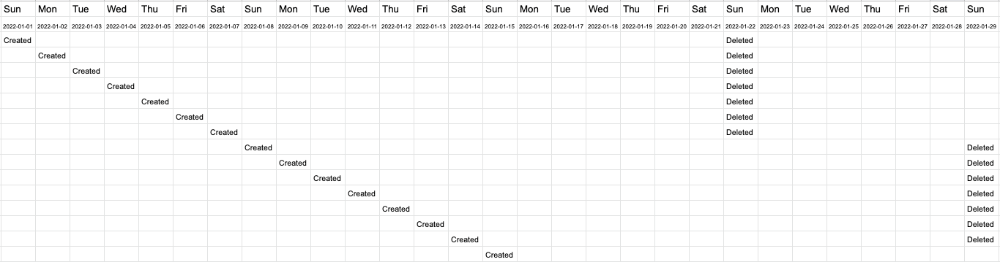

## On this page
{:.no_toc .hidden-md .hidden-lg}

- TOC
{:toc .toc-list-icons .hidden-md .hidden-lg}

{::options parse_block_html="true" /}

---

This page documents the CI jobs used by the data team in Merge Requests in both the [Data Tests](https://gitlab.com/gitlab-data/data-tests) and [Analytics](https://gitlab.com/gitlab-data/analytics) projects.

## What to do if a pipeline fails 

* If a weekend has passed re-run any CLONE steps which were performed prior, every Sunday (5:00AMUTC) all old pipeline databases are [dropped](https://gitlab.com/gitlab-data/analytics/-/blob/master/orchestration/drop_snowflake_objects.py) from SnowFlake older than 14 days. 

* Merge master branch. Due to how dbt handles packages pipelines can fail due to package failures which should always be handled in the latest branch. 
* Confirm [model selection syntax](https://docs.getdbt.com/reference/node-selection/syntax). In general, it is easiest to simply use the file names of the models you are changing. 
* If still uncertain or facing any issues, request assistance in the #data Slack channel  

### Variable Name not found in the CI Pipeline job
This kind of error pops up in the pipeline like KeyError: 'GITLAB_COM_CI_DB_USER'. It means the variable is not defined in the variable section of CI/CD Settings. To resolve this, add the variable name to [CI/CD setting](https://gitlab.com/gitlab-data/analytics/-/settings/ci_cd) i.e. settings --> ci_cd --> variable, also provide the variable value.      
**Notes:-** Turn off the Flags, so the variable is accessible from the CI pipeline.   
The same applies to the variable value; if it is incorrect in the job, we can update it in the above link.

# Analytics pipelines 

## Stages

CI jobs are grouped by stages.

### ❄️ Snowflake

These jobs are defined in [`.gitlab-ci.yml`](https://gitlab.com/gitlab-data/analytics/-/blob/master/.gitlab-ci.yml). All Snowflake objects created by a CI clone job will exist until dropped, either manually or by the [weekly clean up of Snowflake objects](https://about.gitlab.com/handbook/business-technology/data-team/platform/ci-jobs/#what-to-do-if-a-pipeline-fails).

#### clone_prep_specific_schema

Run this if you need a clone of any schema available in the prep database. Specify which schema to clone with the `SCHEMA_NAME` variable. If the clone already exists, this will do nothing. 

#### clone_prod_specific_schema

Run this if you need a clone of any schema available in the prod database. Specify which schema to clone with the `SCHEMA_NAME` variable. If the clone already exists, this will do nothing. 

#### clone_prod

Runs automatically when the MR opens to be able to run any dbt jobs. Subsequent runs of this job will be fast as it only verifies if the clone exists. This is an empty clone of the `prod` and `prep` databases.

#### clone_prod_real

Run this if you need to do a real clone of the `prod` and `prep` databases. This is a full clone both databases.

#### clone_raw_full

Run this if you need to run extract, freshness, or snapshot jobs. Subsequent runs of this job will be fast as it only verifies if the clone exists.

#### clone_raw_postgres_pipeline

Run this if you only need a clone of the raw `tap_postgres` schema in order to test changes to postgres pipeline or a manifest file.  If the raw clone already exists, this will do nothing.

#### clone_raw_sheetload

Run this if you only need a clone of the raw `sheetload` schema in order to test changes or additions to sheetload.  If the raw clone already exists, this will do nothing.

#### clone_raw_specific_schema

Run this if you need a clone of any other raw schema in order to test changes or additions. Specify which raw schema to clone with the `SCHEMA_NAME` variable. If the raw clone already exists, this will do nothing. 

#### force_clone_both

Run this if you want to force refresh raw, prod, and prep. This does a full clone of raw, but a shallow clone of `prep` and `prod`.

#### 🔑grant_clones

Run this if you'd like to grant access to the copies or clones of `prep` and `prod` for your branch to your role or a role of a business partner. Specify the snowflake role (see [roles.yml](https://gitlab.com/gitlab-data/analytics/-/blob/master/permissions/snowflake/roles.yml)) you'd like to grant access to using the `GRANT_TO_ROLE` variable. This job grants the same `select` permissions as the given role has in `prep` and `prod` for all database objects within the clones of `prep` and `prod`. It does not create any future grants and so **all relevant objects must be built in the clone before you run this job if you want to ensure adequate object grants.**

### 🚂 Extract

These jobs are defined in [`extract-ci.yml`](https://gitlab.com/gitlab-data/analytics/-/blob/master/extract/extract-ci.yml)

#### boneyard_sheetload

Run this if you want to test a new boneyard sheetload load. This requires the real `prod` and `prep` clones to be available.

#### sheetload

Run this if you want to test a new sheetload load. This jobs runs against the clone of `RAW`. Requires the `clone_raw` job to have been run.

#### pgp_test

With the exception of gitlab-ops DB, run this if you're adding or updating a postgres pipeline manifest. Requires a clone of RAW and the `MANIFEST_NAME` variable, possibly `TASK_INSTANCE` variable if it's an SCD table.

The `MANIFEST_NAME` is not the same as the manifest filename. Its the filename except postfix `_db_manifest.yaml`.

#### gitlab_ops_pgp_test

Run this if you're updating the gitlab-ops manifest file.  Requires a clone of RAW.  Does not require any variables, except possibly a `TASK_INSTANCE` variable if it's an SCD table.  This is separate from the `pgp_test` job because it requires a CloudSQL Proxy to be running in order to connect to the database.

### DBT cloning selection

When making any DBT changes, 🔆⚡️clone_model_dbt_select should be your first pipeline run to set up the environment, followed by either the `run_changed` or `specify_model` pipeline (to test & validate). 

The following jobs use the same selection syntax as the regular DBT runs, but they use this to **begin a SnowFlake cloning operation for the DBT lineage provided**. In the case of 🔆⚡️clone_model_dbt_select it is far faster, cheaper, and can handle a much greater data volume than the regular DBT runs, because they do not actually run DBT. 

#### 🔆⚡️clone_model_dbt_select

Specify which model to run with the variable `DBT_MODELS`. Clones all models in the provided selection. Does not run any DBT tests or validation. This job will fail for the same errors as the existing DBT process (i.e. ensure that you have selected the correct lineage above your model).

### ⚙️ dbt Run

These jobs are defined in [`snowflake-dbt-ci.yml`](https://gitlab.com/gitlab-data/analytics/-/blob/master/transform/snowflake-dbt/snowflake-dbt-ci.yml)

> As part of a DBT Model Change MR, you need to trigger a pipeline job to test that your changes won't break anything in production. To trigger these jobs, go to the "Pipelines" tab at the bottom of this MR and click on the appropriate stage (dbt_run or dbt_misc).

These jobs are scoped to the `ci` target. This target selects a subset of data for the snowplow and version datasets.

Note that job artifacts are available for all dbt run jobs. These include the compiled code and the run results.

These jobs run against the primary `RAW` database.

Most dbt run jobs can be parameterized with a variable specifying dbt model that requires testing. Watch [this intro](https://youtu.be/l14N7l-Sco4) to see an example of how to set the variable.

The variable `DBT_MODELS` is a stand-in for any of the examples in [the dbt documentation on model selection syntax](https://docs.getdbt.com/docs/model-selection-syntax#section-specifying-models-to-run).

All dbt ci jobs run in `--full-refresh`. If you'd like to override this and run incremental models as incremental then set the `REFRESH` variable to a space ` `.

If you are testing changes to tests in the `data-tests` project, you can pass in `DATA_TEST_BRANCH` to the manual jobs along with the branch name. This will update the branch in the `packages.yml` for the data-tests package. This works for any job running `dbt test`.

You can also add `--fail-fast` to the end of the model selection to quickly end the dbt call at the first failure. Read the [dbt docs](https://docs.getdbt.com/reference/commands/run#failing-fast) for more information.

#### 🐭specify_model

Specify which model to run with the variable `DBT_MODELS`

#### 🦖specify_l_model

Specify which model to run using an L warehouse with the variable `DBT_MODELS`

#### 🐘specify_xl_model

Specify which model to run using an XL warehouse with the variable `DBT_MODELS`

#### specify_dbt_parameters

Specify how to run dbt using the variable `DBT_PARAMETERS`. This job essentially just puts everything in DBT_PARAMETERS variable into a command after `dbt run`, and can be used for excluding models. 

#### 🐭🥩specify_raw_model

Specify a dbt model against the clone of the RAW database. This jobs runs against the clone of `RAW`. Requires the `clone_raw` job to have been run. This is useful for the following scenarios:

* You have a new sheetload file that you're uploading. You can use this to test the sheetload dbt models in the same MR you're adding the sheet.
* You have a new gitlab.com or other pgp table you're adding. You can use this to test the dbt models in the same MR you're adding the table.
* You're adding a dbt snapshot and want to test models built on top of that snapshot.

#### 🌱specify_csv_seed

This job tests specific seed file.

Specify seed file with the variable `DBT_MODELS`.

#### 📸🥩specify_snapshot

Specify which snapshot to run with the variable `DBT_MODELS`.
This jobs runs against the clone of `RAW`. Requires the `clone_raw` job to have been run.

#### 📸🥩🦖specify_l_snapshot

Specify which snapshot to run with the variable `DBT_MODELS`.
This jobs runs against the clone of `RAW`, using a large SnowFlake warehouse. Requires the `clone_raw` job to have been run.

#### 🏗🛺️run_changed_models_sql
Runs all the models in the MR diff whose SQL has been edited. Does not pickup changes to schema.yml / source.yml, only .sql files.
* (Optionally) Specify running ancestors using the `ANCESTOR_TYPE` variable along with either the `@` or `+` operator. The operator is inserted **before** the models. 
* (Optionally) Specify running dependants using the `DEPENDENT_TYPE` variable along with either the `@` or `+` operator. The operator is inserted **after** the models. 

#### 🏗️🛺🦖run_changed_models_sql_l
Runs all the models in the MR diff whose SQL has been edited against an L warehouse. Does not pickup changes to schema.yml / source.yml, only .sql files.
* (Optionally) Specify running ancestors using the `ANCESTOR_TYPE` variable along with either the `@` or `+` operator. The operator is inserted **before** the models. 
* (Optionally) Specify running dependants using the `DEPENDENT_TYPE` variable along with either the `@` or `+` operator. The operator is inserted **after** the models. 

#### 🏗️🛺🐘run_changed_models_sql_xl
Runs all the models in the MR diff whose SQL has been edited against an XL warehouse. Does not pickup changes to schema.yml / source.yml, only .sql files. 
* (Optionally) Specify running ancestors using the `ANCESTOR_TYPE` variable along with either the `@` or `+` operator. The operator is inserted **before** the models. 
* (Optionally) Specify running dependants using the `DEPENDENT_TYPE` variable along with either the `@` or `+` operator. The operator is inserted **after** the models. 

#### ➕🐘🏭⛏specify_selector_build_xl
Specify which selector to build with the variable `DBT_SELECTOR`, addtional filtering of the selction can be accompleshed by appending the `resource-type` options to the desierd selector. 

For example,  `DBT_SELECTOR: customers_source_models --resource-type snapshot` will limit the models to only snapshot models.  

Available selectors can be found in the [selector.yml](https://gitlab.com/gitlab-data/analytics/-/blob/master/transform/snowflake-dbt/selectors.yml) file.  The dbt build command will run all seeds, snapshots, models, and tests that are part of the selection.  Just as in other snapshot CI jobs the `clone_raw_full` will need to have run to get a clone of the `RAW` data base so that the snapshots executed in the job do not over write the 'production' raw data.  This is useful for the following scenarios:

* Testing of new selectors for Airflow DAGs
* Testing version upgrades to the dbt environment

#### DBT CI Job size

If you want to run a dbt job via the `specify_*_model` or `specify_*_exclude`, you have the possibility to choose the size of the Snowflake warehouse you want to use in the CI job. Starting with XS, followed by L and last you can select XL size warehouse. This can be done to trigger different CI Jobs.
* CI Job `specify_model` is using a `XS` warehouse.
* CI Job `specify_l_model` is using a `L` warehouse.
* CI Job `specify_xl_model` is using a `XL` warehouse.

Using a bigger warehouse will result in shorter run time (and prevents timing out of large models), but also results in bigger costs for GitLab. You start with the regular `specify_model` CI Job. If this is not suitable, you can move over to the `specify_l_model` and alternatively you can use the `specify_xl_model`. Of course there can be a good reason to use a bigger warehouse, if there are complex transformations or lots of data to be processed more power is required. But always also please check your model. Maybe the model can be adjusted to run more efficiently. Running your test on a bigger warehouse will not trigger instant costs on Snowflake only on **this** CI Job, but it also could run inefficiently in production and could have a much bigger impact for the long run.

### 🛠 dbt Misc

These jobs are defined in [`snowflake-dbt-ci.yml`](https://gitlab.com/gitlab-data/analytics/-/blob/master/transform/snowflake-dbt/snowflake-dbt-ci.yml)

#### 🧠all_tests

Runs all the tests

- Note: it is not necessary to run this job if you've run any of the dbt_run stage jobs as tests are included.

#### 💾data_tests

Runs only data tests

#### 🌻freshness

Runs source freshness test. This jobs runs against the clone of `RAW`. Requires the `clone_raw` job to have been run.

#### 🔍periscope_query

This job runs automatically and only appears when `.sql` files are changed. In its simplest form, the job will check to see if any of the currently changed models are queried in Periscope. If they are, the job will fail with a notification to check the relevant dashboard. If it is not queried, the job will succeed.

Current caveats with the job are:

- It will not tell you which dashboard to check
- It is not able to validate tables that are queried with any string interpolation syntax (i.e. `retention_[some_variable]`)
- It is not able to validate if a table is aliased via dbt

##### Explanation

This section explains how the periscope query works.

`git clone -b periscope/master --single-branch https://gitlab.com/gitlab-data/periscope.git --depth 1`

This clones the periscope project.

`git diff origin/$CI_MERGE_REQUEST_TARGET_BRANCH_NAME...HEAD --name-only | grep -iEo "(.*)\.sql" | sed -E 's/\.sql//' | awk -F '/' '{print tolower($NF)}' | sort | uniq > diff.txt`

This gets the list of files that have changed from the master branch (i.e. target branch) to the current commit (HEAD). It then finds (grep) only the sql files and substitutes (sed) the `.sql` with an empty string. Using `awk`, it then prints the lower-case of the last column of each line in a file (represented by $NF - which is the number of fields), using a slash (/) as a field separator. Since the output is directory/directory/filename and we make the assumption that most dbt models will write to a table named after its file name, this works as expected. It then sorts the results, gets the unique set, and writes it to a file called diff.txt.

`periscope_check.py`

This recursively searches the entire periscope repo for a string that matches a `from|join` statement from any of the 3 currently queryable schemas. It does some cleaning on files that match and creates a dictionary of table name mapping to all of the files it is referenced in. It then reads in `diff.txt` to do a lookup and write to comparison.txt and matches based on the model name.

`if (( $(cat comparison.txt | wc -l | tr -d ' ') > 0 )); then echo "Check these!" && cat comparison.txt && exit 1; else echo "All good" && exit 0; fi;`

This uses word count (wc) to see how many lines are in the comparison file. If there is more than zero it will print the lines and exit with a failure. If there are no lines it exits with a success.

#### 🛃dbt_sqlfluff

Runs the SQLFluff linter on all changed `sql` files within the `transform/snowflake-dbt/models` directory.  This is currently executed manually and is allowed to fail, but we encourage anyone developing dbt models to view the output and format according to the linters specifications as this format will become the standard.  

#### 🚫safe_model_script

In order to ensure that all [SAFE](https://about.gitlab.com/handbook/legal/safe-framework/) data is being stored in appropriate schemas all models that are downstream of [source models with MNPI data](https://about.gitlab.com/handbook/business-technology/data-team/how-we-work/new-data-source/#mnpi-data) must either have an exception tag or be in a restricted schema in `PROD`. This CI Job checks for compliance with this state. If your MR fails this job it will likely either need to be audited and verified to be without change MNPI data and have the appropriate exception tags added, or models may need to be migrated to the appropriate restricted schema

#### 🗂schema_tests

Runs only schema tests

#### 📸snapshots

Runs snapshots. This jobs runs against the clone of `RAW`. Requires the `clone_raw_full` job to have been run.

#### 📝specify_tests

Runs specified model tests with the variable `DBT_MODELS`

### 🐍 Python
 
These jobs are defined in [`.gitlab-ci.yml`](https://gitlab.com/gitlab-data/analytics/-/blob/master/.gitlab-ci.yml).

There are several jobs that only appear when `.py` files have changed. All of them will run automatically on each new commit where `.py` files are present.

Pipelines running automatically are:

#### ⚫python_black

We handle python code formatting using the [`black`](https://github.com/psf/black) library. The pipeline checks the entire `/analytics` repo (all `*.py` files). 

#### ✏️python_mypy

We use the [`mypy`](https://mypy.readthedocs.io/en/stable/) library to check code correctness. The pipeline checks the entire `/analytics` repo (all `*.py` files). 

#### 🗒️python_pylint

We use the [`pylint`](https://pylint.pycqa.org/en/latest/) library and check code linting for Python files. The pipeline checks only **changed** Python files (`*.py`) in `/analytics` repo. 

#### 🌽python_flake8

We use the [`flake8`](https://flake8.pycqa.org/en/latest/) library and check code linting for Python files. The pipeline checks only **changed** Python files (`*.py`) in `/analytics` repo. 

#### 🦅python_vulture

We use the [`vulture`](https://pypi.org/project/vulture/0.5/) library and check unused for Python files. `Vulture` finds unused classes, functions and variables in your code. This helps you cleanup and find errors in your programs.
The pipeline checks only **changed** Python files (`*.py`) in `/analytics` repo. 

#### 🤔python_complexity

We use the [`xenon`](https://pypi.org/project/xenon/) library and check code complexity for Python files. The pipeline checks the entire `/analytics` repo (all `*.py` files). 

#### ✅python_pytest

We ensure code quality by running the [`pytest`](https://docs.pytest.org/en/7.1.x/contents.html) library and test cases in `/analytics` repo. The pipeline all test files in the entire `/analytics` repo (all `*.py` files contains `pytest` library). 

Manually running pipelines are:

#### 🧊⚙permifrost_run

Manual job to do a dry run of [Permifrost](https://gitlab.com/gitlab-data/permifrost/).

#### 🧊 permifrost_spec_test

Must be run at least once before any changes to `permissions/snowflake/roles.yml` are merged. Takes around 30 minutes to complete.  

Runs the `spec-test` cli of [Permifrost](https://gitlab.com/gitlab-data/permifrost/) to verify changes have been correctly configured in the database. 

#### 📁 yaml_validation

Triggered when there is a change to `permissions/snowflake/roles.yml`. Validates that the YAML is correctly formatted.

### 🛑 Snowflake Stop

These jobs are defined in [`.gitlab-ci.yml`](https://gitlab.com/gitlab-data/analytics/-/blob/master/.gitlab-ci.yml).

#### clone_stop

Runs automatically when MR is merged or closed. Do not run manually.

# Data Test Pipelines 

All the below run against the Prod DB using the changes provided in the repo. No cloning is needed to run the below. 

#### 🧠 all_tests_prod

Runs through all tests in the analytics & data tests repo. 

#### 💾 data_tests_prod

Runs through all the data tests in the analytics & data tests repo's. 

#### schema_tests_prod

Runs through all the schema tests in the analytics & data tests repo's. 

#### specify_tests_prod

Runs specified model tests with the variable `DBT_MODELS`
