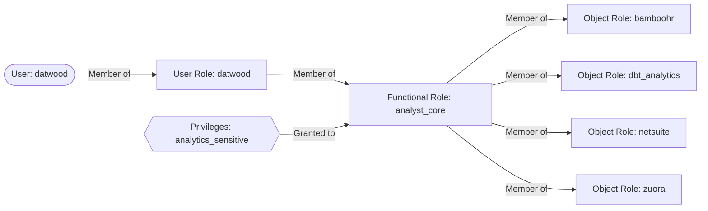
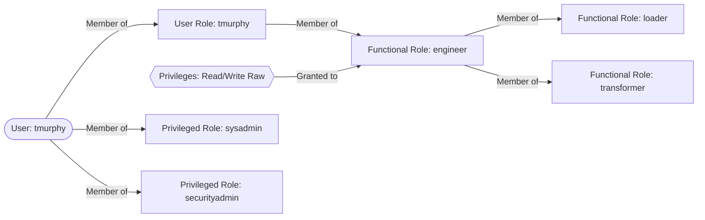
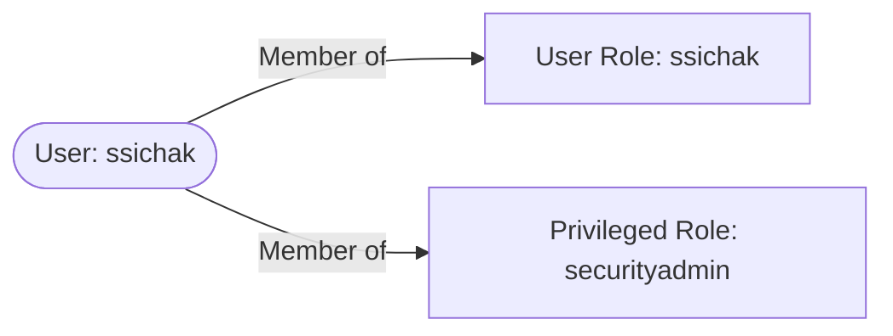
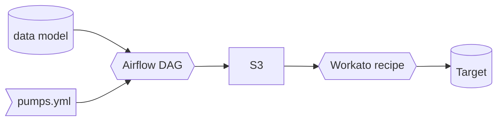

## On this page
{:.no_toc .hidden-md .hidden-lg}

- TOC
{:toc .toc-list-icons .hidden-md .hidden-lg}

{::options parse_block_html="true" /}

{::options parse_block_html="true" /}

<div class="panel panel-gitlab-orange">
**This is a Controlled Document**
{: .panel-heading}
<div class="panel-body">

Inline with GitLab's regulatory obligations, changes to [controlled documents](/handbook/security/controlled-document-procedure.html) must be approved or merged by a code owner. All contributions are welcome and encouraged. 

</div>
</div>
---

## <i class="fas fa-map-marked-alt fa-fw" style="color:rgb(107,79,187); font-size:.85em" aria-hidden="true"></i>Quick Links

- [Data Infrastructure](/handbook/business-technology/data-team/platform/infrastructure/)
- [Data Pipelines](/handbook/business-technology/data-team/platform/pipelines/)
- [Data CI Jobs](/handbook/business-technology/data-team/platform/ci-jobs/)
- [dbt Guide](/handbook/business-technology/data-team/platform/dbt-guide/)
- [Enterprise Data Warehouse](/handbook/business-technology/data-team/platform/edw/)
- [Data Pump](/handbook/business-technology/data-team/platform/#data-pump)
- [Jupyter Guide](/handbook/business-technology/data-team/platform/jupyter-guide/)
- [Permifrost](/handbook/business-technology/data-team/platform/permifrost/)
- [Python Guide](/handbook/business-technology/data-team/platform/python-guide/)
- [Sisense (Periscope)](/handbook/business-technology/data-team/platform/sisensecdt/)
- [Sisense Style Guide](/handbook/business-technology/data-team/platform/sisense-style-guide/)
- [Snowplow](/handbook/business-technology/data-team/platform/snowplow/)
- [SQL Style Guide](/handbook/business-technology/data-team/platform/sql-style-guide/)
- [Meltano](/handbook/business-technology/data-team/platform/Meltano-Gitlab/)
- [R/RStudio](/handbook/business-technology/data-team/platform/rstudio/)

## <i class="fas fa-cubes fa-fw" style="color:rgb(252,109,38); font-size:.85em" aria-hidden="true"></i>Our Data Stack


We use GitLab to operate and manage the analytics function.
Everything starts with an issue.
Changes are implemented via merge requests, including changes to our pipelines, extraction, loading, transformations, and parts of our analytics.

| Stage           |              Tools             |
| :-------------- | :---------------------------: |
| Extraction      | Stitch, Fivetran, and Custom Code |
| Loading         | Stitch, Fivetran, and Custom Code |
| Orchestration   | Airflow |
| Data Warehouse  | Snowflake Enterprise Edition |
| Transformations | dbt and Python scripts |
| Data Visualization | Sisense For Cloud Data Teams‎ |
| Advanced Analytics | jupyter‎ |

## <i class="fas fa-exchange-alt fa-fw" style="color:rgb(107,79,187); font-size:.85em" aria-hidden="true" id="extract-and-load"></i>Extract and Load

We currently use [Stitch](https://www.stitchdata.com) and [Fivetran](https://fivetran.com/) for some of our data sources. These are off-the-shelf ELT tools that remove the responsibility of building, maintaining, or orchestrating the movement of data from some data sources into our Snowflake data warehouse. We run a full-refresh of all of our Stitch/Fivetran data sources at the same time that we rotate our security credentials (approx every 90 days). Prior to running a full refresh we will drop all of the tables.

Stitch and Fivetran handle the start of the data pipeline themselves. This means that Airflow does not play a role in the orchestration of the Stitch- and Fivetran schedules.

Other solutions we use to extract data are:
1. [Meltano](/handbook/business-technology/data-team/platform/Meltano-Gitlab/) 
1. Custom pipelines built in [Python](/handbook/business-technology/data-team/platform/python-guide/) and orchestrated via [Airflow](/handbook/business-technology/data-team/platform/infrastructure/#airflow)
1. Snowflake [data share](https://docs.snowflake.com/en/user-guide/data-sharing-intro.html)

For source ownership please see [the Tech Stack Applications data file.](https://gitlab.com/gitlab-com/www-gitlab-com/-/blob/master/data/tech_stack.yml)

### Data Sources

The following table indexes all of the RAW data sources we are loading into the data warehouse from external locations. We manage the development backlog and priorities in the [New Data Source/Pipeline Project Management](https://docs.google.com/spreadsheets/d/14uqsAIqRnyyL9Ta39QYwheXnf0k86yTTIKhrkY_1el8/edit#gid=0) sheet, with links to GitLab issues for up-to-date status and progress management. The [new data source handbook](/handbook/business-technology/data-team/how-we-work/new-data-source/) page describes how the Data Team handles any request for new data sources. 

**Key**
- Pipeline: The technology we use to replicate data.
- RF (Replication Frequency): How often we load new and updated data.
- Raw Schema: The schema in the `RAW` database where data is stored.
- Prep Schema: The schema in the `PREP` database where [source models](/handbook/business-technology/data-team/platform/dbt-guide/#source-models) are materialized.
- Audience: The primary users of the data.
- SLO: Service Level Objective. Our SLO is the time between real-time and the analysis displayed in the [data visualization tool](#visualization)
- `x` indicates undefined or not run

|                                                             [Data Source](/handbook/business-technology/data-team/platform/pipelines) |                                                               Pipeline                                                                |            Raw Schema             |          Prep Schema          |             Audience              |  RF / SLO   | MNPI |  Tier  | 
|--------------------------------------------------------------------------------------------------------------------------------------:|:-------------------------------------------------------------------------------------------------------------------------------------:|:---------------------------------:|:-----------------------------:|:---------------------------------:|:-----------:|:----:|:------:|
|                                                                                         [Adaptive](https://www.adaptiveplanning.com/) |                                                                Meltano                                                                |          `tap_adaptive`           |                               |              Finance              |             | Yes  | Tier 2 |
|                                                    [Adobe / Bizible](https://experienceleague.adobe.com/docs/bizible/using/home.html) |                                            [Airflow](https://airflow.gitlabdata.com/home)                                             |             `bizible`             |          `sensitive`          |             Marketing             |  24h / 36h  |  No  | Tier 2 |
|                                                                                                [Airflow](https://airflow.apache.org/) |                                                 [Stitch](https://www.stitchdata.com/)                                                 |         `airflow_stitch`          |           `airflow`           |             Data Team             |  24h / 24h  |  No  | Tier 3 |
|                                                                                                 [BambooHR](https://www.bamboohr.com/) |                                            [Airflow](https://airflow.gitlabdata.com/home)                                             |            `bamboohr`             |          `sensitive`          |              People               |  12h / 24h  |  No  | Tier 2 |
|                                                                                                 [Clari](https://www.clari.com/) |                                            [Airflow](https://airflow.gitlabdata.com/home)                                             |            `clari`             |          `clari`          |              Sales               |  24h / 24h  |  Yes  | Tier 2 |
|                                                                                                     [Clearbit](https://clearbit.com/) |                                                                   x                                                                   |                 x                 |               x               |               x / x               |             |  No  | Tier 3 |
| [CustomersDot](https://about.gitlab.com/handbook/business-technology/data-team/platform/pipelines/#gitlab-customer-dot-database) [ERD](https://gitlab.com/gitlab-org/customers-gitlab-com/-/blob/staging/doc/db_erd.pdf) |                        [pgp](https://gitlab.com/gitlab-data/analytics/-/tree/master/extract/postgres_pipeline)                        |          `tap_postgres`           |          `customers`          |              Product              |   24h / x   |  No  | Tier 1 |
|                                                                                             [Demandbase](https://www.demandbase.com/) |  [Snowflake task](/handbook/business-technology/data-team/platform/infrastructure/#automated-processes-loading-data-into-snowflake)   |           `demandbase`            |         `demandbase`          |             Marketing             |   24h / x   |  No  | Tier 2 |
|                                                                                                    [EdCast](https://www.edcast.com//) |                              [Meltano](/handbook/business-technology/data-team/platform/Meltano-Gitlab/)                              |           `tap_edcast`            |           `edcast`            |              People               |   24h / x   |  No  | Tier 3 |
|                                                                                                    [Facebook_ads](https://www.facebook.com/business/ads) |                              [Fivetran](https://fivetran.com/)                              |           `facebook_ads`            |           `facebook_ads`            |              Marketing               |   24h / 48h   |  No  | Tier 3 |
|                                                                                                          [Gitter](https://gitter.im/) |                                                                   x                                                                   |             `gitter`              |               x               |                 x                 |      x      |  No  | Tier 3 |
|                                    [GitLab.com](/handbook/business-technology/data-team/platform/pipelines/#gitlab-postgres-database) |                        [pgp](https://gitlab.com/gitlab-data/analytics/-/tree/master/extract/postgres_pipeline)                        |          `tap_postgres`           |        `gitlab_dotcom`        |       Product, Engineering        |  24h / 48h  |  No  | Tier 1 |
|                                                                                                                         [GitLab Ops DB](https://about.gitlab.com/handbook/business-technology/data-team/platform/pipelines/#gitlab-ops-database) |                        [pgp](https://gitlab.com/gitlab-data/analytics/-/tree/master/extract/postgres_pipeline)                        |          `tap_postgres`           |         `gitlab_ops`          |            Engineering            |   6h / x    |  No  | Tier 1 |
|                                                                                                                    GitLab Profiler DB |                                                                   x                                                                   |                 x                 |               x               |                 x                 |    x / x    |  No  | Tier 3 |
|                                                                                                        Gitlab Container Registry Logs |                                            [Airflow](https://airflow.gitlabdata.com/home)                                             |       `Container Registry`        |     `Container Registry`      |            Engineering            |      x      |  No  | Tier 2 |
|                                                                                                 [Google Ads](https://ads.google.com/) |                                                   [Fivetran](https://fivetran.com/)                                                   |           `google_ads`            |         `google_ads`          |             Marketing             |  24h / 48h  |  No  | Tier 2 |
|                                                     [Google Analytics 360](https://marketingplatform.google.com/about/analytics-360/) |                                                   [Fivetran](https://fivetran.com/)                                                   |  `google_analytics_360_fivetran`  |    `google_analytics_360`     |             Marketing             |  6h / 32h   |  No  | Tier 2 |
|                                                       [Google Cloud Billing](https://cloud.google.com/support/billing)                |                                            [Airflow](https://airflow.gitlabdata.com/home)                                             |           `gcp_billing`           |         `gcp_billing`         |            Engineering            |   24h / x   |  No  | Tier 3 |
|                                                      [Google Search Console](https://search.google.com/search-console/about) |                                                   [Fivetran](https://fivetran.com/)                                                   |           `google_search_console`            |         `google_search_console`          |             Marketing             |  24h / 48h  |  No  | Tier 2 |
|                                                                        [Graphite API](https://graphite-api.readthedocs.io/en/latest/) |                                            [Airflow](https://airflow.gitlabdata.com/home)                                             |      `engineering_extracts`       |               x               |            Engineering            |  24h / 48h  |  No  | Tier 3 |
|                                                                                              [Greenhouse](https://www.greenhouse.io/) |                          [Sheetload](https://gitlab.com/gitlab-data/analytics/tree/master/extract/sheetload)                          |           `greenhouse`            |         `greenhouse`          |              People               |  24h / 48h  |  No  | Tier 2 |
|                                [Handbook YAML Files](https://gitlab.com/gitlab-data/analytics/-/tree/master/extract/gitlab_data_yaml) |                                            [Airflow](https://airflow.gitlabdata.com/home)                                             |        `gitlab_data_yaml`         |      `gitlab_data_yaml`       |             Multiple              |  8h / 24h   |  No  | Tier 2 |
|                       [Handbook MR Data](https://gitlab.com/gitlab-data/analytics/-/blob/master/dags/extract/handbook_mrs_extract.py) |                                            [Airflow](https://airflow.gitlabdata.com/home)                                             |            `handbook`             |          `handbook`           |             Multiple              |  24h / 24h  |  No  | Tier 2 | 
|                   [Handbook Git Log Data](https://gitlab.com/gitlab-data/analytics/-/blob/master/dags/extract/values_page_extract.py) |                                            [Airflow](https://airflow.gitlabdata.com/home)                                             |            `handbook`             |          `handbook`           |             Multiple              |   1w / 1m   |  No  | Tier 2 |
| [Automatic Process](/handbook/business-technology/data-team/platform/infrastructure/#automated-processes-loading-data-into-snowflake) |                                                                                                                                       |           `license_db`            |         `license_db`          |              Product              | 24 h / 48 h |  No  | Tier 1 |
|                                                                                                    [Liknedin_ads](https://business.linkedin.com/marketing-solutions/ads) |                              [Fivetran](https://fivetran.com/)                              |           `linkedin_ads`            |           `n/a`            |              Marketing               |   24h / 48h   |  No  | Tier 3 |
|                                                                     [Marketo](https://www.marketo.com/software/marketing-automation/) |                                                   [Fivetran](https://fivetran.com/)                                                   |             `marketo`             |               x               |             Marketing             |  24h / 24h  |  No  | Tier 2 |
|                                                                               [MailGun](https://documentation.mailgun.com/en/latest/) |                                            [Airflow](https://airflow.gitlabdata.com/home)                                             |             `mailgun`             |           `mailgun`           |             Marketing             |  24h / 24h  |  No  | Tier 2 |
|                                                                               [Monte Carlo](/handbook/business-technology/data-team/platform/monte-carlo/) |                                            Snowflake Share                                             |             `n/a`             |           `prep_legacy`           |             Data             |  12h / 24h  |  No  | Tier 3 |
|                                                                                [Netsuite](https://www.netsuite.com/portal/home.shtml) |                                                   [Fivetran](https://fivetran.com/)                                                   |        `netsuite_fivetran`        |          `netsuite`           |              Finance              |  6h / 24h   | Yes  | Tier 2 |
|                                                                                                           [PMG](https://www.pmg.com/) |                                                                   x                                                                   |               `pmg`               |             `pmg`             |                 x                 |    x / x    |  No  | Tier 3 |
|                                                                                        [PTO by Deel](https://www.deel.com/engage/pto) |     [Snowpipe](/handbook/business-technology/data-team/platform/infrastructure/#automated-processes-loading-data-into-snowflake)      |               `pto`               |         `gitlab_pto`          | Engineering Productivity / People | 7 days / x  |  No  | Tier 3 |
|                                                                                               [Qualtrics](https://www.qualtrics.com/) |                                            [Airflow](https://airflow.gitlabdata.com/home)                                             |           `qualitrics`            |          `qualtrics`          |             Marketing             |  12h / 48h  |  No  | Tier 2 |
|                                   [SaaS Service Ping](https://gitlab.com/gitlab-data/analytics/-/tree/master/extract/saas_usage_ping) |                                            [Airflow](https://airflow.gitlabdata.com/home)                                             |         `saas_usage_ping`         |       `saas_usage_ping`       |              Product              | 1 week / x  |  No  | Tier 1 |
|                                                                                             [Salesforce](https://www.salesforce.com/) |                                                 [Stitch](https://www.stitchdata.com/)                                                 |        `salesforce_stitch`        |            `sfdc`             |               Sales               |  6h / 24h   | Yes  | Tier 1 |
|                                                    [SheetLoad](/handbook/business-technology/data-team/platform/pipelines/#sheetload) |                          [SheetLoad](https://gitlab.com/gitlab-data/analytics/tree/master/extract/sheetload)                          |            `sheetload`            |          `sheetload`          |             Multiple              |  24h / 48h  | Yes  | Tier 1 |
|                                                                                            [Snowplow](https://snowplowanalytics.com/) |                       [Snowpipe](/handbook/business-technology/data-team/platform/snowplow/index.html#snowpipe)                       |            `snowplow`             |          `snowplow`           |              Product              |  15m / 24h  |  No  | Tier 1 |
|                                                                                   [Thanos](https://thanos-query.ops.gitlab.net/graph) |  [Snowflake Task](/handbook/business-technology/data-team/platform/infrastructure/#automated-processes-loading-data-into-snowflake)   |           `prometheus`            |         `prometheus`          |            Engineering            |  24 h / x   |  No  | Tier 3 |
|                                                                                [Version DB](https://version.gitlab.com/users/sign_in) | [Automatic Process](/handbook/business-technology/data-team/platform/infrastructure/#automated-processes-loading-data-into-snowflake) |           `version_db`            |         `version_db`          |              Product              | 24 h / 48 h |  No  | Tier 1 |
|                                                                                                   [Workday](https://www.workday.com/) |                                                               Fivetran                                                                |             `workday`             |           `workday`           |              People               | 6h / 24h /  |  No  | Tier 2 |
|                                                                                                  [Xactly](https://www.xactlycorp.com) |                                                    [Meltano](https://meltano.com/)                                                    |           `tap_xactly`            |              N/A              |               Sales               |  24h / N/A  | Yes  | Tier 2 |
|                                                                                                   [Zendesk](https://www.zendesk.com/) |                                                    [Meltano](https://meltano.com/)                                                    |           `tap_zendesk`           |           `zendesk`           |              Support              |  6h / 24h   |  No  | Tier 2 |
|                                                                               [Zendesk Community Relations](https://www.zendesk.com/) |                                                    [Meltano](https://meltano.com/)                                                    | `tap_zendesk_community_relations` | `zendesk_community_relations` |              Support              |  6h / 24h   |  No  | Tier 2 |
|                                                                                                              [ZenGRC](/handbook/business-technology/data-team/platform/pipelines/#zengrc) |                                                    [Meltano](https://meltano.com/)                                                    |            `tap_gengrc`             |              N/A              |              Engineering               |  8h / 16h  |  Yes  | Tier 3 |
|                                                                                                              [Zoom](https://zoom.us/) |                                                    [Meltano](https://meltano.com/)                                                    |            `tap_zoom`             |              N/A              |              People               |  24h / N/A  |  No  | Tier 3 |
|                                                                                                       [Zuora](https://www.zuora.com/) |                                                 [Stitch](https://www.stitchdata.com/)                                                 |          `zuora_stitch`           |            `zuora`            |              Finance              |  6h / 24h   | Yes  | Tier 1 |
|                                                                                            [Zuora API Sandbox](https://www.zuora.com) |                                                 [Stitch](https://www.stitchdata.com/)                                                 |    `zuora_api_sandbox_stitch`     |           `Legacy`            |              Finance              |  24h / 24h  | Yes  | Tier 3 |
|                                                                                       [Zuora Central Sandbox](https://www.zuora.com/) |                  [Fivetran](https://fivetran.com/dashboard/connectors/zuora_sandbox/zuora_central_sandbox_fivetran)                   | `zuora_central_sandbox_fivetran`  |    `zuora_central_sandbox`    |          Finance Sandbox          |      -      | Yes  | Tier 3 |
|                                                                      [Zuora Revenue](https://knowledgecenter.zuora.com/Zuora_Revenue) |                                            [Airflow](https://airflow.gitlabdata.com/home)                                             |          `zuora_revenue`          |        `zuora_revenue`        |              Finance              |  24h / 48h  | Yes  | Tier 1 |
 
##### Source contacts 

See the [source contact spreadsheet](https://docs.google.com/spreadsheets/d/1VKvqyn7wy6HqpWS9T3MdPnE6qbfH2kGPQDFg2qPcp6U/edit) for who to contact if there are any external errors. 

#### Tier definition

| Aspect | Tier 1 | Tier 2  | Tier 3 | 
|:-|:-|:-|:-|
| **Description**  | - Trusted Data solutions that are most important and business critical. <br><br> - Components needs to  be available and refreshed to ensure day-by-day operation | - Data solutions that are important and beneficial for gathering insights. <br><br> - Components should be available and refreshed to supporting day-by-day operation | - Data solutions that are important for for Ad-Hoc, periodically or one-time analysis. <br><br> - Components could be unavailable or data not refreshed. |
|**Criteria**|- Any data, process, or related service that would result in a $100k or _higher_ business impact if unavailable for 24 hours <br><br>-  Affecting more than 15 business users | - Any data, process, or related service that would result in  _less_  than $100k business impact if unavailable for 24 hours <br><br> - Affecting between 5 and 15 business users | - Any data, process or related service that would _not_ result in a immediate business impact if unavailable for more than 5 working days <br><br> - Affecting less then 5 business users |
|**Impact due to outage**|Severe|Lenient|Negligible |

### Data Team Access to Data Sources

In order to integrate new data sources into the data warehouse, specific members of the Data team will need admin-level access to data sources, both in the UI and through the API.
We need this admin-level access through the API in order to pull all the data needed to build the appropriately analyses and through the UI to compare the results of prepared analyses to the UI.

Sensitive data sources can be limited to no less than 1 data engineer and 1 data analyst having access to build the require reporting.
In some cases, it may only be 2 data engineers.
We will likely request an additional account for the automated extraction process.

Sensitive data is locked down through the security paradigms listed below;
Sisense will never have access to sensitive data, as Sisense does not have access to any data by default.
Sisense's access is always explicitly granted.

### Data Source Overviews

- [Customer Success Dashboards](https://drive.google.com/open?id=1FsgvELNmQ0ADEC1hFEKhWNA1OnH-INOJ)
- [Netsuite](https://www.youtube.com/watch?v=u2329sQrWDY)
    - [Netsuite and Campaign Data](https://drive.google.com/open?id=1KUMa8zICI9_jQDqdyN7mGSWSLdw97h5-)
- [Version (pings)](https://drive.google.com/file/d/1S8lNyMdC3oXfCdWhY69Lx-tUVdL9SPFe/view)
    - Note that up until October 2019, the data team referred to the entire **version** data source as "pings". However, usage ping is only one subset of the version data source which is why we now use "version" or "version app" to refer to the version.gitlab.com _data source_ and "usage data" or "usage pings" or "pings" to refer to the [specific usage data feature](https://docs.gitlab.com/ee/user/admin_area/settings/usage_statistics.html) of the version data source. In the context of Data extraction, when it comes to `Service ping` data ingestion, specific details should be found in the [Service ping](/handbook/business-technology/data-team/platform/pipelines/#service-ping) page or in the [Readme.md](https://gitlab.com/gitlab-data/analytics/-/blob/master/extract/saas_usage_ping/README.md) page for Service ping
- [Salesforce](https://youtu.be/KwG3ylzWWWo)
- [Zendesk](https://drive.google.com/open?id=1oExE1ZM5IkXcq1hJIPouxlXSiafhRRua)

### DataSiren

To ensure that the data team has a complete picture of where sensitive data is in the data warehouse, as well as make sure Sisense does not have access to sensitive data, a periodic scan of the data warehouse is made using dbt along with the internally-developed library of tools created as [`datasiren`](https://gitlab.com/gitlab-data/datasiren). This scan is currently executed weekly. The fine-grained results are stored in Snowflake in the `PREP.DATASIREN` schema and are not available in Periscope because of sensitivity reasons.  High-level results have been made available in Periscope, including the simple dashboard found [here](https://app.periscopedata.com/app/gitlab/793578/DataSiren).  

### Snowplow Infrastructure

Refer to the [Snowplow Infrastructure page](/handbook/business-technology/data-team/platform/snowplow) for more information on our setup.

## <i class="fas fa-clock fa-fw" style="color:rgb(252,109,38); font-size:.85em" aria-hidden="true"></i>Orchestration

We use Airflow on Kubernetes for our orchestration. Our specific setup/implementation can be found [here](https://gitlab.com/gitlab-data/data-image). Also see the [Data Infrastructure](/handbook/business-technology/data-team/platform/infrastructure/) page for more information.

## <i class="fas fa-database fa-fw" style="color:rgb(107,79,187); font-size:.85em" aria-hidden="true" id="data-warehouse"></i>Data Warehouse

We currently use [Snowflake](https://docs.snowflake.net/manuals/index.html) as our data warehouse. The Enterprise Data Warehouse (EDW) is the single source of truth for GitLab's corporate data, performance analytics, and enterprise-wide data such as Key Performance Indicators. The EDW supports GitLab’s data-driven initiatives by providing all teams a common platform and framework for reporting, dashboarding, and analytics. With the exception of point-to-point application integrations all current and future data projects will be driven from the EDW. As a recipient of data from a variety of GitLab source systems, the EDW will also help inform and drive Data Quality best-practices, measures, and remediation to help ensure all decisions are made using the best data possible.

### Snowflake support portal access 

To get access to snowflake support portal, please follow the below steps.
- Register using gitlab email id to [community portal](https://community.snowflake.com/CommunitiesSelfReg)
- This registration will send a welcome email to gitlab mail with the subject `Welcome to the Snowflake Community`. In the mail it will ask you to finish the registration as part of that you will be asked to set your password for the community portal.
- Once done login again to your snowflake community account and on the home page, click `submit case`. For the first time, the user who do not have access to submit a case with snowflake. It will ask you to fill in the form for access. 
- In the form select the access for already snowflake customer. On the next page, it will ask for information `Account Name `, `Cloud Name`, and  `Region Name`. Below is one way to pull this information from the snowflake console.
    - `Account Name` - select CURRENT_ACCOUNT();
    - `Region Name`- select CURRENT_REGION();
    - `Cloud Name` - Based on the [region name](https://docs.snowflake.com/en/user-guide/admin-account-identifier.html#snowflake-region-ids)  value we can identify the cloud name. 
    
- Once done you should receive the acknowledgment mail with the subject `[Request received] Case#` instantly. In case you don't receive the mail resubmit the form. 
- Post that you will receive confirmation mail within 24 hours on your request with the subject line  `Case# -Self Register - Enable Case access`

### Warehouse Access

To gain access to the data warehouse:

- Create an issue in the [access requests project](https://gitlab.com/gitlab-com/team-member-epics/access-requests) documenting the level of access required.
- Do not request a shared account - each account must be tied to a user.
- We loosely follow the paradigm explained in [this blog post](https://blog.fishtownanalytics.com/how-we-configure-snowflake-fc13f1eb36c4) around permissioning users.
- When asking to mirror an existing account, please note that access to restricted SAFE data will **not** be provisioned/mirrored (currently provided via `restricted_safe` role). 

### Snowflake Permissions Paradigm

We use [Permifrost](https://gitlab.com/gitlab-data/permifrost/) to help manage permissions for Snowflake.
Our configuration file for our Snowflake instance is stored in [this roles.yml file](https://gitlab.com/gitlab-data/analytics/blob/master/permissions/snowflake/roles.yml).
Also available is our [handbook page on Permifrost](/handbook/business-technology/data-team/platform/permifrost/).

We follow this general strategy for role management:

- Every user has an associated user role
- Functional roles exist to represent common privilege sets (`analyst_finance`, `data_manager`, `product_manager`)
- Logical groups of data have their own object roles
- Object roles are assigned primarily to functional roles
- Higher privilege roles (`accountadmin`, `securityadmin`, `useradmin`, `sysadmin`) are assigned directly to users
- Service accounts have an identically named role
- Additional roles can be assigned either to the service account role or the service account itself, depending on usage and needs
- Individual privileges can be granted at the granularity of the table & view
- Warehouse usage can be granted to any role as needed, but granting to functional roles is recommended

#### User Roles

Every user will have their own user role that should match their user name.
Object level permissions (database, schemas, tables) in Snowflake can only be granted to roles.
Roles can be granted to users or to other roles.
We strive to have all privileges flow through the user role so that a user only has to use one role to interact with the database.
Exceptions are privileged roles such as `accountadmin`, `securityadmin`, `useradmin`, and `sysadmin`.
These roles grant higher access and should be intentionally selected when using.

#### Functional Roles

Functional roles represent a group of privileges and role grants that typically map to a job family.
The major exception is the analyst roles.
There are several variants of the analyst role which map to different areas of the organization.
These include `analyst_core`, `analyst_finance`, `analyst_people`, and more.
Analysts are assigned to relevant roles and are explicitly granted access to the schemas they need.

Functional roles can be created at any time.
It makes the most sense when there are multiple people who have very similar job families and permissions.

#### Object Roles

Object roles are for managing access to a set of data.
Typically these represent all of the data for a given source.
The `zuora` object role is an example.
This role grants access to the raw Zuora data coming from Stitch, and also to the source models in the `prep.zuora` schema.
When a user needs access to Zuora data, granting the `zuora` role to that user's user role is the easiest solution.
If for some reason access to the object role doesn't make sense, individual privileges can be granted at the granularity of a table.

#### Masking Roles

Masking Roles manage how users interact with masked data. Masking is applied at the column level and which columns are masked is the decision of the source system owner. Masking is applied to a column in a `schema.yml` file within the dbt code base when a data object is created via dbt. As some users will need access to unmasked data the masking role allows for permissions to the unmasked data to be granted on a functional or object role level. For example if the masking role of `people_data_masking` is applied to the column `locality` then the functional role of `analyst_people` can be set as a member of the `people_masking` role to allow the analysts to see unmasked people data.

When a masking policy is created, it is created based on the masking roles and only one masking policy can be applied to a column.

#### Examples

This is an example role hierarchy for an Data Analyst, Core:



This is an example role hierarchy for an Data Engineer and Account Administrator:



This is an example role hierarchy for a Security Operations Engineer:



<div class="panel panel-success">
**Managing Roles for Snowflake**
{: .panel-heading}
<div class="panel-body">

Here are the proper steps for provisioning a new user and user role:

- Make sure we have an issue in the GitLab Data Team project linking the original request with the `Provisioning` label applied
- Login to Snowflake and switch to `securityadmin` role
    - All roles should be under `securityadmin` ownership
- Copy the [`user_provision.sql`](https://gitlab.com/gitlab-data/analytics/-/blob/master/permissions/snowflake/user_provision.sql) script and replace the email, firstname, and lastname values in the initial block
- If a password is needed, use [Password Generator](https://passwordsgenerator.net/) to create one
    - Send username and password credentials to user with [One Time Secret](https://onetimesecret.com/) or via Slack
- Document in Snowflake [roles.yml](https://gitlab.com/gitlab-data/analytics/-/blob/master/permissions/snowflake/roles.yml) permifrost config file (this file is automatically loaded every day at 12:00a.m. UTC)
    - Add the user and user role you created
    - Assign the user role to new user
    - Assign any additional roles to user
- Ensure the user is assigned the application in Okta
- Ensure the user is assigned to the `okta-snowflake-users` [Google Group](https://groups.google.com/my-groups)

Here are the proper steps for deprovisioning existing user:

- Snowflake deprovision should be done via an offboarding issue or access request issue.
- Make sure we have an issue in the GitLab Data Team project linking the original source request with the `Deprovisioning` label applied.
- Login to Snowflake and switch to `securityadmin` role
    - All roles should be under `securityadmin` ownership.
- Copy the [`user_deprovision.sql`](https://gitlab.com/gitlab-data/analytics/-/blob/master/permissions/snowflake/user_deprovision.sql) script and replace the USER_NAME. The reason for not removing and leaving the user in snowflake and setting disabled = TRUE is to have a record of when the user lost access.
- Remove the user from `okta-snowflake-users` [Google Group](https://groups.google.com/my-groups)
- Remove the user records in Snowflake [roles.yml](https://gitxlab.com/gitlab-data/analytics/-/blob/master/permissions/snowflake/roles.yml) permifrost config file (this file is automatically loaded every day at 12:00a.m. UTC)


</div>
</div>

For more information, watch this [recorded pairing session](https://youtu.be/-vpH0aSeO9c) (must be viewed as GitLab Unfiltered).

#### Logging in and using the correct role

When you apply for a Snowflake account via an AR and get access provisioned it takes until 3.00AM UTC for the change to take effect. This is because we have a script running daily to provision the access in Snowflake. When you can login, you can do this via Okta. After you logged in via Okta, you need to select the right role that is attached to your account. This is by default the same as your account and it follows the convention of your email adres minus `@gitlab.com`. 

When you don’t select the right role in Snowflake, you only see the following Snowflake objects:


Selecting the right role can be done via the GUI in the up right corner.


1. Click on the arrow
2. Select Switch Role
3. Select your role. 
  
You can set this to your default by running the following:

`ALTER USER <YOUR_USER_NAME> SET DEFAULT_ROLE = '<YOUR_ROLE>'`

### Compute Resources

Compute resources in Snowflake are known as "warehouses".
To use our credit consumption effectively, we try to minimize the amount of warehouses. For development purposes (executing dbt jobs locally, running MR pipelines and querying in Snowflake) we use the `dev_x` warehouse. The names of the warehouse are appended with their size (`dev_xs` for extra small).

| warehouse            | purpose                                                                                         | max query (minutes) |
| -------------------- | ----------------------------------------------------------------------------------------------- | ------------------- |
| `admin`              | This is for permission bot and other admin tasks                                                | 10                  |
| `datasiren`          | This is used for the Data siren proces                                                          | 30                  |
| `dev_x`              | This is used for development purposes, to be used when using the Snowflake UI and in CI-pipelines | 180               |
| `gainsight_xs`       | This is used for gainsight data pump                                                            | 30                  |
| `gitlab_postgres`    | This is for extraction jobs that pull from GitLab internal Postgres databases                   | 10                  |
| `grafana`            | This is exclusively for Grafana to use                                                          | 60                  |
| `loading`            | This is for our Extract and Load jobs and testing new Meltano loaders                           | 60                  |
| `reporting`          | This is for the BI tool for querying. Note that Sisense enforces a 5 minute timeout.            | 30*                 |
| `transforming_xs`    | These are for production dbt jobs                                                               | 180                 |
| `transforming_s`     | These are for production dbt jobs                                                               | 180                 |
| `transforming_l`     | These are for production dbt jobs                                                               | 240                 |
| `transforming_xl`    | These are for production dbt jobs                                                               | 180                 |
| `transforming_4xl`   | This is for the Airflow dag: `dbt_full_refresh`                                                 | 120                 |
| `usage_ping`         | This is used for the service_ping and service_ping_backfill load.                               | 120                 |

If you're running into query time limits please check your query for optimisation. A bad performing query in development will result in a bad performing query in production, having impact on a daily basis. Please **always** use the right (size) warehouse. Ground rules of using/selecting a warehouse:

- Warehouses are set as t-shirt sizes. Larger warehouses are more costly for GitLab
- Consider using a running warehouse
   - If you resume a paused warehouse, there is a initial start cost
   - Every warehouse suspends after a set period, but when idle (time between query result and the suspend time), we still consume snowflake credits
   - In general we don't spend more money if we run concurrent queries.

* The query timeout in Snowflake is set to 30 minutes for the `REPORTING` warehouse. Sisense has a threshold that has been set to 10 minutes to time-out in order to prevent queuing on the Sisense platform.

### Data Storage

We use three primary databases: `raw`, `prep`, and `prod`.
The `raw` database is where data is first loaded into Snowflake; the other databases are for data that is ready for analysis (or getting there).

There is a `snowflake` database, which contains information about the entire GitLab instance.
This includes all tables, views, queries, users, etc.

There is a `covid19` database, which is a shared database managed through the Snowflake Data Exchange.

There is a `testing_db` database, which is used for testing Permifrost.

There is a `bi_tool_eval` database, which is used for testing bi tooling. Users are able create own testing sets manually. 

All databases not defined in our [`roles.yml`](https://gitlab.com/gitlab-data/analytics/-/blob/master/permissions/snowflake/roles.yml) Permifrost file are removed on a weekly basis.

| Database | Viewable in Sisense |
|:-:|:-:|
| raw | No |
| prep | No |
| prod | Yes |

#### Raw

This database is not available to query in Sisense. No dbt models exist for this data and so it may be the case that the data needs review or transformation in order to be useful or accurate. This review, documentation, and transformation all happens downstream in dbt for `PREP` and `PROD`

- Raw may contain sensitive data, so permissions need to be carefully controlled
- RAW will contain data that isn't ready for business use.
- Data is stored in different schemas based on the source
- User access can be controlled by schema and tables

#### Prep

This database is not available to query in Sisense, and is the first layer of verification and transformation in the warehouse, but is not yet ready for general business use.

- [Source models](/handbook/business-technology/data-team/platform/dbt-guide/#source-models) are built in logical schemas corresponding to the data source (i.e. `sfdc`, `zuora`)
- PREPARATION - this is the default schema where dbt models are built
- SENSITIVE

#### Prod

This database and all schemas and tables in it are queryable by Sisense. This data has been transformed and modeled for business use.

With the exception of `public`, and [`boneyard`](/handbook/business-technology/data-team/#mind-about-sheetload), all schemas are controlled by dbt.
See the [dbt guide](/handbook/business-technology/data-team/platform/dbt-guide) for more information.

#### Folder Structure in Analytics Project

The table below shows a mapping of how models stored within folders in the [`models/`](https://gitlab.com/gitlab-data/analytics/-/tree/master/transform/snowflake-dbt/models) directory in the analytics project will be materialized in the data warehouse. 

The source of truth for this is in the [`dbt_project.yml` configuration file](https://gitlab.com/gitlab-data/analytics/-/blob/master/transform/snowflake-dbt/dbt_project.yml).

| Folder in snowflake-dbt/models/ | db.schema | Details | Queryable in Sisense |
|-|-|-|:-:|
| common/ | prod.common | Top-level folder for facts and dimensions. Do not put models here. | Yes |
| common/bridge | prod.common | Sub-folder for creating many-to-many mappings between data that come from different sources. | Yes |
| common/dimensions_local | prod.common | Sub-folder with directories containing dimensions for each analysis area. | Yes |
| common/dimensions_shared | prod.common | Sub-folder with dimensions that relate to every analysis area. | Yes |
| common/facts_financial | prod.common | Sub-folder with facts for the financial analysis area. | Yes |
| common/facts_product_and_engineering | prod.common | Sub-folder with facts for the product and engineering analysis area. | Yes |
| common/facts_sales_and_marketing | prod.common | Sub-folder with facts for the sales and marketing analysis area. | Yes |
| common/sensitive/ | prep.sensitive | Facts/dims that contain sensitive data. | No |
| common_mapping/ | prod.common_mapping | Used for creating one-to-one mappings between data that come from different sources. | Yes |
| common_mart/ | prod.common_mart | Joined dims and facts that are relevant to all analysis areas. | Yes |
| common_mart_finance/ | prod.common_mart | Joined dims and facts that are relevant to finance.  | Yes |
| common_mart_marketing/ | prod.common_mart | Joined dims and facts that are relevant to marketing. | Yes |
| common_mart_product/ | prod.common_mart | Joined dims and facts that are relevant to product. | Yes |
| common_mart_sales/ | prod.common_mart | Joined dims and facts that are relevant to sales. | Yes |
| common_prep/ | prod.common_prep | Preparation tables for mapping, bridge, dims, and facts. | Yes |
| marts/ | varies | Contains mart-level data and data pumps that send data to third party sources. | Yes |
| legacy/ | prod.legacy | Contains models built in a non-dimensional manner | Yes |
| sources/ | prep.`source` | Contains source models. Schema is based on data source | No |
| workspaces/ | prod.workspace_`workspace` | Contains workspace models that aren't subject to SQL or dbt standards.  | Yes |
| common/restricted | prod.restricted_`domain`_common | Top-level folder for restricted facts and dimensions. Equivalent of the regular common schema, but for restricted data. | Yes |
| common_mapping/resticted | prod.restricted_`domain`_common_mapping | Contains restricted mapping, bridge, or look-up tables. Equivelement of regular common mapping schema, but for restricted data. | Yes |
| marts/restricted | prod.restricted_`domain`_common_`marts` | Yes | 
| legacy/restricted | prod.restricted_`domain`_legacy | Contains restricted models built in a non-dimensional manner. Equivalent of the normal legacy schema, but for restricted data). | Yes |

#### Static

For data warehouse use cases that require us to store data for our users without updating it automatically with dbt we use the `STATIC` database. This also allows for analysts and other users to create their own data resources (tables, views, temporary tables). There is a sensitive schema for sensitive data within the static database. If your use case for static requires the use or storage of sensitive data please create an issue for the data engineers.

Scenario's we have been using the `STATIC` database:

A request comes in to upload a set of data into one of our data sources.
This set of data is going to be uploaded once and never updated again.

In this case we have created a new table in the STATIC database and loaded the data there via `BULK UPLOAD` / `COPY` command. Then this model has been exposed to the `PREP` layer. The final model reads from this table via a `UNION` statement.

This way we have the data in the `STATIC` database and even if we perform a full-refresh of the data source, we will be able to include this manually uploaded set of records.

Examples of this implementation can be found below:

- Qualtrics, [Link to the MR](https://gitlab.com/gitlab-data/analytics/-/merge_requests/7676)
- Clari, [Link to the MR](https://gitlab.com/gitlab-data/analytics/-/merge_requests/7655)

### Data Masking

We use data masking obfuscate private or sensitive information with our data warehouse.  Masking can be applied in a dynamic or static manner depending on the particular data needs.  Masking can be applied at the request of the data source system owner or at discretion of the Data Team.  As our current data masking methods are applied procedurally using dbt they can only be applied in the `PREP` and `PROD` database.  If masking is required in the `RAW` database alternant methods of masking should be investigated.

#### Static Masking

Static data masking is applied during the transformation of the data and the masked result is materialized into the table or view.  This will mask the data for all users regardless of role or access permission.  This is accomplished in the code with tools such as the `hash_sensitive_columns` [macro](https://gitlab.com/gitlab-data/analytics/-/blob/48e7ef194be084b13d8091d3c97ca2c4ca89cf6d/transform/snowflake-dbt/macros/sensitive/hash_sensitive_columns.sql) within dbt.

#### Dynamic Masking

Dynamic masking is currently applied on tables or views in the `prep` and `prod` layer at query run time based on assigned policies and user roles using the [Dynamic Data Masking](https://docs.snowflake.com/en/user-guide/security-column-ddm-use.html) capabilities of Snowflake. Dynamic masking allows for data to be unmasked for selected users wile masked for all other users. This is accomplished by creating masking policies that are then applied to the column at the time of table or view creation. Masking policies are maintained within the data warehouse source code repository. Please see the [dbt guide](/handbook/business-technology/data-team/platform/dbt-guide/#dynamic-masking) to setup dynamic masking. 

Note: Dynamic masking is not applied on `raw` database yet. 

### Timezones

All timestamp data in the warehouse should be stored in UTC. The [default timezone](https://docs.snowflake.net/manuals/sql-reference/parameters.html#timezone) for a Snowflake sessions is PT, but we have overridden this so that UTC is the default. This means that when `current_timestamp()` is queried, the result is returned in UTC.

[Stitch explicitly converts](https://www.stitchdata.com/docs/data-structure/snowflake-data-loading-behavior#%0A%0A%09%0A%09%09%09%09%09a-column-contains-timestamp-data%0A%0A%09%09%09%09%0A%0A%0A) timestamps to UTC. Fivetran does this as well (confirmed via support chat).

The only exception to this rule is the use of pacific time to create date_id in fact tables, which should always be created by the `get_date_pt_id` dbt macro and labeled with the `_pt_id` suffix.

### Snapshots
{: #snapshots-definition}

We use the term snapshots in multiple places throughout the data team handbook and the term can be confusing depending on the context. Snapshots as defined by the dictionary is "a record of the contents of a storage location or data file at a given time". We strive to use this definition whenever we use the word.

#### dbt

The most common usage is in reference to [dbt snapshots](https://docs.getdbt.com/docs/snapshots). When dbt snapshots is run, it takes the current state of the *source* data and updates the corresponding *snapshot* table, which is a table that contains the full history of the source table. It has `valid_to` and `valid_from` fields indicating the time period for which that particular snapshot is valid. See the [dbt snapshots](/handbook/business-technology/data-team/platform/dbt-guide/#snapshots) section in our dbt guide for more technical information.

The tables generated and maintained by dbt snapshots are the raw historical snapshot tables. We will build downstream models on top of these raw historical snapshots for further querying. The [snapshots folder](https://gitlab.com/gitlab-data/analytics/tree/master/transform/snowflake-dbt/snapshots) is where we store the dbt models. One common model we may build is one that generate a single entry (i.e. a single snapshot) for a given day; this is useful when there are multiple snapshots taken in a 24 hour period. We also will build models to return the most current snapshot from the raw historical table.

#### Other uses

Our Greenhouse data can be thought of as a snapshot. We get a daily database dump provided by Greenhouse that we load into Snowflake. If we start taking dbt snapshots of these tables then we would be creating historical snapshots of the Greenhouse data.

The extracts we do for some [yaml files](https://gitlab.com/gitlab-data/analytics/tree/master/extract/gitlab_data_yaml) and for BambooHR can also be thought of as snapshots. This extraction works by taking the full file/table and storing it in its own, timestamped row in the warehouse. This means we have historical snapshots for these files/tables but these are not the same kind of snapshot as dbt. We'd have to do additional transformations to get the same `valid_to` and `valid_from` behavior.

#### Language

- Snapshot - The state of data at a specific point in time
- Take a snapshot - Run the job that takes the state of the data currently and stores it. Can be used in the dbt context. Not recommended to reference our yaml extract jobs - these would be "run the extract".
- Historical snapshots - A table that contains data for a given source table at multiple points in time. Most commonly used to reference dbt-generated snapshot tables. Can also be used to reference the yaml extract tables.
- Latest snapshot - The most current state of the data we have stored. For dbt snapshots these are the records that have null for the `valid_to`. For BambooHR and yaml extracts these correspond to the last time the extraction job was run. For Greenhouse raw, this represents the data as it is in the warehouse. Were we to start taking snapshots of the Greenhouse data the speaker would have to clarify if they mean the raw table or the latest record in the historical snapshots table.

### Backups

The scope of data backups at Data Platform level is to ensure data continuity and availability for reporting and analytics purposes. In case of an unforeseen circumstance happening with our data in Snowflake or with our Snowflake platform, the GitLab data team is able to recover and restore data to the desired state. In our backup policy we tried to find a balance between the risk of an unforeseen event and the impact of the mitigated solution.

Note: the (Snowflake) Data Platform doesn't act as a data archival solution for upstream source systems i.e. for compliance reasons. The Data Platform relies on data that was and is made available in upstream source systems.

#### Unforeseen circumstances
We've identified currently 2 types of unforeseen circumstances:

- Incorrect events happening inside the data platform.
- Unavailability of the Snowflake environment.

##### Incorrect events happening inside the data platform

This can be data manipulation action done by a GitLab Team member or by services with access to the data in Snowflake. Some examples are accidentally dropping/truncating a table or running incorrect logic in a transformation.

The vast majority of data in snowflake is copied or derived from copies of our [data sources](/handbook/business-technology/data-team/platform/#data-sources), which is all managed [idempotently](https://docs.getdbt.com/terms/idempotent) with **dbt** and so the most common procedure for data restoration or recovery is through recreating or refreshing objects using [dbt Full Refresh](/handbook/business-technology/data-team/platform/infrastructure/#dbt-full-refresh). For data in the `RAW` database, which comes from our extraction [pipelines](/handbook/business-technology/data-team/platform/pipelines/) we follow the appropriate [Data refresh procedure](https://about.gitlab.com/handbook/business-technology/data-team/platform/infrastructure/#data-refresh).

However, there are some exceptions to this. Any data in snowflake which is not a result of idempotent processes or that cannot be refreshed in a practical amount of time should be backed up. For this we use Snowflake Time travel. Which includes:
1. Storage in permanent (not transient) tables. 
1. [A data retention period](https://docs.snowflake.com/en/user-guide/data-time-travel.html#specifying-the-data-retention-period-for-an-object) of 30 days. 

The data retention period is set via dbt This should be implemented in code via a dbt post-hook [example](https://gitlab.com/gitlab-data/analytics/-/blob/b898087672bfeb3e6329d76696de220fc4b9b2a9/transform/snowflake-dbt/dbt_project.yml#L658).

The following set of rules and guidelines applies to backing up data/using time travel:
- **It is the responsibility of the [CODEOWNER](https://gitlab.com/gitlab-data/analytics/-/blob/master/CODEOWNERS) to ensure that the the backup processes has been correctly implemented for the data that their code builds or maintains.**
- Backups (via Time Travel)  need not be applied on dbt models by [default](https://docs.getdbt.com/reference/resource-configs/snowflake-configs#transient-tables) since these are idempotent **and** this would result in a huge increase of the storage costs in Snowflake. 
- The retention period is set to 30 days. 

At the moment the following snowflake objects are considered in scope for Time Travel recovery:
- `RAW.SNAPSHOTS.*`


Once a table is permanent with a retention period we are able to use [Time Travel (internal runbook)](https://gitlab.com/gitlab-data/runbooks/-/blob/main/data_restoration/time_travel.md) in the event we need to recover one of these tables. 


##### Unavailability of the Snowflake environment

For the unlikely event that Snowflake becomes unavailable for an undetermined amount of time, we additionally backup the any business critical data, where Snowflake is the primary source, to Google Cloud Storage (GCS). We execute these backup jobs using dbt's [`run-operation`](https://docs.getdbt.com/docs/using-operations) capabilities. Currently, we backup all of our **snapshots** daily and retain them for a period of 60 days (per GCS retention policy). If a table should be added to this GCS backup procedure it should be added via the [backup manifest](https://gitlab.com/gitlab-data/analytics/-/blob/master/dags/general/backup_manifest.yaml).

### Admin

In order to keep Snowflake up and running, we perform administrative work.

#### Create Storage location

In order to load data into the data warehouse, data is usually read out of a storage bucket. To load from a bucket, that bucket must be added as part of an allow list in Snowflake and a `stage` must be created. 

First select all current storage locations. Copy the value under `property_value` where property=`STORAGE_ALLOWED_LOCATIONS`
```sql
DESC INTEGRATION GCS_INTEGRATION;
```

Paste the value in the query below, over `<<<<_paste_here_>>>>` + the value of the new bucket location. Values needs to be separated by a `,`.
```sql
ALTER INTEGRATION GCS_INTEGRATION 
SET STORAGE_ALLOWED_LOCATIONS = ('<<<<_paste_here_>>>>')
```

A new stage can then be created with the added storage location. 
```sql
CREATE STAGE "RAW"."PTO".pto_load
STORAGE_INTEGRATION = GCS_INTEGRATION URL = 'bucket location';
```

## <i class="fas fa-cogs fa-fw" style="color:rgb(252,109,38); font-size:.85em" aria-hidden="true"></i>Transformation

We use [dbt](https://www.getdbt.com/) for all of our transformations.
See our [dbt guide](/handbook/business-technology/data-team/platform/dbt-guide) for more details on why and how we use this tool.

## <i class="fas fa-check-double fa-fw" style="color:rgb(107,79,187); font-size:.85em" aria-hidden="true"></i>Trusted Data Framework
{: #tdf}

Data Customers expect Data Teams to provide data they can trust to make their important decisions. And Data Teams need to be confident in the quality of data they deliver. But this is a hard problem to solve: the [Enterprise Data Platform](/handbook/business-technology/data-team/direction/#a-complete-enterprise-data-platform) is complex and involves multiple stages of data processing and transformation, with tens to hundreds of developers and end-users actively changing and querying data 24 hours a day. The Trusted Data Framework (TDF) supports these quality and trust needs by defining a standard  framework for data testing and monitoring across data processing stages, accessible by technical teams _and business teams_. Implemented as a stand-alone module separate from existing data processing technology, the TDF fulfills the need for an independent data monitoring solution.

- Enable everyone to contribute to trusted data, not just analysts and engineers
- Enable data validations from top to bottom and across all stages of data processing
- Validate data from source system data pipelines
- Validate data transforms into dimensional models
- Validate critical company data
- Deployable independently from central data processing technology

### Key Terms

- Assertion or Test Case - An [individual test](https://en.wikipedia.org/wiki/Test_case#:~:text=In%20software%20engineering%2C%20a%20test,verify%20compliance%20with%20a%20specific) and the smallest unit of a test that can be performed. In TDF the test case is expressed either as a SQL statement or via a YAML configuration within SQL-compilation tool, dbt.
- Data Schema - The tables, columns, views, and other structural elements that make up a data subject area, create using [SQL Data Definition Language](https://en.wikipedia.org/wiki/Data_definition_language#:~:text=In%20the%20context%20of%20SQL,tables%2C%20indexes%2C%20and%20users.) (DDL).
- Golden Data - [Golden data](https://blogs.informatica.com/2015/05/08/golden-record/) is a data constant from a single field or a group of fields important to the business.
- Monitoring - [Tracking the results](https://www.edq.com/glossary/data-monitoring/#:~:text=Data%20monitoring%20is%20the%20process,using%20dashboards%2C%20alerts%20and%20reports.) of tests cases to help ensure data is ready for use.

### Trusted Data Components

The primary elements of the TDF include:

1. [A Virtuous Test Cycle](/handbook/business-technology/data-team/platform/#virtuous-test-cycle) that embeds quality as a normal part of daily data development, ranging from new data solutions to break-fix issue resolution.
1. [Test Cases Expressed As SQL and YAML](/handbook/business-technology/data-team/platform/#test-cases-expressed-as-sql-and-yaml) which can be developed by anyone.
1. The [Trusted Data Schema](/handbook/business-technology/data-team/platform/#trusted-data-schema) saves test results for monitoring and alerting, and long-term analysis towards the path of developing wisdom around business processes and data platform performance.
1. [Schema-to-Golden Record Coverage](/handbook/business-technology/data-team/platform/dbt-guide/#schema-to-golden-data-coverage) to provide broad coverage of the data warehouse domain, ranging from schema to critical "Golden" data.
1. The [Trusted Data Dashboard](/handbook/business-technology/data-team/platform/#trusted-data-dashboard), a _business-friendly_ dashboard to visualize overall test coverage, successes, and failures.
1. The [Test Run](/handbook/business-technology/data-team/platform/#test-run) is when a Test Cases are executed.
1. [Row Count test](/handbook/business-technology/data-team/platform/#row-count-test) to reconsile the amount of rows between source system and Snowflake

#### Virtuous Test Cycle

The TDF embraces business users as _the most important participant_ in establishing trusted data and uses a simple and accessible testing model. With SQL and YAML as a test agent, a broad group of people can contribute test cases. The test format is straightforward with simple PASS/FAIL results and just four test case types. Adoption grows quickly as TDF demonstrates value:

- Data Customers and Business Users learn the testing framework and create tests themselves
- Teams embrace testing as a valuable activity to include _at all times_, not as a last-minute activity
- The Data Team learns to add new tests as part of production-down retrospectives to more rapidly identify issues before they become large problems
- Teams develop operational rythms to continually develop new tests and expand test coverage

Over time, it is not uncommon to develop hundreds of tests cases which are run on a daily basis, continually validating data quality.

#### Test Cases Expressed As SQL and YAML

SQL is the universal language in databases and nearly everyone who works with data has some level of SQL competency. However, not everyone may be familiar with SQL and we don't want that to limit who can contribute. We use [dbt](/handbook/business-technology/data-team/platform/dbt-guide/) to support the TDF which enables the defining of tests via SQL _and_ YAML.

#### Trusted Data Schema

With all tests being run via dbt, storing tests results is simple. We store the results of every test run in the data warehouse. Storing test results enables a variety of valuable features, including:

- data visualization and pattern analysis test results (total tests run by date, PASS/FAIL rate by subject area, and so on)
- measurement of test coverage over a data subject or schema (number of tests by area)
- measurement of system quality improvements over time (an increase in the PASS rate)
- development of an alerting system based on test result

These test results are parsed and are available for querying in Sisense.

The schema we store all test results is: `WORKSPACE_DATA`. <br>
Note: This schema only containts views. 

#### Schema To Golden Record Coverage

The Data Warehouse environment can change quickly and the TDF supports predictability, stability, and quality with test coverage of the areas in the Data Warehouse that are most likely to change:

1. [Schema tests](/handbook/business-technology/data-team/platform/dbt-guide/#schema-tests) to validate the integrity of a schema
1. [Column Value tests](/handbook/business-technology/data-team/platform/dbt-guide/#column-value-tests) to determine if the data value in a column matches pre-defined thresholds or literals
1. [Rowcount tests](/handbook/business-technology/data-team/platform/dbt-guide/#rowcount-tests) to determine if the number of rows in a table over a pre-defined period of time match pre-defined thresholds or literals
1. [Golden Data tests](/handbook/business-technology/data-team/platform/dbt-guide/#golden-data-tests) to determine if pre-defined high-value data exists in a table

The implementation details of these tests are documented in our [dbt guide](/handbook/business-technology/data-team/platform/dbt-guide/#schema-to-golden-data-coverage).

#### Trusted Data Dashboard

The [Trusted Data Dashboard](https://app.periscopedata.com/app/gitlab/756199/Trusted-Data-Dashboard) as available in Sisense.

#### Test Run

More to come.

#### Row Count Test

The row count tests reconciles the amount of rows between source database and target database by extracting data from source DB tables and load into Snowflake table and extract similar stats from Snowflake and perform comparison between source and target. Their is a challenge to have an exact match between source and target, because;
- There is timing difference.
- Data warehouse might keep history.
- Deletions takes place on source database.

Depending on the scenario, its advisable to check the row count not on the highest (table) level, but check the row counts on a lower granular level. This could be one or more fields with a logical distribution, but still on a aggregated level. An example could be an insert or update date in a table.

Based on the row counts from source and row counts on the target (Snowflake data warehouse), a reconciliation can take place to determine if all rows are loaded into the data warehouse. 

##### Row Count Tests PGP 

The framework is designed to handle execution of any kind of query to perform the test. As per the current architecture every query will create one Kubernetes pod, so grouping into one query reduces creation of the number of Kubernetes pods. For record count and data actual test between postgres DB and snowflake the approach followed  is grouping low volume source tables together and large volume source tables run as an individual task. 

A new yaml file is created which is supposed to do all types of reconciliation (so its not incorporated in the existing yaml extraction manifest). Manifest file combines a group of low volume tables together and a large volume table as individual tasks. Row count test comparisons from Postgres and snowflake are stored in a snowflake table named "PROD"."WORKSPACE_DATA"."PGP_SNOWFLAKE_COUNTS".

## Data Pump



In order to make it easy for anyone to send data from Snowflake to other applications in the GitLab tech stack we have partnered with the Enterprise Applications Integration Engineering team to create this data integration framework, which we are calling Data Pump. 

This is all orchestrated in the Data Pump [Airflow DAG](https://airflow.gitlabdata.com/tree?dag_id=data_pumps), which runs the pump, and is set to **run once daily at 05:00 UTC**.

### Adding a Data Pump

**Step 1:** Create a data model [using dbt](/handbook/business-technology/data-team/platform/dbt-guide/#using-dbt) in `/marts/pumps` (or `/marts/pumps_sensitive` if the model contains [RED or ORANGE Data](/handbook/security/data-classification-standard.html#data-classification-levels)), following our [SQL](/handbook/business-technology/data-team/platform/sql-style-guide/) and [dbt](/handbook/business-technology/data-team/platform/dbt-guide/#style-and-usage-guide) style and documentation standards. Create an MR using dbt model changes template. Once this is merged and appears in Snowflake in `PROD.PUMPS` or `PROD.PUMPS_SENSITIVE` you are ready for steps two and three.

**Step 2:** Add Model to [`pumps.yml`](https://gitlab.com/gitlab-data/analytics/-/blob/master/pump/pumps.yml) using the 'Pump Changes' MR template with the following attributes:
* model - the name of the model in dbt and snowflake
* timestamp_column - the name of the column that should be used to batch the data (or `null` if there is none and the table is small)
* sensitive - `True` if this model contains sensitive data and is in the pumps_sensitive directory and schema
* single - `True` if you want to create a single file in the target location. `False` if multiple files can be written
* stage - The name of the snowflake stage you'd like to use for the target location
* owner - your (or the business DRI's) gitlab handle

**Step 3:** Create an [issue in the platypus project](https://gitlab.com/gitlab-com/business-technology/enterprise-apps/integrations/platypus/-/issues/new) using the 'change' issue template so that the Integration team can map and integrate the data into the target application.

### Operational Data Pumps

| Model | Target system | RF | MNPI |
| ----- | ------------- | -- | ---- |
| pump_hash_marketing_contact | Marketo | 24h | No | 
| pump_marketing_contact | Marketo | 24h | No |
| pump_marketing_premium_to_ultimate | Marketo | 24h | No | 
| pump_subscription_product_usage | Salesforce | 24h | No |
| pump_product_usage_free_user_metrics_monthly | Salesforce | 24h | No |

#### Marketing Data Mart to Marketo

The [Email Data Mart](/handbook/business-technology/data-team/data-catalog/email-data-mart/) is designed to automatically power updates to Marketo to enable creation of structured and targeted communications. 

#### Trusted Data Model to Gainsight

The [Data Model to Gainsight Pump](/handbook/customer-success/product-usage-data/using-product-usage-data-in-gainsight/) is designed to automatically power updates to Gainsight to enable creation of visualizations, action plans, and strategies for Customer Success to help our customers succeed in their use of GitLab.

#### Qualtrics Mailing List Data Pump / Qualtrics SheetLoad

The Qualtrics mailing list data pump process, also known in code as `Qualtrics SheetLoad`, enables emails to be uploaded to Qualtrics from the data warehouse without having to be downloaded onto a team member's machine first.  This process shares its name with SheetLoad because it looks through Google Sheets for files with names starting with `qualtrics_mailing_list`.  For each of the files it finds with an `id` column as the first column, it uploads that file to Snowflake.  The resulting table is then joined with the GitLab user table to retrieve email addresses.  The result is then uploaded to Qualtrics as a new mailing list.

During the process, the Google Sheet is updated to reflect the process' status.  The first column's name is set to `processing` when the process begins, and then is set to `processed` when the mailing list and contacts have been uploaded to Qualtrics.  Changing the column name informs the requester of the process' status, assists in debugging, and ensures that a mailing list is only created once for each spreadsheet.

The end user experience is described on the [UX Qualtrics page](/handbook/product/ux/qualtrics/#distributing-your-survey-to-gitlabcom-users).

##### Debugging to Qualtrics Processes

Attempting to reprocess a spreadsheet should usually be the first course of action when a spreadsheet has an error and there is no apparent issue with the request file itself.  Reprocessing has been necessary in the past when new GitLab plan names have been added to the `gitlab_api_formatted_contacts` dbt model, as well as when the Airflow task hangs when processing a file.  This process should only be performed with coordination or under request from the owner of the spreadsheet, to ensure that they are not using any partial mailing list created by the process, as well as not making any additional changes to the spreadsheet.

To reprocess a Qualtrics Mailing List request file:   
    1. Disable the Qualtrics Sheetload DAG in Airflow.  
    2. Delete any mailing lists in Qualtrics that have been created from the erroring spreadsheet.  You should be able to log into Qualtrics using the `Qualtrics - API user` credentials and delete the mailing list.  The mailing list's name corresponds to the name of the spreadsheet file after `qualtrics_mailing_list.`, which should also be the same as the name of the tab in the spreadsheet file.  
    3. Edit cell A1 of the erroring file to be `id`.  
    4. Enable the Qualtrics Sheetload DAG in Airflow again and let it run, closely monitoring the Airflow task log.  

## <i class="fas fa-toggle-on" style="color:rgb(107,79,187); font-size:.85em" aria-hidden="true"></i>Data Spigot

A Data Spigot is a concept/methodology to give external systems, access to Snowflake data in a controlled manner.  To give external systems access to Snowflake, the following controls are in place:
- A dedicated service account.
- A dedicated view (or views) only exposing the minimum required data. No Personally Identifiable Information (PII) may be disclosed.
- A dedicated role (or equivalent) with access to only the specified tables/views.
- A dedicated XS warehouse to limit and monitor costs.

The process for setting up a new Data Spigot is as follows:
1. Comply to the controls that are in place, as described above.
2. Add new Data Spigots to the table below:

### Current Data Spigots

| Connected system | Data scope | Database table/view | MNPI |
| ---------------- | ---------- | ------------------- | ---- |
| Grafana          | Snowplow loading times | `prod.legacy.snowplow_page_views_all_grafana_spigot` | No |
| Gainsight        |  | `prod.common_prep.prep_usage_ping_no_license_key` | No |
| Gainsight        |  | `prod.common_mart_product.mart_product_usage_wave_1_3_metrics_latest` | No |
| Gainsight        |  | `prod.common_mart_product.mart_product_usage_wave_1_3_metrics_monthly` | No |
| Gainsight        |  | `prod.common_mart_product.mart_product_usage_wave_1_3_metrics_monthly_diff` | No |
| Gainsight        |  | `prod.common_mart_product.mart_saas_product_usage_metrics_monthly` | No |
| Gainsight        |  | `prod.common_mart_product.mart_product_usage_paid_user_metrics_monthly` | No |
| Gainsight        |  | `prod.common_mart_product.mart_product_usage_free_user_metrics_monthly` | No |
| Gainsight        |  | `prod.restricted_safe_common_mart_sales.mart_arr` | Yes | 
| Salesforce       | [Snowflake API](/handbook/business-technology/data-team/platform/#Sales-Systems-Use-Case:-Using-the-Snowflake-API) | `mart_product_usage_paid_user_metrics_monthly`, `mart_product_usage_paid_user_metrics_monthly_report_view` | No | 

Sales Systems Use-Case: Using the Snowflake API

## <i class="fas fa-chart-bar fa-fw" style="color:rgb(252,109,38); font-size:.85em" aria-hidden="true"></i>Visualization

We use [Sisense](https://www.periscopedata.com) as our Data Visualization and Business Intelligence tool. To request access, please follow submit an [access request](https://gitlab.com/gitlab-com/team-member-epics/access-requests/-/issues/new?issuable_template=New_Access_Request).

#### Meta Analyses for the Data Team

- [Sisense Usage! 📈](https://app.periscopedata.com/app/gitlab/410320/)
- [Sisense Account Optimization 💪](https://app.periscopedata.com/app/gitlab/410321/)
- [Sisense Account Maintenance 🗑️](https://app.periscopedata.com/app/gitlab/410322/)
- [dbt Event Logging](https://app.periscopedata.com/app/gitlab/420622/)
- [Snowflake Spend ️❄](https://app.periscopedata.com/app/gitlab/443349/)

## <i class="fas fa-user-lock fa-fw" style="color:rgb(107,79,187); font-size:.85em" aria-hidden="true"></i>Security

### Passwords

Per GitLab's password policy, we rotate service accounts that authenticate only via passwords every 90 days. A record of systems changed and where those passwords were updated is kept in [this Google Sheet](https://docs.google.com/spreadsheets/d/17T89cBIDLkMUa3rIw1GxS-QWFL7kjeLj2rCQGZLEpyA/edit?usp=sharing).

We also rotate Snowflake user passwords the first Sunday of every 3rd month of the year (January, April, July, October) via the [Snowflake Password Reset DAG](https://gitlab.com/gitlab-data/analytics/blob/master/dags/general/snowflake_password_reset.py).

### Software User Provisioning

The data team is responsible for provisioning users within the tools managed by the Data Team. This includes tools like Sisense, MonteCarlo, Fivetran, Stitch, and Snowflake.

For Snowflake, we have a robust process documented in the [Snowflake Permissions Paradigm](/handbook/business-technology/data-team/platform/#snowflake-permissions-paradigm) section of this page.

For other tools, add users via the UI and in the appropriate [Google Group](https://groups.google.com/my-groups) if one exists. 

#### Stitch provisioning

A new user in Stitch should by default be added to the `General` role. This role gives sufficient access to Stitch to create new, change existing and troubleshoot running extractions.

## Google Data Studio

Much like Google Drive all GitLab team members have access to Google's [Data Studio](https://datastudio.google.com/) which can be used to build dashboards with data from Google Sheets or other Google data sources. Hence there is no access request needed to get access provisioned to Google Data Studio.
Google Data Studio is especially popular with Marketing with their use of Google Analytics. Though this resides outside of the platform described above, any data managed within Google's Data Studio must adhere to the same [Data Categorization and Management Policies](/handbook/security/data-classification-standard.html) as we do in the rest of our platform.

There are 3 types of objects available in Google Data Studio:
- Data Sources
  - This is a connection to data sources. **Currently there is no connection available/supported towards our Snowflake data warehouse.**
- Reports
  - This is for creating reports based on any connected data set.
- Explorer
  - This is a tool to quickly explore data sets and find detailed insights.

The sharing and access process in Data Studio is comparable to sharing in Google Drive / Google Docs. Google Studio Objects can be shared with individuals in our GitLab organization account or with the Organization as a whole. There are no group or role level permissions available. Given the decentralized quality of managing dashboards and data sources in Data studio it is advised that business critical data and reporting be eventually migrated to Snowflake and Sisense. This is made easy with the use of [sheetload](/handbook/business-technology/data-team/platform/pipelines/#sheetload) or FiveTran, which has a BigQuery connector.

A GitLab Team Member that creates any artifacts in Google Studio owns the owner permissions of that particular object. With the ownership the GitLab Team Member holds responsibility to keep data [SAFE](/handbook/legal/safe-framework/) within GitLab and outside the organization. Google Data Studio currently doesn't provide an admin interface that can take over the ownership. Upon off-boarding any ownership of existing objects should be carried over to ensure business continuity by the respective object owner. Note that [Red Data](/handbook/security/data-classification-standard.html#red) should never be stored or transmitted within Google Data Studio.


## Sales Analytics Notebooks

The [Sales Analytics](https://about.gitlab.com/handbook/sales/field-operations/sales-strategy/) have a couple (but expanding) list of regular update processes that will benefit from being able to be run automatically without human intervention. 

Some of those are: 
1. **X-Ray fitted curves calculation:** Quarterly process that create a table with fitted curves to historical coverage ratios. This data is used within the X-Ray dashboard.
2. **QTD Pre-Aggregated data for X-Ray and SAL Heatmap:** Daily process to precalculate data aggregations at different levels. This process is much easier to run in Python than with SQL and we will be able to upload the data directly into `Snowflake`.

For future iterations, the Jupyter notebooks will be able to access to gSheets documents, opening the door to automating some of our regular data extracts.

For this, we have implemented a solution consisting of multiple Airflow dags, per schedule.

#### The process, explained

As of right now (subject to further iterations and changes), the steps are the following:

1. A Sales Analyst works on a Python Notebook (example notebook) and makes it ready for production (making sure the cell execution results are cleared, no local variables/secrets are laying around etc.)
2. The Sales Analyst uploads the notebook and its respective query in the corresponding folder, depending on what schedule the notebook should run on. The available schedules (and therefore folders) under https://gitlab.com/gitlab-data/analytics/-/tree/master/sales_analytics_notebooks are:

    - daily - daily at 6AM
    - weekly - every Monday at 6AM
    - monthly - every 7th day of the month, at 6AM
    - quarterly - every 7th day of the quarter, at 6AM

This has been implemented by creating 4 main DAGs (one per schedule) consisting of as many tasks as there are notebooks for that schedule. New tasks are dynamically added to the DAG as notebooks are committed to the repository.

The code for the dags can be found in the [Sales Analytics Dags in the gitlab-data/analytics project](https://gitlab.com/gitlab-data/analytics/-/tree/master/dags/sales_analytics).

#### Example:

Currently, under the `/daily/` notebooks we have [one sample notebook and its corresponding query](https://gitlab.com/gitlab-data/analytics/-/tree/master/sales_analytics_notebooks/daily).

This notebook runs daily and the scores produced during execution are loaded into `Snowflake` in the `RAW.SALES_ANALYTICS` schema.

For this data to be available on Sisense, `dbt` models will have to be written to expose them as views in the production database, under the `PROD.WORKSPACE_SALES` schema.

For that the Sales Analyst can either open an MR directly into the [gitlab-data/analytics](https://gitlab.com/gitlab-data/analytics) project, or create an issue on this project and a data platform engineer will implement the necessary dbt models.

In order to change the desired day of the week/time of these schedules, the Sales Analyst can open an issue on the [gitlab-data/analytics](https://gitlab.com/gitlab-data/analytics) project.

#### Planned (near) future work:

- Change the folder where the notebooks reside (Noel will provide a new repo for that)

- Send dag failure alerts towards the `#sales-analytics-pipelines` (analytics#14861), so the Sales Analysts can monitor errors with the notebooks

- If the errors seem to be platform-related, the Sales Analyst can reach out to the data platform engineers either via Slack (via the `#data-engineering` channel), or by opening an issue on the [gitlab-data/analytics](https://gitlab.com/gitlab-data/analytics) project

## Sales Systems Use-Case: Using the Snowflake API

The [Sales Systems](https://about.gitlab.com/handbook/sales/field-operations/sales-systems/) team needs to run the same query several times per day against Snowflake and load that data into Salesforce.

The data team provided an API user so the Sales Analytics team can automate this process, instead of manually downloading the data and uploading it into Salesforce.
More detail on this use-case can be found in the original issue [#15456](https://gitlab.com/gitlab-data/analytics/-/issues/15456).

The data pulled from the database is encapsulated in a view that strictly exposes only the requested data and the sales systems team will be querying this view directly via the Snowflake API.
A new role was created specifically, called `SALES_SYSTEMS_SNOWFLAKE_API_ROLE` for this use-case on Snowflake and it has been configured to only have read access on the underlying view.

The Snowflake API user has been created following the steps in the official Snowflake documentation on [Using Key Pair Authentication](https://docs.snowflake.com/en/developer-guide/sql-api/authenticating.html#using-key-pair-authentication) and the credential is stored in our Data Team Secure vault and is to be shared with the Sales Systems team.

We created a runbook with a step-by-step guide on how to create the user and role for this purpose - [link to the Snowflake API User](https://gitlab.com/gitlab-data/runbooks/-/tree/main/snowflake_api_user) runbook.


