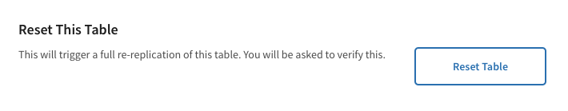

## On this page
{:.no_toc .hidden-md .hidden-lg}

- TOC
{:toc .hidden-md .hidden-lg}

{::options parse_block_html="true" /}

## Quick Links

[Airflow](https://airflow.gitlabdata.com){:.btn .btn-purple-inv}
[Data Image Project](https://gitlab.com/gitlab-data/data-image){:.btn .btn-purple-inv}
[GitLab Data Utils Project](https://gitlab.com/gitlab-data/gitlab-data-utils/){:.btn .btn-purple-inv}
[Meltano](/handbook/business-technology/data-team/platform/Meltano-Gitlab){:.btn .btn-purple-inv}
[Monte Carlo](/handbook/business-technology/data-team/platform/monte-carlo){:.btn .btn-purple-inv}
[Python Guide](/handbook/business-technology/data-team/platform/python-guide){:.btn .btn-purple-inv}
[Snowflake Guide](/handbook/business-technology/data-team/platform/snowflake){:.btn .btn-purple-inv}

## System Diagram


### Editing the System Diagram

To edit the system diagram, go to the [Lucidchart document](https://lucid.app/lucidchart/4c787916-ccf2-43f5-963a-2e4adb222019/edit) and make the desired changes.  If the changes are contained in the red box, the changes should be automatically reflected in GitLab.  If the viewing area needs to be changed, then a new link will need to be generated using the [Lucidchart documentation to publish](https://lucidchart.zendesk.com/hc/en-us/articles/207300196-Publish-Your-Document), and an MR made to update the link used above to pull in the image.

## Airflow

We use Airflow for all Orchestration.

### Naming Conventions

Both DAG and task naming should be as descriptive as possible so that engineers and other users can understand what a DAG does both within and without the context of the airflow UI. Names should include information about what and how a DAG or task is doing. 

As an example consider the DAG and task naming for the `gitlab_com_db_extract` DAG, which has tasks with names like `gitlab-com-packages-package-files-db-incremental-pgp-extract`. It is tempting to avoid the redundancy between the task and DAG naming, but since we sometimes only see the task name (like in Slack or Prometheus errors, or when using 'Browse' in airflow) it ends up being helpful. 

Starting with Summer of 2021 we've introducted a more abbreviated, but hopefully equally descriptive way of describing some of the most common DAGs we create and this convention should be used in all DAG created since. Please use a prefix to indicate whats performed by that DAG. For example, if we had created the gitlab extract DAG after this convention it should be named `el_gitlab_com_db_extract` since it performs both extraction and loading phases, whereas `greenhouse_extract` would be `l_greenhouse` as it only loads extracted data from S3 into Snowflake.

List of prefix indicators
| Prefix | Indicator |
| ------ | --------- |
| `e`    | Extract   |
| `l`    | Load      |
| `t`    | Transform |
| `p`    | Pump      |
| `m`    | Metadata  |


### In Production

All DAGs are created using the `KubernetesPodOperator`, so the airflow pod itself has minimal dependencies and doesn't need to be restarted unless a major infrastructure change takes place.

There are 4 containers running in the current Airflow deployment as defined in the [deployment.yml](https://gitlab.com/gitlab-data/data-image/blob/master/airflow_image/manifests/deployment.yaml):

1. A sidecar container checks the repo activity feed for any merges to master. If there was one, the sidecar will reclone the repo so that Airflow runs the freshest DAGs.
1. The Airflow scheduler
1. The Airflow webserver
1. A cloudsql proxy that allows Airflow to connect to our cloudsql instance

#### Kubernetes Setup

We run in the `gitlab-analysis` project in Google Cloud Platform (GCP). Airflow runs in the `data-ops` cluster.

##### Nodepools

Within this cluster there are 4 nodepools: `highmem-pool`, `production-task-pool`, `testing-pool`, and `sdc-1`.  Each nodepool has a dedicated use for ease of monitoring and resource management.

1) `highmem-pool` - used to run the Airflow server, scheduler, and network components.  Autoscales from 1-2 nodes.  
2) `production-task-pool` - used to run most production Airflow tasks except SCD tasks.  Autoscales from 2-5 nodes.  
3) `sdc-1` - used to run production SCD extractions.  Autoscales from 1-3 nodes.  
4) `testing-pool` - a pool that does not usually have a running node, but is used to run engineer's locally-launced Airflow tasks.  Autoscales from 1-2 nodes.  

All nodepools except the `highmem-pool` have labels and [taints](https://kubernetes.io/docs/concepts/configuration/taint-and-toleration/) to manage which nodepool launches which Airflow task. For a task to be scheduled in a nodepool, a task must have nodeAffinity for the pool and it must have a toleration that matches the taint. See [this MR](https://gitlab.com/gitlab-data/analytics/merge_requests/2006/diffs) where we added the affinity and toleration for the Slowly-Changing Dimensions task for our postgres pipeline jobs.

#### Create Namespace

When the cluster gets created, it has by default one namespace associated with it named `default`. The airflow setup of the project requires two namespace setups in a production setup.
1) Default
2) Testing

Namespace:- In Kubernetes, namespaces provide a mechanism for isolating groups of resources within a single cluster. Names of resources need to be unique within a namespace, but not across namespaces. 

Setup the namespace and secret file once the cluster gets provisioned. `Default` namespace is present by default, and we only need to create the `testing` namespace.  [names_space_testing.yaml](https://gitlab.com/gitlab-data/data-image/-/blob/master/airflow_image/manifests/names_space_testing.yaml) contain information about the namespace details. 

Execute command `kubectl apply -f name_space_testing.yaml` from the folder `airflow_image/manifests/names_space_testing.yaml`. This should create give below as output `namespace/testing created`.

To validate the list of namespace created/present  use `kubectl get namespace`.

### Create kube secret

After creating the namespace, create the airflow secret in both the namespace `default` and `testing`.
For the creation of secrets in `default` namespace use [kube_secret_default.yaml](https://gitlab.com/gitlab-data/data-image/-/blob/master/airflow_image/manifests/kube_secret_default.yaml) Execute below command `kubectl create -f kube_secret_default.yaml` from the directory `airflow_image/manifests`
Below output you should receive.
```
 secret/airflow created
```
To check for the secret have been created successfully. Use below command
`kubectl get secrets --namespace=default `.

Follow the same steps for Creating the airflow secret in the testing namespace. For the creation of secrets in `testing` namespace use [kube_secret_testing.yaml](https://gitlab.com/gitlab-data/data-image/-/blob/master/airflow_image/manifests/kube_secret_testing.yaml).

Execute below command `kubectl create -f kube_secret_testing.yaml` from the directory path  `airflow_image/manifests/`.

All the values for secret file is present in the 1 password data team secure vault as document, i.e `kube_secret_testing_namespace`. Add the new secret to the 1pass document.

#### Add/Edit secret
To edit the kube secrets yaml file:
- for testing  namespace use command  `kubectl edit secret airflow  -o yaml --namespace=testing`  
- for default (prod) namespace use `kubectl edit secret airflow  -o yaml --namespace=default` 

This will open a `kubectl...yaml` file where a new secret can be added or existing secret can be edited.

The secret needs to be base64 encoded prior to adding it to the yaml file. This can be done like so:
`echo -n 'some_secret'| base64`

And to decode a secret (for general reference, not needed when adding a secret):
`echo -n "encoded_message"|base64 --decode`

Lastly add the new secret to the 1pass secret document, i.e `kube_secret_testing_namespace`, this serves as a backup in case the kube cluster goes down.

**Note:-** Updates to the secret file should be done prior to applying the deployment.yml file


##### DNS

To enable the URL airflow.gitlabdata.com to point to our cluster, a static IP was provisioned in the us-west1 region using the command `gcloud compute addresses create airflow-west --region=us-west1`. The IP generated was `35.233.169.210`. This is available by running `gcloud compute addresses list`. Note that the static IP must be a regional and not global IP for the TLS steps to work.

This was mapped to the domain in Route 53 by the infrastructure team, documented in [this issue](https://gitlab.com/gitlab-com/gl-infra/infrastructure/issues/9267).

##### TLS

A certificate was generated for the airflow.gitlabdata.com domain via [this infrastructure issue](https://gitlab.com/gitlab-com/gl-infra/infrastructure/issues/9205).
This certificate was saved to a kubernetes secret by running the command `kubectl create secret tls airflow-tls --cert=airflow.gitlabdata.com.chained.crt --key=airflow.gitlabdata.com.key` - these are the actual filenames for the chained certificate and key.
This created the secret `airflow-tls`.
The certificate files (site, chain, chained (site+chain), and key) are also stored in the Data Team Secure vault in 1password.

We decided to use the [NGINX Ingress Controller](https://kubernetes.github.io/ingress-nginx/) since it has excellent built-ins for redirecting and enforcing TLS.
To install NGINX into the cluster follow below steps:
1) If helm is not installed in system install it using command `brew install helm`.  
2) Then add nginx-stable version to helm repo using command `helm repo add nginx-stable https://helm.nginx.com/stable`.  
3) To get the latest version of stable use `helm repo update`.  This should give output similar to below 

    ```
    Hang tight while we grab the latest from your chart repositories...
    ...Successfully got an update from the "nginx-stable" chart repository
    ...Successfully got an update from the "ingress-nginx" chart repository
    Update Complete. ⎈Happy Helming!⎈
    ```

4) To check helm repo status use command `helm repo list`

  ```
  NAME         	URL
  ingress-nginx	https://kubernetes.github.io/ingress-nginx
  nginx-stable 	https://helm.nginx.com/stable`
  ```


5) Use command to `The NGINX Ingress Controller`  
  `helm install airflownginx nginx-stable/nginx-ingress --values nginx_values.yaml `
  It will provide output as below 
  ```
    NAME: airflownginx
    LAST DEPLOYED: Wed Oct 20 19:01:38 2021
    NAMESPACE: default
    STATUS: deployed
    REVISION: 1
    TEST SUITE: None
    NOTES:
    The NGINX Ingress Controller has been installed.  
  ```
 The [NGINX value file](https://gitlab.com/gitlab-data/data-image/-/blob/93b20e4286d2a383e46eac091c68d162156223bd/airflow_image/manifests/nginx_values.yaml) defines what the load balancer IP address is. The load balancer IP is set to the address generated in the previous section.
The values passed into the install command are expanded in the [controller-deployment.yaml file](https://github.com/helm/charts/blob/b7afaf9d8875f6aa1cfed4c0422cb28e51d823a3/stable/nginx-ingress/templates/controller-deployment.yaml#L111-L117).

If NGINX needs to be deleted and reinstalled that can be done via `helm delete airflownginx`.

The [ingress definition](https://gitlab.com/gitlab-data/data-image/-/blob/93b20e4286d2a383e46eac091c68d162156223bd/airflow_image/manifests/ingress.yml) was also updated with these settings:

- [force-ssl-redirect](https://kubernetes.github.io/ingress-nginx/user-guide/nginx-configuration/annotations/#server-side-https-enforcement-through-redirect) is true
- tls is set for airflow.gitlabdata.com using the `airflow-tls` kubernetes secret
- All traffic matching the host is sent to the `airflow-webserver` service and not the [default backend](https://kubernetes.github.io/ingress-nginx/user-guide/default-backend/)

Although not strictly necessary, it is cleaner to delete the ingress when applying changes. This can be done via the UI in GCP or via the command `kubectl delete ingress airflow-ingress`.
Applying the new configuration is done via the command `kubectl apply -f ingress.yaml`


### Viewing Airflow Logs in GCP

Airflow logs of all kinds can be found in the [Logs Explorer of Google Cloud](https://console.cloud.google.com/logs/query;query=resource.type%3D%22k8s_container%22?project=gitlab-analysis).  This application can be a little bit overwhelming with all of the different logs it collects, so here are some tips:
  * Make sure the `log fields` view is open.  This view is critical in filtering logs down to exactly what you're interested in, whether it be the webserver or a specific DAG run.  To open the view, go to `PAGE LAYOUT` in the top right and click on it and then make sure `Log fields` is checked.  The `Log fields` view shows up just to the left of the actual logs.
  * Using the `Log fields` view, you can filter to logs from specific processes.  The container_name is a great filter to use.  Most of the containers have to do with the airflow deployment itself.  If looking for a specific DAG run, then the container_name is `base` which is shared by all DAGs, so more filtering will need to be done.  The pod name is unique for each DAG, so the pod name can be filtered on if exploring a specific DAG run's logs.
  * To change the timeframe of the logs being viewed, there is a clock icon with the current timeframe displayed.  Click on that button and a new timeframe can be viewed based on a variety of options.

### GCP IAM
{: #gcp-iam}

It is recommended for Engineers to have the following permissions for GCP:

- Cloud SQL Admin
- Kubernetes Engine Admin
- Storage Admin

For developing with Airflow locally, Engineers will also need a service account. These credentials should point to a service account provisioned by your manager. The account should follow the same pattern as your email i.e. `tmurphy@gitlab-analysis.iam.gserviceaccount.com`. Recommended permissions are:

    * Cloud SQL Client
    * Kubernetes Engine Developer
    * Storage Object Creator
    * Storage Object Viewer

The service account key should be downloaded as JSON and sent to the user for secure storage on their computer.

#### Provisioning a Service Account

- Navigate to the [Service Account section of the gitlab-analysis GCP project](https://console.cloud.google.com/iam-admin/serviceaccounts?project=gitlab-analysis)
- Click `Create Service Account`
- For an individual user, the name should follow the first initial last name pattern
- Indicate it's a service account for a specific person
- Give the service account relevant permissions
- Grant the service account to the user
- Generate a JSON key for the service account and send to user

### Handling Failed Jobs

There should never be more than one failed DAG run visible for any DAG at one time. For incremental jobs that rely on the `execution_date`, such as the extract from the gitlab.com database, any failed DAGs need to have their task instances cleared so that they can be rerun once the fix has been applied.

For jobs that are not dependent on `execution_date` the job should be rerun manually when the fix is applied and the failed DAGrun(s) should be deleted. If there is a failed DAGrun for a DAG it should mean that the current state of that DAG is `broken` and needs to be fixed.

This will make it easier to glance at the list of DAGs in Airflow and immediately know what needs attention and what doesn't.

#### Backfills

If incremental runs are missed for a given DAG or there is missing data in a table, there are two ways to do a backfill. If the table is small and a backfill would be relatively quick then dropping the table and doing a full sync is an option. However, for times when a DAG is stopped due to upstream errors, this may not be possible when there are a large number of tables.

In the latter case, it is better to run the backfill command in the airflow scheduler pod container. The command is:

`airflow backfill gitlab_com_db_extract -s 2019-10-30T00:00:00 -e 2019-11-04T12:00:00 --delay_on_limit 30 --reset_dagruns`

This will clear any DAGruns and task instances that already exist for the given time frame while also generating any new DAGruns that don't exist for the time frame. The [Airflow documentation for the CLI](https://airflow.apache.org/cli.html#backfill) details what the flags are.

Consider using the `--task_regex` [flag](https://airflow.apache.org/docs/stable/cli-ref#backfill) to filter the tasks triggered. This is useful in the case of gitlab.com incremental loads where "pgp-extract" can be used to skip the downstream dbt tasks.

If DAG runs already exist for the timeframe that is being backfilled, the tasks may run concurrently when running the command above.  If the DAGs need to run serially:

- First turn off the scheduling of the DAG.
- Then go into the Airflow UI, go to Browse, click on DAG runs.  Then, use the search bar to filter to the DAG that is going to be backfilled.  Select all DAG runs that are going to be backfilled over and go to `Actions` --> `Delete`.
- Now, with the DAG runs deleted, airflow will run the tasks serially.  However, since the tasks are not deleted, Airflow will probably not actually run the tasks.  So, to clear the tasks, go to `Browse` --> `Task Instances` and use the search bar and sorting to select the task instances that need to be ran again.  With those task instances selected, go to `Actions` --> `Clear` to clear the state of those task instances.
- With that cleared up, go back to the DAG and turn scheduling back on.
- Then run the backfill command above, but leave off `--reset_dagruns` because there are no dagruns to reset.  This should make the backfill run serially.


### In Merge Requests

To facilitate the easier use of Airflow locally while still testing properly running our DAGs in Kubernetes, we use docker-compose to spin up local Airflow instances that then have the ability to run their DAG in Kubernetes using the KubernetesPodOperator. See the [Docker section](/handbook/business-technology/data-team/platform/infrastructure/#docker) to ensure you have the proper environment variables configured.

The flow from code change to testing in Airflow should look like this (this assumes there is already a DAG for that task):

1. Commit and push your code to the remote branch.
1. Run `make init-airflow` to spin up the postgres db container and init the Airflow tables, it will also create a generic Admin user. You will get an error if Docker is not running.
1. Run `make airflow` to spin up Airflow and attach a shell to one of the containers
1. Open a web browser and navigate to `localhost:8080` to see your own local webserver. A generic Admin user is automatically created for you in MR airflow instances with the username and password set to `admin`.
1. In the airflow shell, run a command to trigger the DAG/Task you want to test, for example `airflow run snowflake_load snowflake-load 2019-01-01` (as configured in the docker-compose file, all kube pods will be created in the `testing` namespace). Or if you want to run an entire DAG (for instance the `dbt` DAG to test the branching logic), the command would be something like `airflow backfill dbt -s 2019-01-01T00:00:00 -e 2019-01-01T00:00:00`.
1. Once the job is finished, you can navigate to the DAG/Task instance to review the logs.

There is also a `make help` command that describes what commands exist and what they do.

Some gotchas:

- Ensure you have the latest version of Docker. This will prevent errors like `ERROR: Version in “./docker-compose.yml” is unsupported.`
- If you're calling a new python script in your dag, ensure the file is executable by running `chmod +x your_python_file.py`. This will avoid permission denied errors.
- Ensure that any new secrets added in your dag are also in `kube_secrets.py`. This is the source of truth for which secrets Airflow uses. The actual secret value isn't stored in this file, just the pointers.
- If your images are outdated, use the command `docker pull <image_name>` to force a fresh pull of the latest images.
- If you get an error like: "could not find an available, non-overlapping IPv4 address pool among the defaults to assign to the network", try turning off any VPN you have running.

### Video Walk Throughs

- [Airflow pt 1](https://drive.google.com/open?id=1S03mMINXJFXekeixcJS2tN4T62qYchej)
- [Airflow pt 2](https://drive.google.com/open?id=1zZGtSZIvSwHvhu2sEgGm4LjvbLim5KME)
- [Airflow test environment](https://www.youtube.com/watch?v=zSyzCRVuJ18). The video explained the testing environment for `Airflow` and `pod` operators (`Kubernetes`) in `GCP`.

### Local Airflow Configuration.

All DAGs are created using the `KubernetesPodOperator` so while working from local we need a cluster where we should be able to spin the pod when running a task in local. In order to make this work we need to ensure we are connected through to a cluster. To connect to cluster use  `gcloud container clusters get-credentials data-ops --zone us-west1-a --project gitlab-analysis`. In order to make the local setup work in cluset we need to ensure that the we name `testing` namespace is created and `airflow` secret is also present in the testing namespace. The steps to create this is present above. 
Once you have these your local setup should be able to spin the pod in the cluster. 

#### Troubleshooting Local Airflow Config

#### No Such File or Directory: 'Users/(user)/google-cloud-sdk-bin/gcloud'

```
FileNotFoundError: [Errno 2] No such file or directory: '/Users/(user)/google-cloud-sdk/bin/gcloud': '/Users/(user)/google-cloud-sdk/bin/gcloud'
```

This is because the default install location for the Google Cloud SDK on a Mac is now the above,
but on linux, and in containers it is installed to `/usr/lib/google-cloud-sdk/bin/gcloud`. This value is passed
to the container from the `/.kube/config` file.

To correct this error all you need to do is edit your `/.kube/config` and update the command path parameter to where it will be in the container: `/usr/lib/google-cloud-sdk/bin/gcloud`
That file gets updated everytime you install the SDK or run this command: `gcloud container clusters get-credentials data-ops`.
See related [issue (internal link)](https://gitlab.com/gitlab-data/analytics/-/issues/5012) for more info

### Project variables

Our current implementation uses the following project variables:

- SNOWFLAKE_ACCOUNT
- SNOWFLAKE_REPORT_WAREHOUSE
- SNOWFLAKE_{FLAVOR}_USER
- SNOWFLAKE_{FLAVOR}_PASSWORD
- SNOWFLAKE_{FLAVOR}_DATABASE
- SNOWFLAKE_{FLAVOR}_ROLE
- SNOWFLAKE_{FLAVOR}_WAREHOUSE

The following flavors are defined:

- `LOAD` flavor is used by the Extract & Load process
- `TRANSFORM` flavor is used by the Transform process
- `TEST` flavor for testing using Snowflake
- `PERMISSION` flavor for the permission bot
- `SYSADMIN` flavor for housekeeping tasks (like setting up review instances). This flavor doesn't define `SNOWFLAKE_SYSADMIN_DATABASE` and `SNOWFLAKE_SYSADMIN_WAREHOUSE`.

The following variables are set at the job level depending on the running environment **and should not be set in the project settings**.

- SNOWFLAKE_USER
- SNOWFLAKE_PASSWORD
- SNOWFLAKE_ROLE
- SNOWFLAKE_DATABASE
- SNOWFLAKE_WAREHOUSE

### Airflow Monitoring and Alerting

#### Monitoring

- Airflow metric values can be explored with [Thanos](https://thanos-query.ops.gitlab.net/graph?g0.range_input=2w&g0.max_source_resolution=0s&g0.expr=airflow_scheduler_heartbeat_interval&g0.tab=0).
- Airflow is monitored by our internal Prometheus cluster.  Prometheus monitors Airflow by making a GET request to the [`/admin/metrics` endpoint](https://airflow.gitlabdata.com/admin/metrics/) on a regular interval.
- The metrics endpoint exposes metrics which are made available by our customized version of [airflow-prometheus-exporter](https://gitlab.com/gitlab-data/airflow-prometheus-exporter) which is packaged into the GitLab Airflow Docker image.
- The package airflow-prometheus-exporter comes preconfigured to pull many different metrics about the airflow server, tasks, and DAGs.  The package can also pull metrics from what are known as [XComs](https://airflow.apache.org/docs/stable/concepts.html#concepts-xcom).  Tasks can pass data between each other using XComs.  When an XCom is returned from a task, it gets stored in the Airflow database.  The prometheus exporter reads the Airflow database and so is able to use XCom values as metrics.
- To make the KubernetesPodOperator return an XCom, first the task must have XCom passing enabled like [this one](https://gitlab.com/gitlab-data/analytics/-/blob/master/dags/extract/bamboohr_extract.py#L75).  The Airflow version we are on is between versions of how to enable XComs, which is why this one may have two different booleans to enable XCom passing.  After the KubernetesPodOperator has XComs enabled, the code it runs must write a json object to a specific file.  In order to make this easy and to abstract away where that file is, `gitlabdata.orchestration_utils.push_to_xcom_file` has been created.  This function takes a JSON object and writes it to the XCom file.  This function should only be called once per task. To use a value in an XCom as a metric, the metric must be a first-class member of the JSON object that is written to the XCom file.  For example, `{"record_count": 5, "other_record_count": 6}` would work if you want to use `record_count` and `other_record_count` as metrics.
- To enable the prometheus-exporter to use an XCom as a metric, simply add the name of the task and the name of the metric to [this configuration](https://gitlab.com/gitlab-data/data-image/-/blob/master/airflow_image/prometheus_config.yml).  If there is a metric that should be imported for all airflow tasks, then the task name `all` can be used.  Once the configuration is changed, for the metric to be visible, the airflow image will have to be rebuilt and redeployed as explained in the "Restart Deployment and Pods" section.

#### Alerting
- Alerts based on the metrics mentioned above are defined in the runbooks repository in the [`rules/airflow.yml` file](https://gitlab.com/gitlab-com/runbooks/-/blob/master/rules/airflow.yml).  A new alert can be added by adding to the `rules` list.  The `expr` element is a PromQL expression that should return 1 when alerting, and returns 0 otherwise.  The `for` element defines how long the expression must evaluate to `1` for before the Alert is actually triggered.  Labels should include a severity.  The severity is currently defined GitLab system-wide, so should be low severity for Airflow rules unless the GitLab infrastructure member on call should pay attention to it.  The `team` label ultimately determines which slack channel receives the alerts. The `team` label should be set to `data-analytics` for all alerts for the data team because `data-analytics` is the name of the team setup in [the runbook service catalog](https://gitlab.com/gitlab-com/runbooks/-/merge_requests/2738/diffs#e0a80850fadbbea8ae97d9821ef8037aa6b02348_122_122).
- Prometheus alerts assigned to the data-analytics team are sent to the `data-prom-alerts` Slack channel which should be investigated and addressed by the team member on triage.

### Common Airflow and Kubernetes Tasks

#### Tips

- We recommend aliasing `kubectl` as `kbc`

#### Debugging Airflow Problems

Sometimes things break and it's not clear what's happening. Here are some common things to check.

- Check the status of [GitLab.com](https://status.gitlab.com/) and [Google Cloud](https://status.cloud.google.com/)
- Review if there were recent merge requests to the [`analytics` (internal link)](https://gitlab.com/gitlab-data/analytics/-/merge_requests?scope=all&utf8=%E2%9C%93&state=merged) or [`data-image`](https://gitlab.com/gitlab-data/data-tests/-/merge_requests?scope=all&utf8=%E2%9C%93&state=merged) projects
- Review the [Container Logs](https://console.cloud.google.com/logs/query?project=gitlab-analysis&query=%0A)
- [GKE Dashboard](https://console.cloud.google.com/monitoring/dashboards?project=gitlab-analysis) - Useful for understanding the current state
- [GCP Error Reporting](https://console.cloud.google.com/errors?time=P1D&order=COUNT_DESC&resolution=OPEN&resolution=ACKNOWLEDGED&project=gitlab-analysis) - This can be very useful for determining what errors are happening in Airflow and across the project
    - The GCP error report was useful when the [cluster was down in February 2020](https://gitlab.com/gitlab-data/analytics/issues/3757). The errors were reporting that the application was out of storage. This led to the fix described in [Managing Persistent Volume Claim](/handbook/business-technology/data-team/platform/infrastructure/#managing-pvc)
- Check the Workloads and Services & Ingress sections in the [Kubernetes section of GCP](https://console.cloud.google.com/kubernetes/list?project=gitlab-analysis). Notice if there are any warnings or errors there
- Run `kubectl get pods` and see if one labeled `airflow-deployment` comes back. Try to `exec` into the pod
- Run `kubectl get pods -A` and double check if there are any old or stale pods which may be causing a bottle neck in the namespace.

##### Semi-common Problems

* Logs are filled with `<task> had an event of type Pending` and the task never starts
  * Potentially caused by k8s being unable to pull the container from the registry. See [this issue (internal link)](https://gitlab.com/gitlab-data/analytics/-/issues/6779) for a recent incident
  * Potentially caused by running out of resources in GKE

#### Connecting to the Kubernetes Airflow Cluster:

1. [Install Kubectl](https://kubernetes.io/docs/tasks/tools/install-kubectl/#install-with-homebrew-on-macos)

1. Connect it to the data team cluster by running -> `gcloud container clusters get-credentials data-ops --zone us-west1-a --project gitlab-analysis`

1. Run `kubectl get pods` and make sure it returns successfully

1. _ALL OF YOUR COMMANDS TOUCH PRODUCTION, THERE IS CURRENTLY NO TESTING ENVIRONMENT IN Kubernetes_. The canonical way to test is to use the local docker-compose setup.

#### Access Airflow Webserver UI

- `kubectl port-forward deployment/airflow-deployment 1234:8080`. You can now navigate to `localhost:1234` in a browser and it will take you to the webserver for the instance you port-forwarded to. Note: We no longer needd to do this as we now have a stable URL to access.

#### Updating Airflow

- Have an issue ready with key stakeholders alerted as to the timing of the upgrade. Give at least one day notice before moving forward with the upgrade
- Bump the version in the `airflow_image/Dockerfile`, the line looks like `ARG AIRFLOW_VERSION=<version_number>`
- Delete and recreate the deployment.  See the `Restart Deployment and Pods` section below for specific directions for this step.
- `exec` into one of the containers in the pod and run `airflow upgradedb`

#### View Resources

- `kubectl get all`. This will display any pods, deployments, replicasets, etc.
- `kubectl get pods` command to see a list of all pods in your current namespace.

#### View Persistent Volumes

- To see a list of persistent volumes or persistent volume claims (where the logs are stored), use the commands `kubectl get pv` and `kubectl get pvc` respectively. The command to get persistent volumes will show all volumes regardless of namespace, as persistent volumes don't belong to namespaces. Persistent volume claims do however belong to certain namespaces and therefore will only display ones within the namespace of your current context.

#### Restart Deployment and Pods

The resource manifests for kubernetes live in `airflow-image/manifests/`. To create or update these resources in kubernetes first run `kubectl delete deployment airflow-deployment` and then run `kubectl apply -f <manifest-file.yaml>`. Because we are using a persistent volume that can only be claimed by one pod at a time we can't use the usual `kubectl apply -f` for modifications. A fresh deployment must be set up each time.

- For example, if you need to force a pod restart, either because of Airflow lockup, continual restarts, or refresh the Airflow image the containers are using, run `kubectl delete deployment airflow-deployment`. This will wipe out any and all pods (including ones being run by airflow so be careful). Then from the `data-image` repository root folder, run `kubectl apply -f airflow_image/manifests/deployment.yaml` to send the manifest back up to Kubernetes and respawn the pods.

#### Access Shell with Pod
{: #access-pod}

- To get into a shell that exists in a kube pod, use the command `kubectl exec -ti <pod-name> -c <container-name> /bin/bash`. This will drop you into a shell within the pod and container that you chose. This can be useful if you want to run airflow commands directly within a shell instead of trying to do it through the webserver UI.

    - `kubectl exec -ti airflow-deployment-56658758-ssswj -c scheduler /bin/bash` Is an example command to access that pod and the container named `scheduler`. The container names are listed in `airflow_image/manifests/deployment.yaml`. This information is also available if you do `kubectl describe pod <pod-name>` thought it is harder to read.
        - Additional tip: there is no need to specify a resource type as a separate argument when passing arguments in resource/name form (e.g. 'kubectl get resource/<resource_name>' instead of 'kubectl get resource resource/<resource_name>'
    - You can also do this through docker compose commands when running containers locally e.g.:
    - To get into an existing, running container
        - `docker-compose exec airflow_scheduler bash`
    - To spin up and bash into it:
        - `docker-compose run airflow_scheduler bash`

- Things you might do once you're in a shell:

    - Trigger a specific task in a dag:
        - Template: `airflow run <dag> <task_name> <execution_date> -f -A`
        - Specific example: `airflow run dbt dbt-full-refresh 05-02T15:52:00+00:00  -f -A`
        - The `-f` flag forces it to rerun even if there was already a success or failure for that task_run, the `-A` flag forces it to ignore dependencies (aka doesn’t care that it wasn’t branched to upstream)

#### Updating Secrets

- The easiest way to update secrets in the prod environment is to use the command `kubectl edit secret airflow -o yaml`, this will open the secret in a text editor and you can edit it from there. New secrets must be base64 encoded, the easiest way to do this is to use `echo -n <secret> | base64 -`. There are some `null` values in the secret file when you edit it, for the file to save successfully you must change the `null` values to `""`, otherwise it won't save properly.
- When adding new secrets, also make sure to add the secret, with an appropriate value, to the testing environment.  The command for this is `kubectl edit secret airflow -o yaml --namespace testing`.  This command follows the same guidelines as those described above for production.  If you don't add new secrets to the testing environment, the DAGs that use them will not run when testing.

#### Stopping a Running DAG

- Navigate to the graph view of the dag in question
- Select the task in the graph view
- In the modal that pops up select either Mark Failed or Mark Success with the Downstream option selected.
- Confirm in the [Kubernetes workloads tab](https://console.cloud.google.com/kubernetes/workload?project=gitlab-analysis&workload_list_tablesize=50) that the relevant pod is stopped. Delete it if necessary.

#### Running specific tasks within a DAG

- Get a shell running within a container with the command `kubectl exec -ti <pod_name> -c <webserver|scheduler> /bin/bash`
- For the simplest cases, `airflow run <dag_id> <task_id> <execution_date>` will be sufficient.
- For more complex cases, such as when you need to run a `dbt full-refresh`, a few more flags are required. `airflow run dbt dbt-full-refresh <execution_date> -f -A`. The `-f` flag forces the task to run even if it is already marked as a success of failure. The `-A` flag tells it to run regardless of any dependencies it should have.

#### Setting/Changing an Airflow variable

- On occasion, we use Airflow variables.  An Airflow variable is used right now to override the data integrity checks on the BambooHR data extract.  Airflow variables are stored within the Airflow database and are easily accessible in code running in Airflow by `from airflow.models import Variable` and then getting the variable value with `Variable.get(variable_name)`.
- In order to set a variable or change its value, go into the Airflow UI.  Click on the "Admin" tab, and then "Variables."  To add a new variable, press the `+` button.  Type in the desired key and value.  If the value should be encrypted, check the box.  Then press save.  To edit a variable, click on the edit icon next to the variable of interest and change what you would like.  Then press save.
- For the BambooHR integrity check bypass specifically, the variable key should be `BAMBOOHR_SKIP_TEST`.  The value should be a comma-separated list of the names of the tables you would like to temporarily skip testing.  Once the BambooHR extract has succeeded, please either remove the variable or change the value to an empty string.

#### Managing Persistent Volume Claim and its Data
{: #managing-pvc}

The persistent volume claim for Airflow is defined in the [`persistent_volume.yaml` manifest](https://gitlab.com/gitlab-data/data-image/-/blob/master/airflow_image/manifests/persistent_volume.yaml). It is used in the [deployment for logs](https://gitlab.com/gitlab-data/data-image/-/blob/master/airflow_image/manifests/deployment.yaml#L25-27) and writes to the [`/usr/local/airflow/logs` directory](https://gitlab.com/gitlab-data/data-image/-/blob/master/airflow_image/manifests/deployment.yaml#L76-77). If the persistent volume claim is full, there are two solutions:

- Increase the volume available for the claim
- Delete data from the claim

##### Deleting Data

- [Exec into the airflow-deployment pod](/handbook/business-technology/data-team/platform/infrastructure/#access-pod)
- Navigate to the `logs` directory
- Delete files

##### Increase Claim Size

- Navigate to the [Object Browser](https://console.cloud.google.com/kubernetes/object/browser?project=gitlab-analysis) and find the claim for the DataOps cluster under core > PersistentVolume
- Click through on the PersistentVolume - it should be `pvc-<GUID>`
- Look at the YAML for that volume and find the `pdName` under `gcePersistentDisk`. This is the GCE Disk that will need to be updated
- Go to the [Compute Disks section of GCP](https://console.cloud.google.com/compute/disks?project=gitlab-analysis) and find the referenced disk
- Click through on that disk and edit it to update the size
- Go back to the YAML for the PersistentVolume and update `storage` which is under `spec: capcacity:`
- The claim size should now be increased

Alternatively, you can update the `persistent_volume.yaml` definition in the project. However, redeploying this _may_ delete the data already in the claim. This has not been tested yet.

### Airflow roles

Currently we have the following (default) roles in airflow:

- `Public`
- `Viewer`
- `User`
- `Op`
- `Admin`

In the above order, a role gives more permissions in Airflow.

#### Custom roles

On top of the existing default roles, the following custom roles are also implemented.

1. Profile
1. Analytics_engineer

##### Profile role

In order for non-admin users to update or reset their passwords they need to be given permissions to access their profiles and reset their passwords. This is includes the following permissions and should be granted to all non-admin users.

- `can this form post on ResetMyPasswordView`
- `can this form get on ResetMyPasswordView`
- `can this form post on UserInfoEditView`
- `can this form get on UserInfoEditView`
- `resetmypassword on UserDBModelView`
- `can edit on UserDBModelView`
- `can userinfo on UserDBModelView`
- `userinfoedit on UserDBModelVie`


##### Analytics_engineer role

In order to start a DAG, at least `User` permissions is needed. But in order to change variables, `Op` is needed. Changing variables is needed to perform a full refresh with a selected (set) of models. 

`Op` gives a big set off unnecessary [permissions](https://airflow.apache.org/docs/apache-airflow/stable/security/access-control.html#op) for an Analytics Engineer. Only the following is needed:

- `menu access on Admin`
- `menu access on Variables`
- `can read on Variables`
- `can edit on Variables`

To follow the [Principle of Least Privilege](https://about.gitlab.com/handbook/security/access-management-policy.html#principle-of-least-privilege) the 4 mentioned permissions are added to a new role: `Analytics_engineer`. 

All Analytics Engineers will have `User` +  `Profile` + `Analytics_engineer` to give them the right permissions in Airflow to execute a DAG.


## Postgres Pipeline 

### Development

To add new tables or fields to be pulled by postgres pipeline, the manifest file for the specific source database will need to be changed.  These manifest files are in a folder [here](https://gitlab.com/gitlab-data/analytics/-/tree/master/extract/postgres_pipeline/manifests).  To add a new table, add an item to the `tables` list.  The `import_db` value should match the other items in that manifest.  The `import_query` is executed directly against the source target database.  Where possible, make the import query incremental by adding a `WHERE` clause such as:

```sql
WHERE updated_at BETWEEN '{EXECUTION_DATE}'::timestamp - interval '{HOURS} hours'
AND '{EXECUTION_DATE}'::timestamp
```

The `export_schema` value should match the other items in the manifest.  The `export_table` value should match the name of the table being imported.  The `export_table_primary_key` should be set to the primary key of that specific table in the postgres database.  If the import query is not incremental, then add `advanced_metadata: true` which creates another column that differentiates when data was loaded.

After the manifest changes are made, create a merge request using the `add_manifest_tables` template.  Then follow the instructions there.

For further details on the technical implementation see the README [here](https://gitlab.com/gitlab-data/analytics/-/blob/master/extract/postgres_pipeline/README.md)


### Testing in Airflow

When testing postgres pipeline (pgp) locally in Airflow, there are a few things to keep in mind:

* Previously, a pool needed to be added manually to Airflow, but running `make init-airflow` will now automatically add all the pgp pools to Airflow.
* Prior to triggering the DAG, the `clone_raw_postgres_pipeline` [CI pipeline](https://about.gitlab.com/handbook/business-technology/data-team/platform/ci-jobs/#clone_raw_postgres_pipeline) will need to be run. This pipeline clones a schema `tap_postgres` into a Snowflake 'dev' database that the DAG will write the data to.


## Bash Scripting

- The data team maintains a [training on basic and advanced command line usage](https://gitlab.com/gitlab-data/managers/-/blob/master/training/command_line_training_guide.md).  This training also contains details about advanced bash scripting usage within the analytics repo.

## Docker

As an alternative to Docker Desktop we use Rancher desktop as suggested in [`/handbook/tools-and-tips/mac`](/handbook/tools-and-tips/mac/#docker-desktop). We use version `1.4.1`, which can be found on [the rancher dektop releases page](https://github.com/rancher-sandbox/rancher-desktop/releases/tag/v1.4.1).

Make sure that "check for updates automatically" is **unchecked** as later versions have had problems connecting to our Kubernetes cluster. 


### Compose

We use Docker compose to [define and run](https://gitlab.com/gitlab-data/analytics/blob/master/docker-compose.yml) our different images and applications. These are activated by users via the [Makefile](https://gitlab.com/gitlab-data/analytics/blob/master/Makefile).

#### Environment Variables

There are a few environment variables you will need to properly use the Makefile and Docker Compose.

- `GIT_BRANCH` - typically a feature branch like `2112-my-feature`
- `KUBECONFIG` - Defines where Kubernetes credentials are stored on your local machine. `KUBECONFIG="/Users/tmurphy/.kube/config"`
- `GOOGLE_APPLICATION_CREDENTIALS` - CloudSQL credentials for connecting to GCP. Typically points to a JSON file - `GOOGLE_APPLICATION_CREDENTIALS="/Users/tmurphy/Projects/GitLab/gcloud_service_creds.json"`
    - These credentials should be provisioned following the instructions in the [GCP IAM section](/handbook/business-technology/data-team/platform/infrastructure/#gcp-iam)

### Images

#### Data

The `data_image` directory contains everything needed for building and pushing the `data-image`. If a binary needs to be installed it should be done in the Dockerfile directly, python packages should be added to the `requirements.txt` file and pinned to a confirmed working version.

#### Airflow

The `airflow_image` directory contains everything needed to build and push not only the `airflow-image` but also the corresponding Kubernetes deployment manifests. The only manual work that needs to be done for a fresh deployment is setting up an `airflow` secret. The required secrets can be found in `airflow_image/manifests/secret.template.yaml`.

The `default` airflow instance is the production instance, it uses the `airflow` postgres db. The `testing` instance uses the `airflow_testing` db.

The `default` instance logs are stored in `gs://gitlab-airflow/prod`, the `testing` instance logs are stored in `gs://gitlab-airflow/testing`

#### dbt

The `dbt_image` directory contains everything needed for building and pushing the `data-image`. If a binary needs to be installed it should be done in the Dockerfile directly, python packages should be added to the `requirements.txt` file and pinned to a confirmed working version. As this image is used by Data Analysts there should not be much more than dbt in the image.

### Creating New Images
{: #new-images}

Production images are only built when a git tag is pushed on the master branch. Our current release flow is as follows:

```
# Either on the master branch or in a feature branch run:
git tag v<sem_ver>

# Push the tag
git push origin $(git describe --tags --abbrev=0)
```

The build pipelines will automatically run. Make a new MR anywhere these images are referenced to update the tag.

## Python Housekeeping

There are multiple `make` commands and CI jobs designed to help keep the repo's python clean and maintainable. The following commands in the Makefile will help analyze the repo:

- `make lint` will run the `black` python linter and update files (this is not just a check)
- `make pylint` will run the pylint checker but will NOT check for code formatting, as we use `black` for this. This will check for duplicated code, possible errors, warnings, etc. General things to increase code quality. It ignores the DAGs dir as those are not expected to follow general code standards.
- `make radon` will test relevant python code for cyclomatic complexity and show functions or modules with a score of `B` or lower.
- `make xenon` will run a complexity check that returns a non-zero exit code if the threshold isn't met. It ignores the `shared_modules` and `transform` repos until they get deleted/deprecated or updated at a later date.

## Accessing peered VPCs

Some of the GitLab specific ELTs connect to databases which are in peered GCP projects, such as the usage ping. To allow connections, a few actions have been taken:

1. The Kubernetes cluster where the runner executes has been setup to use [IP aliasing](https://cloud.google.com/kubernetes-engine/docs/how-to/ip-aliases), so each pod gets a real routable IP within GCP.
1. A [VPC peering relationship](https://cloud.google.com/vpc/docs/vpc-peering) has been established between the two projects and their networks.
1. A firewall rule has been created in the upstream project to allow access from the runner Kubernetes cluster's pod subnet.

## Extractor Documentation

- [BambooHR](https://gitlab.com/gitlab-data/analytics/tree/master/extract/bamboohr)
- [Commit Stats (Engineering)](https://gitlab.com/gitlab-data/analytics/tree/master/extract/engineering)
- [Graphite (Engineering)](https://gitlab.com/gitlab-data/analytics/tree/master/extract/graphite)
- [SheetLoad](https://gitlab.com/gitlab-data/analytics/tree/master/extract/sheetload)
- [YML files from the handbook](https://gitlab.com/gitlab-data/analytics/tree/master/extract/gitlab_data_yaml)

## Updating the Runner

We execute our CI jobs in the [`gitlab-data` group](https://gitlab.com/groups/gitlab-data/-/settings/ci_cd) with Kubernetes via the `gitlab-analysis` GCP project. We have a group runner setup to share across all repos.

In the case where a new group runner token needs to be associated, or if we need to update the runner image. These are the basic steps. Note - since the release of helm 3, it is recommended that all of these commands be run in the Cloud Shell console in GCP. Navigate to the deployment for the runner (currently `gitlab-data-gitlab-runner`) and use the kubectl dropdown to enter the shell.

To get the credentials

`gcloud container clusters get-credentials bizops-runner --zone us-west1-a --project gitlab-analysis`

To see the helm releases

`helm list --namespace <namespace>`

To get the chart values for a specific release

`helm get values --namespace <namespace> <chartname>`

Prep commands

`helm repo add <chart> <url>`

`helm repo update`

To delete the runner

`helm delete --namespace <namespace> <chartname>`

To install the runner with the Helm chart

`helm install --namespace <namespace> --name <chartname> -f <valuesfile> <chartrepo/name>`

Example for updating the runner version or group token

```bash
helm list --namespace gitlab-data
helm get values --namespace gitlab-data gitlab-runner
helm get values --namespace gitlab-data gitlab-runner > values.yaml
```
Update the runnerRegistrationToken in `values.yaml` found at [gitlab.com/groups/gitlab-data/-/runners](https://gitlab.com/groups/gitlab-data/-/runners) when you click 'Register Group Runner'

```
helm repo add gitlab https://charts.gitlab.io
helm repo update
helm delete --namespace gitlab-data gitlab-runner
helm install --namespace gitlab-data gitlab-runner -f values.yaml gitlab/gitlab-runner
```

Our YAML configuration is as follows:

```yaml
affinity: {}
checkInterval: 30
concurrent: 10
gitlabUrl: https://gitlab.com
hostAliases: []
imagePullPolicy: IfNotPresent
metrics:
  enabled: true
nodeSelector: {}
podAnnotations: {}
podLabels: {}
rbac:
  clusterWideAccess: false
  create: false
  podSecurityPolicy:
    enabled: false
    resourceNames:
    - gitlab-runner
  serviceAccountName: gitlab-data-gitlab-runner
resources: {}
runnerRegistrationToken: <token found in https://gitlab.com/groups/gitlab-data/-/runner when you click 'Register Group Runner> 
runners:
  builds: {}
  cache: {}
  helpers: {}
  image: ubuntu:16.04
  outputLimit: 4096
  pollTimeout: 180
  privileged: false
  services: {}
  tags: analytics,housekeeping
securityContext:
  fsGroup: 65533
  runAsUser: 100
```

## Automated Processes Loading Data into Snowflake

### Version DB and License DB Load Tasks

#### Source Postgres DB Data Export

There's a once-daily CI job that executes in the [version project](https://gitlab.com/gitlab-services/version-gitlab-com) as well as the [license project](https://gitlab.com/gitlab-org/license-gitlab-com/) that runs the database export [version script](https://gitlab.com/gitlab-services/version-gitlab-com/-/blob/master/scripts/data/export_data.sh) or [license script](https://gitlab.com/gitlab-org/license-gitlab-com/-/blob/master/scripts/data/export_data.sh) and exports CSV files to a GCS bucket.  These files are named `gitlab-version-{table_name}-{monday_of_week}` or `gitlab-license-{table_name}-{monday_of_week}` respectively.

#### Snowflake Stage

The GCS bucket where the version DB CSV files are being exported is setup in Snowflake as the stage `raw.version_db.version_dump`.  The GCS bucket where the license DB files are exported is setup as the stage `raw.license_db.license_dump`. This means from Snowflake, we can list all of the files, copy the data in the files into tables, and even delete files.

#### Column Matching and Table Generation

The CSV files are not self-describing. They do not have a column header to know what column is in which position.  Because of this, the tables in RAW need to have columns in order that exactly match what order the CSVs are in.  In order to easily create the tables, [this bash script](https://gitlab.com/gitlab-data/analytics/-/blob/master/load/miscellaneous/version_and_license_db/do_create_tables.sh) was created.  In order to generate the create statements:
1. Uncomment the declare statement of the desired database
1. Set the PATH_TO_MANIFESTS environment variable to have the path to your cloned version of the source sql folder.  For version db it should point to your cloned version of [this folder](https://gitlab.com/gitlab-services/version-gitlab-com/-/tree/master/scripts/data/sql).  For license db it should point to [this folder](https://gitlab.com/gitlab-org/license-gitlab-com/-/tree/master/scripts/data/sql).
1. Execute `do_create_tables.sh` and it should print out all of the create table statements.

#### Snowflake Tasks

The CSV files are being loaded daily from the Snowflake stage with snowflake tasks. The tasks were generated running SQL such as 

```sql
create or replace task users_load_task
       WAREHOUSE = LOADING
       SCHEDULE = '1440 minute'
       AS 
        COPY INTO users
        from @raw.version_db.version_dump/gitlab-version-users-
        file_format = (TYPE = CSV FIELD_OPTIONALLY_ENCLOSED_BY='"')
```

with the LOADER role.  These tasks run daily and load only new or updated files.  To see the task definitions, you can run `show tasks` as the LOADER role with the `version_db` or `license_db` schema as part of the context.

##### Task Monitoring

The tasks are being monitored with a dbt test that makes sure each task has ran successfully in the last day.  The version test and license test can be found in the internal data-tests project [here](https://gitlab.com/gitlab-data/data-tests/-/blob/main/tests/sources/version/version_load_task_test.sql) and [here](https://gitlab.com/gitlab-data/data-tests/-/blob/main/tests/sources/license/license_load_task_test.sql) respectively.  In order to diagnose problems with the tasks, you can query the `raw.snowflake.task_history_view` and inspect the `error_message` column on failed tasks.

### PTO by Deel Snowpipe

As described in [this issue (internal link)](https://gitlab.com/gitlab-data/analytics/-/issues/5786), there is a process maintained by the people group that periodically queries the PTO by Deel API and dumps the results into a JSON file in the `gitlab-pto` GCS bucket.  This bucket is in the `gitlab-analysis` GCP project.  

To load this data into Snowflake, a Snowpipe for GCS was configured using this [Snowflake documentation](https://docs.snowflake.com/en/user-guide/data-load-snowpipe-auto-gcs.html).  A GCP pubsub topic named `gitlab-pto-snowpipe` was configured to receive a new message whenever a new file was written to the `gitlab-pto` bucket.  A GCP Pub/Sub subscription named `gitlab-pto-snowpipe` with delivery type `Pull` was created to subscribe to the `gitlab-pto-snowpipe` topic.

Then, a notification integration was created in Snowflake with the following command:

```sql
create notification integration pto_snowpipe_integration
    type = queue
    notification_provider = gcp_pubsub
    enabled = true
    gcp_pubsub_subscription_name = 'projects/gitlab-analysis/subscriptions/gitlab-pto-snowpipe';
```

The Snowpipe was then created using this command:

```sql
CREATE OR REPLACE PIPE raw.pto.gitlab_pto
    AUTO_INGEST = true
    INTEGRATION = 'PTO_SNOWPIPE_INTEGRATION'
    AS copy into raw.pto.gitlab_pto (jsontext, uploaded_at)
    from (select $1, current_timestamp() as uploaded_at from @raw.pto.pto_load)
    file_format=(type='json' strip_outer_array = true);
```

The Snowpipe was enabled so it successfully picks up any new files written to the `gitlab-pto` bucket:

```sql
alter pipe raw.pto.gitlab_pto enable;
```

#### Debugging

If there are any issues with the PTO snowpipe, check the status of the Snowpipe first.  This can be done in Snowflake by running

```sql
select SYSTEM$PIPE_STATUS('gitlab_pto');
```

### Demandbase Load Tasks

The Demandbase data load was implemented as part of [this issue (internal link)](https://gitlab.com/gitlab-data/analytics/-/issues/7657).  Demandbase data is loaded daily, by Demandbase, in parquet format into a GCS bucket owned by Demandbase named `datastream-hosted-gitlab-3750`.  GitLab's Snowflake-GCS integration service account was granted permission to read and list files within this bucket to load data from Demandbase into Snowflake.

A Snowflake stage was created to interface with the Demandbase data:

```sql
CREATE STAGE "RAW".demandbase.data_stream 
STORAGE_INTEGRATION = GCS_INTEGRATION 
URL = 'gcs://datastream-hosted-gitlab-3750/datastream-gitlab/';
```

After, a Snowflake task for each demandbase relation was created to load from GCS into the Snowflake RAW database.  For example, the Snowflake task loading accounts was defined with:

```sql
create task demandbase_account_load_task
       WAREHOUSE = LOADING
       SCHEDULE = '1440 minute'
       AS 
copy into raw.demandbase.account (jsontext, uploaded_at) 
    from (select $1, current_timestamp() as uploaded_at from @raw.demandbase.data_stream/db1_accounts/)
    file_format=(type='parquet');
```

Then the task was enabled by running `alter task DEMANDBASE_ACCOUNT_LOAD_TASK resume;`.  Each task continues to run daily and loads any new files from GCS into the Snowflake `raw.demandbase` schema.

## Data Refresh

If a full refresh is required due to a failing test leading to an SLO breach, take time to investigate the root cause of the failing test. Make an [incident](/handbook/business-technology/data-team/how-we-work/#incidents) and document any findings before triggering the full refresh. It may also be useful to copy the data to another temporary table to allow the full refresh to continue unimpeded.

### Stitch-Managed Data

For data sources extracted by Stitch (see extraction table [on the platform page](/handbook/business-technology/data-team/platform/#extract-and-load)) steps to be taken to refresh data depend on the connection and table settings.

#### Key based replication tables

For Salesforce, where the connection is running key based incremental extractions, the table is best reset using the `reset table` feature under table settings. Simply put, this will truncate the table in `RAW` and reload/refresh all the data with a complete extract. Stitch manages this appropriately such that there is little disruption to the table in `RAW.SALESFORCE_STITCH`



Once reset the table will be refreshed on next run. If the data is needed sooner than that then you can trigger the extraction from Stitch, though this will incure an addition cost for the extra job.

#### Manual refresh of Stitch managed tables

If for some reason it is the case that the Stitch connection cannot handle the table refresh without manual intervention the follow process has worked:

* Ensure the Stitch replication job is not currently running.  Pause the integration so it won't start a run aside from this process.
* As the STITCH role, clone the target schema so the refresh process does not affect production in any way.  This can be done by running the following SQL and filling in the relevant schema name:

```sql
  create schema clone_<DATA_SCHEMA> clone <DATA_SCHEMA>;
```

* Run the following SQL query to get all tables (changing to the relevant schema):

```sql
SELECT
 'truncate table if exists clone_<DATA_SCHEMA>.' || LOWER(table_name) || ';'
FROM "RAW"."INFORMATION_SCHEMA".tables
WHERE LOWER(table_schema) = '<DATA_SCHEMA>';
```

* Run all of the truncate queries in Snowflake
* Back in Stitch, create a new integration of the desired type.  Make the name of the integration `Clone <Name of Old Integration>`.  For example, for Salesforce, the name of the integration would be `Clone SalesForce Stitch`.  Authenticate the integration and set up the extraction to match the extraction settings of the current Stitch job.
* Run the extraction
* When the extraction is done, all of the data should be in the `clone_<DATA_SCHEMA>` schema.  Perform some sanity check SQL queries to make sure the data looks as expected. Some Stitch data may arrive after the extraction job is complete, make sure to leave some time to ensure all data from Stitch has arrived.
* Swap the new data with the old data by retrieving the necessary sql for each table (replacing `<DATA_SCHEMA>` appropriately):

```sql
SELECT
 'ALTER TABLE <DATA_SCHEMA>.' || LOWER(table_name) || ' SWAP WITH clone_<DATA_SCHEMA>.' || LOWER(table_name) || ';'
FROM "RAW"."INFORMATION_SCHEMA".tables
WHERE LOWER(table_schema) = '<DATA_SCHEMA>';
```

* Execute each sql statement yielded by the above SQL
* Delete the cloned extraction job by going into the extraction -> Settings -> Delete
* Resume the old Stitch replication job so incremental data will start flowing again.
* ONLY when it is clear that the refreshed data is complete and as expected, drop the old data by running `drop schema clone_<DATA_SCHEMA> cascade;`.

### DBT Full Refresh

#### Business Summary

Data Producers create data in source applications and we extract that data towards the Snowflake data warehouse. A key feature of our ELT processes is to do incremental extractions of source data towards Snowflake AND do incremental loads of data in downstream dbt transformations. The benefit for an incremental load above a full load is efficiency. An incremental load only loads newly added or changed data which is only a small piece of the total data set that is otherwise processed incase of a full load. The incremental logic is typically based on checking for data that has been created or updated since the last incremental extraction or dbt model transformation. In many cases, the data that is created or updated in the source applications on a given calendar day is loaded into an endpoint which our incremental extraction and transformation processes are able to recognize as having been created since the last incremental data extraction and subsequently process in the ELT and make available to end users in both Sisense and Snowflake. However, this ideal state does not always happen and we sometimes need to fully refresh the `prep` and `prod` databases. This could be because the `raw` database requires a full refresh or because an incremental dbt model relies on a data source with the possibilty of back-dated data. What follows is a summary of the incremental behavior in extraction and transformation processess.

#### Current State of Incremental Extractions 

Incremental data extraction is the default. To extract data incrementally we are depending on the source, if the source provides a mechanism to identify newly created, updated or deleted data we will use that. Prerequisites on source level to supports incremental data selection:
- a table has a insert/update timestamp column that indicates per record when the data is inserted/updated or,
- incremental key (insert only) and,
- data is not **deleted** or,
- change data captured (CDC) mechanism is provided/enabled.

#### Current State of Incremental DBT Model Runs

In dbt, we create models using an incremental configuration whereby the data model checks for records that have been created/updated since the last incremental model run. Those subset of records are transformed and inserted into the table. This is a great feature that optimizes the performance and compute needed to run the model in the daily DAG. Backdated data causes a problem in these models because if there are records available in the `raw` database that have created/updated dates in the past, before the last dbt model run, the incremental logic will miss loading these records. This backdated data is the root cause of why we need to do scheduled full refreshes of the `prep` and `prod` databases. The backdated data has a ripple effect where the source application and `raw` database becomes out of sync with the incremental models in the `prep` and `prod` databases. Therefore, we need to do a full refresh of the incremental models in order to align the incremental dbt models with the data in the `raw` database and source application. 

#### Current State of Extraction Full Refreshes

Full refreshes are performed when the prerequisites are not met. In some cases there is a full refresh requested ad-hoc. This is likely because of:
- an issue/incident,
- a data migration been performed and subsequently the prerequisites were not met,
- the source has changed,
- extra columns needs to be extracted. 

#### Target State of Extraction Full Refreshes

Because of the prerequisites data extractions have to deal with full refreshes in the future. 

#### Current State of DBT Model Full Refreshes

We currently have two options for dbt model full refreshes:

1. Manual full refresh (Add link)
1. Scheduled full refresh every Sunday (Add link)

#### Target State of DBT Model Full Refreshes

In the target state, we would continue to have the manual full refresh since it has utility for being responsive to the business and building models on an ad-hoc basis. However, we would significantly evolve the cadence of the scheduled, weekly full refresh that happens on Sunday. The target state would be to build and configure the data extractions and transformations in such a way that we could ultimately end-up with a quarterly scheduled full refresh on the models that truly needed to be refreshed. This would take significant collaboration between Business Data Champions, Data Producers, and the Central Data Team. We will take a multi-quarter, iterative approach to arrive at the target state.

### Data Source and Data Lineage Information Used to Determine Full Refresh Policy 

There are many variables and considerations that need to be evaluated when determining the full refresh policy for data models in a data lineage. The following sections provide information about data sources and lineages that can used to determine the full refresh policy for data models.

#### Instance Service Ping: Version App - Manual Service Ping

1. **Is there backdated data:** Yes, the Product Intelligence team checks for service ping payloads from customers on a rolling 10 week basis. Therefore, it is possible to receive backdated service ping data.
1. **How far back can data be backdated:** 10 weeks
1. **Are live models eligible for incremental configuration:** Yes, the live models can be set to incremental; however, must be careful with derived models that join in a time_frame or xMAU metric mapping for example which can update for metrics. 
1. **Are snapshot models eligible for incremental configuration:** Yes, the snapshot service ping models take a snapshot of the final xMAU report models and there is no backdated data or need to full refresh.
1. **Size of data:** Service Ping is big data with the atomic Service Ping fact weighing in at over 600 GBs of data. It is necessary to use incremental models where possible in this lineage for model build performance and cost optimization. The combination of incremental models, backdated data, and size of data needs to be considered in model development and model runs.  
1. **Are there incremental dbt models in this lineage:** Yes, the prep tables and atomic facts in the lineage are incremental. However, the downstream derived facts that join in dimension attributes need to full refresh so they can be updated with current state of the time_frame and xMAU metric mapping attributes which can change over time in some cases. 
1. **Can the model be set to not full refresh:** No, due to the backdated data that can be received from service ping, we'll need to keep the full refresh for the time being. However, this full refresh will become compute prohibitive as the data grows and we may come to a point where we cannot full refresh the model. A possibility is that we could fetch incremental records on a rolling 10 week basis to align to the source application's receipt of backdated service pings on a rolling 10 week basis. In that case, we could potentially not run a full refresh. 

#### Instance Service Ping: Snowflake - Automated Service Ping

1. **Is there backdated data:** 
1. **How far back can data be backdated:** 
1. **Are live models eligible for incremental configuration:** 
1. **Are snapshot models eligible for incremental configuration:** 
1. **Size of data:**   
1. **Are there incremental dbt models in this lineage:** 
1. **Can the model be set to not full refresh:**  

#### Namespace Service Ping: Snowflake - Automated Service Ping

1. **Is there backdated data:** 
1. **How far back can data be backdated:** 
1. **Are live models eligible for incremental configuration:** 
1. **Are snapshot models eligible for incremental configuration:** 
1. **Size of data:**   
1. **Are there incremental dbt models in this lineage:** 
1. **Can the model be set to not full refresh:**  

#### Gitlab.com Postgres Database

1. **Is there backdated data:** No we don't expect backdated data from gitlab.com. 
1. **How far back can data be backdated:** Not applicable.
1. **Are live models eligible for incremental configuration:**  Yes, the prep tables in the lineage are incremental.The downstream model are mix of both incremental and full refresh. 
1. **Are snapshot models eligible for incremental configuration:** Yes 
1. **Size of data:** This is one of the biggest data source at the moment with volumne 4.6 TB and increasing daily. 
1. **Are there incremental dbt models in this lineage:** Yes we do have incremental DBT Model in this lineage but they are part of legacy code. 
1. **Can the model be set to not full refresh:**  Yes the downstream model can be set for incremental run only. 

#### Snowplow

1. **Is there backdated data:** No.
1. **How far back can data be backdated:** N/a
1. **Are live models eligible for incremental configuration:** Yes, the live models can be set to incremental
1. **Are snapshot models eligible for incremental configuration:** Yes, the snapshots models can be set to incremental
1. **Size of data:** Data is separated per month in a separate schemas, approx size is `~50m` records per day or `~33TB` in summary (for the entire dataset),
1. **Are there incremental dbt models in this lineage:** Yes, several models in the lineage are incremental
1. **Can the model be set to not full refresh:** Yes, but some refactoring is required. 

#### Salesforce

1. **Is there backdated data:** Yes
1. **How far back can data be backdated:** Integration is set to retrieve data from December 27, 2012, earliest data available in the DB is 2015-06-30T00:00:00Z
1. **Are live models eligible for incremental configuration:** No, live models cannot be set to incremental status because they need to have refreshed, updated data on a daily basis as records are updated in Salesforce. Salesforce is a small data set and models are very performant with full refreshes finishing in less than 30 minutes.
1. **Are snapshot models eligible for incremental configuration:** Yes, snapshot models that are 100% recreations of prior days can be set to incremental. However, snapshot models that have joins to live dimension tables will need to be periodically full refreshed. 
1. **Size of data:** Medium, depending on the table. Total schema size for all Salesforce Stitch data is 15GB. Full refresh for the entire schema takes ~24 hours
1. **Are there incremental dbt models in this lineage:** Not on the SFDC level but some of the snapshot & EDM models built on top of this lineage are incremental. 
1. **Can the model be set to not full refresh:** Yes, but SFDC will be a more challenging data source to do this for. The integration from Stitch often receives late arriving data, so we would first need to confirm how late these can arrive and set the incremental model to allow for a longer time period (i.e. delete/insert or insert new arrivals for last week of data on each refresh)

Salesforce opportunity data is refreshed on a six-hourly schedule. This is done using the [`dbt build`](https://docs.getdbt.com/reference/commands/build) command in the `dbt_six_hourly` DAG. These models are relatively small and can be fully refreshed in under five-minutes. The models included in this schedule are tagged as `six_hourly`:
1. [`sfdc_opportunity_source`](https://dbt.gitlabdata.com/#!/model/model.gitlab_snowflake.sfdc_opportunity_source)
1. [`prep_crm_opportunity`](https://dbt.gitlabdata.com/#!/model/model.gitlab_snowflake.prep_crm_opportunity)
1. [`dim_crm_opportunity`](https://dbt.gitlabdata.com/#!/model/model.gitlab_snowflake.dim_crm_opportunity)
1. [`fct_crm_opportunity`](https://dbt.gitlabdata.com/#!/model/model.gitlab_snowflake.fct_crm_opportunity)
1. [`mart_crm_opportunity`](https://dbt.gitlabdata.com/#!/model/model.gitlab_snowflake.mart_crm_opportunity)


#### Zuora

1. **Is there backdated data:**  No we don't expect backdated data from Zuora.
1. **How far back can data be backdated:**   Not applicable 
1. **Are live models eligible for incremental configuration:** No, live models cannot be set to incremental status because they need to have refreshed, updated data on a daily basis as records are updated in Zuora. Zuora is a small data set and models are very performant with full refreshes finishing in less than 30 minutes.
1. **Are snapshot models eligible for incremental configuration:** Yes, snapshot models that are 100% recreations of prior days can be set to incremental. However, snapshot models that have joins to live dimension tables will need to be periodically full refreshed. 
1. **Size of data:** It sum up to 4 GB of data.
1. **Are there incremental dbt models in this lineage:** It is if full refresh at the moment. 
1. **Can the model be set to not full refresh:** 

### Roadmap to Achieve Target State of DBT Model Full Refreshes

#### Iteration 1 (FY23-Q3)

1. As a boring solution that will have a minimal amount of impact to the business, we will update the scheduled full refresh to be the first Sunday of the month. The monthly cadence provides a balance between cost and data impact. The full refresh is much more costly compared to the regular, incremental dbt DAG that runs daily. This schedule will allow the business to receive the fully refreshed data from the prior month on the same schedule they receive it now. The most important analysis that depend on models with incremental configurations such as service ping and gitlab.com models are generally done on a monthly basis. However, there are important use cases that happen daily or weekly; however, the incremental runs do a good job picking up the data on a daily basis. There is a risk that the analyses that are conducted on daily and weekly cadences would not have the backdated data. We will continue to work on this in iteration 2 where will get more precise with the incremental model configurations and DAGs to allow a period of rolling historical data to full refresh more frequently than monthly. 

1. With the scheduled monthly refresh, we will rebuild the **complete** `prep` and `prod` layer via DBT monthly on the first Sunday of the month. In this case, we overrule any existing incremental models delta selection and we are sure we have all the data available on the first Sunday of the month. We have a dedicated data `dbt_full_refresh_weekly` DAG. This DAG performs a full refresh of all the models and will be running only on the first Sunday of the month. Currently, the only model excluded from full refresh is `+gitlab_dotcom_usage_data_events+`.

1. As part of the first iteration, we will start the **Data Source and Data Lineage Information Used to Determine Full Refresh Policy** section of the handbook page. The results of this analysis will be used as an input to the second iteration.

#### Iteration 2 (FY23-Q4 and FY24-Q1)

The full refresh is costly and comes with a risk that the analyses that are conducted on daily and weekly cadences would not have the backdated data with the monthly full refresh cadence. Ideally, the full refresh should only be performed on models that require a scheduled full refresh, based on a required cadence. During the 2nd iteration, we will perform the following tasks:

1. The scope of the models to review will be limited to the model lineages in the `COMMON_PREP`, `COMMON_MAPPING`, `COMMON`, AND `COMMON_MART_` schemas and the `legacy` models that are used to satsify P1 Product and Engineering Analytics use cases that are still done out of the `legacy` schema. The models in the `COMMON_` schema are our Trusted Data Models and power the majority of the P1 analytics use cases. However, not all P1 use cases are done using Trusted Data Models so it will be necessary to bring a selection of `legacy` models into scope. The models found in these schemas would trace back to `source` models in the `prep` database that would also be in scope. There are incremental models used in the model lineages from the `prep` database through the `prod` database. Limiting the scope to these interdependent models will allow us to make a significant iteration without making the task too big.

1. Determine which incremental models and lineages have no backdated data behavior and do not need to have any scheduled full refresh. We will use the Backdated Data Considerations for Primary Data Sources (add link) as an input to this review. Configure these models and lineages to never full refresh. The Snowplow data source will be a good candidate for this since there is either a low risk or no risk backdated event data. This has to be done on a model by model, lineage by lineage basis to insure the desired results are achieved. 

1. For the models that have backdated data behavior such as service ping and the Gitlab.com Postgres database lineages, consider adding incremental date logic that checks for created/updated records on a rolling 30 day basis. This would allow the daily and weekly analytical use cases to have backdated data available on a rolling 30 day basis. We have installed this technique with the `fct_event` model. It adds more compute to the model build, but it strikes a balance between cost, performance, and providing the business with backdated data. We would need to check that all models in the lineage have the same type of rolling days incremental date logic so that all of the backdated data flows through the lineage. 

#### Iteration 3 (FY24-Q2)

Iteration 3 will focus on moving to a quarterly scheduled full refresh. 

### DBT Model Scheduled Full Refresh

In some data sources, we have to handle backdated data which is data that is received later than expected. In the case of an incremental dbt model where a field, typically a created at or updated at timestamp, is used to determine which data has to be loaded into a data model, there is a risk of missing backdated data entries due to some source application behavior that results in backdated data. This could be a data quality issue or it could be the case the data arrives in the source application on a backdated basis.

1. Dennis, please add references to Sunday full refresh DAG...

### DBT Model Manual Full Refresh

Use `dbt_full_refresh` DAG to force dbt to rebuild the entire incremental model from scratch.

1. In Airflow set up Variable `DBT_MODEL_TO_FULL_REFRESH` with name of model(s) to refresh following [dbt model selection syntax](https://docs.getdbt.com/docs/running-a-dbt-project/command-line-interface/model-selection-syntax/).  For example, to refresh version models, the value would be `sources.version staging.version`.  To refresh gitlab_dotcom models, the value would be `sources.gitlab_dotcom staging.gitlab_dotcom`.
<br></br>
2. By default `dbt_full_refresh` DAG will be running on `TRANSFORMING_XL` warehouse , in order to modify the warehouse size in case of quick full refresh or in case of performance issue, modify the variable `DBT_WAREHOUSE_FOR_FULL_REFRESH` to desired warehouse size. For the actual list of the actual warehouse's sizes, check [compute-resources](https://about.gitlab.com/handbook/business-technology/data-team/platform/#compute-resources)
3. Manually trigger DAG to run.

dbt command that is run behind is

```
dbt run --profiles-dir profile --target prod --models DBT_MODEL_TO_FULL_REFRESH --full-refresh
```

See the following demo video on how to perform a DBT Full Refresh in Airflow:

<figure class="video_container"><iframe src="https://www.youtube.com/embed/OIBdemRSAiQ"></iframe></figure>


## GitLab Data Utilities

This is a project for centralizing handy functions we use across the team. Project is <https://gitlab.com/gitlab-data/gitlab-data-utils>

### Cutting a release

1. Increment the minor version in setup.py.  The minor version is the second number, i.e. `1` in `0.1.0`.  Currently, updating only the minor version is supported.
1. Make an MR for this change and get it merged into master.
1. Checkout and pull master locally so you have the version change you just made.  From the root folder of `gitlab-data-utils`, run `make release`, this will make sure you don't have any pending changes and will push a new tag to the GitLab repo.  This in turn will run the pipeline to publish to pypi.
1. For consistency with pypi, cut a GitLab release with a command similar to this:
    ````
    curl --header 'Content-Type: application/json' --header "PRIVATE-TOKEN: <your-private-token>" \
     --data '{ "name": "GitLab Data Utilities v0.0.1", "tag_name": "v0.0.1", "description": "Initial tagged release"}' \
     --request POST https://gitlab.com/api/v4/projects/12846518/releases
     ````
1. Update the docker image as was done in [this merge request](https://gitlab.com/gitlab-data/data-image/-/merge_requests/98)

## Upgrading dbt for production

See the [runbook](https://gitlab.com/gitlab-data/runbooks/-/blob/main/infrastructure/upgrading_dbt_version.md) for instructions on how to independently and asyncronously upgrade dbt.
