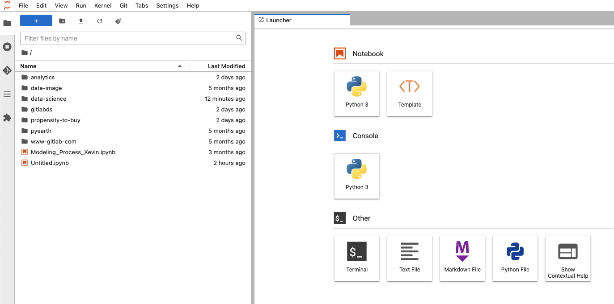

## On this page
{:.no_toc .hidden-md .hidden-lg}

- TOC
{:toc .toc-list-icons .hidden-md .hidden-lg}

---
See related [repository](https://gitlab.com/gitlab-data/data-science)

### Features

- Full install of JupyterLab with the most useful extensions pre-installed. 
- Common python DS/ML libraries (pandas, scikit-learn, sci-py, etc.)
- Natively connected to Snowflake using your dbt credentials. No login required!
- Git functionality: push and pull to Git repos natively within JupyterLab ([requires ssh credentials](https://docs.gitlab.com/ee/ssh/index.html))
- Run any python file or notebook on your computer or in a Gitlab repo; the files do not have to be in the data-science container.
- Linting python code using [black](https://pypi.org/project/black/) natively within Jupyter
- Need a feature you use but don't see? Let us know on [#bt-data-science](https://gitlab.slack.com/archives/C027285JQ4E)!

### Getting Started
First, you need to install and launch [Rancher Desktop](https://rancherdesktop.io/), an open-source container manager, on your local machine.

You have two options when setting up jupyter via the data-science project. Choose from one of the following:
- **Full install (Recommended)**: Creates a [pipenv](https://pypi.org/project/pipenv/) virtual environment on your local machine, installs [Mambaforge](https://github.com/conda-forge/miniforge) and the libraries defined in this [Pipfile](https://gitlab.com/gitlab-data/data-science/-/blob/main/Pipfile) 
- **Minimal install**: Installs **_only_** Creates a pipenv viritual environment and installs the libraries defined in this [Pipfile](https://gitlab.com/gitlab-data/data-science/-/blob/main/Pipfile). This install should be used if you already have a python environment on your local machine that you would like to use as the base imag instead of the Mambaforge version. Requires Python 3.9.

### Installation Instructions

1. Prerequisites - before installing please make sure your system is setup with the following:
   - [Python3](https://www.python.org/)
   - [Pip3](https://pypi.org/project/pip/) (usually aliased as `pip`).
   - [pipevn](https://pypi.org/project/pipenv/). If not installed, can be installed on the command line `pip install pipenv`.
   - On certain versions of MacOS, it may be required to install Xcode Command Line Tools. From the command line, `xcode-select --install`
1. Clone the repo to your local machine `git clone git@gitlab.com:gitlab-data/data-science.git`
1. Navigate to the directory: `cd data-science`
1. Based on which version you would like to install, run one of the following:
    - **_For full install_**: `make setup-jupyter-local`
    - **_For minimal install_**: `make setup-jupyter-local-no-mamba` 
1. `make jupyter-local`
1. Jupyter Lab will launch automatically in your default browser. 

#### Linting the repository

Included in the environment setup are all of the libraries needed to lint Jupyter notebooks in the repository. When you launch JupyterLab and open a notebook you should see a new "Format Notebook" icon in the task bar of your notebook. Clicking that button will lint your entire notebook.

Alternatively, after completing the above setup instructions run: 
```
make lint
```
From the root of the data science repo, this will find and correct and issues according to the Black format. 

#### Connecting to Snowflake

1. Make sure on your local machine you have setup `/Users/{your_user_name}/.dbt/profiles.yml` file which **does not** include your password. `profiles.yml` must be placed in this directory in your "home" directory otherwise, you will not be able to connect to Snowflake from your local machine. You can use the example provide [here](https://gitlab.com/gitlab-data/analytics/-/blob/master/admin/sample_profiles.yml) as reference
1. Run through the [auth_example notebook](https://gitlab.com/gitlab-data/data-science/-/blob/main/examples/auth_example.ipynb) in the repo to confirm that you have configured everything successfully. The first time you run it you will get a browser redirect to authenticate your snowflake credientials via Okta. After that, if you run the notebook again you should be able to query data from Snowflake.  
1. If you get an error then likely Snowflake is not properly configured on your machine. Please refer to the Snowflake and dbt sections of the [Data Onboarding Issue](https://gitlab.com/gitlab-data/analytics/-/blob/master/.gitlab/issue_templates/Data%20Onboarding.md). It is likely that your .dbt/profiles.yml is not setup correctly.


#### Mounting a local directory

By default, the local install will use the data-science folder as the root directory for jupyter. This is not terribly useful when your code, data, and notebooks are in other repositories on your computer. To change, this you will need to create and modify a jupyter notebook config file:
1. Open terminal and nagivate to the data-science repo, e.g. `cd repos/data-science`. The config file must be created with the pipenv we setup in the above steps: `pipenv run jupyter-lab --generate-config`. This creates the file `/Users/{your_user_name}/.jupyter/jupyter_lab_config.py`.
1. Browse to the file location and open it in an editor
1. Search for the following line in the file: `#c.ServerApp.root_dir = ''` and replace with `c.ServerApp.root_dir = '/the/path/to/other/folder/'`. If unsure, set the value to your repo directory (i.e. `c.ServerApp.root_dir = '/Users/{your_user_name}/repos'`). Make sure you remove the `#` at the beginning of the line.
1. Make sure you use forward slashes in your path. Backslashes could be used if placed in double quotes, even if folder name contains spaces as such as `\{your_user_name}\Any Folder\More Folders\`
1. Rerun `make jupyter-local` from the data-science directory and your root directory should now be changed to what you specified above. 

#### Enabling Jupyter Templates

The data science team has created modeling templates that allow you to easily start building predictive models without writing python code from scratch. To enable these templates:
- In your `jupyter_lab_config.py` that you created as part of the [Mounting a local directory](https://about.gitlab.com/handbook/business-technology/data-team/platform/jupyter-guide/#mounting-a-local-directory), add the following lines, replacing `/Users/{your_user_name}/repos/` with the path to the `data-science/templates` repo on your local machine:
```
c.JupyterLabTemplates.template_dirs = ['/Users/{your_user_name}/repos/data-science/templates']
c.JupyterLabTemplates.include_default = False
```
- Launch JupyterLab and you should see a new _Template_ icon. Click the icon and select which template you would like to use.


#### Increasing Container Memory Allocation

By default, rancher will allocate a small percentage of your machine's memory to run containers. This is likely not enough RAM to work with jupyter and python, as data is held in-memory. It is recommended you increase the memory allocation to avoid out-of-memory errors.
1. Open Rancher Desktop (on Mac, there should be an icon on the top menu bar), _Preferences_, then _Kubernetes Settings_
1. Here you can allocate additional memory and CPUs to be used by your containers. 8GB and 2 CPUS are recommended but you may have to increase it futher if working with large datasets or an intensive multithreaded process.
1. Click "Restart Kubernetes". 

#### Setting Up Jupyter Extensions

- The data-science repo comes with many useful Jupyter Lab extensions pre-installed, including [git](https://github.com/jupyterlab/jupyterlab-git), [variable inspector](https://github.com/lckr/jupyterlab-variableInspector), [collapsible headings](https://github.com/aquirdTurtle/Collapsible_Headings), [execute time](https://github.com/deshaw/jupyterlab-execute-time), and [system monitor](https://github.com/jtpio/jupyterlab-system-monitor). 
- To get the most out of these (and to avoid having to configure them every time you run the container), create the following file: `/Users/{your_user_name}/.jupyter/lab/user-settings/@jupyterlab/notebook-extension/tracker.jupyterlab-settings`
- Within that file, paste the following and save: 

```
{
    "codeCellConfig": {
        "codeFolding": true,
        "lineNumbers": true,
    },
    
    "recordTiming": true,
    
}
```

### Some interesting libraries included

#### Data/Model Analysis

* [ELI5](https://eli5.readthedocs.io/en/latest/overview.html#installation)
* [QuickDA](https://pypi.org/project/quickda/)
  
#### Visualisation tools: 

* [Plotly](https://plotly.com/python/)
* [Seaborn](https://seaborn.pydata.org/)

#### ML libraries

* [Scikit-Learn](https://scikit-learn.org/stable/index.html): Suite of commonly used algorithms
* [Autots](https://pypi.org/project/AutoTS/): Automated time series forcasting
* [XGBoost](https://xgboost.readthedocs.io/en/latest/python/python_intro.html) + [Optuna](https://optuna.org/): Powerful black-box method with automated hyperparameter optimization
* [Tensorflow & Keras](https://www.tensorflow.org/api_docs/python/tf): Deep learning and neural networks
* [MLFlow](https://mlflow.org/docs/latest/index.html): Experiment tracking and model registry

#### Easy concurrency

* [Modin](https://modin.readthedocs.io/en/latest/#): Pandas optimization
* [Dask](https://dask.org/) (must be self-installed): Parallel computing

