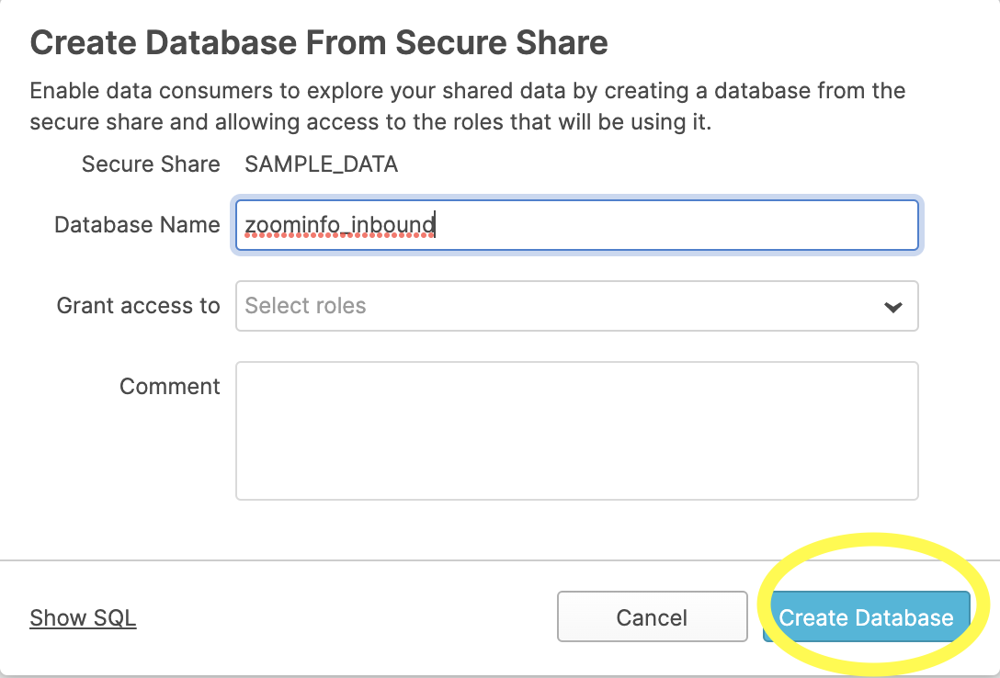

## On this page
{:.no_toc .hidden-md .hidden-lg}

- TOC
{:toc .hidden-md .hidden-lg}

{::options parse_block_html="true" /}

## Background
The data warehouse contains source data from different source systems, via different extraction methodologies (i.e. Fivetran, Stich and Postgres pipeline). This page describes the different data sources and the way we extract this data via data pipelines.

## GitLab Postgres Database
 
There are **dedicated** gitlab.com _read_ replica database instances used for data pulls into Snowflake. There are 2 replicas available, with each having their own replication frequency and behavior.  


 - `GitLab.com-DB (Main and CI) created from GCP snapshots` 
    Since GCP snapshot is scheduled to takes snapshot every 6 hours. The current schedule  for Snapshot restoration is set as below.
      - GitLab.com-DB(Main) 
          - 01:00 UTC  This should restore GCS snapshot of current_day (00:00 Hours) 
          - 13:00 UTC  This should restore GCS snapshot of current_day (12:00 Hours)
      - GitLab.com-DB(Ci) 
          - 01:10 UTC  This should restore GCS snapshot of current_day (00:00 Hours)
          - 13:10 UTC  This should restore GCS snapshot of current_day (12:00 Hours)

The build of the database takes about 45 mins. This results in two available time window everyday to query this database.
    - 02:00 UTC to 13:00 UTC 
    - 14:00 UTC to 01:00 UTC 
Extracting data from this database outside the window will result in an error, but no data loss will occur. The recreation process is executed in this [project](https://gitlab.com/gitlab-com/gl-infra/data-server-rebuild-ansible/activity).  


- `Gitlab.com-DB (Main and CI) Live Replica` is populated with data via WAL files continuously. 

Currently, to ensure a stable data-feed, both the incremental and full loads utilise the `GitLab.com-DB (Main and CI) created from GCP snapshots` instance. During development and tests activities, we faced issues with loading out of the `Gitlab.com-DB Live Replica` as a result of write and read actions at the same time (query conflicting). To increase the time for a query conflicting with recovery, there are `max_standby_archive_delay` and `max_standby_streaming_delay` settings. This should be configured on the server side and could result increasing lag on the replication process. We should avoid that and thus we are reading out of a more static data source.

### Monitoring/Alerting

The Data Platform Team is notified when the build fails via email and in Slack channel `#data-pipelines`. There is [runbook](https://gitlab.com/gitlab-data/runbooks/-/blob/main/Gitlab_dotcom/Gitlab_DB_recreation_failure.md) entry of where to look for issue in the clone setup. 

Failure alerts looks like below 


### Incremental and full loads

1. Incremental extract 
- This is the most convenient methodology, a minimal amount of records is transferred. Prerequisite is that there is a delta column available on the source table level
- +/- 120 tables are incrementally extracted
- Load time about 1 hour 30 Minutes
- Executed every 12 hours 
2. Full extract (at this moment +/- 100 tables & load tie about 4 hours)
- This is the alternative if no delta column is available on source table level, or if records are deleted in the source.
- +/- 70 tables are incrementally extracted
- Load time about 2 Hour 20 Minutes
- Executed every 12 hours

The extraction methodology is determined via the [manifest file](https://gitlab.com/gitlab-data/analytics/-/tree/master/extract/postgres_pipeline/manifests_decomposed). 

Below a overview of the end 2 end flow. From GCP snapshot creation up untill dbt processing:


### Manual Backfill of table from Postgres To Snowflake

This section is used only when we need to do a backfill for a table that has below condition satisfied of gitlab Postgres database. 
- Airflow task for the table has been completed to the latest date. 
- The data in the table is missing for a date or date range for which catch-up has already been completed. 
- If dropping the table and reloading will breach the SLO.

In the above case, we can use this approach to pull the data and load it to the snowflake target table. It has been done for one of the table in this [issue (internal link)](https://gitlab.com/gitlab-data/analytics/-/merge_requests/5003)

Below is the step to be followed for the same. 

Step 1:- Connect to Kubernetes pod:<br>
 `kubectl exec -ti <pod_name> -c <webserver|scheduler> /bin/bash`.<br>

 In our current setup: <br>
 `kubectl exec -ti airflow-deployment-7484d899c6-tfm8v -c scheduler /bin/bash` 

As gcp client changed some things from time to time, you might encounter the following error: `Unable to connect to the server: x509: certificate signed by unknown authority`. To resolve this, run the following command:<br>
`gcloud container clusters get-credentials data-ops --zone us-west1-a --project gitlab-analysis` 

Step 2:- Established connection to Postgres using python library. This is required to go through the Kubernetes pod because we don't have access to Postgres directly. The table for which the data has to be extracted picks up the query from the respective manifest file. Below is the step to execute the query and fetch the output in the csv file. In this example, it is being done for table `experiment_subjects`
```
python3
import psycopg2
conn = psycopg2.connect(
host="",
database="",
user="",
password="",
port=,
options='-c statement_timeout=900000'
)
cur=conn.cursor()
sqlstr = "COPY (SELECT id , experiment_id, user_id, group_id, project_id, variant, created_at, updated_at, converted_at, context FROM experiment_subjects WHERE updated_at BETWEEN '2021-04-05T19:14:20'::timestamp AND '2021-04-26T10:08:16'::timestamp) TO STDOUT WITH CSV HEADER "
with open('experiment_subjects.csv','w') as f:
cur.copy_expert(sqlstr, f)
```
This will generate the file in the Kubernetes pod itself. 
Notes:- The credentials need to be picked up from the secure vault

Step 3: Upload the file using gsutil to GCS to postgres_pipeline
```
  gsutil cp experiment_subjects.csv gs://postgres_pipeline/
```
Step 4: Prepare the timestamp variable as we are not pushing this through the dataframe to enrich the file with _uploaded_at column. Hence it needs to be done using the command line.
```
  import time 
  print(time.time())
```
The value returned will be used while performing copy into snowflake as target table has _uploaded_at column which needs to be populated. 
Step 5: Read each column defined in the manifest file as below and add a _uploaded_at timestamp column to it like below. This needs to be executed in snowflake to validate the data is correct and it can also be used to do a certain audit. 
```
SELECT $1 as id ,
$2 as experiment_id,
$3 as user_id,
$4 as group_id,
$5 as project_id,
$6 as variant,
$7 as created_at,
$8 as updated_at,
$9 as converted_at,
$10 as context, '1621841251.8090081' as _uploaded_at
FROM `@stage`/experiment_subjects.csv ;
```
The stage is the Postgres pipeline stage.

Step 6: Load the data using copy into and load this data in RAW.tap_postgres.gitlab_db_experiment_subjects table.

### GitLab Database Schema Changes and DangerFile

The Data Platform team maintains a Dangerfile in the main GitLab project [here](https://gitlab.com/gitlab-org/gitlab/-/blob/master/danger/datateam/Dangerfile) with the purpose of alerting the `@gitlab-data/engineers` group about any changes to the gitlab.com source schema definition file. Being notified about source schema changes is essential to avoiding errors in the extraction process from the GitLab.com database since extraction is based on running a series of select statements. The data engineer on triage for any given day is the DRI for investigating schema changes as well as creating issues for any needed action from the data team.

### Trusted data framework tests

On this data pipeline, 3 types of Trusted Data Framework tests are executed:
1. Source freshness.
2. Row-count tests.
3. Data actual tests.

 **Source freshness** is checked via the dbt functionality.
<br> **Row count** and **Data actual** are performed via an extra `DAG`, named `gitlab_com_data_reconciliation_extract_load` in Airflow and the results are stored in snowflake table named `RAW.TAP_POSTGRES.GITLAB_PGP_EXPORT`

### Decommission Postgres pipeline table

When one (or more) tables require decommissioning from the `Postgres` pipeline, follow the steps mentioned in the [**Runbook guideline**](https://gitlab.com/gitlab-data/runbooks/-/blob/main/Gitlab_dotcom/table_decommission/README.md) to avoid any failure caused due to removal of the table.

## Pseudonymistaion hashed user IDs with Snowflake Database

### Connecting Snowplow hashed user IDs with Snowflake Database

The pseudonymization project was undertaken with the primary goal of **allowing our internal teams to string together comprehensive user journeys in a privacy-minded manner**. We intend to not reveal a user's identity, but we do intend to know what a single non-identifiable user has done. 
And this view is needed before they purchase with us (docs, pricing, marketing pages, etc), through trial, through purchase, and then through their journey using the product. Our pseudonymization MVC is limited to Snowplow events on `SaaS`. 

As such, we are not considering the pseudonymization of backend events, and we do not have a way to connect the product journey in a holistic manner. Many examples of the type of analysis we'd like to perform at the user level requiring this connection have been mentioned in [this comment](https://gitlab.com/gitlab-org/gitlab/-/issues/339891#note_671241239).

Enable analysis of a user's entire `GitLab` experience, from visiting a page and clicking a `CTA` to creating an issue to starting a trial to deploying code.

### Requirements

1. The end user is able to join snowplow event data that contains hashed `user_id` with the production `gitlab.com` database
1. Access to the hash secret is restricted to a minimal amount of team members
1. No `PII` data should be visible when connected

### Motivation

Why do the `Product Management` and `Product Analysis` team wants to have this? There are a few reasons:

1. Promised to the wider community
1. In case of any leakage, will be much safer to have anonymized data
1. Product Management relies on the community and their data and obligation is crucial
1. Data will be used internally, but without the possibility to identify customers

### Proposed solutions evaluation

After listing down 6 potential technical approaches, the following has been listed for future evaluation.

| Category             | Property                                                                                          | `3.` ↩️ `DBT` + incremental models (`1.0` bad, `5.0` the best) | `4.2` ❄️ + ↩️ `Dynamic data masking` using `DBT` (`1.0` bad, `5.0` the best) |
| -------------------- | ------------------------------------------------------------------------------------------------- | -------------------------------------------------------------- | ---------------------------------------------------------------------------- |
| 🔧 Requirements      | Create a mechanism to anonymize `USER_ID` _(and similar)_ column                                  | `Yes` ✅                                                       | `Yes` ✅                                                                     |
| 🔧 Requirements      | No `PII` data should be visible when connected                                                    | `Yes` ✅                                                       | `Yes` ✅                                                                     |
| 🔧 Requirements      | Proposed solution must be resilient to indirect `USER_ID` _(and similar column)_ disclosure       | `Yes` ✅                                                       | `No` ❌                                                                      |
| 🔧 Requirements      | Prevent disclosing user identity by providing a direct mapping between pseudonymized and raw data | `Yes` ✅                                                       | `Yes` ✅                                                                     |
| 🔧 Requirements      | Prevent disclosing user identity via discrimination attacks                                       | `Yes` ✅                                                       | `Yes` ✅                                                                     |
| 🔧 Requirements      | Access to the hash secret is restricted to the minimal amount of team members                     | `Yes` ✅                                                       | `Yes` ✅                                                                     |
| 🔧 Requirements      | Ability to connect with `Snowplow` data                                                           | `5.0` ⭐⭐⭐⭐⭐                                               | `5.0` ⭐⭐⭐⭐⭐                                                             |
| 🔧 Requirements      | Compute costs efficiency                                                                          | `3.0` ⭐⭐⭐☆☆                                                 | `3.0` ⭐⭐⭐☆☆                                                               |
| 🔧 Requirements      | Storage costs efficiency                                                                          | `1.0` ⭐☆☆☆☆                                                   | `5.0` ⭐⭐⭐⭐⭐                                                             |
| 🚀 Solution          | Easiness of implementation _(anti-complexity)_                                                    | `5.0` ⭐⭐⭐⭐⭐                                               | `4.0` ⭐⭐⭐⭐☆                                                              |
| 🚀 Solution          | Horizontal scalability                                                                            | `3.0` ⭐⭐⭐☆☆                                                 | `3.0` ⭐⭐⭐☆☆                                                               |
| 🚀 Solution          | Vertical scalability                                                                              | `2.0` ⭐⭐☆☆☆                                                  | `2.0` ⭐⭐☆☆☆                                                                |
| 🚀 Solution          | Ability for the implementation                                                                    | `3.0` ⭐⭐⭐☆☆                                                 | `5.0` ⭐⭐⭐⭐⭐                                                             |
| 🚀 Solution          | Ability for the maintenance                                                                       | `2.0` ⭐⭐☆☆☆                                                  | `5.0` ⭐⭐⭐⭐⭐                                                             |
| 🧱 Data manipulation | Data Extraction efficiency                                                                        | `2.0` ⭐⭐☆☆☆                                                  | `5.0` ⭐⭐⭐⭐⭐                                                             |
| 🧱 Data manipulation | Data Querying efficiency                                                                          | `5.0` ⭐⭐⭐⭐⭐                                               | `3.0` ⭐⭐⭐☆☆                                                               |
| 🧱 Data manipulation | Data Filtering efficiency                                                                         | `5.0` ⭐⭐⭐⭐⭐                                               | `1.0` ⭐☆☆☆☆                                                                 |
| 🧱 Data manipulation | Data Join efficiency                                                                              | `5.0` ⭐⭐⭐⭐⭐                                               | `1.0` ⭐☆☆☆☆                                                                 |
| 📦 **Summary**       | **Summary**                                                                                       | **Initial effort is higher, later is lower**                   | **Initial effort lower, joins are difficult**                                |

The comprehensive guildeline should be found [in the README.md file](https://gitlab.com/gitlab-data/runbooks/-/blob/main/pseudonymized_data_spike/README.md) with all technical details and a deep dive approach.

## GitLab Ops Database

Gitlaop ops database refers to the database instance of `ops.gitlab.net`. The infrastructure setup is done in a way that a daily restoration of the below-listed tables in a database [ops-db-restore](https://console.cloud.google.com/sql/instances/ops-db-restore/overview?project=gitlab-analysis)  is managed inside the GitLab-analysis GCP project.
Currently below tables are being restored and consumed as part of data pipeline. 
- ci_builds
- ci_pipelines
- ci_stages
- labels
- merge_request_metrics
- merge_requests
- projects
- users
- label_links
- members

A CI pipeline has been set up that dumps and restores the above table. The CI-pipeline is set up in project [ops-db-dump](https://ops.gitlab.net/gitlab-com/gl-infra/ops-db-dump).
The restore is executed at 00:15 UTC and takes around 10 minutes.
The airflow user has been given full access after restoring the database to read all the data from the source. 

## Gitlab Customer Dot Database 

Customers Dot database holds information on the `Customer Portal` of the gitlab.com, where customers manage information such as upgrade of subscriptions, adding more seats etc. The infrastructure setup is done in a way that the data team uses the backups as a data source to extract information without affecting the production database.
The system setup is done by SRE team. For more details on peering can be found [here](https://gitlab.com/gitlab-com/runbooks/-/blob/master/docs/customersdot/backups.md#gitlab-analysis).
Currently, we run a complete extract from the customer dot database. 

## Google Search Console

[Google Search Console](https://search.google.com/search-console/about) helps you monitor and maintain your site's presence in Google Search results.

The data is loaded into our warehouse using Fivetran connectors and are uploaded into our Snowflake warehouse every 24 hours.

We bring in data for the report `Keyword Page Report` from our fivetran connectors. This report allows us to search traffic data of the pages of the site based on the query string user searched for on Google. Each record shows how the site appeared in the search result for a particular search query.

The following 3 sites are included in the extract:
- `https://about.gitlab.com/`
- `https://gitlab.com/`
- `http://gitlab.com/`

## Service ping

Service Ping is a method for GitLab Inc to collect usage data about a given GitLab instance.
More information about `Service ping` (formerly known as `Service ping`) from a Product perspective, should be found **[here](https://about.gitlab.com/handbook/customer-success/csm/service-ping-faq/)**. Comprehensive guide with rich documentation is exposed in [Service Ping Guide](https://docs.gitlab.com/ee/development/service_ping/).

Service ping has two major varieties:
- Self-Managed Service Ping
- SaaS Service Ping

For more details refer to [4 types of service ping processes](https://about.gitlab.com/handbook/business-technology/data-team/data-catalog/saas-service-ping-automation/#4-types-of-service-ping-processes-run-versus-3-environments)

### Self-Managed Service Ping

Self-Managed Service Ping is loaded into the Data Warehouse from the Versions app and is stored in the `VERSION_DB` databases.

### SaaS Service Ping

SaaS Service Ping is loaded into Data Warehouse in two ways:
* using `SQL` statements from Gitlab `Postgres Database` Replica (`SQL-based`) and
* RestFUL API call from `Redis` (`Redis based`) 

Implementation details from Data team is shown under [Readme.md](https://gitlab.com/gitlab-data/analytics/-/blob/master/extract/saas_usage_ping/README.md#user-content-technical-implementation) file.


#### Loading instance SQL-based metrics

Data is loaded from `Postgres Sql` replica: The queries are version controlled in the very large JSON (couple of hundreds queries in the file) files present within this extract.  The queries are split out into two categories: instance queries and namespace queries. The instance queries generate data about `GitLab.com` as a whole, while the namespace queries generate data about each namespace on `GitLab.com`.
Data is stored in the tables (in the `RAW.SAAS_USAGE_PING` schema):
* `RAW.SAAS_USAGE_PING.INSTANCE_SQL_METRICS`
* `RAW.SAAS_USAGE_PING.INSTANCE_SQL_ERROR` - this table contains SQL command where error pops-up during data processing for SQL metrics.
* `RAW.SAAS_USAGE_PING.GITLAB_DOTCOM_NAMESPACE`

Details about implementation are exposed in **[sql-metrics-implementation](https://about.gitlab.com/handbook/business-technology/data-team/data-catalog/saas-service-ping-automation/#sql-metrics-implementation)**

#### Loading instance Redis based metrics

Data is downloaded via API, refer to API specification: [UsageDataNonSqlMetrics API](https://docs.gitlab.com/ee/api/usage_data.html#usagedatanonsqlmetrics-api). Stored in a `JSON` format, approximately size is around 2k lines. Usually, it is one file per load _(at the moment, it is a weekly load)_. The main purpose of loading data from Redis is to ensure fine granulation of metrics can't be fetched using SQL queries.
Data is stored in the table (in the `RAW.SAAS_USAGE_PING` schema): 
* `RAW.SAAS_USAGE_PING.INSTANCE_REDIS_METRICS`

Details about implementation are exposed in **[redis-metrics-implementation](https://about.gitlab.com/handbook/business-technology/data-team/data-catalog/saas-service-ping-automation/#redis-metrics-implementation)**

## SheetLoad

SheetLoad is the process by which a Google Sheets and CSVs from GCS or S3 can be ingested into the data warehouse.

Technical documentation on usage of SheetLoad can be found in the [readme](https://gitlab.com/gitlab-data/analytics/tree/master/extract/sheetload) in the data team project.

If you want to import a Google Sheet or CSV into the warehouse, please [make an issue](https://gitlab.com/gitlab-data/analytics/issues/new?issue%5Bassignee_id%5D=&issue%5Bmilestone_id%5D=) in the data team project using the "CSV or GSheets Data Upload" issue template. This template has detailed instructions depending on the type of data you want to import and what you may want to do with it.

### Considerations
{: #mind-about-sheetload}

SheetLoad should primarily be used for data whose canonical source is a spreadsheet - i.e. Sales quotas. If there is a source of this data that is not a spreadsheet, you should at least [make an issue for a new data source (internal link)](https://gitlab.com/gitlab-data/analytics/-/issues/new?issuable_template=New%20Data%20Source) to get the data pulled automatically. However, if the spreadsheet is the SSOT for this data, then SheetLoad is the appropriate mechanism for getting it into the warehouse.

### Loading into Snowflake

SheetLoad is designed to make the table in the database an exact copy of the sheet from which it is loading. Whenever SheetLoad detects a change in the source sheet, it will drop the database table and recreate it in the image of the updated spreadsheet. This means that if columns are added, changed, etc. it will all be reflected in the database. Changes are detected within 24 hours.

### Preparing for SheetLoad

Except for where absolutely not possible, it is best that the SheetLoad sheet import from the original Google Sheet directly using the `importrange` function. This allows you to leave the upstream sheet alone while enabling you to format the SheetLoad version to be plain text. Any additional data type conversions or data cleanup can happen in the base dbt models. (This does not apply to the Boneyard.)

Some additional considerations for preparing the data for loading:

* format all numeric columns to have no commas or other symbols - 1000.46 instead of $1,000.46
* use simple headers where possible - `user_name` instead of `GitLab - User Name`
* use blank cells to indicate no data. blank cells are stored as `null` in the database.

### Modeling

Before regular SheetLoad data can be accessible by Sisense, it has to be modeled via dbt. A minimum of 2 models will be made for the sheet: a [source model](/handbook/business-technology/data-team/platform/dbt-guide/#source-models) and a [staging model](/handbook/business-technology/data-team/platform/dbt-guide/#staging). These will be made by a member of the data team once you've [made an issue](https://gitlab.com/gitlab-data/analytics/issues/new?issue%5Bassignee_id%5D=&issue%5Bmilestone_id%5D=) in the data team project.

### Boneyard

The `boneyard` schema is where data can be uploaded from a spreadsheet and it will be directly available for querying within Sisense. However, this is for instances where a one-off analysis is needed and/or you need to join this to data already in the warehouse. It is called Boneyard to highlight that this data is relevant only for an **_ad hoc/one off_** use case and will become stale within a relatively short period of time. We will periodically remove stale data from the `boneyard` schema.

### Certificates

If you are adding Certificates to SheetLoad, refer to the instructions in the [People Group page](/handbook/people-group/learning-and-development/)

## GCS External

Using a Snowflake Integration we are able to extract and load data directly from files stored in GCS. This can be used for load operations as well as for [External tables](https://docs.snowflake.com/en/user-guide/tables-external-intro.html). GCS External pipelines are those for which the source of truth remains within a GCS bucket.

This allows us to make general use of data, especially large data, without need for complicated load processes. External tables may serve as a means [to a data lake/lakehouse](https://www.snowflake.com/blog/external-tables-are-now-generally-available-on-snowflake/) within our existing data stack.


### GCP Billing Data

We have created an export of our GCP Billing Data to BigQuery using Google's provided [Cloud Billing Export service](https://cloud.google.com/billing/docs/how-to/export-data-bigquery). This data is exported in Summary and Detail tables that are difficult to replicate in Snowflake because of a lack of unique keys and what otherwise look like duplicates in the Summary data. This, along with the relatively large size of the detail data, led us to an implementation of external tables.

Data is exported from BigQuery to GCS using 
- [Our BigQuery Client](https://gitlab.com/gitlab-data/analytics/-/blob/master/orchestration/big_query_client.py)
- [An Airflow DAG](https://gitlab.com/gitlab-data/analytics/-/blob/master/dags/extract/external_gcp_billing.py)
- [`/gcs_external/src/gcp_billing/gcs_external.py`](https://gitlab.com/gitlab-data/analytics/-/blob/master/extract/gcs_external/src/gcp_billing/gcs_external.py)
- [`/gcs_external/src/gcp_billing/gcs_external.yml`](https://gitlab.com/gitlab-data/analytics/-/blob/master/extract/gcs_external/src/gcp_billing/gcs_external.yml)

Export queries for BigQuery are generated via details in the `gcs_external.yml` and logic within `gcs_external.py`, which are run by the Airflow DAG, which also runs a external table refresh via dbt.

The detail table is partitioned daily, which matches the current schedule interval in the DAG, the summary table however is partitioned monthly, though run daily. **This means that when backfilling the summary table you only need to run one task instance per month**.

This data is then accessed in Snowflake via external tables created with the [dbt external table package](https://github.com/dbt-labs/dbt-external-tables), which is implemented for this GCS billing pipeline in [`/sources/gcp_billing/sources.yml`](https://gitlab.com/gitlab-data/analytics/-/blob/master/transform/snowflake-dbt/models/sources/gcp_billing/sources.yml#L25).

This pattern should be expanded or replicated for any future BigQuery to GCS export use cases.

### Container Registry Logs

A [hardcoded SQL pipeline](https://gitlab.com/gitlab-data/analytics/-/blob/master/extract/gcs_external/src/container_registry.py) that queries directly from the external stage is used for filtering and loading data from an external GCS stage. Currently only used for [Container Registry Log data (issue linked)](https://gitlab.com/groups/gitlab-data/-/epics/579), which was too large to completely replicate into `RAW`. Currently [the DAG](https://gitlab.com/gitlab-data/analytics/-/blob/master/dags/extract/container_reg.py) runs SQL daily that creates a new table for each date partition, the business [has indicated](https://docs.google.com/document/d/1kwL3KGSmTbtKD7vliRbWOp1uY6gu6FLms6SPb4wXwA4/edit#heading=h.5kovd39dcksw) that this is unlikely to become a business critical data source.


## Prometheus / Thanos (Periodic Queries)

We have one solution in place for extracting data from our Thanos instance, which is managed my the Infrastructure team, into snowflake. There is a service set up in CI Pipeline that runs in `ops.gitlab.net` called [Periodic Quries](https://gitlab.com/gitlab-com/runbooks/blob/d3b03bd2aff20865ba0ae3f96c9d38e3209b4e15/periodic-thanos-queries/README.md) that queries thanos and loads json files into a [GCS Bucket with the same name](https://console.cloud.google.com/storage/browser/periodic-queries)

To pull the metrics into Snowflake from GCS, a stage was created:

```sql
CREATE STAGE "RAW"."PROMETHEUS".periodic_queries 
STORAGE_INTEGRATION = GCS_INTEGRATION URL = 'gcs://periodic-queries/';
```

A Snowflake task was then setup to load the new data files in daily:

```sql
create or replace task prometheus_load_task
       WAREHOUSE = LOADING
       SCHEDULE = '1440 minute'
       AS 
    copy into raw.prometheus.periodic_queries (jsontext, uploaded_at)
    from (select $1, current_timestamp() as uploaded_at from @raw.prometheus.periodic_queries)
    file_format=(type='json');
```

Current Metrics Available

| Name | Topic Link | Source Issue |
|------|------------|--------------|
| `stage_group_error_budget_availability` | [stage-group-error-budgets.queries.jsonnet](https://gitlab.com/gitlab-com/runbooks/-/blob/master/periodic-thanos-queries/stage-group-error-budgets.queries.jsonnet) | [#7713 (internal link)](https://gitlab.com/gitlab-data/analytics/-/issues/7713) |
| `total_haproxy_bytes_out` | [daily-haproxy-bytes.queries.jsonnet](https://gitlab.com/gitlab-com/runbooks/-/blob/master/periodic-thanos-queries/daily-haproxy-bytes.queries.jsonnet) | [#11584 (internal link)](https://gitlab.com/gitlab-data/analytics/-/issues/11584) |

## Zuora API Sandbox
The API Sandbox is Zuora's "release preview" environment. It is a customer facing, multi-tenant environment that gets code deployed to it before Zuora's production environment. How early code gets deployed depends on the type of release: Major releases are usually deployed a week in advance, whereas minor releases and emergency patches get deployed days, hours or minutes before production. Zuora customers can purchase any number of tenants in this environment for a recurring annual fee.

API Sandbox is co-located in the same data center as the production environment, running on bare metal, but on a smaller footprint, offering less capacity.

The main use cases for API Sandbox include:

Basic implementation configuration and integrations
- Training
- Integration testing
- Regression testing
- Release preview testing


## Zuora Central Sandbox
Zuora Central Sandbox combines the capability to copy production data along with production-like performance into a single test environment tenant.  While Zuora Central Sandbox always comes with a snapshot of scrubbed production data, it can also be utilized for a brand new implementation in case the production tenant has no data at that time. The use cases of Zuora Central Sandbox includes all that of API Sandbox and more. See the following use cases supported by Zuora Central Sandbox.

Basic implementation configuration and integration

- Training
- Integration testing
- Regression testing
- Performance testing (with guidelines)
- Pre-production testing
- User acceptance testing 

Zuora Central Sandbox is hosted on a production-like AWS infrastructure, allowing you to test the API response time, the bill runs and payment runs with production-level data loading. It provides a more realistic view of performance than API Sandbox. While the Zuora Central Sandbox is designed for production-level performance, Zuora recommends you to contact [Zuora Global Support](http://support.zuora.com/) if you plan to test over a certain amount of volume in a 24 hour period in the Zuora Central Sandbox. See [Performance guidelines](https://knowledgecenter.zuora.com/BB_Introducing_Z_Business/D_Zuora_Environments/Getting_started_with_Zuora_Central_Sandbox#Performance_guidelines) for the details.

Zuora Central Sandbox vs API Sandbox
See the contrasts between the use cases of API Sandbox and Zuora Central Sandbox.

|   |API Sandbox	   | Zuora Central Sandbox  |
|---|---|---|
| Regression testing  |Yes   |Yes   |
| Performance testing (with guidelines)  | No  | Yes  |
| Pre-production testing  | Yes  | Yes  |
| User acceptance testing   |No   | Yes  |
|Basic implementation configuration and integration|Yes |Yes |
|Training |Yes |Yes |
|Integration testing	|Yes|Yes|

### Zuora Central Sandbox connection 
In case we get the database refreshed the credentials gets wiped off in source because of which the connectivity between fivetran and zuora central sandbox gets lost.  In order to restore the connection  request for the `client Id` and `client secret`. Once received update the same in Fivetran. 


## Zuora Revenue 
Zuora Revenue is an application where you can automate the complicated revenue management process in compliance with the latest revenue standards (ASC 606 and IFRS 15).
As part of data pipeline for Zuora Revenue extraction process, we extract data using REST Call from Zuora Revenue BI views (created by Zuora Revenue in the product by default, we only use these views and could not create or alter these views).
The data entities for Zuora Revenue BI views are based on the key physical tables. Some BI views are similar to the physical tables on which they are based. Other BI views are derived from calculations based on the physical tables.   

### Zuora Network Architecture 
The Zuora system is placed behind a firewall. In order to get access through the firewall GitLab IP address needs to be allowlisted. The Kubernetes Engine does not have a static IP, hence an extra compute engine is in place, with a static IP to gain access to Zuora.


From this [list](https://knowledgecenter.zuora.com/Zuora_Revenue/Zuora_Revenue_BI_views) only below table are being loaded or had data for Gitlab in Zuora Revenue at the moment for integration. 

Below is the list of table which has data and which will be created in snowflake. The table which is not having data will not be created because the table definition provided by Zuora API is not on the column ordinal position but it alphabetical order, which makes column labeling incorrect.

|Serial No|Data entity in Zuora|Physical table In Zuora|View Name in Zuora|Table Name in SF|Has Records|Present in Snowflake|
|----|--------------------|-----------------------|-------------------|--------------|-------------|-----------|
|1|Account Type|RPRO_BI3_ACCT_TYPE_V|BI3_ACCT_TYPE|BI3_ACCT_TYPE|Yes|Yes|
|2|Accounting Pre-Summary|RPRO_BI3_RI_ACCT_SUMM_V|BI3_RI_ACCT_SUMM|BI3_RI_ACCT_SUMM|Yes|Yes|
|3|Approvals|RPRO_BI3_APPR_DTL_V|BI3_APPR_DTL|BI3_APPR_DTL|Yes|Yes|
|4|Bill|RPRO_BI3_RC_BILL_V|BI3_RC_BILL|BI3_RC_BILL|Yes|Yes|
|5|Calendar|RPRO_BI3_CALENDAR_V|BI3_CALENDAR|BI3_CALENDAR|Yes|Yes|
|6|Deleted Schedules|RPRO_BI3_RC_SCHD_DEL_V|BI3_RC_SCHD_DEL|BI3_RC_SCHD_DEL|Yes|Yes|
|7|Header|RPRO_BI3_RC_HEAD_V|BI3_RC_HEAD|BI3_RC_HEAD|Yes|Yes|
|8|Holds|RPRO_BI3_RC_HOLD_V|BI3_RC_HOLD|BI3_RC_HOLD|Yes|Yes|
|9|Lines|RPRO_BI3_RC_LNS_V|BI3_RC_LNS|BI3_RC_LNS|Yes|Yes|
|10|MJE|RPRO_BI3_MJE_V|BI3_MJE|BI3_MJE|Yes|Yes|
|11|POB|RPRO_BI3_RC_POB_V|BI3_RC_POB|BI3_RC_POB|Yes|Yes|
|12|Schedules|RPRO_BI3_RC_SCHD_V|BI3_RC_SCHD|BI3_RC_SCHD|Yes|Yes|
|13|Waterfall (Derived)|RPRO_BI3_WF_SUMM_V|BI3_WF_SUMM|BI3_WF_SUMM|Yes|No|
|14|Org|RPRO_BI3_ORG_V|BI3_ORG|BI3_ORG|No|No|
|15|Acct Summary (Derived)|RPRO_BI3_LN_ACCT_SUMM_V|BI3_LN_ACCT_SUMM|BI3_LN_ACCT_SUMM|No|No|
|16|Book|RPRO_BI3_BOOK_V|BI3_BOOK|BI3_BOOK|No|No|
|17|Cost|RPRO_BI3_RC_LN_COST_V|BI3_RC_LN_COST|BI3_RC_LN_COST |No|No|


### Zuora Revenue Extract 
<details>
  <summary markdown="span">Below is the information around the extraction of Zuora Revenue extraction pipeline, click here to expand</summary>

### Setup the environment in Compute engine 
Do SSH to the zuora compute engine using your service account.
Below is the server details in GCP 
https://console.cloud.google.com/compute/instancesDetail/zones/us-west1-a/instances/zuora-revenue-extract-server?project=gitlab-analysis&rif_reserved

 ssh -o UserKnownHostsFile=/dev/null -o CheckHostIP=no -o StrictHostKeyChecking=no -i $HOME/.ssh/google_compute_engine -A -p 22  <username>@<external_ip>


From separate terminal go to ` ~/repos/analytics/extract/zuora_revenue/src` directory and run below command to upload whole directory to compute engine. This directory contains the code for the extraction process.

gcloud compute scp --recurse src --zone "us-west1-a" zuora-revenue-extract-server:/home/vedprakash/zuora_revenue

This will upload the src folder from your branch your local to the compute engine branch. 

### Post connection and upload of file. 
`Step 1 `: Create a virtual environment inside the compute engine named --- `zuora-revenue-extract-venv` 

Keep the same name to keep the changes minimal. 

`python3 -m venv zuora-revenue-extract-venv`

`Step 2`: Activate the venv

`source /home/vedprakash/zuora-revenue-extract-venv/bin/activate` 

`Step 3`: Post that upgrade the pip

`pip install --upgrade pip`

`Step 4`: Go to src folder and install all the required package. 

`pip install -r requirements.txt`

`Notes:`  Step 1 to Step 4 is required only when the environment is crashed and we have got to build it from start not required for general operations. 

### Below Steps is required if we have accidentally deleted the GCS bucket folder, then we need to do below steps for each table. Also if there is requirement to add new table into the system then also we below steps can be used.


`Step 5`: Create the start_date_<table_name>.csv file which holds   table_name,load_date information.
For example for table BI3_MJE the file name will be 
 `start_date_BI3_MJE.csv` and file content will be below.

table_name,load_date   
BI3_ACCT_TYPE,                   
load_date for new table should be left blank because it will start to download the file from start. For other we can pick up the last load date from airflow log. 
For the current table below is the list of command to create the file, this can be done from local or from compute engine as well. 

```
echo "table_name,load_date
BI3_ACCT_TYPE," > start_date_BI3_ACCT_TYPE.csv
echo "table_name,load_date
BI3_APPR_DTL," > start_date_BI3_APPR_DTL.csv
echo "table_name,load_date
BI3_CALENDAR," > start_date_BI3_CALENDAR.csv
echo "table_name,load_date
BI3_MJE," > start_date_BI3_MJE.csv
echo "table_name,load_date
BI3_RC_BILL," > start_date_BI3_RC_BILL.csv
echo "table_name,load_date
BI3_RC_HEAD," > start_date_BI3_RC_HEAD.csv
echo "table_name,load_date
BI3_RC_HOLD," > start_date_BI3_RC_HOLD.csv
echo "table_name,load_date
BI3_RC_LNS," > start_date_BI3_RC_LNS.csv
echo "table_name,load_date
BI3_RC_POB," > start_date_BI3_RC_POB.csv
echo "table_name,load_date
BI3_RC_SCHD," > start_date_BI3_RC_SCHD.csv
echo "table_name,load_date
BI3_RC_SCHD_DEL," > start_date_BI3_RC_SCHD_DEL.csv
echo "table_name,load_date
BI3_RI_ACCT_SUMM," > start_date_BI3_RI_ACCT_SUMM.csv
```

This command create the file for each table and then putting required column name and value. 
The load_date is set to null because it will be treated as first run.   
`Note:` If we know the load date then place in `2016-07-26T00:00:00`  format `%Y-%m-%dT%H:%M:%S` for the particular table. 

`Step6`: Now we need to upload the file in staging area. Below is the set of command for upload each file to respective table in staging area. 

```
gsutil cp start_date_BI3_MJE.csv             gs://zuora_revpro_gitlab/RAW_DB/staging/BI3_MJE/
gsutil cp start_date_BI3_ACCT_TYPE.csv  gs://zuora_revpro_gitlab/RAW_DB/staging/BI3_ACCT_TYPE/
gsutil cp start_date_BI3_APPR_DTL.csv  gs://zuora_revpro_gitlab/RAW_DB/staging/BI3_APPR_DTL/
gsutil cp start_date_BI3_CALENDAR.csv  gs://zuora_revpro_gitlab/RAW_DB/staging/BI3_CALENDAR/
gsutil cp start_date_BI3_RC_BILL.csv  gs://zuora_revpro_gitlab/RAW_DB/staging/BI3_RC_BILL/
gsutil cp start_date_BI3_RC_HEAD.csv  gs://zuora_revpro_gitlab/RAW_DB/staging/BI3_RC_HEAD/
gsutil cp start_date_BI3_RC_HOLD.csv  gs://zuora_revpro_gitlab/RAW_DB/staging/BI3_RC_HOLD/
gsutil cp start_date_BI3_RC_LNS.csv  gs://zuora_revpro_gitlab/RAW_DB/staging/BI3_RC_LNS/
gsutil cp start_date_BI3_RC_POB.csv  gs://zuora_revpro_gitlab/RAW_DB/staging/BI3_RC_POB/
gsutil cp start_date_BI3_RC_SCHD.csv  gs://zuora_revpro_gitlab/RAW_DB/staging/BI3_RC_SCHD/
gsutil cp start_date_BI3_RC_SCHD_DEL.csv  gs://zuora_revpro_gitlab/RAW_DB/staging/BI3_RC_SCHD_DEL/
gsutil cp start_date_BI3_RI_ACCT_SUMM.csv  gs://zuora_revpro_gitlab/RAW_DB/staging/BI3_RI_ACCT_SUMM/
```

`Step 7`: To run the extract below variable needs to be declared in the .bash_profile file of the server.   
```     
    export zuora_bucket=""
    export zuora_dns=""
    export authorization_code=""
    export python_venv="source /home/vedprakash/zuora-revenue-extract-venv/bin/activate" #From step 2
    export zuora_extract_log="/home/vedprakash/zuora_revenue/src/logs/"
    export zuora_src="/home/vedprakash/zuora_revenue/src" #The path of source code
```
`Note:` The credentials is present in 1 password under `zuora_revenue_prod`.

`Step 8`: The last step is to do the schedule.Add below command to crontab. 
Once edited and ready add the required command to crontab of that machine. 
The current schedule is set to run at 02:00 AM UTC every day. 
```
00 02 * * * . $HOME/.bash_profile;$python_venv && cd $zuora_src && python3 extract_zuora_revenue.py -table_name BI3_ACCT_TYPE     -bucket_name $zuora_bucket -api_dns_name $zuora_dns -api_auth_code "$authorization_code" &>/tmp/mycommand.log
00 02 * * * . $HOME/.bash_profile;$python_venv && cd $zuora_src && python3 extract_zuora_revenue.py -table_name BI3_APPR_DTL      -bucket_name $zuora_bucket -api_dns_name $zuora_dns -api_auth_code "$authorization_code" &>/tmp/mycommand.log
00 02 * * * . $HOME/.bash_profile;$python_venv && cd $zuora_src && python3 extract_zuora_revenue.py -table_name BI3_CALENDAR      -bucket_name $zuora_bucket -api_dns_name $zuora_dns -api_auth_code "$authorization_code" &>/tmp/mycommand.log
00 02 * * * . $HOME/.bash_profile;$python_venv && cd $zuora_src && python3 extract_zuora_revenue.py -table_name BI3_MJE           -bucket_name $zuora_bucket -api_dns_name $zuora_dns -api_auth_code "$authorization_code" &>/tmp/mycommand.log
00 02 * * * . $HOME/.bash_profile;$python_venv && cd $zuora_src && python3 extract_zuora_revenue.py -table_name BI3_RC_BILL       -bucket_name $zuora_bucket -api_dns_name $zuora_dns -api_auth_code "$authorization_code" &>/tmp/mycommand.log
00 02 * * * . $HOME/.bash_profile;$python_venv && cd $zuora_src && python3 extract_zuora_revenue.py -table_name BI3_RC_HEAD       -bucket_name $zuora_bucket -api_dns_name $zuora_dns -api_auth_code "$authorization_code" &>/tmp/mycommand.log
00 02 * * * . $HOME/.bash_profile;$python_venv && cd $zuora_src && python3 extract_zuora_revenue.py -table_name BI3_RC_HOLD       -bucket_name $zuora_bucket -api_dns_name $zuora_dns -api_auth_code "$authorization_code" &>/tmp/mycommand.log
00 02 * * * . $HOME/.bash_profile;$python_venv && cd $zuora_src && python3 extract_zuora_revenue.py -table_name BI3_RC_LNS        -bucket_name $zuora_bucket -api_dns_name $zuora_dns -api_auth_code "$authorization_code" &>/tmp/mycommand.log
00 02 * * * . $HOME/.bash_profile;$python_venv && cd $zuora_src && python3 extract_zuora_revenue.py -table_name BI3_RC_POB        -bucket_name $zuora_bucket -api_dns_name $zuora_dns -api_auth_code "$authorization_code" &>/tmp/mycommand.log
00 02 * * * . $HOME/.bash_profile;$python_venv && cd $zuora_src && python3 extract_zuora_revenue.py -table_name BI3_RC_SCHD       -bucket_name $zuora_bucket -api_dns_name $zuora_dns -api_auth_code "$authorization_code" &>/tmp/mycommand.log
00 02 * * * . $HOME/.bash_profile;$python_venv && cd $zuora_src && python3 extract_zuora_revenue.py -table_name BI3_RC_SCHD_DEL   -bucket_name $zuora_bucket -api_dns_name $zuora_dns -api_auth_code "$authorization_code" &>/tmp/mycommand.log
00 02 * * * . $HOME/.bash_profile;$python_venv && cd $zuora_src && python3 extract_zuora_revenue.py -table_name BI3_RI_ACCT_SUMM  -bucket_name $zuora_bucket -api_dns_name $zuora_dns -api_auth_code "$authorization_code" &>/tmp/mycommand.log
```

## Zuora Extract Flow Chart 


At the end of the process below will be output. 
1) A success log file is present named `<table_name>_DD-MM-YYYY.log`  upload to path zuora_revpro_gitlab/RAW_DB/staging/<table_name>/<table_name>_DD-MM-YYYY.log.log. For example for table BI3_MJE the log file for the day will be named `BI3_MJE_21-06-2021.log` and it will be uploaded to the path `gs://zuora_revpro_gitlab/RAW_DB/staging/BI3_MJE/BI3_MJE_21-06-2021.log`
2) Any file for the date range wil be present in the GCS bucket. 
</details>

**Note :** Zuora performs deletes/reconciliations(monthly and/or quarterly) at the source system and since zuora is a full refresh system, we get volume anomalies in Monte carlo which can be marked as expected.

## In order to add table for extraction to Snowflake.
From this list if any table get the data and we need to add the entry to snowflake then we need to follow below steps.    
**Step 1:** Add the entry `extract/zuora_revenue/zuora_revenue_table_name.yml` to add task in the `zuora_revenue_load_snow` DAG.  
**Step 2:** For the respective table follow  Step 5, Step 6 and Step 8.
<br>**Step 3:** Pickup the column name from the file downloaded and set all column to varchar, then create the table in snowflake RAW.ZUORA_REVENUE schema.

**Notes:** Don't use the describe column API to create the table definition because the order of column in list may differ from original table definition. 


### For Derived table 
Zuora have provided view definition for the derived view. As extracting data from the derived view is not feasible in production. Hence for table BI3_WF_SUMM we prepare the data in the DBT model in PREP layer with the DDL provided from Zuora. The DDL definition is present in [extract/zuora_revenue/README.md](https://gitlab.com/gitlab-data/analytics/-/tree/master/extract/zuora_revenue) in repo. 

## Zoominfo
ZoomInfo is a go-to-market intelligence platform for B2B sales and marketing teams. The integrated cloud-based platform provides sellers and marketers with comprehensive information to help them find potential new customers. In order to get these kind of enrich data, Gitlab needs to send data as outbound towards Zoominfo and after processing GitLab will receive processed data as an inbound table via Snowflake data share from zoominfo.

The Zoominfo data pipeline is an automated bi-directional data pipeline that leverages Snowflake data share methodology.

### Snowflake Data share.
[Snowflake data share](https://docs.snowflake.com/en/user-guide/data-sharing-intro.html) enables sharing of snowflake database tables from one account and also allows access to data shared from external accounts. This involves creating an outbound share of a database in their account and grant access to the snowflake table that needs to be shared to an external account using either web interface/SQL.

#### Snowflake Data Share using SQL
Below are the steps followed for working on outbound/inbound shares via snowflake data share using SQL.

##### Outbound share using SQL
For example database named `prod` with a schema named `share` and a table named `gitlab_user_outbound`is shared with consumer account `azitest`. Run below SQL's
to create outbound share.
* Step 1: Create a Share using role accountadmin.
    * USE ROLE accountadmin;
    * CREATE SHARE share_test;
* Step 2: Add database, schema and table to the Share by Granting Privileges.
    * GRANT USAGE ON DATABASE prod TO SHARE share_test;
    * GRANT USAGE ON SCHEMA prod.share TO SHARE share_test;
    * GRANT SELECT ON TABLE prod.share.gitlab_user_outbound TO SHARE share_test;
* Step 3: Add consumer account to the Share.
In order to add account to the share, consumer need to provide their account details and both consumer and provider accounts should be in the same snowflake region.
    * ALTER SHARE share_test ADD ACCOUNTS =‘azitest';

##### Inbound share using SQL
For example share named `gitlab` is shared to us from account `azitest`, run below SQL to create database in snowflake and to access the tables and data in inbound share.

* CREATE DATABASE zoominfo_inbound FROM SHARE azitest.gitlab;

#### Snowflake Data Share using snowflake web interface 
Below are the steps followed for working on outbound/inbound shares via snowflake data share using Web interface. 
Use `accountadmin` role and navigate to shares page in the snowflake web interface to perform inbound/outbound data share tasks.


##### Outbound share using snowflake web interface
* Step 1: To create a outbound share click on `outbound` icon and then on `+create` icon on shares page in the snowflake web interface.
* Step 2: Add secure share name, database, table/view details and then click on create button on the bottem. 


* Step 3: Add consumer account to the share and choose to create reader/full account and click on `add` button at the bottem. This will create a share and shares tables/views to consumer.


##### Inbound share using snowflake web interface
Inbound shares can be viewed under Inbound tab under shares page on the snowflake web interface. Inorder to access the tables and data in the inbound share, a shared database needs to be created. To create shared database click on `Create database from secure share` icon and provide database name, grant access to and click on `create database` button. This process creates database `zoominfo_inbound` in snowflake. Inbound tables and data can be accessed under this shared database in snowflake. Data from shared database is ingested into `prep`.





### Architecture


#### Outbound table
* `"PROD"."SHARE"."GITLAB_USER_OUTBOUND"` - Outbound table has Gitlab user information such as First name, Last name, email address and company name. Outbound table is shared only once to Zoominfo via Snowflake data share. The table is prepared via `dbt` so it will change over time. Its up to Zoominfo to ingest newly and updated data in this table.

#### Loading Inbound tables  
Zoominfo sends inbound files to Gitlab via Snowflake data share. Shared database ZOOMINFO_INBOUND is created from inbound share using either the web interface or SQL. The inbound tables don't follow the standard architecture, where we ingest data in our raw layer and where `dbt` picks the data up for transformation. We handle the shared database as the `raw` database to avoid creating extra processes and make the pipeline more efficient. Data from inbound tables in ZOOMINFO_INBOUND is ingested into snowflake `prep` ​​using Snowflake Data Exchange loader. Below list of inbound tables are created in PREP database under 'zoominfo' schema.

* `"ZI_COMP_WITH_LINKAGES_GLOBAL_SOURCE"` -  International table has a list of all the companies they have information about. This is a one time share.
* `"ZI_REFERENCE_TECHS_SOURCE"` - Technograph table that has a list of technologies used by companies in their database.This is a one time share.
* `"GITLAB_CONTACT_ENHANCE_SOURCE"` - User table company matched table which appends company information to the user list Gitlab sends to zoominfo. Gitlab sends Zoominfo only once but the appended data can be refreshed quarterly. 

## Adaptive
 
Adaptive has been implemented as part of this [issue (internal link)](https://gitlab.com/gitlab-data/analytics/-/issues/6237). The tap is reponsible for 100% sync for every refresh and executed via Meltano via the TAP-ADAPTIVE. 
 
Below is the list of the relevant endpoints in Adaptive. The end points available and more information around the end point is present [here](https://adaptiveplanning.doc.workday.com/r/DG7oXjCPB6kIw6Th6awNUg/r2Yl8CztW98XTEeX1vKtgQ)
 
- exportAccounts
- exportActiveCurrencies
- exportAttributes
- exportConfigurableModelData
- exportCustomerLogo
- exportData
- exportDimensionFamilies
- exportDimensions
- exportDimensionMapping
- exportGroups
- exportInstances
- exportLevels
- exportLocales
- exportModeledSheet
- exportRoles
- exportPermissionSet
- exportSecurityAudit
- exportSheetDefinition
- exportSheets
- exportTime
- exportTransactionDefinition
- exportUsers
- exportVersions

All of these end points or table are created in snowflake. If the data is not present then also sklenton of the table will be created. The target landing Schema is `RAW.TAP-ADAPTIVE`.

Repo URL for [TAP-ADAPTIVE](https://gitlab.com/gitlab-data/meltano_taps/-/tree/main/tap-adaptive). 

To run the TAP it required 2 enviornment variable named `TAP_ADAPTIVE_USERNAME` and  `TAP_ADAPTIVE_PASSWORD`. Below is the details of meltano.yml file which is configured for the TAP-ADAPTIVE.
 
```
- name: tap-adaptive
    namespace: tap_adaptive
    pip_url: git+https://gitlab.com/gitlab-data/meltano_taps.git#subdirectory=tap-adaptive
    executable: tap-adaptive
    capabilities:
     - catalog
     - discover
     - state
    settings:
     - name: username
     - name: password
       kind: password
     - name: start_date
       value: '2010-01-01T00:00:00Z'
    config:
      start_date: '2010-01-01T00:00:00Z'
      username: $TAP_ADAPTIVE_USERNAME
      password: $TAP_ADAPTIVE_PASSWORD
  loaders:
```
 
The Schedule is set to run daily at midnight.


## ZenGRC

The ZenGRC data source uses a singer tap we developed in [gitlab-data/tap-zengrc](https://gitlab.com/gitlab-data/tap-zengrc) and is run in our [Meltano instance](https://about.gitlab.com/handbook/business-technology/data-team/platform/Meltano-Gitlab/) on a [daily](https://gitlab.com/gitlab-data/gitlab-data-meltano/-/blob/main/meltano.yml#L73) scheduled 3 times per day/every 8 hours starting at midnight UTC in Meltano.

Currently this tap extracts a select number of objects from ZenGRC. These are listed in the [stream types in `tap_zengrc/tap.py`](https://gitlab.com/gitlab-data/tap-zengrc/-/blob/main/tap_zengrc/tap.py#L20-26). 

This tap was created using [Meltano SDK](https://sdk.meltano.com/en/latest/) and the [ZenGRC API](https://gitlab.api.zengrc.com/#/). [Environment variables for username and password](https://gitlab.com/gitlab-data/gitlab-data-meltano/-/blob/main/meltano.yml#L29) `$ZENGRC_USERNAME` and `$ZENGRC_PASSWORD`are required to run this in Meltano.

## EdCast

The `EdCast` data source uses a singer tap we developed in [gitlab-data/tap-edcast](https://gitlab.com/gitlab-data/meltano_taps/-/tree/main/tap-edcast) and is run in our [Meltano instance](https://about.gitlab.com/handbook/business-technology/data-team/platform/Meltano-Gitlab/) on a [daily](https://gitlab.com/gitlab-data/gitlab-data-meltano/-/blob/main/meltano.yml#L121) schedule at `07:00:00 UTC`.

The streams we currently loaded are:
* [datasets](https://docs.edcast.com/docs/datasets-definition)
* [300121_Glue_ Groups [G][3] Group Performance Data Explorer](https://docs.edcast.com/docs/datasets-definition#groups-g-group-performance-data-explorer)

[Environment variables](https://gitlab.com/gitlab-data/gitlab-data-meltano/-/blob/main/meltano.yml#L71) for the `tap-edcast` are:
* $TAP_EDCAST_USERNAME
* $TAP_EDCAST_PASSWORD
* $TAP_EDCAST_START_DATE
* $TAP_EDCAST_END_DATE
* $TAP_EDCAST_URL_BASE

and they are required to run this in Meltano. More details about `tap-edast` setup and tunning with detailed explanation are under [edcast-setup](https://gitlab.com/gitlab-data/gitlab-data-meltano/-/blob/main/README.md#edcast-setup) page.

A graphical representation of data flow for `tap-edcast` looks like:

<div style="width: 640px; height: 480px; margin: 10px; position: relative;"><iframe allowfullscreen frameborder="0" style="width:640px; height:480px" src="https://lucid.app/documents/embeddedchart/8e6593e1-9be4-41ae-8d28-22c460639ab7" id="1R4EMPLKFtbd"></iframe></div>


## ZenDesk

The `ZenDesk` data source uses the [tap-zendesk](https://hub.meltano.com/taps/zendesk) Singer tap and runs on our [Meltano instance](https://about.gitlab.com/handbook/business-technology/data-team/platform/Meltano-Gitlab/) on a [daily](https://gitlab.com/gitlab-data/gitlab-data-meltano/-/blob/main/meltano.yml#L374) schedule at `04:00:00 UTC`.

The streams we currently load are specified on the `meltano.yml` configuration file, under the loader's `select` [section](https://gitlab.com/gitlab-data/gitlab-data-meltano/-/blob/main/meltano.yml#L100).
 

[Environment variables](https://gitlab.com/gitlab-data/gitlab-data-meltano/-/blob/main/meltano.yml#L71) for the `tap-zendesk` are:
* `$TAP_ZENDESK_EMAIL`
* `$TAP_ZENDESK_START_DATE`
* `$TAP_ZENDESK_SUBDOMAIN`
* `$TAP_ZENDESK_API_TOKEN`

and they are required to run this in Meltano. They are part of the `tap-secrets` secret on k8s. 

The data is then loaded into Snowflake, using the `target-snowflake--edcast` loader, which is our in-house developed loader targetting Snowflake databases. The repo for this loader is located [here](https://gitlab.com/gitlab-data/target-snowflake-edcast).

The final data ends up in Snowflake under the `TAP_ZENDESK` schema. 


## ZenDesk Community Relations

Similar to the `ZenDesk` pipeline, the `ZenDesk Community Relations` data source uses the [tap-zendesk](https://hub.meltano.com/taps/zendesk) Singer tap and runs on our [Meltano instance](https://about.gitlab.com/handbook/business-technology/data-team/platform/Meltano-Gitlab/) on a [daily](https://gitlab.com/gitlab-data/gitlab-data-meltano/-/blob/main/meltano.yml#L380) schedule at `05:00:00 UTC`.

Notice how in the configuration, this loader has a different name (`tap-zendesk--community-relations`), but it inherits from the same base loader: `tap-zendesk`.

The streams we currently load are specificed on the `meltano.yml` configuration file, under the `tap_zendesk` loader `select` [section](https://gitlab.com/gitlab-data/gitlab-data-meltano/-/blob/main/meltano.yml#L289).
 

[Environment variables](https://gitlab.com/gitlab-data/gitlab-data-meltano/-/blob/main/meltano.yml#L71) for the `tap-zendesk` are:
* `$TAP_ZENDESK_COMMUNITY_RELATIONS_EMAIL`
* `$TAP_ZENDESK_COMMUNITY_RELATIONS_START_DATE`
* `$TAP_ZENDESK_COMMUNITY_RELATIONS_SUBDOMAIN`
* `$TAP_ZENDESK_COMMUNITY_RELATIONS_API_TOKEN`

and they are required to run this in Meltano. They are part of the `tap-secrets` secret on k8s. 

The data is then loaded into Snowflake, using the `target-snowflake--edcast` loader.
The final data ends up in Snowflake under the `TAP_ZENDESK_COMMUNITY_RELATIONS` schema. 


## Xactly

The Xactly data source uses a singer tap we developed in [gitlab-data/tap-xactly](https://gitlab.com/gitlab-data/meltano_taps/-/tree/main/tap-xactly) and is run in our [Meltano instance](https://about.gitlab.com/handbook/business-technology/data-team/platform/Meltano-Gitlab/) on a daily schedule at midnight UTC and at 5:00AM UTC. The midnight UTC is the regular extract and we do an [extra](https://gitlab.com/gitlab-data/analytics/-/issues/14780#note_1185764844) extract at 5:00AM UTC incase of network errors. Network errors do occur from time to time when extracting data out of Xactly which gets resolved automatically. Instead of rerunning the extract manually with the risk of missing the SLO we do an extra try at 5:00AM UTC.

## Clari
Clari is a revenue platform currently used by GitLab to forecast salesperson sales for the quarter. Clari data is loaded into Snowflake via a custom [script](https://gitlab.com/gitlab-data/analytics/-/blob/master/extract/clari/src/clari.py), which requests data from the [Clari API](https://developer.clari.com/documentation/external_spec).

For each quarter, the API returns a forecast record for each user/week/metric.

The [Clari child page](https://about.gitlab.com/handbook/business-technology/data-team/platform/pipelines/clari-pipeline) in the handbook has more technical details, including various gotcha's such as:
- API is not idempotent - returns only records for *current* active users, making backfills inadvisable
- Need two DAG's to support the following edge cases: 
    - late updated records
    - weeks in the quarter starting prematurely
