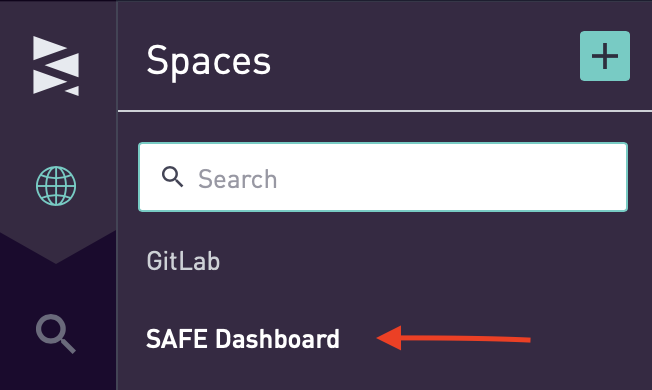
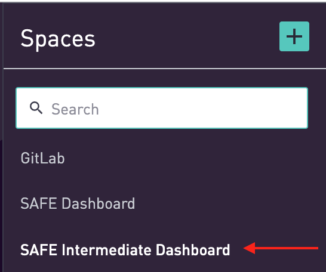
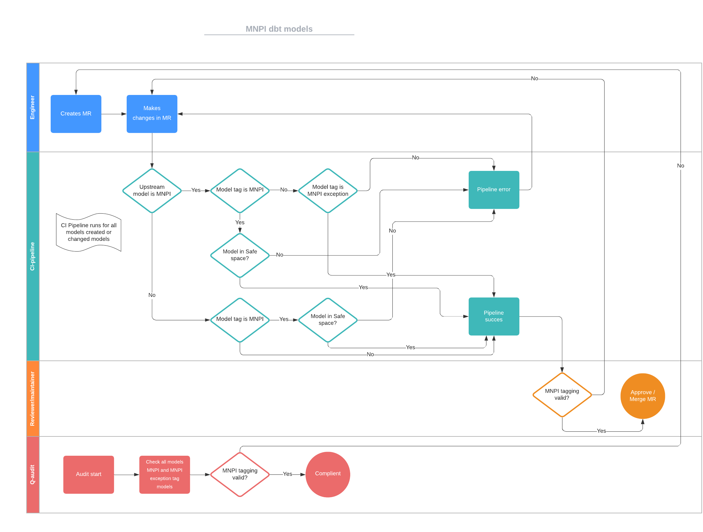

## On this page
{:.no_toc .hidden-md .hidden-lg}

- TOC
{:toc .toc-list-icons .hidden-md .hidden-lg}

{::options parse_block_html="true" /}

---

## What is SAFE Data?

The Data Team follows the GitLab SAFE [Framework](/handbook/legal/safe-framework/) when it comes to SAFE Data. Sometimes also `MNPI` and `RESTRICTED_SAFE` is used in relation to SAFE Data and the SAFE Framework. 

## Access to SAFE Data

### Sisense

Access to Sisense dashboards is based on job role and goverened by the [SAFE Data Access Framework](https://about.gitlab.com/handbook/legal/safe-framework/). In Sisense, dashboards are classified into the following spaces:
- the **GitLab** space is a General Access area which houses dashboards which do not require SAFE handling. General Access Dashboards are accessible by all GitLab Team Members. Access instructions are covered in the [Sisense overview and development page.](https://about.gitlab.com/handbook/business-technology/data-team/platform/sisensecdt/#access)
- the **SAFE Intermediate Dashboard** space houses dashboards which do not require SAFE handling, but reference data models that contain SAFE Data. SAFE Intermediate Dashboards are available to GitLab Team Members based on job role or demonstrated need.
- the **SAFE Dashboard** space houses all dashboards that meet [GitLab's SAFE criteria](https://about.gitlab.com/handbook/legal/safe-framework/#safe-flowchart). SAFE Dashboards are available to GitLab Team Members based on job role or demonstrated need.

A complete list of Dashboards, including SAFE Dashboards, is available in the [GitLab Dashboard Index](https://app.periscopedata.com/app/gitlab/910238/GitLab-Dashboard-Index).

#### Accessing a GitLab General Access Dashboard

General Access Dashboards are available to all GitLab Team members and no Access Request issue is required. Access instructions are covered in the [Sisense overview and development page.](https://about.gitlab.com/handbook/business-technology/data-team/platform/sisensecdt/#access)

#### Accessing a SAFE Dashboard

All SAFE Dashboards are stored within the Sisense SAFE Dashboard space and access is granted at the Sisense space level. Access to a single SAFE Dashboard provides access to all SAFE Dashboards. Having  access to the SAFE Dashboard space will result in a team member being added to the designated insiders list. Access to a SAFE Dashboard (and the space) requires:
1. Your immediate manager's approval
2. Departmental VP (or equivalent) approval

To gain access to SAFE Dashboards:

1. Create an [Access Request](https://gitlab.com/gitlab-com\team-member-epics/access-requests/-/issues\new?issuable_template=Individual_Bulk_Access_Request) and list up to three SAFE Dashboards from the [GitLab Dashboard Index](https://app.periscopedata.com/app/gitlab/910238/GitLab-Dashboard-Index) you require access to. This list of SAFE Dashboards will help approvers understand your needs and intent.
2. Request approval from your immediate manager and your Departmental VP (or equivalent). Approval is needed if it concerns a new Access Request(/issue). 
3. Once the request is approved, follow the instructions in the tech_stack.yml file for provisioning. 
4. After processing is complete you will be able to login to Sisense and access your requested SAFE dashboard and all other dashboards within the SAFE Dashboard Space.

Please see the [Accessing](/handbook/business-technology/data-team/platform/#warehouse-access) SAFE Data in Snowflake for instructions on to access the SAFE data in Snowflake.

SAFE Data in Google Sheets files can be accessed using the instructions for [Accessing a SAFE Dashboard](/handbook/business-technology/data-team/platform/safe-data/#accessing-a-safe-dashboard). Please follow those instructions to gain access to SAFE Data in Google Sheets. 

##### Deprovisioning SAFE Dashboard access

Every 90 days the Data Team runs a [Data Health and Security Audit](/handbook/business-technology/data-team/data-management/). In this audit the Data Team also checks for inactive usage. In case a GitLab Team Member hasn't used the SAFE Dashboard space for more than 90 days, access will be deprovisioned. To get access again to the SAFE Dashboard space, a new AR needs to be created and all approvals need to be obtained again. 

#### Accessing a SAFE Intermediate Dashboard

The **SAFE Intermediate Dashboard** space houses dashboards that do NOT expose Material Non-Public Information (MNPI); however, they are built using restricted data models that contain sensitive financial data. Having VIEW only access to the space will NOT result in a team member being added to the designated insiders list by being included in the space. However, a team member could still be added to the designated insiders list for having access to sensitive information in other applications outside of Sisense. Having the EDITORS role in the **SAFE Intermediate Dashboard** space WILL result in the team member being added to the designated insiders list. This is because EDITORS in the Space will have access to all of the sensitive data in the restricted schemas in the space. Team members should check to see if the dashboard they require VIEW only access is available in the **SAFE Intermediate Dashboard** space so they can avoid be adding to the **SAFE Dashboard** space and thereby being added to the designated insiders list. A complete list of Dashboards, including SAFE and SAFE Intermediate Dashboards, is available in the [GitLab Dashboard Index](https://app.periscopedata.com/app/gitlab/910238/GitLab-Dashboard-Index).

Editors in the **SAFE Intermediate Dashboard** space should not expose MNPI in the charts and dashboards. Generally speaking, data insights that show Total Company ARR, Net and Gross Dollar Retention, Revenues, and Expenses should not not be exposed in the SAFE Intermediate Space and should continue to be built in the **SAFE Dashboard** space. Data insights that show a partial view of the Sales Funnel, a partial view of ARR or other sensitve financial data, or an abstraction of senstive financial data such that one cannot determine what the Total Company metrics would be are ok to visualize in the **SAFE Intermediate Dashboard**. Should Editors in the space have any questions about a specific dashboard, they can ask in the #safe Slack channel and ping a member of the data team for assistance.

SAFE Intermediate Dashboard Change Management: ALL new dashboards in the space will require review by the Data Team, Corporate Finance, and Legal to ensure no MNPI data has been exposed in the dashboard. The recommended development workflow is to develop your new dashboard in the SAFE space and when you are ready to release the dashboard, you could open an issue in the Data Team project, have the dashboard reviewed, and then migrate it to the SAFE Intermediate Dashboard space. The Data Team can assist with this process and request for the dashboard to be copied over. Any new charts added to existing dashboards in the space or any material changes to existing charts in the dashboard that would cause the insights to change require review by the Data Team, Corporate Finance, and Legal. Please open a ticket in the Data Team project and request review of the dashboard when you make updates. This change management policy is to insure that no material MNPI is exposed in the space and will help keep the space safe.

To gain access to SAFE Intermediate Dashboards:

1. To receive VIEW access only, create an [Access Request](https://gitlab.com/gitlab-com\team-member-epics/access-requests/-/issues\new?issuable_template=Individual_Bulk_Access_Request) and follow the instructions in the tech_stack.yml file.
2. Due to the sensitive and nuanced nature of data in this **SAFE Intermediate Dashboard** space, only a select few Functional and Central Data Analysts have been added to the Space as Editors. Any additional Editor users would be added on a case by case basis when new Functional and/or Central Data Analysts join the team and would need access to develop dashboards in the Space. Team members are permitted to gain view access as needed with Manager approval.
3. Once the request is approved, follow the instructions in the tech_stack.yml file for provisioning. 
4. After processing is complete you will be able to login to Sisense and access your requested SAFE Intermediate dashboard and all other dashboards within the SAFE Intermediate Dashboard Space.

#### Accessing a Sales Organization Dashboard

The **Sales Organization** space houses dashboards that contains sensitive Sales data and _can_ expose Material Non-Public Information (MNPI). The connection that is used by this space has access to the same data as the SAFE Dashboard and SAFE Intermediate Dashboard Spaces. Therefore the Sales organization Dashboard Space is also considered as a SAFE Dashboard space. It doesn't contain SAFE in the space name to avoid any confusion.
 
This space is only about limiting access to sensitive sales organization dashboards and not about limiting access to the underlying data. The reason for having this setup (only limiting access on dashboard level and not on data level) is that a carve out of sensitive data from the other SAFE Spaces will be a heavy lift, adds more complexity and the current setup is considered as good for now. Additional context could be found in this [issue](https://gitlab.com/gitlab-data/analytics/-/issues/12436). Technically everyone that has editor access to the SAFE Dashboard and SAFE Intermediate Dashboard Spaces could access and expose the Sensitive Sales data that is foreseen to be exposed in dashboards in this space.

#### Sisense Data Access Matrix:

| Space | Read-Only | Editor |
| ----- | --------- | ------ |
| General / GitLab | Baseline entitlement | AR with manager approval |
| SAFE Intermediate Dashboard | AR with manager approval | No additional Editors will be added at this time | 
| SAFE Dashboard | AR with manager and departmental VP (or equivalent) approval | AR with manager and departmental VP (or equivalent) approval |
| Sales Organization | AR with manager, departmental VP (or equivalent) and space owner approval | AR with manager, departmental VP (or equivalent) and space owner approval |

### Tableau

Access to Tableau dashboards is based on job role and goverened by the [SAFE Data Access Framework](https://about.gitlab.com/handbook/legal/safe-framework/). In Tableau, dashboards are classified as dashboards that meet [GitLab's SAFE criteria](https://about.gitlab.com/handbook/legal/safe-framework/#safe-flowchart). SAFE Dashboards are available to GitLab Team Members based on job role or demonstrated need. All Tableau users need prior access to the Sisense SAFE space.

### Snowflake

All SAFE Data are stored in tables and views within seperate database schemas in Snowflake. Access to 1 table provides access to all SAFE tables. Access to SAFE data requires:

1. Your immediate manager's approval.
2. Departmental VP (or equivalent) approval.

To gain access to SAFE Data:

1. Create an [Access Request](https://gitlab.com/gitlab-com\team-member-epics/access-requests/-/issues\new?issuable_template=Individual_Bulk_Access_Request) and provide your needs and intent.
2. Request approval from your immediate manager and your Departmental VP (or equivalent). Approval is needed if it concerns a new Access Request(/issue). 
3. Once the request is approved, tag the Snowflake [provisioners](https://gitlab.com/gitlab-com/www-gitlab-com/-/blob/master/data/tech_stack.yml) and they will process the request.
4. After processing is complete you will be able to access SAFE Data (schemas) in Snowflake.

## Data Development

SAFE Data in Snowflake is stored in separate schemas. Schemas with SAFE Data are prefixed with: `RESTRICTED_SAFE_*`. All models that contain MNPI data must be stored in these schemas. There is a [CI-Pipeline](/handbook/business-technology/data-team/platform/ci-jobs/#safe_model_script) (`safe_model_script`) that secures this process. Every model that is created or changed, will be checked by the CI-Pipeline. As a developer, the following governance needs to be taken into account:
 
- `mnpi` tag to be applied when reading out of a table/model that holds MNPI data and MNPI is used in the model. Subsequently the data must be stored in a `RESTRICTED_SAFE_*` schema.
- `mnpi_exception` tag to be applied when reading out of a table/model that holds MNPI data and MNPI is **not** used in the model. I.e. only a NON-MNPI field is used from a MNPI model. 
- It's up to the engineer to determine if and which tag needs to be applied. Check the data that is exposed in your model against the GitLab SAFE [Framework](https://about.gitlab.com/handbook/legal/safe-framework/). If there is doubt, reach out in the. `#SAFE` channel in Slack.
- The CI pipeline is there to help and check fact based (upstream model tags versus current model tags).

The following diagram describes the process in detail when handling or referencing SAFE Data.

