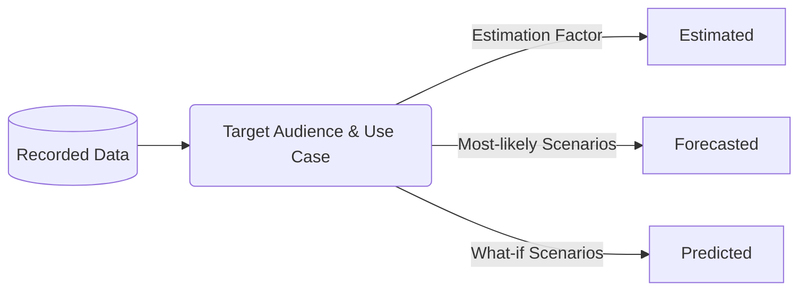

## On this page
{:.no_toc .hidden-md .hidden-lg}

- TOC
{:toc .toc-list-icons .hidden-md .hidden-lg}

---

## Overall Look and Feel

### KPI Charts

1. Create a new chart. 
1. Change the `Series Settings` in the right hand pane to `Number Overlay`
1. Under `Fields`, set `periscope_index` as the X Axis
1. Set the field you want to display as the Y Axis
1. Under `Series`, make sure one of the boxes is checked
1. To change the font size and number formatting, click on the `Chart Format` button on the right, then check the corresponding boxes.

### Filterable Reports

`under construction`

### Choosing the Right Chart

#### Line charts

A line chart is commonly used to compare data over time or to show trend data by plotting data points in a line. An example is when you want to analyze the MR rate of a certain department for the last year. The X-axis is typically used to represent time while the Y-axis contains the values. 

We can also use line charts when comparing changes over time for more than one group or category. When comparing the MR rate of several departments for example, each department will be represented by different lines in the chart. 

##### How to Create a Line chart in Sisense

Here is how you can create a line chart in Sisense:

1. Once you have the data, in the Series Settings panel, choose the Line option.
2. Under the series settings, you can see the list of fields. Determine the field that will represent the time or period and assign it in the X-axis.
3. Determine the values fields and assign them in the Y-axis. We can choose multiple fields that will be represented by multiple lines too.
4. If more than 1 value field is determined: Under the Series panel, you can further choose the fields to be assigned in either of the two Y-axis.

We can also change the color theme by following the [Gitlab Standard Color Pallete](https://about.gitlab.com/handbook/business-technology/data-team/platform/sisense-style-guide/#standard-color-pallete).

#### Bar charts

A bar chart is commonly used to compare data across several categories. Typically, the categories are displayed along the Y-axis, while the values are displayed along the X-axis. The values can also be broken down further by another category.

In creating a bar chart in Sisense, we must first determine the categories and values. The number of categories must be at least 1 and at most 2. The number of values, however, must also be at least 1, but there is no limit as to how many can be added. When the number of values is more than 1, each value will be represented in the chart with different colors and areas.

There are different design options available to fine-tune a Bar chart. We can choose from the following appearances:
1. Classic: Columns are displayed side by side.
2. Stacked: Columns are stacked on top of each other and do not overlap. The tooltips over the columns show the percentage distribution among the Values.
3. Stacked 100: Columns are stacked on top of each other (but do not overlap) and the combined column is stretched to represent 100%. This option is most commonly used when the relative distribution of the values is more important than their aggregation.

##### How to Create a Bar chart in Sisense

Here is how you can create a bar chart in Sisense:

1. Once you have the data, in the Series Settings panel, choose the Bar option.
2. Under the charts options, you can see the list of fields. Determine the field/s that will be the category/categories and assign them in the X-axis (min of 1, max of 2).
3. Determine the values fields and assign them in the Y-axis (min of 1).
4. If more than 1 value field is determined: Under the Series panel, you can further choose the fields to be assigned in either of the two Y-axis.

We can also change the color theme by following the [Gitlab Standard Color Pallete](https://about.gitlab.com/handbook/business-technology/data-team/platform/sisense-style-guide/#standard-color-pallete).

#### Pie charts

Try to avoid using pie charts and use bar charts instead. The human eye is not well suited to easily grasp the difference in the sizes of the slices of the pie chart, a problem aplified with every added slice over two. If you must use pie charts, reserve them only for use cases where only two dimensional values need to be represented (although even there bar charts may be preferable).

For an in-depth explanation of the limitations of pie charts, please read Stephen Few's excellent [article](https://www.perceptualedge.com/articles/visual_business_intelligence/save_the_pies_for_dessert.pdf).

## Colors, Labels, and Data Values

### Standard Color Pallete

SiSense charts use the standard GitLab color pallete. To confirm you're using the recommended color pallette, take the following steps: 
1. Hover over a chart
1. Click on the pencil (`Edit Chart`) icon
1. On the right pane, confirm that the `Color Theme` is set to `Dashboard Theme (GitLab Theme)`
1. If not, click on the theme to bring up a dropdown menu. Select a different theme if needed.
1. If you made a change, click on the `Save` button on the top right of the screen. If you didn't make a change, click on the `Cancel` button instead.

Scenarios where you might deviate from using the standard color pallette:
- use colors for specific signal functions (e.g. green & red to denote positive or negative)
- account for [color blindness](https://www.getfeedback.com/resources/ux/how-to-design-for-color-blindness/)

### Rounding

To round or not to round? Know your audience. Present numbers suitable for your target audience and analysis use cases.
- Executive-level charts do not normally require multiple digits of precision and rounding to the nearest ten, hundred, or thousand is sufficient.
- Depending on the chart, 1 or 2 significant digits on percentages may be required for totals to equal 100%.
- In general except for currency, numbers should be displayed in their full form.

### Currency

- All currency is presented in USD.
- At $10,000 and above, each `000` is replaced with a k; example $10k instead of $10,000.
- At $1,000,000 and above, each `000,000` is replaced with a m; example $10m instead of $10,000,000.

For any numeric values of a 1000 million or more, be mindful of international differences in the [definition of billion](https://pages.ucsd.edu/~dkjordan/cgi-bin/moreabout.pl?tyimuh=bignum).

### Data and Time 

Fiscal Dates should be extracted from the DIM_DATE dimension table.

Date formats must adhere to the [GitLab Writing Style Guidelines](https://about.gitlab.com/handbook/communication/#writing-style-guidelines):
- Dates are yyyy-mm-dd
- Time is presented as a 24 hour clock using UTC
- Fiscal Quarter is Qn, example Q1
- Fiscal Year is FYyy, example FY21. 2021 would denote the calendar year.
- Fiscal Year and Quarter is FYyy-Qn, example FY21-Q2 

### Recorded and Calculated Data

Data is prepared for presentation, or reporting, for a specific target audience and use case. **Recorded Data** is the basis for all **Calculated Data**.

- **Recorded Data** - "Factual" data which originates from a verifiable source and observable events. To aid in verification, recorded data commonly includes audit metadata such as the name of data creator/source, the date and time of data capture, and the location where the event occurred.
- **Estimated Data** - calculated data based on Recorded data plus an Estimation Factor. The Estimation Factor is typically based on historical data trends over a meaningful and relevant period of time. [Estimation](https://en.wikipedia.org/wiki/Estimation) is widely used across all industries and domains.
- **Forecasted Data** - calculated data based on historical Recorded data plus assessments based on "most-likely" future scenarios. [Forecasting](https://en.wikipedia.org/wiki/Forecasting) is commonly used in Financial Planning.
- **Predicted Data** - calculated data based on historical Recorded data plus assessments based on "what-if" future scenarios.

#### Presentation

Recorded data does not require special labeling, but Calculated data does. Calculated data should _always_ be:
- clearly labeled, such as in the chart title and legend (E.g. use "Estimated Seats" instead of "Seats")
- clearly identified in the chart elements (E.g. use different line styles when mixing Calculation types on the same chart)

## Custom Python Modules

Python modules help with maintaining reusable, quality and clean code in a single place.

To start / modify a custom python module start a MR in the [periscope/master branch of the Sisense project](https://gitlab.com/gitlab-data/periscope/-/tree/periscope/master). You can see the available custom modules in Sisense at any point at the left side menu of the Create Chart page.

Official documentation on Custom Modules can be found [HERE](https://dtdocs.sisense.com/article/custom-modules).
