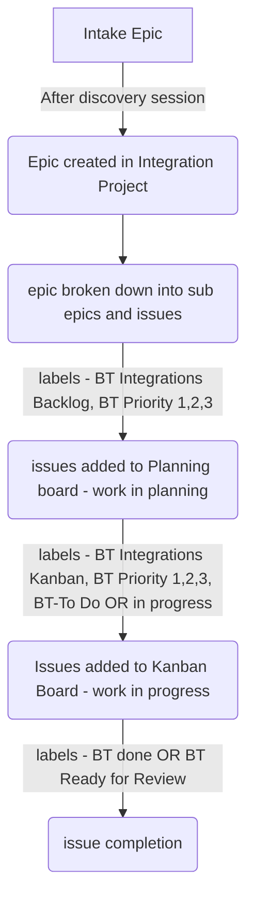

{::options parse_block_html="true" /}

<link rel="stylesheet" type="text/css" href="/stylesheets/biztech.css" />

## On this page
{:.no_toc .hidden-md .hidden-lg}

- TOC
{:toc .hidden-md .hidden-lg}

## Integrations - SDLC Process

### Quick links
- [Integration Planning Board](https://gitlab.com/groups/gitlab-com/-/boards/3224617)
- [Integration Kanban Board](https://gitlab.com/groups/gitlab-com/-/boards/2031131?milestone_title=22%20-%20BT%20EntApps%20-%202021-09-07&label_name%5B%5D=BT%20Integrations%3A%3AKanban)
- [Backlog filter](https://gitlab.com/groups/gitlab-com/-/issues?scope=all&utf8=%E2%9C%93&state=opened&label_name%5B%5D=BT%20Integrations%3A%3ABacklog)
- [Platypus Project](https://gitlab.com/gitlab-com/business-technology/enterprise-apps/integrations/platypus)

## SDLC
The page defines the different SDLC stages and artifacts delivered at the completion of each stage. We use combinations of milestones, boards, epics, issues and labels to manage, plan and track the work as it flows through the SDLC pipeline.

Note: The Integrations team uses the same project phases as the Enterprise Applications BSAs. Information on the phases can be found [here](/handbook/business-technology/enterprise-applications/bsa/#how-we-work)

### SDLC Phases
For each phase, we (the integrations team) require certain additional artifacts in order to exit a phase and enter the next. We also have specific separate locations where we might track progress through a phase.

For full information on the EntApps SDLC phases please see the [BSA handbook page](/handbook/business-technology/enterprise-applications/bsa/#how-we-work).

#### [Intake](/handbook/business-technology/enterprise-applications/bsa/#intake)
Intake may come directly to the integrations team but may also go through the normal EntApps intake process. In the latter scenario, the BSAs would triage any related work to the Integrations team which is then the first time a project would appear on our radar. 

In reality the method with which a project is made known to us can vary from an intake issue, to a slack message, to being invited to a Zoom call. We always strive to convert those initial conversations into an intake issue so as to have that engagement on record.

#### [Phase 1 - Define](/handbook/business-technology/enterprise-applications/bsa/#phase-exit-criteria)
From an engineering perspective, define is crucial to our project as it's the primary opportunity to surface high-level asks and define scoping and a potential timeline. Oftentimes there is an implicit expectation that all questions will be answered in this phase, unfortunately that's not the case and usually we won't delve into the details of features until the design phase. Please keep in mind that this might be the first time that we collectively have encountered your specific business problem or ask. We will do our best to document as much about the problem as possible and gain a sufficient understanding to effectively develop a solution for you. This phase has a direct impact on almost all subsequent phases and is probably the most crucial in the SDLC process. We may even ask to return to this phase from a future phase if we feel that enough context/information has not been gained in the first pass.

The primary artifact of the define phase are user stories, specifications and possibly some engineering prototypes. We would also ask for stakeholder signoff of the user stories and specifications in order to exit this phase.

Another artifact of this phase would be a UAT plan primarily developed by the technical stakeholders. This should include sample input and expected output data for all features as the engineering team will use that for dev testing as well.

> "A user story is a promise for a conversation" - Alistair Cockburn

#### [Phase 2 - Design](/handbook/business-technology/enterprise-applications/bsa/#design)
User stories would be converted into sub-epics of the main project with each specification being documented on the epics. These epics will live in the [Gitlab.com group](https://gitlab.com/gitlab-com). The engineering team will create various design documents and break down the specifications into engineering issues. Issues are the smallest unit of work. They are created in the [Platypus Project](https://gitlab.com/gitlab-com/business-technology/enterprise-apps/integrations/platypus/-/issues)

Note: In order to correctly associate changes to their respective projects; merge requests in the Platypus project must have an issue number in their title. For example: [WIP: #20 Ship coverage report artifact from tests](https://gitlab.com/gitlab-com/business-technology/enterprise-apps/integrations/platypus/-/merge_requests/25)

These issues are then added to the [BT Integrations Planning board](https://gitlab.com/groups/gitlab-com/-/boards/3224617) via label `BT Integrations::Backlog`. Good practice is to use additional labels to define the priority like BT Priority 1, 2, 3 and the nature of work like Field Marketing, Finance Systems or Bug. The board comes in handy while planning for the engineering [milestones](/handbook/business-technology/enterprise-applications/integrations/how-we-work/#3-milestone-process), because we can select backlog items to bring into current or future milestones based on project and issue priority.

The engineers will also deliver a design document, which will be placed in the [team wiki](https://gitlab.com/gitlab-com/business-technology/enterprise-apps/integrations/platypus/-/wikis/integrations-list) before this phase is complete.

A privacy review and Appsec review **MUST** be initiated in this phase at the latest in order for those to be complete before the feature goes live.

#### [Phase 3 - Build](/handbook/business-technology/enterprise-applications/bsa/#build)
The engineering issues above once planned into an engineering milestone will be built by the team. The team works on various projects in tandem and as such a milestone may include tasks for multiple different projects. For the most part we try to focus a team member to an individual project so as to reduce distractions and increase delivery efficiency. A project may span multiple one-month milestones or may be limited to just one, it depends a lot on the size of the project. For all projects the team strives to deliver in small batches. What this means is that we will try to constantly deliver small increments to a functioning feature. Production (and staging) deployment does not occur at the end of the project, but rather on a daily basis. This approach ensures that we constantly have a buildable solution ready to deploy at all times and that we avoid a risky "all-in-one" deployment at the end of a project. It also means that we can get continuous feedback from the stakeholders on these partial deliveries and that testing can occur as soon as a feature is working rather than all at the end of a project.

#### [Phase 4 - Test](/handbook/business-technology/enterprise-applications/bsa/#test)
This phase is driven by the stakeholders and technically can begin during the build phase as soon as functionality is available for testing. Each of the agreed-upon UAT scenarios should be tested and receive signoff from the stakeholders. Problems that are discovered during UAT testing should be raised as either bugs (incorrectly implemented logic) or change requests (changes to the specifications).

#### [Phase 5 - Deploy](/handbook/business-technology/enterprise-applications/bsa/#deploy)
Though deployments have been occurring all through the build and test phases, we treat this phase as the final delivery of an agreed-upon feature to the team. This step will probably involve some final connecting of systems and end-to-end validation of the feature in the full production environment with other systems.

### SDLC Flowchart

### SDLC Artifacts

#### Artifact epic & issue templates
> Coming soon; stay tuned

#### Labels

| Label                         | Description                                                                                     |      project/group     |  type  |
| :---------------------------- | :---------------------------------------------------------------------------------------------- | :--------------------: | :----: |
| BusinessTechnology                   | Business Technology is actively involved                                                                        | gitlab-com |    - |
| BT Integrations::Backlog                       | Add issues to the Planning board              | gitlab-com |    - |
| BT Integrations::Kanban                            | Add issues to the In progress board work                                                                   | gitlab-com |    - |
| BT-Priority::1               | Critical                                                                                        | gitlab-com | scoped |
| BT-Priority::2               | Important not urgent                                                                            | gitlab-com | scoped |
| BT-Priority::3               | No rush to do, but please do it.                                                                | gitlab-com | scoped |
| BT::To Do                   | This is for work that's not started yet                                                        | gitlab-com| scoped |
| BT::Blocked                       | This blocks other work                                                                          | gitlab-com | scoped |
| BT::In Progress                | This is for work that's in progress stage request                                                                                  | gitlab-com | scoped |
| BT::Done               | This is for work completed by the assignee request                                                                                  | gitlab-com | scoped |
| BT::Ready to Deploy                | This is for merge request ready to be deployed in master request                                                                                  | gitlab-com | scoped |
| BT::Ready for Review                | This is for merge request ready for team memeber review request                                                                                  | gitlab-com | scoped |
| Bug               | This is for issues raised in the delivered work request                                                                                  | gitlab-com | scoped |

#### Issue Weights

Issue weight is an estimate of how much time is required to complete the tasks in the issue. The idea is to go over the problem statement raised in the issue with the team that will be working on it and put it into one of 5 buckets: XS, S, M, L, XL as a way to group the unit of work.

**Process**

- When an issue is opened for the Enterprise App team with the appropriate [labels](/handbook/business-technology/how-we-work/#labels), a team member must be assigned.
- The assignee works with all parties involved in the issue to recommend a weight.
- After the issue is closed, the assignee who helped coordinate the work can update the weight to reflect the actual effort if different from the original weight.
    They should provide a reason and mention it in the Enterprise Applications Sync or in the [Enterprise Applications wiki](https://gitlab.com/gitlab-com/business-technology/enterprise-apps/enterprise-applications-sync/-/wikis/Enterprise-Applications-weekly-sync) to help us improve our weighting accuracy going forward.

**Guidelines**

| Size/Weight | Description | Estimate work range  |
| ----------- | ----------- | ----------- | 
| XS:1        | A task.   **Example:**  - Documentation update. | <4 hours |
| S:2         | The problem statement has been determined and a solution identified. No need for (extra) discussion with other teams or people.   **Examples are:**  - A problem that has been discussed but needs an issue to track the development and outcome. - Regular bugs to be addressed by the Integrations engineers where some investigation has already taken | 4 hours / half a day |
| M:3         | The problem statement has been defined with understood requirements. A solution is yet to be identified and coordination with other teams or people may be required.  Bugs that are not fully understood and may not yet have a suggested solution. Extra investigation is required but the expectation is that once a solution is identified, it should be relatively easy to implement.   **Examples are:**  - A deliverable from an ongoing project that will involve different teams and coordination from a BSA (Business Systems Analyst) to help find and implement a solution. - Most system bugs or performance issues. | 8 hours / 1 day      |
| L:5         | The problem statement has been defined but a solution will require extra investigation in order to be identified and implemented. Surprises are expected, different teams will have to be involved and a BSA (Business Systems Analyst) assistance is needed.  Bugs that are very poorly understood and will not have a suggested solution. Significant investigation will be required and once the problem is found, a solution may not be straightforward.   **Examples are:**  - A deliverable from an ongoing project that will involve different teams and coordination from a BSA (Business Systems Analyst) to help find and implement a solution.  Bugs or system workflows that negatively impact the work of other people. | 12 hours / 1.5 days  |
| XL:8        | The problem statement has been defined but is a significant change that has dependencies and the requirements are probably not fully understood or known. It's unlikely we would resolve this in just one issue and the preference would be to further clarify requirements and/or break into smaller issues.    **Example:**  - A new system or module implementation. | 16 hours / 2 days   |
