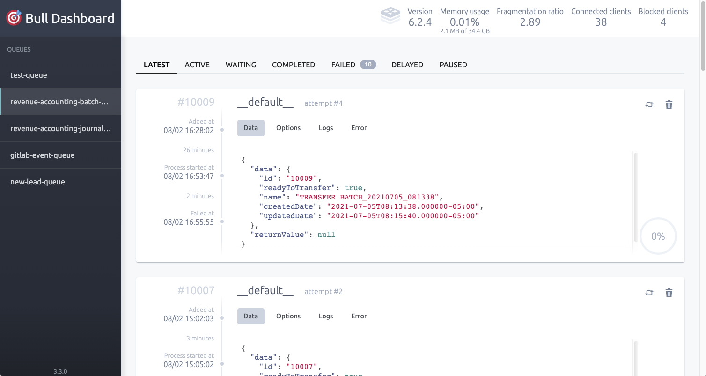
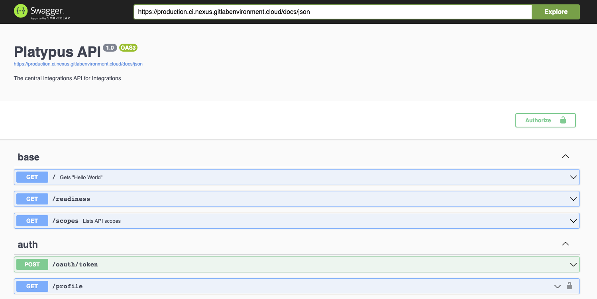

{::options parse_block_html="true" /}

<link rel="stylesheet" type="text/css" href="/stylesheets/biztech.css" />

## On this page
{:.no_toc .hidden-md .hidden-lg}

- TOC
{:toc .hidden-md .hidden-lg}

# Platypus Distilled
Pick the option from this list that most closely aligns to you to see a tailored description of Platypus.

- [I'm a Business Leader/Professional](#for-the-business)
- [I work in product/engineering](#for-productengineering)
- [I own/admin a SaaS system](#for-sysadmins)

## For the Business
You can think of Platypus as a central hub for system integrations where data can flow in real-time around the Enterprise Applications ecosystem.
Platypus provides us with a repeatable way to ensure we're building robust, well-tested, secure, and compliant integrations at GitLab. It is used as an alternative to building
point to point integrations between systems.
The Enterprise Applications Integrations team will also more easily be able to support integrations that are built in Platypus as they can be monitored in our central logging and alerting tools.
An additional benefit to housing your integrations in Platypus is that you have the option to tap into a growing ecosystem of other systems and data that might enhance your ability to deliver in your specific tools

## For Product/Engineering
At GitLab we have a broad ecosystem of internal and SaaS tools that are varying in technologies, APIs (REST, GraphQL, SOAP, FTP flat files), auth models, stability, support etc. For systems that do not live within the GitLab product, ownership is spread across many teams with varying expertise and engineering knowledge. The Enterprise Applications team is a specialised technical team that lives in the Business Technology function who's primary goal is to engage team members across GitLab and assist them in implementing their systems, integrating them into the wider ecosystem and support them in the long term. Part of this Enterprise Applications team is the Integrations Engineering team whose primary focus is building and maintaining the underlying technology that facilitates scale for the broader GitLab team and software ecosystem all the while keeping in mind our security and compliance objectives. The Integrations team is the DRI for all ingress and egress from the Enterprise Applications ecosystem that includes all software we have built or bought that isn't part of the GitLab product.

[Platypus](https://gitlab.com/gitlab-com/business-technology/enterprise-apps/integrations/platypus) is a Typescript application running on node.js that is built on the [Nestjs framework](https://nestjs.com/). It is opinionated both in terms of how code should be written, as well as how we want to build integrations at GitLab to meet our broader company goals. It is however a generic framework built in a generic programming language, run on generic infrastructure. It is very flexible in terms of what types of projects can be built with it. As of now the primary purpose of the project is to build APIs and scheduled automations so that other teams and software can consume those APIs in order to integrate data. There are plan on the horizon to build some basic user interfaces to manage these integrations but in general we are not planning to build any rich application UIs of our own that would hit this backend. If those plans change we will post that information on our handbook pages.

## For SysAdmins
The Enterprise Applications Integrations team and Platypus are here to make your life as easy as possible. You can think of Platypus as a central hub for system integrations where data can flow in real-time around the Enterprise Applications ecosystem. We will use the integrations platform tools we have to build the automations and integrations that you need to make your
system a success at GitLab. Here are some of the things we can do for you, but please reach out in any case so we can help you out with your specific integration needs.
- Automatically fetch a report from a system and send it to another system
- Scheduled flat file (csv, json etc.) transfers between systems
- Integrations with Google Apps (Sheets, Drive)
- API Integrations between systems
- Receiving triggered events from systems and broadcasting them to other systems (webhooks, polling)
- Automatically sending integration errors to Slack, Email, GitLab Incidents and Issues etc.
- Providing basic reporting tools to analyze how an integration is performing or what data has been sent
- Accelerating development of more sophisticated integrations and automations by leveraging data and APIs from other systems in our ecosystem

# Releases
Our full release list can be found on the [GitLab project releases page](https://gitlab.com/gitlab-com/business-technology/enterprise-apps/integrations/platypus/-/releases)

## [Release v1.0.0 - 2021-08-03](https://gitlab.com/gitlab-com/business-technology/enterprise-apps/integrations/platypus/-/releases/v1.0.0)
### Summary
This release contains all of the work up until the end of [Milestone 20](https://gitlab.com/groups/gitlab-com/-/milestones/512)

This is the integrations team's first official release of Platypus. It contains most of the architectural and infrastructure items that we deemed to be necessary to be production read (MVC).

### Changelog
#### Features
- Stub endpoint for receiving Product Qualified Leads (PQL) with model validation and documentation
- Basic EdCast connector

#### Application
- Queueing support via the Bull library
    - [Bull Project](https://github.com/OptimalBits/bull)
    - [Nestjs Docs](https://docs.nestjs.com/techniques/queues#queues)
- Bull Board UI integrated into the main platypus app (screenshot below)
    - [Bull Board Project](https://github.com/felixmosh/bull-board)
- CRON Scheduling
    - [Nestjs Docs](https://docs.nestjs.com/techniques/task-scheduling#task-scheduling)
- CQRS/Mediator request handling architecture
    - [Nestjs Docs](https://docs.nestjs.com/recipes/cqrs#cqrs)
- Outgoing Slack Integration
    - [Slack Node SDK](https://github.com/slackapi/node-slack-sdk) - **Note: There are plans to move to the bolt library once it fully supports Typescript**
- Workato Services API Integration
    - Allows us to leverage built in connectors in Workato
- PostgresDB with ORM and Migrations
    - [TypeORM Project](https://typeorm.io/#/)
    - [Nestjs Docs](https://docs.nestjs.com/recipes/sql-typeorm#sql-typeorm)
- Parent-Child Queue job orchestration
- Automatic Swagger API documentation generation (OpenAPI Spec 3) (screenshot below)
    - [API Docs](https://production.ci.nexus.gitlabenvironment.cloud/docs/static/index.html)
- Automatic code documentation using Compodoc
    - [Compodoc project](https://compodoc.app/)
    - https://nexus-docs-gitlab.netlify.app/
- Improved logging
    - [Pino project](https://github.com/pinojs/pino)
- Feature flags
    - [Unleash project](https://docs.getunleash.io/)
    - [GitLab Unleash docs](https://docs.gitlab.com/ee/operations/feature_flags.html)
- Authentication and Authorization Strategies
    - OAuth2 Client Credentials
    - HTTP Basic Auth
    - GitLab Webhook Header API Key auth
    - Scopes Authorization
- Graceful shutdown support (K8s requirement)
- Unit test infrastructure
- E2E test infrastructure

#### CI/CD
- AutoDevops
    - K8s GitLab Review Apps
- Infra terraform automation

#### Infrastructure (Thanks to the IT Ops team)
- GCP MemoryStore Redis instance
- GCP Cloud SQL Postgres instance
- Bastion host VM
- GCP VPC (containing the above)

#### Screenshots
##### Bull Board

##### Swagger API Docs

---
