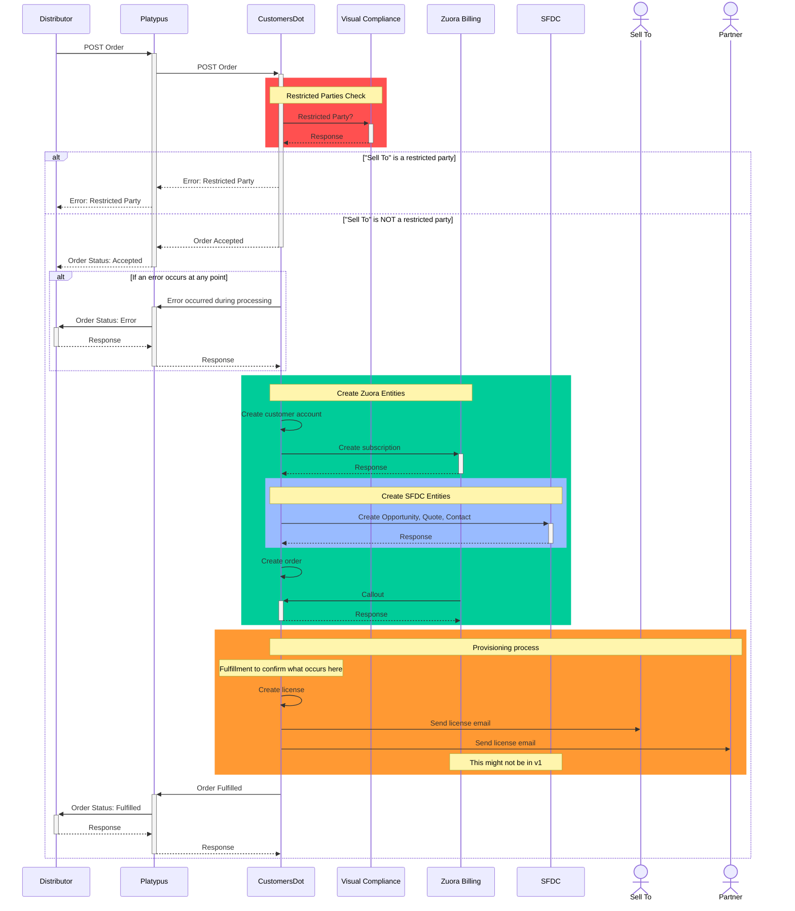

{::options parse_block_html="true" /}

<link rel="stylesheet" type="text/css" href="/stylesheets/biztech.css" />

## On this page
{:.no_toc .hidden-md .hidden-lg}

- TOC
{:toc .hidden-md .hidden-lg}

# Connected Systems

- Distributor e-marketplace
  - Arrow (Arrowsphere)
- Platypus (middleware)
- CustomersDot (destination & middleware)
- Visual Compliance (destination)
- Zuora Billing (destination & middleware)
- Salesforce "SFDC" (destination)

# Summary


# Sequence
<div class="x-scrollable">
<div style="width: 1800px;">



</div>
</div>

# Error handling

# Data Models

```mermaid
erDiagram

```

# Security Components

1. Platypus authenticates with Workato using [OAuth2 Client Credentials](https://docs.workato.com/api-mgmt/oauth2.html#request-access-token)
2. Workato Authenticates with Zuora Revenue using a [custom built auth scheme](https://www.zuora.com/developer/revpro-api/#tag/Authentication)
3. All connections are over HTTPS

# Data classification

This integration handles and stores [Red Data](/handbook/security/data-classification-standard.html#red) (Customer data)

# Environments

| Environment | Zuora Billing                    | Zuora Revenue     | Platypus                | Workato             | Netsuite   |
|-------------|----------------------------------|-------------------|-------------------------|---------------------|------------|
| Production  | Production                       | Production        | Production              | Production          | Production |
| Staging     | Zuora Central Sandbox (10000796) | REVPRO_GITLAB_S02 | Staging                 | Development/Testing | Sandbox 2  |
| Development | Zuora API Sandbox 1 (14115)      | REVPRO_GITLAB_S01 | Local Dev & [Review Apps](https://docs.gitlab.com/ee/ci/review_apps/) | Development         | Sandbox 1  |
