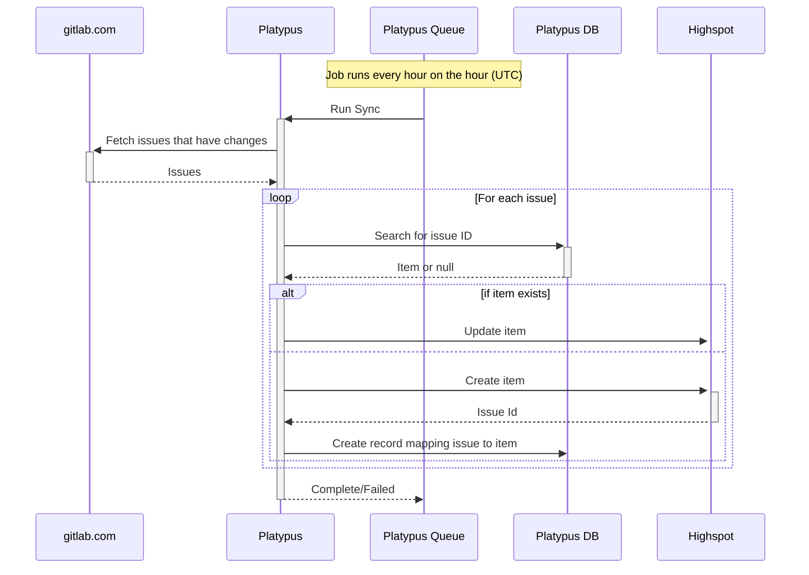

{::options parse_block_html="true" /}

<link rel="stylesheet" type="text/css" href="/stylesheets/biztech.css" />

## On this page
{:.no_toc .hidden-md .hidden-lg}

- TOC
{:toc .hidden-md .hidden-lg}

# Links

[Intake issue](https://gitlab.com/gitlab-com/business-technology/enterprise-apps/intake/-/issues/411)

# Connected Systems

- <https://gitLab.com> (source)
- Platypus (middleware)
- Highspot (destination)

# Summary

This integration takes GitLab issues from the [CS Knowledgebase](https://gitlab.com/gitlab-com/customer-success/solutions-architecture/sa-knowledge-base/-/issues) project and creates items in Highspot that link back to these issues.

# Sequence

# Error handling

# Data Model

| Highspot Field | Field Type | Value |
|------------------|------------------|------------|
| type | string | `web_link` |
| url | string | GitLab Issue URL |
| title | string | GitLab Issue title (truncated to 200 characters) |
| description | string | GitLab Issue description (truncated to 2000 characters) |
| lists | string array | CS Knowledgebase list id |

# Security Components

1. `Gitlab.com` authenticates with Platypus using [OAuth2 Client Credentials](https://gitlab.com/gitlab-com/business-technology/enterprise-apps/integrations/platypus/-/wikis/Using-the-Platypus-API#authentication)

# Data classification

# Environments

| Environment | gitlab.com | Platypus| Highspot |
| ----------- | ------------ | ---------- | -----------|
| Development | Production | Development  |  Production |
| Staging | Production | Staging | Production |
| Production | Production | Production | Production |