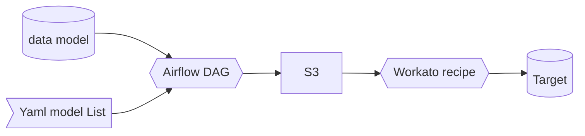
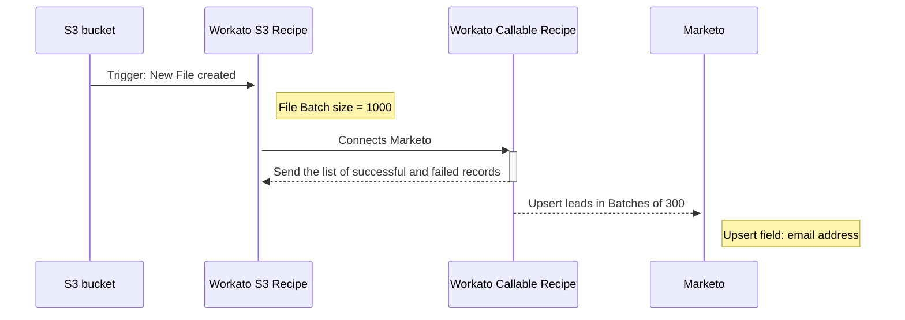
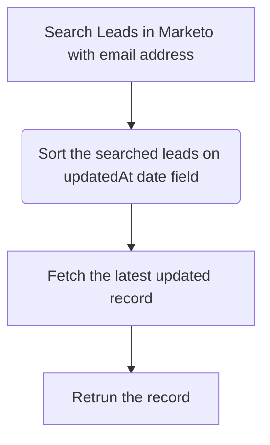

{::options parse_block_html="true" /}

<link rel="stylesheet" type="text/css" href="/stylesheets/biztech.css" />

## On this page
{:.no_toc .hidden-md .hidden-lg}

- TOC
{:toc .hidden-md .hidden-lg}

# Connected Systems

- Snowflake Database (source)
- Workato (middleware)
- Marketo (destination)

# Summary

The integration takes care of sending data to Marketo (and potentially other cloud applications) from Snowflake so that it can use that data in my operation of Email Marketing Automation.

**The integration is primarily responsible for authentication and field mapping**. Sometimes the integration layer handles type casting and sometimes, due to semi-structure data schemas in APIs, does some modeling (which is really be more like mapping)to get from a tabular to json schema, for example.

It gets triggered whenever a new .csv file is added to the S3 bucket. The Workato recipe then reads the .csv file and maps and upsert the Leads data to Marketo org.

## Working Solution

# Sequence

# Error Handling

In Marketo Prod (specifically) there's some dirty data where multiple leads have same email address. Since for Upsert operation to work successfully, the email address must be unique, this handled through a callable recipe.

The `Handling Duplicate Leads` is called for each of the leads that failed in upsert operation in `Callable Lead data Upsert in Marketo`. Here's how it works:

# Data Mapping

| Marketing pump Field | Marketo Field          |
| ------------------- | ----------------------- |
| company_name | [CDB] Company Name |
| country      | [CDB] Country |
| customer_db_confirmed_date           | [CDB]  Customer DB Confirmed Date |
| customer_db_created_date             | [CDB]  Customer DB Created Date |
| customer_db_customer_id              | [CDB] Customer DB Customer ID |
| days_since_saas_signup_bucket        | [CDB] Time Since SaaS Trial Owner Signup |
| days_since_saas_trial_ended_bucket   | [CDB] Time Since SaaS Trial Ended |
| days_since_self_managed_owner_signup_bucket | [CDB] Time Since SM Owner Trial Sign Up |
| dim_marketing_contact_id                   | [CDB] Dim Marketing Contact ID |
| email_address | email |
| first_name    | [CDB] First Name |
| gitlab_dotcom_active_state                 | [CDB] GitLab.com Active State       |
| gitlab_dotcom_confirmed_date     | [CDB] GitLab.com Confirmed Date            |
| gitlab_dotcom_created_date        | [CDB] GitLab.com Created Date              |
| gitlab_dotcom_email_opted_in               | [CDB] GitLab.com Email Opted-in            |
| gitlab_dotcom_last_login_date              | [CDB] GitLab.com Last Login Date           |
| gitlab_dotcom_user_id                      | [CDB] GitLab.com User ID                   |
| gitlab_user_name                           | [CDB] GitLab.com User Name                 |
| group_member_of_saas_bronze_tier    | [CDB] Group Member of SaaS Bronze Tier     |
| group_member_of_saas_free_tier             | [CDB] Group Member of SaaS Free Tier       |
| group_member_of_saas_premium_tier          | [CDB] Group Member of SaaS Premium Tier    |
| group_member_of_saas_trial                 | [CDB] Group Member of SaaS Trial           |
| group_member_of_saas_ultimate_tier         | [CDB] Group Member of SaaS Ultimate Tier   |
| group_owner_of_saas_bronze_tier            | [CDB] Group Owner of SaaS Bronze Tier      |
| group_owner_of_saas_free_tier              | [CDB] Group Owner of SaaS Free Tier        |
| group_owner_of_saas_premium_tier           | [CDB] Group Owner of SaaS Premium Tier     |
| group_owner_of_saas_trial                  | [CDB] Group Owner of SaaS Trial            |
| group_owner_of_saas_ultimate_tier          | [CDB] Group Owner of SaaS Ultimate Tier    |
| individual_namespace_is_saas_bronze_tier   | [CDB] Ind. Namespace is SaaS Bronze Tier   |
| individual_namespace_is_saas_free_tier     | [CDB] Ind. Namespace is SaaS Free Tier     |
| individual_namespace_is_saas_premium_tier  | [CDB] Ind. Namespace is SaaS Premium Tier  |
| individual_namespace_is_saas_trial         | [CDB] Ind. Namespace is SaaS Trial         |
| individual_namespace_is_saas_ultimate_tier | [CDB] Ind. Namespace is SaaS Ultimate Tier |
| is_customer_db_owner                       | [CDB] Is Customer DB Owner                 |
| is_customer_db_user                        | [CDB] Is Customer DB User                  |
| is_gitlab_dotcom_user                      | [CDB] Is GitLab.com User                   |
| is_group_namespace_member                  | CDB] Is Group Namespace Member            |
| is_group_namespace_owner                   | [CDB] Is Group Namespace Owner             |
| is_individual_namespace_owner              | [CDB] Is Individual Namespace Owner        |
| is_self_managed_premium_tier               | [CDB] Is Self-Managed Premium Tier         |
| is_self_managed_starter_tier               | [CDB] Is Self-Managed Starter Tier         |
| is_self_managed_ultimate_tier   | [CDB] Is Self-Managed Ultimate Tier        |
| is_zuora_billing_contact | [CDB] Is Zuora Billing Contact |
| last_name | [CDB] Last Name |
| responsible_for_free_tier_only           | [CDB] Resp for Free Tier Only           |
| responsible_for_group_saas_bronze_tier   | [CDB] Resp for Group Saas Bronze Tier   |
| responsible_for_group_saas_free_tier     | [CDB] Resp for Group Saas Free Tier     |
| responsible_for_group_saas_premium_tier  | [CDB] Resp for Group Saas Premium Tier  |
| responsible_for_group_saas_trial         | [CDB] Resp for Group SaaS Trial         |
| responsible_for_group_saas_ultimate_tier | [CDB] Resp for Group Saas Ultimate Tier |
| zuora_active_state | [CDB] Zuora Active State |
| zuora_contact_id   | [CDB] Zuora Contact ID |
| zuora_created_date | [CDB] Zuora Created Date |
| is_paid_tier | [CDB] Is Paid Tier |
| pql_list_stages | [PQL] Stage names activated by namespace |
| pql_nbr_stages | [PQL] Number of stages activated by namespace |
| pql_nbr_namespace_users | [PQL] Namespace Users |

# Security Components
1. Workato Authenticates S3 using IAM Role Authorization
1. Workato Authenticates Marketo using [OAuth2 Client Credentials](https://docs.workato.com/connectors/marketo.html#marketo)
1. All connections are over HTTPS

# Data classification

This integration handles and stores [Red Data](/handbook/security/data-classification-standard.html#red) (Customer data)

# Environments

| Environment | Snowflake | Workato  | Marketo     |
| ----------- | ------------- | ---- | ---------- |
| Production  | Production    | Production | Production |
| Staging     | Production    | dev   | Sandbox |
