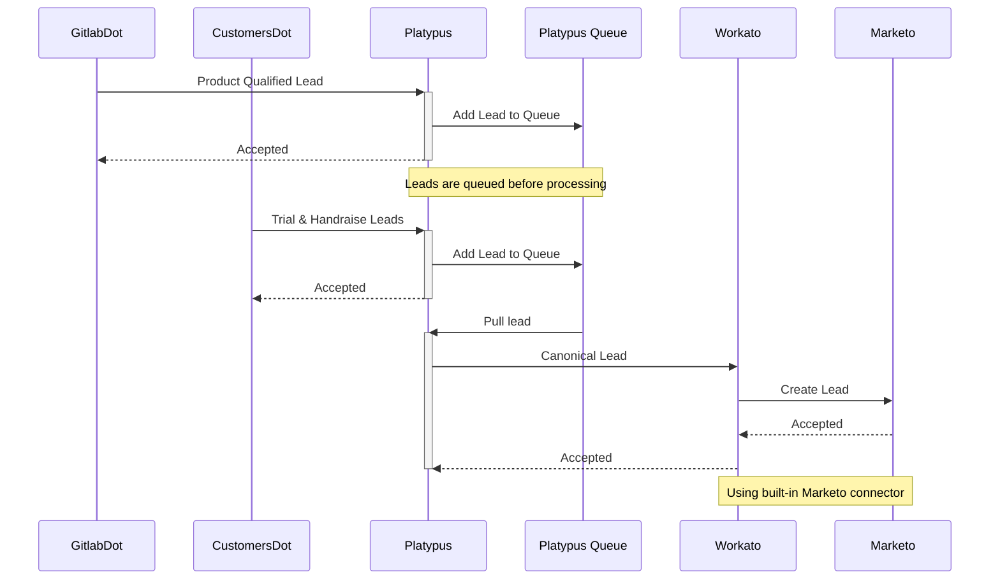

{::options parse_block_html="true" /}

<link rel="stylesheet" type="text/css" href="/stylesheets/biztech.css" />

## On this page
{:.no_toc .hidden-md .hidden-lg}

- TOC
{:toc .hidden-md .hidden-lg}

# Links

[Epic](https://gitlab.com/groups/gitlab-com/business-technology/enterprise-apps/-/epics/298)

# Connected Systems

- <https://gitLab.com> (source)
- <https://customers.gitlab.com> (source)
- Platypus (middleware)
- Workato (middleware)
- Marketo (destination)

# Summary

This integration is concerned with accepting different types of "Product Qualified" leads from the GitLab product and sending them on to Marketo. As of now they come in three different forms

1. Trial signups
   - These occur in CustomersDot
1. Handraise leads
   - These are potential customers who have requested that someone from sales contacts them
1. Product Qualified Leads
   - These are Gitlab.com users who have performed certain actions in the product that meet the threshold for being qualified leads

# Sequence

# Error handling

When leads fail to be created we post errors to the slack channel `#alerts_pql-sync`. Leads can be retried from the message queue.

# Data Model

[Source](https://gitlab.com/gitlab-com/marketing/marketing-operations/-/issues/4885#note_645100634)

| Marketo Friendly | Marketo REST API | Field Type | Value |
|------------------|------------------|------------|-------|
| First name | FirstName | String | variable |
| Last name | LastName | String | variable |
| Company name | Company | String | variable |
| Email | Email | Email | variable |
| Employees Bucket | Employee_Buckets**c | Employees**c | picklist range |
| Phone | Phone | Phone | variable |
| Country | Country | String | variable |
| State | State | State | variable |
| .com Trial Start Date | Trial_Start_Date**c | Date | variable |
| Setup for Company/Team Use | Setup_for_Company_Team_Use**c | Boolean | variable |
| Product Interaction | productInteraction | string | variable |

**Note:** These fields may become out of date, you can always see the up to date model in the [API documentation](https://production.ci.nexus.gitlabenvironment.cloud/docs/static/index.html#/Lead/LeadController_CreateLead) which is auto-generated from the actual running code in production.

# Security Components

1. `Gitlab.com` and `Customers.gitlab.com` both authenticate with Platypus using [OAuth2 Client Credentials](https://gitlab.com/gitlab-com/business-technology/enterprise-apps/integrations/platypus/-/wikis/Using-the-Platypus-API#authentication)
2. Platypus authenticates with Workato using [OAuth2 Client Credentials](https://docs.workato.com/api-mgmt/oauth2.html#request-access-token)
3. Workato Authenticates with Marketo using [OAuth2 Client Credentials](https://docs.workato.com/connectors/marketo.html#how-to-connect-to-marketo-on-workato)
4. All connections between systems are over HTTPS using TLS 1.3 Cypher and properly trusted certificates

# Data classification

This integration handles [Red Data](/handbook/security/data-classification-standard.html#red). The data is stored in the queue and processed by the system. We do not log this data to application logs

# Environments

| Environment | CustomersDot | GitLabDot  | Platypus                                                              | Workato             | Marketo    |
| ----------- | ------------ | ---------- | --------------------------------------------------------------------- | ------------------- | ---------- |
| Production  | Production   | Production | Production                                                            | Production          | Production |
| Staging     | Staging      | Staging    | Staging                                                               | Development/Testing | Sandbox    |
| Development | N/A          | N/A        | Local Dev & [Review Apps](https://docs.gitlab.com/ee/ci/review_apps/) | Development         | Sandbox    |
