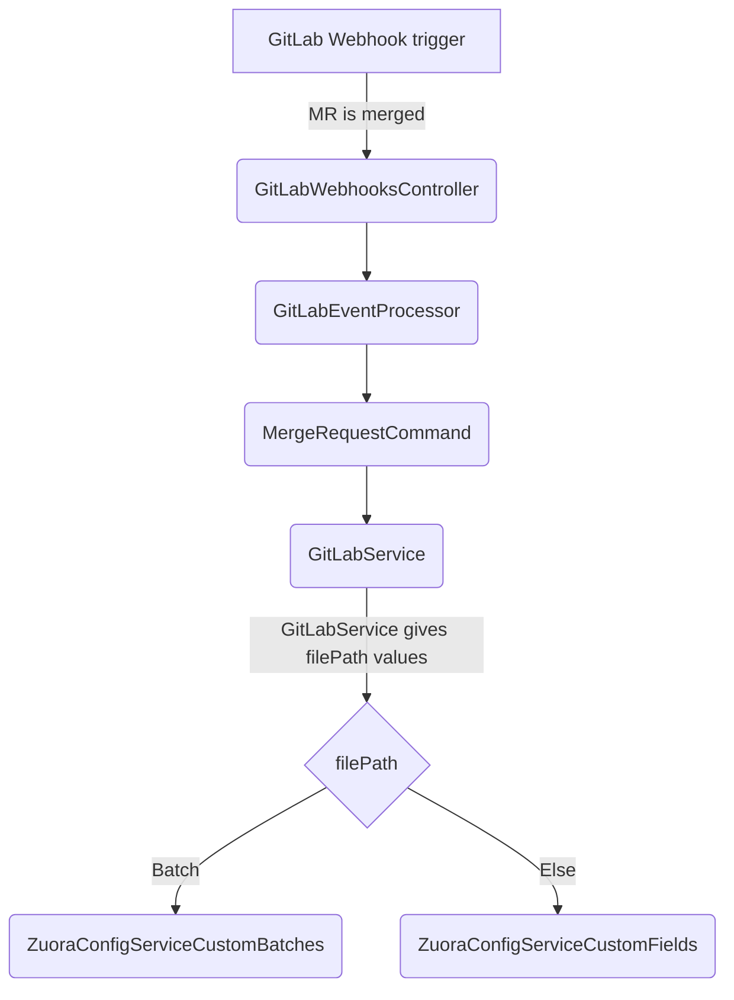

{::options parse_block_html="true" /}

<link rel="stylesheet" type="text/css" href="/stylesheets/biztech.css" />

## On this page
{:.no_toc .hidden-md .hidden-lg}

- TOC
{:toc .hidden-md .hidden-lg}

## Important Links:

- [Summary epic](https://gitlab.com/groups/gitlab-com/business-technology/enterprise-apps/-/epics/274)
- [Epic prioritizing settings](https://gitlab.com/groups/gitlab-com/-/epics/1532#priorities): Acceptance criteria.
- [Zuora Config Project](https://gitlab.com/gitlab-com/business-technology/enterprise-apps/financeops/zuora-config): Webhook picks up MR merged in this project.
- [Google sheet](https://gitlab.com/gitlab-com/business-technology/enterprise-apps/financeops/finance-systems/-/issues/574) contains the settings feasibility to be implemented through APIs.
- [UAT issue](https://gitlab.com/groups/gitlab-com/business-technology/enterprise-apps/integrations/-/epics/3)
- [Product catalog epic](https://gitlab.com/groups/gitlab-com/business-technology/enterprise-apps/integrations/-/epics/3)

## Zuora Config (GitLab Project):

This is a dedicated project to automate Zuora configurations and product catalog across Zuora orgs.
1. Each branch is equivalent to each Zuora org.
	1. dev -> api sandbox 1 and 2
	2. test -> central sandbox
	3. master -> production
2. New branch is created from the targeted org in which the setting change is required. E.g.: If a new custom field is to be created/updated in api sandbox, source = new branch is created from dev and target branch = dev. Similarly, to make changes in the central sandbox, source = new branch created from test and target = test.
3. Never merge an env branch into another as data in each branch is unique.
4. .yaml files in the base folder containing the settings information. In case of Product Catalog it has product and subsequent objects info. For configuration settings, it has custom fields listed for each of the object.
5. For product catalog:
	1. How to determine if it's a new product or existing:
		1. If the SKU file for that environment exists, then it's an update to an existing SKU
		2. If not, then it's a new SKU.
	2. Product names must be valid directory names (. not allowed) Like if Product Name is GitLab.com, it directory and .yaml file name would be GitLab_com.
	3. SKUs will be auto-generated by Zuora (and not user-generated)
	4. Products are directories
6. For settings api:
	1. Directory hierarchy is: Module folder (like Billing, payment) -> Settings folder (like Custom Batches, Custom Fields) -> Object name folder (like Account, Contact - only for custom fields).

### Assumptions for product catalog:

1. No two products will have same name.
2. There'll be no change in the product name once it's created.
3. Products are either created or updated, never deleted.
---

## Zuora CI-CD:

### Settings Implemented:

1. Custom Batches.
2. Custom Fields.

### Next in line:

1. Setup Profiles, Notifications and Email Templates

### Details:

- This [epics](https://gitlab.com/groups/gitlab-com/-/epics/1532#priorities) lists all the settings in the order of their priority.
**note**: There's one class for each setting for all the modules. In GitLab project, the settings are sub folders under module folders.
- Code repo: Platypus.
- Current phase: UAT in progress.
- Future possible dev: Implementation of settings next in the priority.

### Platypus Artefacts:

Here's the order in which the platypus classes are executed for Zuora CI-CD:

- Apart from these there are two d.ts involved: `gitlab.d.ts` and `zuora.d.ts` .
- BullBoard queue: gitlabEventQueue

### Possible Code changes to add new setting:

Next setting in line of priority is Setup Profiles, Notifications and Email Templates.
- [ ] Check the sheet for possible methods and validations.
- [ ] In Zuora Config project, create two new folder for the settings in each module - one for Setup Profiles and one for Notifications.

In nest-js code,
- [ ] Create new interfaces for  Setup Profiles and Notifications response.
- [ ] Create new classes for Setup Profiles and Notifications which extend `BaseZuoraBillingAPIService` like `ZuoraConfigServiceCustomFields`
- [ ] Add an elseif in `MergeRequestCommandHandler.execute` for `filepath` variable and call the respective classes for Setup Profiles and Notifications in `zuora.d.ts`

### Product Catalog:

- Code repo: Workato.
- Current phase: go-live done.
- Future possible dev: Front End to accept the change request.

### Workato Artifacts:

- Folder: Enterprise Apps/Integration Team/Zuora/Product Catalog
- Recipes involved in the order of their execution:
	- `Product Catalog - Webhooks to listen for Merge Request Changes` : Listener recipe for GitLab webhook.
	- `Product Catalog - Validate YAML file values` : Validate yaml format and check for field validations in Product, ProductRatePlan and ProductRatePlanCharge object. Fields involved are listed in the [google sheet](https://docs.google.com/spreadsheets/d/1OLCITDYKEh0kyL4U6h_EDAuKykgt34PcGe9lvPC71V0/edit#gid=532126520).
	- Based on the Merge Request target branch, each callable recipe is executed:
		- If dev, then `Product Catalog - Zuora dev Integration Callable Recipe`
		- If test, then `Product Catalog - Zuora test Integration Callable Recipe`
		- If prod, then `Product Catalog - Zuora prod Integration Callable Recipe`
	- There are some one-time recipes in an inactive state which are used to create yaml files for all the products for any org. The target org is controlled through property `zuora_product_prod_target_branch` .  They're used to create yaml files of all products in an org -> `Product Catalog - Call Create YAML File for All Products`  which calls internally `Product Catalog - Create YAML file in Gitlab`
