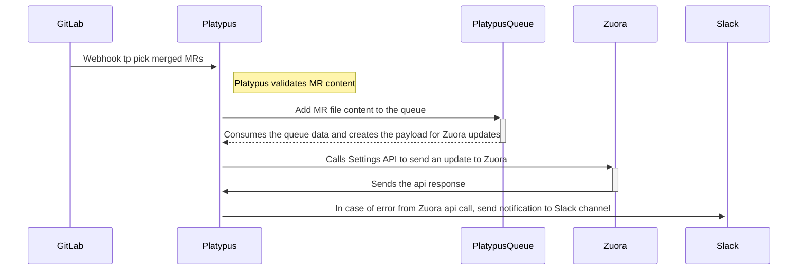

{::options parse_block_html="true" /}

<link rel="stylesheet" type="text/css" href="/stylesheets/biztech.css" />

## On this page
{:.no_toc .hidden-md .hidden-lg}

- TOC
{:toc .hidden-md .hidden-lg}

# Connected Systems

- GitLab (source)
- Platypus (middleware)
- Slack (notification)
- Zuora Billing (destination)

# Summary

This integration is responsible for automating the configurational changes via merge requests and propagating them in higher environments. The integration triggers when a merge request is approved and merged by Finance Admins. The changes are mentioned (and verified by Fin admin) in the .yaml files of the merge request. The code reads the yaml file, creates the payload for settings API and updates the configuration in the Zuora org.

There would be one branch for each of the environments like dev, test and master(prod) and setting branch in [Zuora-config](https://gitlab.com/gitlab-com/business-technology/enterprise-apps/financeops/zuora-config) project which will the source branch to the other ones.

# Sequence

# Data Model

## Product Catalog
Object hierarchy:

Source: https://docs.google.com/spreadsheets/d/1OLCITDYKEh0kyL4U6h_EDAuKykgt34PcGe9lvPC71V0/edit?usp=sharing

### Product

| YAML file Fields (Source) | Zuora Fields (Target) | Field Type | Optional |
|------------------|------------------|------------|-------|
| Name | Name | String | No |
| Description | Description | String | Yes |
| SKU | SKU | String | Yes |
| EffectiveStartDate | EffectiveStartDate | date | No |
| EffectiveEndDate | EffectiveEndDate | date | No |
| Category | Category | String | Yes |
| AllowFeatureChanges | AllowFeatureChanges | boolean | Yes |

### Product Rate Plan

| YAML file Fields (Source) | Zuora Fields (Target) | Field Type | Optional |
|------------------|------------------|------------|-------|
| Name | Name | String | No |
| Description | Description | String | Yes |
| Product ID | Product ID | String | Yes |
| EffectiveStartDate | EffectiveStartDate | date | Yes |
| EffectiveEndDate | EffectiveEndDate | date | Yes |
| Active Currencies | Active Currencies | String | Yes |
| Guided Selling | Guided Selling | string | Yes |
| Legacy Tier UI Display | Legacy Tier UI Display | string | Yes |
| PRP Category | PRP Category | string | Yes |

### Product Rate Plan Charge

| YAML file Fields (Source) | Zuora Fields (Target) | Field Type | Optional |
|------------------|------------------|------------|-------|
| Name | Name | String | No |
| ChargeType | ChargeType | String | No |
| Description | Description | String | Yes |
| ChargeModel | ChargeModel | string | Yes |
| MaxQuantity | MaxQuantity | integer | Yes |
| MinQuantity | MinQuantity | integer | Yes |
| UOM | UOM | integer | Yes |
| DefaultQuantity | DefaultQuantity | integer | Yes |
| ListPriceBase | ListPriceBase | string | Yes |
| BillCycleType | BillCycleType | string | Yes |
| BillingPeriod | BillingPeriod | string | Yes |
| BillingPeriodAlignment | BillingPeriodAlignment | String | Yes |
| BillingTiming | BillingTiming | String | Yes |
| SpecificBillingPeriod | SpecificBillingPeriod | string | Yes |
| TriggerEvent | TriggerEvent | string | Yes |
| AccountingCode | AccountingCode | string | Yes |
| DeferredRevenueAccount | DeferredRevenueAccount | string | yes |
| BundleID__c | BundleID__c | string | yes |
| SSPStratefier__c | SSPStratefier__c | string | yes |
| POBStratefier__c | POBStratefier__c | string | yes |
| AllocationEligibleFlag__c | AllocationEligibleFlag__c | boolean | yes |
| SSPEligibleflag__c | SSPEligibleflag__c | boolean | yes |
| RevenueRecognitionRuleName | RevenueRecognitionRuleName | string | yes |
| RecognizedRevenueAccount | RecognizedRevenueAccount | string | yes |
| UseDiscountSpecificAccountingCode | UseDiscountSpecificAccountingCode | string | yes |
| UpToPeriods | UpToPeriods | integer | yes |
| UpToPeriodsType | UpToPeriodsType | string | yes |
| NumberOfPeriod | NumberOfPeriod | integer | yes |
| OverageCalculationOption | OverageCalculationOption | string | yes |
| EndDateCondition | EndDateCondition | string | yes |
| LegacyRevenueReporting | LegacyRevenueReporting | string | yes |
| PriceChangeOption | PriceChangeOption | string | yes |
| DiscountLevel | DiscountLevel | string | yes |
| ApplyDiscountTo | ApplyDiscountTo | string | yes |
| RevRecCode | RevRecCode | string | yes |
| RevRecTriggerCondition | RevRecTriggerCondition | string | yes |
| UsageRecordRatingOption | UsageRecordRatingOption | string | yes |
| SmoothingModel | SmoothingModel | string | yes |
| PriceIncreasePercentage | PriceIncreasePercentage | number | yes |
| OverageUnusedUnitsCreditOption | OverageUnusedUnitsCreditOption | string | yes |
| IncludedUnits | IncludedUnits | integer | yes |
| UseTenantDefaultForPriceChange | UseTenantDefaultForPriceChange | boolean | yes |
| Taxable | Taxable | boolean | yes |
| TaxCode | TaxCode | string | yes |
| TaxMode | TaxMode | string | yes |

### Product Rate Plan Charge Tier

| YAML file Fields (Source) | Zuora Fields (Target) | Field Type | Optional |
|------------------|------------------|------------|-------|
| Currency | Currency | String | No |
| Price | Price | number | No |

## Custom Batch

| YAML file Fields (Source) | Zuora Fields (Target) | Field Type | Optional |
|------------------|------------------|------------|-------|
| batch | batch | String | No |
| displayName | displayName | string | No |

## Custom Fields

| YAML file Fields (Source) | Zuora Fields (Target) | Field Type | Optional |
|------------------|------------------|------------|-------|
| type | type | String | No |
| FieldAPIName | FieldAPIName | String | No |
| label | label | string | No |
| type | type | string | No |
| description | description | string | yes |
| maxLength | maxLength | integer | yes |
| default | default | string | yes |
| enum | enum | picklist | yes |
| format | format | string | yes |

# Approval Process
1. Changes follow the standard Change Management process. Requests come in as Issues in the Finance Operations project, approved by Zuora's business owner and then the change is provisioned in the system.
1. Merge Request created in [Zuora Config project](https://gitlab.com/gitlab-com/business-technology/enterprise-apps/financeops/zuora-config). Source branch created from product branch.
2. Yaml file validated and approved by Fin-sys-admins.
3. Merge request then merged into target environment - dev, test or master(prod)

# Error handling

When validation errors occur on the incoming data it will post to the `#finsys-integrations` slack channel which is monitored by the Finance System Admins to take action.

# Security Components

1. Platypus authenticates webhook requests using Gitlab token in headers.
2. All connections are over HTTPS

# Data classification

This integration handles and stores [Green Data](https://about.gitlab.com/handbook/security/data-classification-standard.html#green) (Config data)

# Environments

| Environment | Zuora Billing | Platypus                                                              | GitLab     |
| ----------- | ------------- | --------------------------------------------------------------------- | ---------- |
| Production  | Production    | Production                                                            | Production |
| Staging     | TBD           | Staging                                                               | Production |
| Development | Api Sandbox 1 | Local Dev & [Review Apps](https://docs.gitlab.com/ee/ci/review_apps/) | Production |
