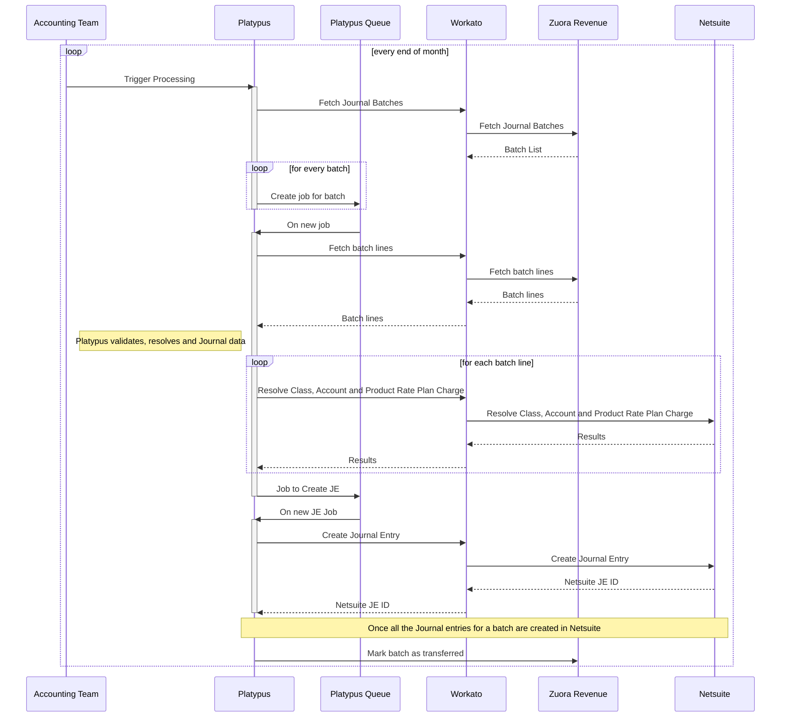
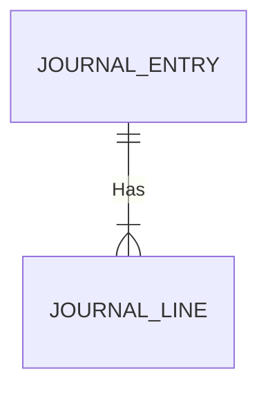

{::options parse_block_html="true" /}

<link rel="stylesheet" type="text/css" href="/stylesheets/biztech.css" />

## On this page
{:.no_toc .hidden-md .hidden-lg}

- TOC
{:toc .hidden-md .hidden-lg}

# Connected Systems

- Zuora Revenue (source)
- Platypus (middleware)
- Workato (middleware)
- Netsuite (destination)

# Summary

This integration is responsible for taking Zuora Revenue Journal Entries and creating Netsuite Journal Entries. This occurs monthly at the end of the month. The integration groups and summarises journal lines into Journal Entries whereby each Entity has `n` JEs depending on the grouping of the fields `GL Account Number` and `Product Rate Plan Charge`. Each resulting entry is summarised by summing the credit lines and separately summing the debit lines.

There are issues with rounding differences and decimal place expectations between systems so we had to solve that via the solution outlined in [this issue](https://gitlab.com/gitlab-com/business-technology/enterprise-apps/integrations/integrations-work/-/issues/115).

# Sequence

# Error handling

When validation errors occur on the incoming data from Zuora revenue we will post to `#alerts_revenue-accounting-integration` slack channel which is monitored by the Accounting Team.

When errors occur with issues downstream in Netsuite we will post to the `#finsys-integrations` slack channel which is monitored by the Finance Systems Administration team.

# Data Model

Each journal entry has many lines

| Zuora Revenue Field | Netsuite Field          | Canonical Field        |
| ------------------- | ----------------------- | ---------------------- |
| id                  | Source System Reference | Batch ID               |
| reference5          | Subsidiary              | Entity                 |
| currency_code       | Currency                | Currency Code          |
| memo                | Memo                    | Memo                   |
| reference9          | postingperiod           | Accounting Period Name |
| segment1            | Line > Account          | GL Account Number      |
| N/A*     | Line > Department       | Department             |
| accounted_dr        | Line > Debit Amount     | Accounted Debit        |
| accounted_cr        | Line > Credit Amount    | Accounted Credit       |
| reference8          | Line > Class            | Classification         |
| N/A†     | Line > Memo             | Line Memo              |

* Department is calculated from the GL Account Number ([relevant code](https://gitlab.com/gitlab-com/business-technology/enterprise-apps/integrations/platypus/-/blob/master/src/finance/accounting/commands/transfer-batch.command.ts#L91))

† This is always set to `REV_Revpro-GL`

# Security Components

1. Platypus authenticates with Workato using [OAuth2 Client Credentials](https://docs.workato.com/api-mgmt/oauth2.html#request-access-token)
2. Workato Authenticates with Zuora Revenue using a [custom built auth scheme](https://www.zuora.com/developer/revpro-api/#tag/Authentication)
3. All connections are over HTTPS

# Data classification

This integration handles and stores [Orange Data](https://about.gitlab.com/handbook/security/data-classification-standard.html#orange) (Accounting data)

# Environments

| Environment | Zuora Revenue | Platypus                                                              | Workato             | Netsuite   |
| ----------- | ------------- | --------------------------------------------------------------------- | ------------------- | ---------- |
| Production  | Production    | Production                                                            | Production          | Production |
| Staging     | TBD           | Staging                                                               | Development/Testing | Sandbox 2  |
| Development | Sandbox 1     | Local Dev & [Review Apps](https://docs.gitlab.com/ee/ci/review_apps/) | Development         | Sandbox 1  |
