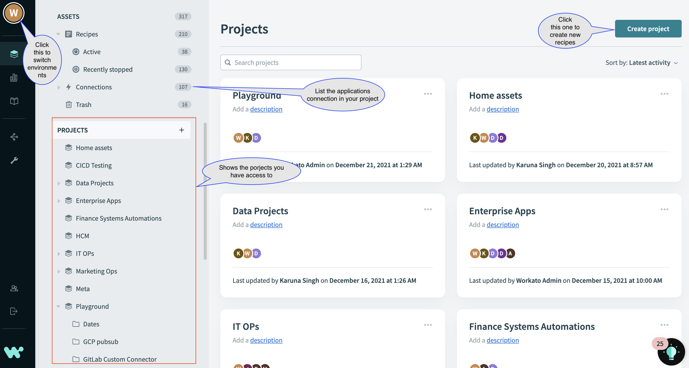
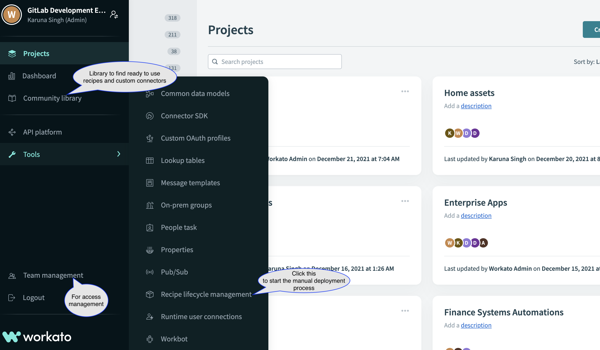

{::options parse_block_html="true" /}

<link rel="stylesheet" type="text/css" href="/stylesheets/biztech.css" />

## Integrations - Workato Playbook

### Support & Help Channel
Please join [#workato-community](https://gitlab.slack.com/archives/C02U9EW8KSS) on Slack to;
* Ask Questions
* Get help & advice with your integrations
* Hear about new Workato features
* Get tips and tricks from the integrations team and other Workato users at GitLab
* Hear about upcoming integrations programs

### How to request access?
To get started with Workato, please create an [access request](https://about.gitlab.com/handbook/business-technology/team-member-enablement/onboarding-access-requests/access-requests/#individual-or-bulk-access-request) and assign it to @dparker or @karuna16. In the AR, please include the following details:

- [ ] your orgnizational team
- [ ] Workato environment - dev, test or prod.
- [ ] why you require access (for production only)

#### Types of Roles/Access available in Workato:
Currently, we have two types of roles per team in Workato:
1. **Team Admin**: To Create, Edit, Deploy, Run/Stop recipes. Like Marketing Admin.
2. **Team Ops**: To view, run/stop recipes. Like Marketing Ops.

Please **note** that access is configurable per team and on a case by case basis.

#### Access Change Process:
To change your access privileges in Workato all environments, please open an [access change request](https://gitlab.com/gitlab-com/team-member-epics/access-requests/-/issues/new?issuable_template=Individual_Bulk_Access_Request) and assign it to @dparker or @karuna16. 
Please remember to mention the environment, if its for dev, test or prod.

### Getting Started with Workato
Once the AR is approved and closed, you'll see the Workato app on your Okta home page. _Please refresh the Okta home page, in case you cannot find the app_. There're 3 Workato apps in Okta for each of the environment, based on your request, you'll see those ones in Okta.

<details>
  <summary markdown="span">Click to view the screenshots</summary>

  Upon clicking the app, you'll be linked to the Workato home page. 

  If it's your first time logging into Workato, you may be prompted to set a password. Set a strong password and save it in your 1Password private vault. In the future you will not be prompted for this password so long as you use Okta to login to Workato. Once you're logged in, search for your team's project and click on it to see your team's recipes and to create new recipes.

  

  

</details>

##### Facing issue in Workato Okta App?
There's a common issue the users face while using the Okta SSO app for logging in any Workato workspace for the first time. On clicking the app, you're often redirected to password input page (as shown in screenshot below)


Here's a 3-Step process to self troubleshoot the issue, if you dont remember your password or have not set earlier ever:

1. Go to Workato users [signing page](https://app.workato.com/users/sign_in) and click forgot password.
2. You'll receive password reset e-mail. Click the link to create/change your password.
3. Use this one to login via Okta workspace app.

_Pro tip_ :zap:  Save this password in 1Password for future reference.

For any other login issue related queries, please use the slack channel [#workato-community](https://gitlab.slack.com/archives/C02U9EW8KSS)

### Workato Ramp-up programs
There are a number of short courses available on the Workato Automation Institution website for all levels of Workato experience - Beginner, Intermediate and Advanced. Select the course that best fits your level of experience with Workato and helps you learn what you need for your project. If you are unsure about which course to pick, contact the integrations team in `#bt-integrations` on Slack.

Here're are some of the course we recommend to get started with Workato:

<details>
  <summary markdown="span">Click to expand</summary>

  _Beginner level_: [Automation Pro I On Demand training](https://academy.workato.com/automation-pro-i-on-demand)

  Course helps you to understand:
  -  Basics of building blocks in Workato and their settings:
    - Recipes
    - Data mapping
    - Data transformations
  - Hands on exercises with scenarios to help understand the integration picture.

  _Intermediate level_: [Automation Pro II On Demand training](https://academy.workato.com/automation-pro-ii-revised)

  Course helps you to understand:
  - Advanced concepts to complete a working recipe. Like:
    - Error Handling
    - Conditional Actions (if/else)
    - What are properties and lookup tables?
    - Repeat Actions and Variables.
  - Hands on exercises with scenarios to help understand the integration picture.
  On course completion, you can opt for certification exam too.

  _Intermediate level_: [Recipe lifecycle management](https://academy.workato.com/recipe-lifecycle-management)

  Course helps you to understand:
  - Roles and access management in Workato
  - Deployment of recipes across environments
  - What are manifests and how you export and import them to deploy your code?
  - CI/CD Automation
  - Hands on exercises.
</details>


### Best Practices in Workato

While using Workato for building recipes, here are some basic best practices that would help you manage and track your work items easily. These are some of the basic points to keep in mind, especially if you're new to Workato. For more detailed information please visit the [Workato page](https://support.workato.com/en/support/solutions/folders/1000210065)

<details>
  <summary markdown="span">Click to expand</summary>

  1. #### Which workspace/environment to use?:
  Always create your folders, connections and recipes in dev workspace first. Once tested move your code to higher workspaces - test and prod using Workato's Recipe lifecycle management tool.

  2. #### Folder creation:
  It's best to create a playground folder in the project followed by a folder of your name if you're just playing around or learning to work in Workato. If you are creating recipes for actual project work, best to create a folder with project name. Say, if you integrating leads between Salesforce and Marketo, the folder name could be Lead integration.

  3. #### Naming and managing your recipes:
    1. Its best to use app names in recipes like [SFDC+QBO] New account in Salesforce. It helps to quick spot and sort them.
    2. Another handy way to manage recipes is to use the `New recipe` prefix while building the recipe, and when you have a successful recipe, change that to the intended name and delete the trial ones. You can easily track and delete the trial ones because of the 'New recipe' pre-fix.
    3. Clones: If you clone a recipe from some other user, your recipe gets the same name as the original. Keep in mind that when the original changes you don't get notified or updated.

  4. #### Adding desciptions and comments:
  Use in-step comments to add one-liner description to your steps to the recipe readable and understandable. Please refer the video on how to set the comments. 

  5. #### Setting up and managing App Connections:
    1. Naming the connection: Use meaningful names for connectors. Like instead of using Google Connection 1, Google Connection 2 use <your name> Google Proc Account and <your name> Google Test Account.
    2. Where to create the connectors? If you create the connection in `Projects > Home assets` anyone in the workspace can use them in their recipes. If you want your connection to be accessible only to you and your team, create them in your `Projects > Folder`. There is also a `Shared Connections` project that you can use to house shared connections.
    3. Avoid creating multiple connections with the same credentials. This too can be confusing, and when you are creating a recipe and linking it to a connection you are not sure if it is the right one you are connected to.
</details>


### How do I promote my recipes to production?
Currently, we're using Workato's `Recipe Lifecycle Management` tool to promote assets from one workspace to another. This is how you can promote what is built in `dev` to `prod` without needing to recreate it.

Also, we're in the process of locking down prod for any dev activities. Soon you won't be able to create or edit recipes in prod. In case, you need to move your recipes, please follow this step-by-step [guide](https://docs.google.com/document/d/1lo0ySrYwBmY0X_AwzJTDxXU5Bv5NWB8lYxoa_bAP-6s/edit?usp=sharing) on how you can create an issue request for prod deployments and assign it to the integration team.

Aside from that, we are actually going to be migrating to Workato Environments soon which further streamlines RBAC and the deployment process so that it's even easier than the `Recipe Lifecycle Management` that we have today. You can read more about it [here](https://www.workato.com/product-hub/democratize-change-management-with-environments/).

#### How to import and export deployment manifests?
Check out the [video](https://youtu.be/WfehKT5nnGo?t=365) to learn how to use `Recipe Lifecycle Management` to promote your recipes and other assets to Production.

#### Need help in designing recipes in workato?
Please reach out to us on [#workato-community](https://gitlab.slack.com/archives/C02U9EW8KSS) Slack channel with your business case and we can help you on design your recipe workflow and what all in Workato are available as an out-of-the-box solution and for what you require custom coding. 


<details>
  <summary markdown="span">Click to understand through a sample use case</summary>
  Problem statement: Generate monthly invoice email and send it to a group of recipients. The pdf is generated from a template with billing details fetched from google sheets. Also, send slack notification in the channel of invoice circulation. (members of slack channel are same as email recipients group)
  Solution Proposed: The recipe flow will look something like this:

  ```mermaid
graph TD
    A[Scheduled Trigger] -->|1st of every month| B(Source - Google drive connector)
    B --> |Read data from google sheets| C(Fill in data in Message Template)
    C --> |message template used in as email template| D(Use gmail connector to send bulk emails)
    D --> E(Slack connector to send message notification in channel)
```

</details>

### Coming soon...
Join the [#workato-community](https://gitlab.slack.com/archives/C02U9EW8KSS) Slack channel to hear more information about upcoming programs

#### 🚀 Soon to launch:
- Workato Champion Program
- Workato CI/CD automation
- Sample projects or plug-and-play solutions involving common GitLab applications.

