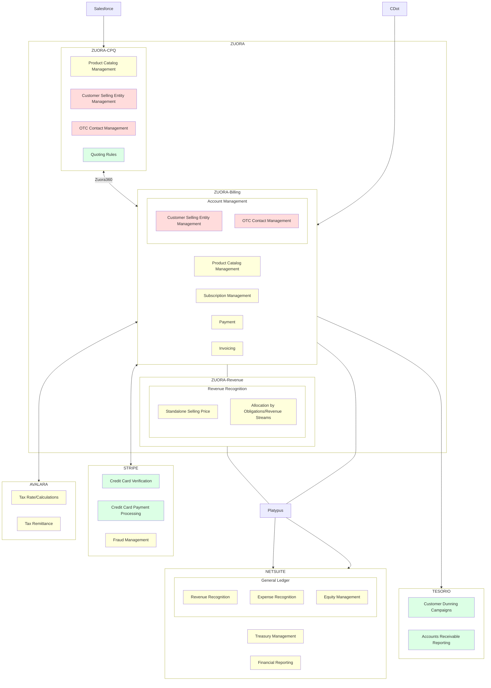

<link rel="stylesheet" type="text/css" href="/stylesheets/biztech.css" />

## On this page
{:.no_toc .hidden-md .hidden-lg}

- TOC
{:toc .hidden-md .hidden-lg}

{::options parse_block_html="true" /}

## Quote to Cash Introduction
The quote-to-cash (QTC) process encompasses customer account management, order fulfillment, billing, and accounts receivables functions. The coordination of this process is owned by the Enterprise Applications team and this handbook page is intended to be used as a table of contents for key documentation of this process. Some of the major applications that make up this process are listed below.

#### Salesforce
* Salesforce is used as our CRM tool for managing customer Leads, Contacts, Accounts, Opportunities and Quotes.
* Salesforce is owned by the [Sales Systems](/handbook/sales/field-operations/sales-systems/) team at GitLab, and implements changes from the process owners.
* The [Quoting process](/handbook/sales/field-operations/order-processing/#quote-configuration) itself is owned by the [Deal Desk team](/handbook/sales/field-operations/sales-operations/deal-desk/).

#### Zuora CPQ
* Zuora CPQ is our Configure, Price, Quote tool used for Sales Assisted deals
* Zuora CPQ is a managed package in Salesforce that has been extended for Quote Approvals by [Sales Systems](/handbook/sales/field-operations/sales-systems/)
* The [Quote Approval process](/handbook/sales/field-operations/order-processing/#standard-quote-approval) itself is owned by the [Deal Desk team](/handbook/sales/field-operations/sales-operations/deal-desk/).

#### Zuora 360
* Zuora 360 is a stock connector between Zuora and Salesforce, is transfers Zuora subscription information to Salesforce.
* Zuora 360 the job is owned by [Enterprise Applications](/handbook/business-technology/enterprise-applications/), the extension of Zuora Subscription data in Salesforce for Add-ons and Renewals deal is owned by [Sales Systems](/handbook/sales/field-operations/sales-systems/).
* The [Add-On](/handbook/sales/field-operations/sales-operations/deal-desk/#amend-subscription-quote) and [Renewal](/handbook/sales/field-operations/sales-operations/deal-desk/#renew-subscription-quote) processes are owned by the [Deal Desk team](/handbook/sales/field-operations/sales-operations/deal-desk/).

#### Zuora Billing
* Zuora is used as our billing and revenue tool for managing customer subscriptions, payments and invoicing.
* Zuora is owned by the [Enterprise Applications](/handbook/business-technology/enterprise-applications/) team at GitLab.
* The Billing process itself is owned by the [Billing Operations](/handbook/finance/accounting/finance-ops/billing-ops/) team

#### Zuora Revenue
* Zuora Revenue is our automated revenue recognition application that meets current and future U.S. GAAP, including the new ASC 606 and IFRS 15 revenue standards.

#### CustomersDot (Customer Portal)
* CustomersDot is used when the customer logs in to manage their subscriptions
* GitLab engineers created CustomersDot and it is owned by the [Fulfillment team](/handbook/engineering/development/fulfillment/)
* CustomersDot integrates with Zuora to enable self-service purchasing and subscription management

#### NetSuite
* NetSuite is the company Enterprise Resource Planning (ERP) system, which is primarily managed by the Finance team.
* The platform allows enhanced dimensional reporting as well as multi-currency and multi-entity reporting. This is where the General Ledger resides and all financial activity is ultimately recorded, which is critical to reporting the financial health of the company.

{::options parse_block_html="true" /}

## Enterprise Systems Architecture

{::options parse_block_html="false" /}

## Lead to Cash Flow

<b>Business Process</b>

<b>Supporting System</b>

<b>Supporting Team</b>

<b>Market</b>

Demand Gen Effort (Marketo)

Marketing Ops

Trial (Home Grown Application - Ruby on Rails)

Fulfillment Engineers

<i class="fas fa-arrow-down"></i>

<b>Sell</b>

Digital Purchase Path

Order Form Purchase Path

Sales Ops/ Deal Desk

CustomerDot

Sales Cycle (SFDC)

Sales Systems

Contract (Salesforce, Zuora CPQ, DocuSign)

Fulfillment Engineers

<i class="fas fa-arrow-down"></i>

<b>Bill</b>

Zuora Subscription Lifecycle Management

Billing

Zuora Billing

Finance

Rev Rec (Netsuite)

Enterprise Apps

<i class="fas fa-arrow-down"></i>

<b>Fulfill</b>

License (Home Grown Application - Ruby on Rails)

Fulfillment Engineers

<i class="fas fa-arrow-down"></i>

<b>Maintain</b>

Support (Zendesk)

Support Team

Monitor (Home Grown Application "Version & SeatLink" - Ruby On Rails)

Fulfillment Engineers

Digital Renewal

Order Form Renewal (SFDC, Z-CPQ, DocuSign)

See Sell

## Process Flow Diagrams

#### Sales-Assisted: New Subscription

<iframe allowfullscreen frameborder="0" style="width:720px; height:480px" src="https://lucid.app/documents/embeddedchart/0f691079-8ee9-4663-84d7-6d03e7f87ed8" id="PNs5p_JZW4yg"></iframe>

#### Sales-Assisted: Renewal

<iframe allowfullscreen frameborder="0" style="width:720px; height:480px" src="https://lucid.app/documents/embeddedchart/5243568d-6c04-4c52-a14c-ea3c5bf42ac0" id="gx25Mg96427t"></iframe>

#### Zero Touch: New Subscription

<iframe allowfullscreen frameborder="0" style="width:720px; height:480px" src="https://lucid.app/documents/embeddedchart/09ac03f9-ae40-4bbd-961c-f64bb44f5b4f" id="KWs5ZPs-THoH"></iframe>

## Entity Relationship Diagrams

- [Zuora Billing](./entity-relationship-diagrams#zuora-billing)
- [CustomersDot (Customer Portal)](./entity-relationship-diagrams#customersdot-customer-portal)
- [GitLab](./entity-relationship-diagrams#gitlab)

### Quote to Cash Systems Field Mapping

[This spreadsheet](https://docs.google.com/spreadsheets/d/1D159Osv6JvQtlHm2Bpekn8ADOWUfgcdszf_pewERBy0/edit#gid=769890791) provides a mapping of fields from the data models of Zuora Billing, CustomersDot and GitLab.  This document highlights some of the overlap and dependencies between the systems currently.

## Contact Us
### Slack Channels
- `#enterprise-apps`
- `#business-technology`
- `#bt-finance-operations`
- `#financesystems_help`
- `#bt-integrations`

### GitLab Issues

  <a href="https://gitlab.com/gitlab-com/business-technology/business-technology/-/issues/new" class="btn btn-purple-inv" style="width:33%;height:100%;margin:1px;display:flex;justify-content:center;align-items:center;">Business Systems Analysts</a>
  <a href="https://gitlab.com/gitlab-com/business-technology/enterprise-apps/integrations/issue-tracker/-/issues/new" class="btn btn-purple-inv" style="width:33%;height:100%;margin:1px;display:flex;justify-content:center;align-items:center;">Integrations Engineering</a>
  <a href="https://gitlab.com/gitlab-com/business-technology/enterprise-apps/financeops/finance-systems" class="btn btn-purple-inv" style="width:33%;height:100%;margin:1px;display:flex;justify-content:center;align-items:center;">Finance Systems</a>
