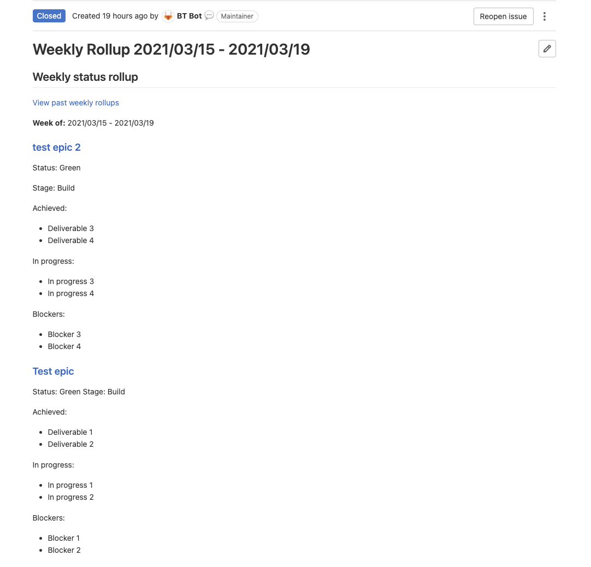

<link rel="stylesheet" type="text/css" href="/stylesheets/biztech.css" />

## On this page
{:.no_toc .hidden-md .hidden-lg}

- TOC
{:toc .hidden-md .hidden-lg}

{::options parse_block_html="true" /}

## Problem
When the team undertakes large programs of work, it becomes cumbersome to do weekly status rollups to the department heads and e-group. This is especially difficult when the program involves multiple teams and departments with totally different workflows. 

## How does Rolly work?
Rolly is an automated tool which extracts key status information from project/program epic descriptions, and compiles them into one issue. It runs every Monday morning at 12am PST. 

### But how does Rolly really work?
1. Rolly searches the group with the ID provided in the config `groupId` for all epics with the label `label`.
1. For each epic's description, Rolly extracts the markdown in between the tokens `extractStatusStart` and `extractStatusEnd`.
    ```
    # My heading

    <!-- Status Start -->
    This part of the epic description would be extracted to be part of the rollup issue.
    The tokens that delimit this area are configurable.
    <!-- Status End -->

    This part of the description would not be included in the status rollup since it's outside of the extract tokens.
    ```
1. Rolly creates an issue in the project with ID `rollupProjectId` with the combined status updates in the description, plus some additional information.
1. The text from `tags` is appended to the bottom of the description, and the issue is labelled with `rollupLabel`.
1. Rolly will find all open issues with the tag `rollupLabel` in the project with ID `rollupProjectId` and close them so that the new one is the only open status issue.
1. Any errors that occur will be reported by email to the email addresses listed in `errorEmails`, as well as to the BT Integrations Engineering team.

#### Example Rollup Issue


### Where does Rolly live?
The main logic for Rolly lives in the BT Enterprise Apps Workato production instance. The configuration for Rolly lives in [this project](https://gitlab.com/gitlab-com/business-technology/enterprise-apps/integrations/rollup-bot-configuration).

## Can I use Rolly for my projects?
YES!! Rolly is open for use by anybody.

### How do I use Rolly?
Configuring Rolly is pretty straightforward:

1. Submit an MR with your configuration added to the yaml file in [rollup-bot-configuration](https://gitlab.com/gitlab-com/business-technology/enterprise-apps/integrations/rollup-bot-configuration/-/blob/master/rollupconf.yml).
2. Make sure that `@bt_bot` has at least `Reporter` access to all the groups that house your epics, and that it also has at least `Reporter` access to your status rollup project in order to create issues.

### I need help configuring Rolly
For assistance with Rolly, please reach out to the BT Integrations Engineering team in the [#bt-integrations](https://gitlab.slack.com/archives/C015U7R5XJ8) slack channel.

## FAQs
### Can I configure Rolly to run at a different time each week?
You can configure Rolly to run on any day of the week in the configuration yaml file, but it will always run at 12am PST on that day. We may add support for custom times in the future.

### Can Rolly fetch status updates from issues instead of epics?
No, unfortunately Rolly only fetches status updates from epics at this time.

### Can Rolly fetch status updates from multiple top-level groups in a single status rollup?
No, Rolly will only fetch epics from one parent group at the moment, if you would like to setup rollups for both `gitlab-com` and `gitlab-org` epics, you will need to create 2 separate Rolly configurations, which will generate 2 issues each week.

### What happens if Rolly fails to run?
Rolly will contact the integrations engineering team when it errors during execution, and can also be configured to contact you. You can configure the error contact emails in the Rolly configuration yml file found [here](https://gitlab.com/gitlab-com/business-technology/enterprise-apps/integrations/rollup-bot-configuration/-/blob/master/rollupconf.yml).

### Who built Rolly?
Rolly was built by [@dparker](https://gitlab.com/dparker) and [@lisvinueza](https://gitlab.com/lisvinueza) from the Business Technology team at GitLab.
