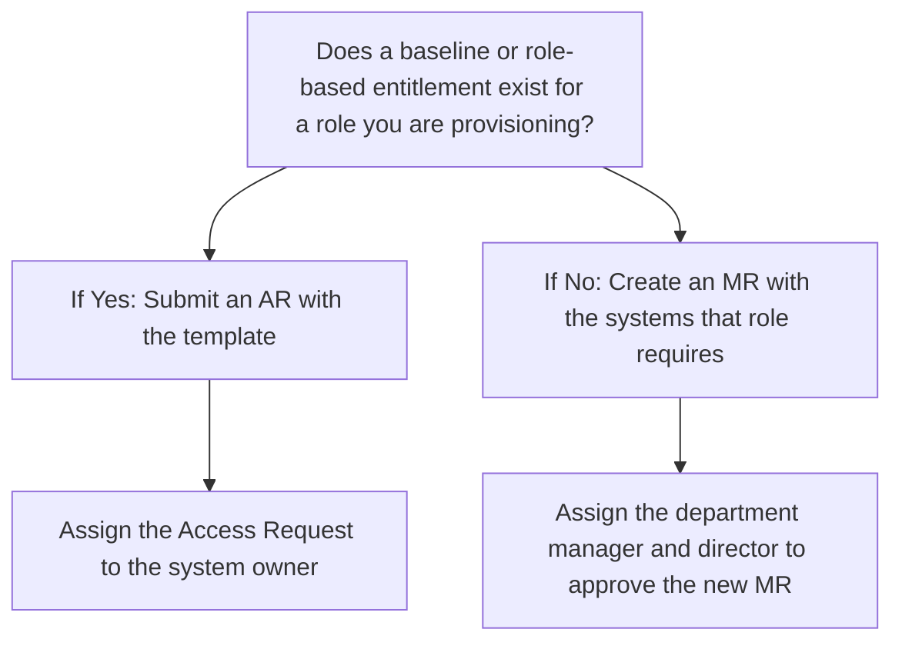

## On this page
{:.no_toc .hidden-md .hidden-lg}

- TOC
{:toc .hidden-md .hidden-lg}

# Baseline Role-Based Entitlements

## Policy, documentation and more detailed information

### Baseline Role-Based Entitlements Access Runbooks & Issue Templates

The goal of baseline and role-based entitlements is to increase security while reducing access management complexity by moving towards [role-based access control](https://csrc.nist.gov/projects/role-based-access-control).
The basic idea is that if we configure all of our systems for access based on the specific [job families](/handbook/hiring/job-families/) that require access to each system, then as we scale we can simply add new GitLab team-members to these pre-defined groups and system-level access will be granted automatically.
The difficult part in this implementation is accurately defining the access each role should have and collecting/maintaining all related approvals.
The GitLab solution to this challenge is to use baseline and role-based entitlements.
These entitlements define what systems each role should have access to and to pre-approve access to those systems so provisioning can be sped up.
Okta will be a huge help in this process as we continue to build out that tool, but these baseline entitlements can still define pre-approved access to systems not managed by Okta.
Baseline and role-based entitlements can also help automate access reviews since we will have a solid source of truth for what access should exist for each role and which GitLab team-members should be a part of each role.

The basic workflow for using a baseline or role-based entitlement is:



The hope with the above workflow is that everyone will contribute to the creation of the baseline and role-based entitlements and they will be prioritized based on how frequently the roles have access provisioned for them. The other benefit of this approach to access is that each access request template for the specific baseline or role-based entitlement role can have very specific instructions and links.

- For certain roles, role-based entitlement templates have been created and can be used during onboarding. [A list of all the roles that have templates](https://gitlab.com/gitlab-com/team-member-epics/access-requests/-/tree/master/.gitlab/issue_templates/role_baseline_access_request_tasks) can be found on the Access Request project.

- The [directory `issues_templates`](https://gitlab.com/gitlab-com/team-member-epics/access-requests/tree/master/.gitlab/issue_templates) in the Access Request project is used to document the configuration and approvals for the baseline and role-based entitlements. Any changes to these approved configurations require the approval of the management groups outlined in each of the runbooks with the [exception of Functional vs Non-Functional changes](/handbook/business-technology/team-member-enablement/onboarding-access-requests/access-requests/baseline-entitlements/#exception-process). 

- Role-based entitlement templates should be maintained accordingly, based on the speicifc requirements documented in the [Access Management Policy](https://about.gitlab.com/handbook/security/access-management-policy.html#role-based-access-control-rbac-requirements). These templates are utilized internally by Security Compliance and externally by External Auditors when assessing access management controls and procedures at GitLab.

#### Baseline Entitlements (All GitLab team-members):

100% of team-members should have access to the following systems at the following levels of access as part of their work at GitLab.
This list has been pre-approved so if any team-member needs access to these systems they can reach out directly to the [system admin(s)](https://gitlab.com/gitlab-com/www-gitlab-com/-/blob/master/data/tech_stack.yml) and request access based on this pre-approval.

| System Name                      | Business Purpose                                    | System Role (What level of access)                                         | Permissions Assigned within Role |
| -------------------------------- | --------------------------------------------------- | -------------------------------------------------------------------------- | -------------------------------- |
| 1Password                        | User Password Management                            | Team Member                                                                | Read+Write                       |
| BambooHR                         | Human Resource Platform                             | Employee, Manager (if people manager)                                                                    | Read+Write                       |                              
| CultureAmp                       | Survey Management                                   | User                                                                       | Read+Write                       |
| EdCast                           | Structured and personal learning experiences        | User                                                                       | Read-Only                        |
| Expensify                        | Expense Claims and Management                       | User                                                                       | Read+Write                       |
| GitLab.com                       | GitLab Application for Staff                        | Developer role in gitlab-org and gitlab-com groups                         | Read+Write                       |      
| Grafana                          | GitLab Dashboard                                    | User                                                                       | Read-Only                        |
| Greenhouse                       | Recruiting Portal                                   | Basic                                                                      | Read+Write                       |
| Google Workspace                 | Email, Calendar, and Document sharing/collaboration | GitLab.com Org Unit                                                        | Read+Write                       |
| Jamf                             | Apple Device Management Tool                        | User                                                                       | Read-Only                        |
| Modern Health                    | Employee Assistance Program                         | Employee                                                                   | Read-Only                        |
| Navex Global                     | LMS Training tool                                   | Employee                                                                   | Read-Only                        |
| Okta                             | Identity and Single Sign On                         | User                                                                       | Read-Only                        |
| PTO by Deel            | PTO tool                                            | User                                                                       | Read+Write                       |
| TripActions                      | Travel booking                                      | Employee                                                                   | Read+Write                       |
| Slack                            | GitLab async communications                         | Member                                                                     | Read+Write                       |
| Sisense (Periscope)              | Data Analysis and Visualisation                     | User                                                                       | Read-Only                        |
| Will Learning                    | Staff Training and Awareness Portal                 | User                                                                       | Read-Only                        |
| YouTube                          | Video sharing platform                              | User                                                                       | Read+Write                       |
| Workday                          | Human Resource Platform                             | Employee, Manager (if people manager)                                                                       | Read+Write                       |
| ZenDesk (non US Federal instance | Customer Support - Incident Management              | [Light Agent](/handbook/support/internal-support/#viewing-support-tickets) | Read+Write                       |
| ZenGRC                           | Governance, Risk, and Compliance tool               | ZenGRC `Reader` role                                                       | Read-Only                        |
| Zoom                             | For video conferencing / meetings                   | Pro                                                                        | Read-Only                        |
| Authomize                        | User Access Review tool                             | Reviewer                                                                   | Read + Write for assigned campaigns |
| OneTrust Vendorpedia                      | RFx Tool                                            | Answerbase General Users | Read-Only |

## Role Entitlements for a specific job

The goal of baseline and role-based entitlements is to increase security while reducing access management complexity by moving towards role-based access control. The basic idea is that if we configure all of our systems for access based on the specific job families that require access to each system, then as we scale we can simply add new GitLab team-members to these pre-defined groups and system-level access will be granted automatically.

Find a list of all our current role based entitlement in the [Access Request project](https://gitlab.com/gitlab-com/team-member-epics/access-requests/-/tree/master/.gitlab/issue_templates/role_baseline_access_request_tasks) and more information on the automation process in the ["Access Requests issues" handbook page](/handbook/people-group/engineering/onboarding/#access-request-issue-creation) of the People Group.

### **Instructions**

#### How do I create a Role Based Entitlement Template?

There are two ways to go about creating a new role-based entitlement template:

1. Copy an existing one and add/remove stuff as needed
1. Start one from scratch

The instructions below mention how to create one from scratch but read through them as they will also help answer any questions on how the format of the templates should be.

#### Approval Process

Before you get started, please keep in mind there is an approval process for adding new templates.
The following people need to review and approve the template before it can be merged:

1. The template needs to be approved by a manager or higher from the department the role belongs to. If the manager is creating the baseline entitlement, an explicit approval from a higher level is required to ensure the permissions included in the baseline entitlement are appropriate.
1. The level of permission  you are requesting access to needs to be approved by the technical owner of the system. You can find a list of the technical owners of each system in our [tech stack](https://gitlab.com/gitlab-com/www-gitlab-com/-/blob/master/data/tech_stack.yml).
1. If the role you are requesting access to is Admin of a system, security compliance (@gitlab-com/gl-security/security-assurance/sec-compliance) also needs to approve the request. Non-admin access doesn't need to be reviewed by Security.
1. Once the MR has been approved by all the relevant parties, you can tag @gitlab-com/business-technology/team-member-enablement on the MR for a format review and merge.

#### Note

- If you cannot find a template for a role in [this list](https://gitlab.com/gitlab-com/team-member-epics/access-requests), please create one by following this format `role_"name_of_the_role".md` (example: `role_backend_engineer.md`) and place it in the correct department directory. The title needs to match a valid title in BambooHR (don't include seniority level). You can find the directories and templates [here](https://gitlab.com/gitlab-com/team-member-epics/access-requests/-/tree/master/.gitlab/issue_templates/role_baseline_access_request_tasks).

- **For engineering roles or roles with a specialty:** The Access Requests are created on a role level and can be created for the specialty level as well. For example if you have a person with the role `Senior Frontend Engineer, Secure`. The code will look for two templates: `role_frontend_engineer.md` and `role_frontend_engineer_secure.md` and combine both of them into 1 access request for the new team member. You don't have to have both templates created, it depends on what your needs are. In this example, the `role_frontend_engineer.md` template should be a catch-all for all access needed by _**all**_ Frontend Engineers, regardless of seniority and specialty. Create a separate specialty template if your team members need more access depending on the team they are a part of.

- If there's no directory for your department created yet, you can add this as well. Make sure it's in the following format: `department_"name_of_department"` (example: `department_business_operations`)

- A template to get you started can be found [here](https://gitlab.com/gitlab-com/team-member-epics/access-requests/-/tree/master/.gitlab/issue_templates/role_baseline_template.md)

#### Instructions

1. If Region or Public SSH key are relevant to the role you are creating the template for, please keep that information in the template, otherwise remove it.
1. Under `Provisioners only section`, please include all the tools that need to be provisioned under the different teams that need to provision them. You can find the provisioners for the different tools in our [tech stack](https://gitlab.com/gitlab-com/www-gitlab-com/-/blob/master/data/tech_stack.yml). For example:

    ```
    #### IT to-do:
    * [ ]  `name of tool`: `level of access or group/project that needs to be accessed by team member`

    #### Sales to-do:
    * [ ]  `name of tool`: `level of access or group/project that needs to be accessed by team member`

    #### PeopleOps to-do:
    * [ ]  `name of tool`: `level of access or group/project that needs to be accessed by team member`
    ```

3. Under `Do Not Edit Below`, please include the role of the Director or Senior Leader and Manager who will be approving the template creation and changes.

    ```
    Changes to permissions must be approved and reviewed by:
       - Director of `Department`
       - `Team` Manager

    Changes to permissions must be reviewed by:
       - Security Manager, Security Operations
     ```

4. As a last step, please make sure your template includes the `/confidential` quick action and labels for the different teams/tools/level of access included in the template (find list below). Do not remove the labels that are already part of the template. Also, make sure to assign provisioners to the template after the `/assign` quick action. You can find the different provisioners for each tool in the [tech stack](https://gitlab.com/gitlab-com/www-gitlab-com/-/blob/master/data/tech_stack.yml)

    ```
    /confidential
    /label  ~"NewAccessRequest" ~"ReadyForProvisioning" ~"AR::2-backlog" ~"AR-Approval::Manager Approved"  ~"BaselineEntitlementAR"
    /assign
    ```

Labels for different teams:

- Data: `~"data::to do"`
- Finance: `~"finance::to do"`
- Infrastructure: `~"infra::to do"`
- IT: `~"IT::to do"`  `~"IT-OPs" `
- Legal: `~legal::to do"`
- Marketing Ops: `~"mktg::to do"`
- People Ops: `~"peoplesops::to do"`
- Product/Engineering: `~"prod+eng::to do"`
- Sales Ops:  `~"To Do - SalesOPS"`
- Security: `~"security::to do"`
- Support: `~"support::to do"`

Labels for different tools:

- `~"ZoomPro"`

Labels for admin level access:

- `~"admin-access"`

### Updating existing Role Based Entitlement templates system access

Once a Role Based Entitlement template has been created and approved by all authorized team members, any access modification will require the same approval process workflow for creating a Role Based Entitlement template with the [exception of Functional vs Non-Functional changes](/handbook/business-technology/team-member-enablement/onboarding-access-requests/access-requests/baseline-entitlements/#exception-process).

#### Role Based Entitlements - information for managers

Role based entitlements are pre-defined groups and system-level access that are granted automatically to team members depending on their role. Role based entitlements Access Requests are created automatically for a new team member on their second day at GitLab **_if_** a template exists for their role. We recommend creating a template for all the roles that you are currently hiring for so the new team member's onboarding is as smooth as possible. You can create a new template for any role following [these instructions](/handbook/business-technology/team-member-enablement/onboarding-access-requests/access-requests/baseline-entitlements/#how-do-i-create-a-role-based-entitlement-template). These templates need to include the tools/systems that all people in a role should get access to and nothing should be added/removed when creating a new issue.

If you haven't created a role based entitlement template for a role you are hiring for, you'll need to manually create a [Single Person Access Request](https://gitlab.com/gitlab-com/team-member-epics/access-requests/-/issues/new?issuable_template=Individual_Bulk_Access_Request) for your new hire.

#### How can I create a new AR using a baseline template? 

Please use the following steps only in the following situations: A new team member is onboarding and their access request wasn't created OR a current team member is moving to another position internally 
{: .alert .alert-gitlab-orange}

All existing role based entitlement templates can be found in [this list](https://gitlab.com/gitlab-com/team-member-epics/access-requests/-/tree/master/.gitlab/issue_templates/role_baseline_access_request_tasks). The templates are organized by department. Once you have found the template you would like to use:

1. Open it and then click on `Edit` at the top of the file.
1. Copy all the contents of the file
1. Click on the `Cancel` button at the bottom of the page
1. Navigate to `Issues` and [create a new issue](https://gitlab.com/gitlab-com/team-member-epics/access-requests/-/issues/new) in the Access Request project.
1. Select from the template dropdown the option: [role_baseline_access_request](https://gitlab.com/gitlab-com/team-member-epics/access-requests/-/issues/new?issuable_template=role_baseline_access_request)
1. Paste at the bottom the contents you copied in the second step and remove the section that says: `<!-- include: role_tasks -->`
1. Fill out the personal details information in the template.
1. Submit the issue and make sure to add the issue to the new team member epic which should have been created during onboarding
1. Be sure to assign the issue to the provisioners

## Instructions for Role Based Entitlement review
1. Once the Team Member Enablement team is mentioned in a role based entitlement for review, the first step is to make sure the role is added to the right folder. All Role Based Entitlements should be added to the path `.gitlab/issue_templates/role_baseline_access_request_tasks/` under the correct department for the role. Example: `.gitlab/issue_templates/role_baseline_access_request_tasks/department_people_success/role_people_group_fullstack_engineer.md` this is the path for the Role: `People Group Fullstack Engineer`, `Department: People Success`.
    - A report can be requested from Total Rewards with the roles we currently have and the departments they belong to if you are unsure where each role falls. The role and department should match what exists in BambooHR.
1. All role based entitlements need to follow the same format. A [template](https://gitlab.com/gitlab-com/team-member-epics/access-requests/-/blob/master/.gitlab/issue_templates/role_baseline_template.md) can be found in the access request project for guidance. The automation won't work unless the proper format is followed.
1. Make sure all systems listed in the template include the System Name and the roles/groups/projects that access is being requested to.
1. Make sure that the team member has requested permission from all the Technical Owners of the systems. This isn't something that Team Member Enablement should do, it should be done by whoever is creating the template.
1. Make sure that the template has been approved by the Director of the department the role belongs to with the exception of Functional vs Non-Functional changes.
1. As a last  step, make sure the labels being added to the template are correct and follow the guidelines outlined in Step 4 of the [instructions](https://about.gitlab.com/handbook/business-technology/team-member-enablement/onboarding-access-requests/access-requests/baseline-entitlements/#instructions-1) above.
1. Keep in mind that if you commit a change to the template, you won't be able to approve it. It is recommended that you add [suggestions](https://docs.gitlab.com/ee/user/discussions/#suggest-changes) to templates instead of committing changes yourself.

## Exception Process
Occasionally changes need to be made to Role Based Entitlement templates that do not require Manager/Director review and approval. Changes are currently being classified as Functional vs Non-Functional changes. **Functional Changes will still follow the normal approval process.**

#### Functional Changes
**Please note that Functional Changes will still follow the normal approval process.**
Functional changes are currently being defined as changes impacting the access levels being granted for a role. A few examples of Funtional changes are:
* New system access is being granted (Role did not previously have access)
* New role access is being granted (Role has existing access to a system but access role is being changed)
    * Role change from `User` to `Auditor`
* Elevated acess is being granted (Role has existing access to a system and will not have elevated access)
    * Role change from `User` to `Admin` or `Read-Only Admin`

#### Non-Functional Changes
Non-Functional changes are currently being defined as changes that do not have impact to a role's access. A few exmaples of Non-Functional changes are:
* Updating a slack channel name
* Process Ownership change (System ownership changing from one team to another team)
* Updating tagged Provisioners/Deprovisioners/Business Owners
* Updating the template format

**For Non-Functional Changes, approval from Manager/Director is not needed.**

#### **Questions**

Start an MR and tag the Business Systems Analysts (@gitlab-com/business-technology/enterprise-apps/bsa) or reach out to us in #business-technology
