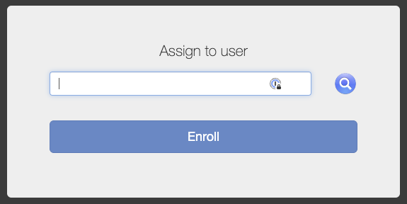

## On this page
{:.no_toc .hidden-md .hidden-lg}

- TOC
{:toc .hidden-md .hidden-lg}

# Jamf endpoint management technology

## What is Jamf?

Jamf is an Apple device management solution used by system administrators to configure and automate IT administration tasks for macOS, iOS, and tvOS devices. The current project will focus solely on macOS devices. All macOS devices used by GitLab Team Members for the purposes of fulfilling the responsibilities of their role as a GitLab Team Member are required to be enrolled and managed by Jamf.

## Why Jamf?

Jamf was selected as a best option that covered our list of requirements:

1. Lightweight agent with minimal compute footprint
1. Ability to lock & wipe the laptop remotely
1. Security management policies - Disk encryption, password strength
1. Schedule OS & software installation and updates
1. Receive non-compliant endpoint notifications
1. SSO support
1. Hardware health status (battery and harddrive health)
1. Report serial number, model/type. enumerate hardware and OS version
1. Enumerate installed software (+browser extensions)
1. Software management
1. Log data on user logins, IP address and machine info
1. Allow users to see what's being collected

# Apple laptops

We performed a proof of concept of multiple solutions and determined [Jamf](https://www.jamf.com/) to be the best option due to its complete suite of features that meets GitLab compliance and customer requirements as well as providing end-user transparency through accessible logs.


## I've tried to install and it's advising that the certificate is `unverified`. Is this normal behaviour?


Yes. It is safe to install and there is no threat to install the certificate. What you're seeing is expected as the Jamf Pro CA is a self-signed certificate and is technically not trusted until it is installed.

# Linux laptops

We do not have Linux-based endpoint management in place at this time. We are using [DriveStrike](https://about.gitlab.com/handbook/business-technology/team-member-enablement/onboarding-access-requests/#fleet-intelligence--remote-lockwipe) to perform remote disk wipes in case a linux device is lost, stolen, or the team-member is offboarded. There will be a second initiative to address Linux-based endpoint management in the future.

# Windows laptops

The Windows operating system is not a supported platform at GitLab, as described in the [Internal Acceptable Use Policy](/handbook/people-group/acceptable-use-policy/#unable-to-use-company-laptop). If you’re using a Windows laptop, please contact [Team Member Enablement](https://about.gitlab.com/handbook/business-technology/team-member-enablement/#-how-to-reach-out-to-us) to have a company laptop shipped to you.

# Support Information

Please review the [Frequently Asked Questions](#frequently-asked-questions) before asking for additional help.

Slack: [#it-help](https://gitlab.slack.com/archives/CK4EQH50E)

## Enrolling in Jamf

- ### **NOTE: Before enrolling please upgrade your MacBook OS to macOS Ventura.**

To install Jamf on your Mac hardware device, you will need to launch the **Chrome browser** and navigate to <https://gitlab.jamfcloud.com/enroll>. 

**Please note** that _Chrome browser is the preferred browser of choice for enrolling into Jamf._

### Installing Jamf for macOS Ventura

**Note that the following instructions are being shown in Google Chrome**

- Once you've opened your web browser and navigated to GitLab's Jamf instance, you will be directed to enter in your Okta credentials.

<br/>


<br/>

- After entering your credentials you will see an "assign to user" window. Please ensure that your gitlab email is filled in and select "enroll"

<br/>



<br/>

- Select continue on the next page and an mdm profile will download in your Downloads folder.

<br/>


<br/>
<br/>


<br/>
<br/>


<br/>

- Click on the newly downloaded cert in the bottom of your Chrome window or double click it from your downloads profile and you will see a notification pop up in the top right of your screen indicating that a new profile needs to be installed. Open up System Prefrences -> Security and Privacy -> Profiles and you will see the new profile to install. 


<br/>
<br/>


<br/>
<br/>


<br/>
<br/>

- Double click on the new profile and then select install. The next prompt will ask for your password to your mac. enter your password and then the newly intalled profile will enroll your machine to Jamf


<br/>


<br/>


<br/>


- You should see a "Self Service" tool/app in your Applications folder


- The Self Service tool is an app catalog. Some of the applications can be found from our [GitLab Tools and Tips Other Apps handbook page](https://about.gitlab.com/handbook/tools-and-tips/other-apps/). Apps listed here have been documented as helpful apps for GitLab team members.

## MacOS Updates with Nudge

[Nudge](https://marketplace.jamf.com/details/nudge) is the current process for encouraging users to keep their macOS up to date. Once a new version of macOS is out and properly tested, a nudge window will pop up for end users to update their OS. Depending on the level of urgency for the given update, the deferral window will run between 3-14 days. Once past the deferral, Users will need to initiate an OS update or the Nudge window will continue to appear for the user. 


### Known issues with Nudge

There is a notification pop up called "Clever DevOps Co." that may say Nudge is installed. It is currently a work in progress to change the naming. 


# Frequently Asked Questions

### How do I verify my connection to Jamf or re-initate a connection to the Jamf console?

1. Open Terminal on your MacBook. One way to do so is to access the `Spotlight Search` via a CMD + Space combination, and search for the word `Terminal`.

1. In Terminal:

``` shell
sudo jamf recon && sudo jamf policy && sudo jamf manage && sudo jamf update && sudo jamf version
```
1. It will prompt for your MacBook password, type it and > press Enter. *Note: you will not be able to see the characters you are typing.*
1. Results should appear as follows:


*If you receive a message containing "Device Signature Error", which often occurs after using Migration Assistant when migrating files from an old laptop, please run the following:*

``` shell
sudo profiles renew -type enrollment
```

After doing so, you should be prompted for your password and able to finish the enrollment.

If you receive any other result, please share the outcome of these commands with #it_help.


### Is endpoint management necessary?

Yes. Centralized endpoint management is common and necessary in enterprise organizations looking to achieve large scale growth, going public, and certifications. This is an expectation of our customers to meet their standards in order to utilize our service.

Do not attempt to modify or remove Jamf components, unless instructed by IT personnel for troubleshooting purposes.

### Why are we using a third party endpoint management system?

The Jamf Pro endpoint management solution provides a lot of advantages over an open-source/build-it-yourself solution. Some of these include integration with our Single Sign-on Identity management system (Okta), Security and access profiles, and a self-service application that allows users to easily install officially supported applications. While a read-only solution would address some of these basic tenets, not everyone in the company is technical enough or motivated to manage the security of their machine. Therefore we require a solution that can be an active component in enforcing security measures.

### Can we self-host our own solution to have more control?

We have chosen to go with the SaaS version of Jamf because we believe that it will be more costly to get the same level of security with the self hosted version. The self-managed version requires expertise with the security and management of MySQL and Tomcat, plus additional costs for the cloud infrastructure required to support it. Since GitLab uses SaaS applications for all other functions of the company, we see no reason to treat this service differently.


### What is the Jamf track record of addressing security vulnerabilities?

According to DPA (Data Processing Agreement) that we have with Jamf in the event of a security breach or vulnerabilities disclosure, Jamf must notify us within 48 hours of knowledge of such an event.

## Safeguards and controls

### Who owns and manages Jamf at GitLab?

GitLab IT Operations is the owner of Jamf and the [Manager, IT](/job-families/finance/manager-it/) is the DRI.

### Who ensures IT Operations is managing the tool correctly and ethically?

As with any enterprise tool, both the Security and Legal team will perform audits to ensure that Admins have the correct least access privilege and are adhering to our code of conduct when using the tool Admins that abuse the endpoint monitoring tools face disciplinary action, up to dismissal, civil/criminal prosecution, and damage claims.

### What safeguards are in place to ensure that owners of this process can prevent abuse under direct order?

While such a possibility exists, we feel that the risk of something like this happening is much, much smaller than some of the risks that an endpoint management solution is made to address. Risks like:

- Laptop is lost or stolen and we are unable to remotely wipe the machine.
- Offboarded team-member leaves GitLab with company PII or other confidential data on their laptop, and we are unable to remotely wipe the machine.
- Laptop is accidentally infected with malware and team-member is unaware of the infection.
- No visibility or verification that the laptop connecting to our cloud services belongs to a GitLab team-member.
- A new security exploit is discovered, and unpatched applications start getting exploited in the wild.
- Accidental misconfiguration of laptop so that company security policies like disk encryption, or password policy is not enabled.

There is a lot of information about our environment (operating system configuration, software apps that are used, etc) that's publicly available on our Handbook. The risk of someone using that information to exploit one of our machines is higher due to our transparency.


### What additional controls are in place to ensure that the owners of this process are secured?

We do not have any additional controls in place beyond the existing requirements applied to all team members at the moment, such as requiring multi-factor authentication and limited session lengths where supported. We are constantly iterating to improve the overall security of all team-members. 

### What will be the change, review, and socialization process for configuration changes to Jamf?

It will be no different than our current process for change management which is outlined here: [/handbook/business-technology/change-management/](https://about.gitlab.com/handbook/business-technology/change-management/).

### What options does a team member have to protect their home network privacy?

If you wish to add further privacy and security to your home network, you can further isolate your work machine by creating a separate network for it. While we cannot provide you with any direct support for this type of network setup, the Security team have a good writeup with some examples [here](https://about.gitlab.com/handbook/security/network-isolation/) that might help to get you started.

### What network configuration is necessary to ensure that Jamf is working?

Please refer to the [Jamf documentation](https://docs.jamf.com/technical-articles/Network_Ports_Used_by_Jamf_Pro.html) for this information.

## Endpoint management access


### Who has access to the data that's being collected? Who can manage security policies? Who can trigger remote laptop wipes?

The IT Operations team has access to this data and has these permissions. Any of the IT team can trigger a remote wipe in cases where a laptop is lost or stolen, or a team-member is off-boarded. Policy creation and management will be limited to a small group within IT Operations. We will not put a technical safeguard in place to prevent remote laptop wipes by a single IT operations team-member, this isn't practical. Only a few people will have this ability. If they use a wipe maliciously we will consider filing a police report and we might start a criminal prosecution. To prevent an ITOps team-member from doing this after getting offboarded we remove their access immediately in the case of an involuntary termination as per our offboarding policy.

### How much notice will be provided before a change is made to the data collection and operations of Jamf?

While we don't expect to be making any changes to our currently defined data privacy policy, should the need arise due to a request from the Security or Legal departments, that change would go through the same change management process as defined above.

### Where can I view data collected from my laptop?

 Jamf also offers wide community support, and customizability and we fully expect to take advantage of this and iterate towards more transparency. In the meantime ITOps is happy to hop on a call with any team-member and show them how Jamf works and what data has been collected from their machine. You can see an example of the different kinds of data that Jamf is collecting, [in this Google Doc](https://docs.google.com/document/d/1oQcavOViqOjpyIRzajbspr-oSQhhMdaLyNsQZeHeJ08).

### Will a user be notified that the endpoint management software is installing something? And will the user know what has been installed?

In general, for any Security or OS software updates performed by Jamf will notify the user ahead of time and offer the user the option to defer the change in cases where the timing is inconvenient to the user. However, that deferral is limited and the user will eventually be forced to apply the update in cases where the update is related to security. Application changes (aside from Security fixes) will go through the Jamf SelfService app and those are completely at the discretion of the user.

### What about the risk of Jamf being used as an attack vector against business or personal interests?

Jamf, including the SaaS component, has passed our usual security procedures for suppliers, and we're philosophical about this possibility - although the potential hazards are high, we judge the risks to be low enough that this won't stop us from continuing with the current proposal. For business interests, this is our call to make, although you can [disagree, commit, and disagree](/handbook/values/#disagree-commit-and-disagree).

Personal interests are more difficult, especially given GitLab's status as a remote-only company - individuals may differ in their evaluation of what risks are acceptable here, and it is not our call to make. If this describes you, then your best option is to practice stricter separation of personal and business interests to avoid the conflict.

For instance, you could:

- Avoid using the endpoint for personal tasks 
- Isolate the endpoint to its own virtual or physical network - _if you are concerned about a compromise making other endpoints on your network vulnerable_
- Isolate the endpoint in rented office premises - _if you are concerned about a compromise of the camera or microphone_

Remember that you can [spend company money](/handbook/spending-company-money/) like it's your own to get a working environment that is suitable for you.

## Eligibility

### Are personal laptops in scope?

Personal laptops are not in scope for Jamf and should not be used for GitLab work. You should comply with our [Acceptable Use Policy](/handbook/people-group/acceptable-use-policy/#bring-your-own-device-byod) at all times.

## Software management

### What software will be required, and optionally managed?

Team members should follow this [process](https://about.gitlab.com/handbook/finance/procurement/personal-use-software/) for procuring software. Team members will also see a Self-Service app when they enroll their laptop into Jamf. This app provides an app-store-like experience, with a curated list of applications that IT will pre-configure and manage. It’s a way to make it easy for team-members to always know where to look for the latest updates to their applications.

### Where can I find the list of tools we plan to manage?

There will be a Self-Service application that is installed with Jamf and gives each team-member a curated list of applications that they can choose to install. That list currently includes things like:

* 1Password
* Calendly browser extensions
* Clockwise browser extensions
* Firefox
* Google Chrome
* Google Drive Stream
* Grammarly
* Slack
* VLC
* Zoom
* Zoom browser extensions

More applications may get added over time if we find them to be useful to team-members.


### What information is kept on installed software, and how can I verify this?

Jamf will keep track of the software versions of all the applications installed on a team-members device and that information will be stored in that device's user record within Jamf. You can see an example of the kind of data that Jamf collects in this [file](https://docs.google.com/document/d/1oQcavOViqOjpyIRzajbspr-oSQhhMdaLyNsQZeHeJ08)


## Remote wipe controls

### What is the process IT operations has to follow to trigger a remote wipe process?

There are 2 scenarios where a remote wipe is required as part of our security compliance measures. The first is when a laptop is lost or stolen. The second is when a team-member leaves the company.

In the former case, a team-member should follow the [Lost or Stolen Procedures](https://about.gitlab.com/handbook/people-group/acceptable-use-policy/#lost-or-stolen-procedures) as outlined in our handbook. As soon as ITOps is informed of the situation, the Jamf admin will login to the Jamf admin console and locate the user’s devices in order to validate the computer name, serial number, hardware specifications, and the last time the device checked into the server. From there, they can execute the remote wipe command by clicking on a button. The Jamf UI will require a 6 digit passcode to be entered before the wipe proceeds. Once the laptop is wiped, it will boot to a lock-screen which prompts the user to enter that same 6 digit passcode. Until that step is completed, the laptop will not allow the user to proceed any further. This way if the device is ever recovered, we can enter the passcode and once again use the laptop.

In the case of an offboarded team-member an ITOps administrator reaches out by email to the former team-member and coordinates with them a time to perform the wipe. From there, the process is the same, except that we will provide the 6 digit passcode to the former team-member so that they can proceed past that lock-screen and reinstall the Mac OS Software from the laptop’s recovery partition.


### How many approvals are necessary to trigger a remote wipe process?

The remote wipe operation is limited to a small group within IT Ops. Any one of those individuals can initiate the remote wipe. ITOps has been performing disk wipe operations at least once a week, on average, since the beginning of 2020, so they are well versed in the process, and all operations are logged within issues. There is no other technical safeguard in place at this time.


### Is the device usable after it has been remotely wiped?

Yes and no. After the laptop is wiped, it will boot into a lock-screen where the team-member needs to enter a 6 digit passcode. Once they are past the lock-screen, they can re-install the Mac OS operating system from the recovery partition that comes with every Mac Laptop.

## Compliance frameworks

### What are the specific items from various compliance frameworks we are looking to address?

Some of the specific items in question are things like:
[Asset tracking and lifecycle management](https://about.gitlab.com/handbook/security/security-assurance/security-compliance/guidance/am.1.01-inventory-management.html) 
Encryption of Data at Rest (Laptop disk encryption)
Data retention and disposal (disk wiping)

There are other security frameworks that establish baseline security policies like:
Password Policy and Authentication

### How does this align with GDPR (EU General Data Protection Regulation)?

Endpoint management supports GitLab's requirements under GDPR to implement technical and organizational protections of personal data, whether these are employee personal data or customer personal data. See the previous question for specific security compliance frameworks.

### How does logging personally identifiable information align with GDPR?

The collection and processing of personal information is lawful when it meets one of the conditions set out in GDPR. In this instance, the collection and processing of personal data would be for GitLab's legitimate interests, to ensure network and information security.

### Can personal information such as IP addresses be collected legally in all locations our team members are?

GitLab is collecting and using the personal information in accordance with GDPR. GDPR is considered one of the most stringent privacy laws that applies across a wide range of jurisdictions.

### How do I exercise my right to be forgotten per GDPR?

We are working to put together a process where team-members can request this. Together with the Privacy Team, GitLab IT admins will evaluate the request and, provided there are no legal exceptions, we will delete the data using the following [Jamf process](https://www.jamf.com/jamf-nation/articles/520/complying-with-gdpr-requests-in-jamf-pro).

### Where can I find the detailed information on how GitLab is ensuring that GDPR requirements are fulfilled?

The GitLab IT team is working with the Privacy Team to complete a detailed privacy review, which will ensure the use of the tool meets the requirements of GDPR.  In addition, the Privacy Team will be conducting an audit of the tool (data collected, accessed etc) on a quarterly basis to ensure the use stays within the parameters reviewed and set out in the Handbook. The results of the audit will be available for review.
