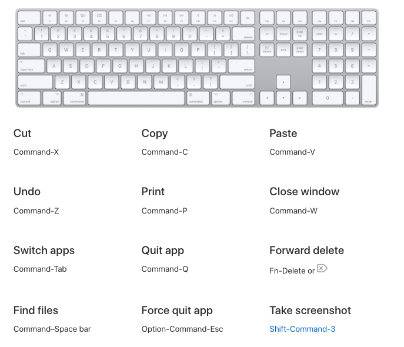
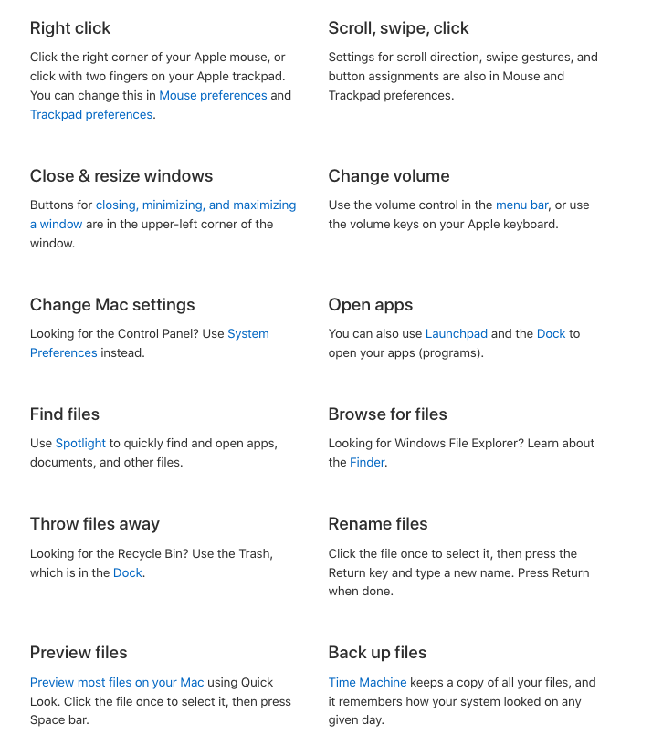

## On this page
{:.no_toc .hidden-md .hidden-lg}

- TOC
{:toc .hidden-md .hidden-lg}

## Welcome To Gitlab!

Congratulations on joining Gitlab! This page is dedicated to the IT onboarding experience, here at Gitlab we use many applications and the latest hardware to enable you to complete your work to the best of your ability! While it may seen a little bit overwhelming at the start the Team member enablement team is here to make the process as easy as possible!

## Getting Started

### Laptop Setup: Macbook

The first time your MacBook Pro starts up, Setup Assistant walks you through the simple steps needed to start using your new Mac.

#### Initial Setup

- Choose a country or region to set the language and time zone for your Mac. You can respond to all the prompts, or skip some and choose “Set up later” when you see that option.

- Connect to a Wi-Fi network: Choose the network and enter a password, if necessary. (If you're using Ethernet, you can also choose Other Network Options.) To change the network later, click the Wi-Fi status icon  in the menu bar or in Control Center, click Other Networks, then choose a Wi-Fi network and enter the password. You can also choose to turn Wi-Fi on or off here.

Tip: After setup, if you don’t see the Wi-Fi status icon in the menu bar, you can add it. Open System Preferences, then click Network. Click Wi-Fi in the list on the left, then select “Show Wi-Fi status in menu bar.”

- Transfer information: If you’re setting up a new computer and you haven’t previously set up a Mac, click “Don’t transfer any information now.”

#### Apple ID
 
- We recommend creating a new Apple ID for Gitlab to keep your personal and work data separate. You can also reimburse apps using an Apple ID created with your Gitlab account. Your Apple ID consists of an email address and a password. It’s the account you use for everything you do with Apple—including using the App Store, Apple TV app, Apple Book Store, iCloud, Messages, and more.

#### Initial Setup Part 2

- **Screen Time:** Monitor and get reports on the use of your computer. For options and details, see Screen Time on Mac.

- **Enable Siri and “Hey Siri”**: You can turn on Siri and “Hey Siri” (so you can speak your Siri requests) during setup. To enable “Hey Siri,” speak several Siri commands when prompted. To learn how to turn on Siri and “Hey Siri” later and for information about using Siri on your Mac, see Siri on your Mac.

- **Store files in iCloud**: With iCloud, you can store all of your content—documents, movies, music, photos, and more—in the cloud, and access it anywhere you go. Be sure to sign in with the same Apple ID on all your devices. To set this option later, open System Preferences and sign in with your Apple ID if you haven’t already. Click Apple ID, click iCloud in the sidebar, then select the features you want to use. To find out more, see Access your iCloud content on your Mac.

- **Choose an appearance**: Select Light, Dark, or Auto for your desktop appearance. If you want to change the choice you make during setup, open System Preferences, click General, then select an appearance option. You can also set other preferences here.

- **Set up Touch ID**: You can add a fingerprint to Touch ID during setup. To set up Touch ID later, or to add additional fingerprints, open System Preferences, then click Touch ID. To add a fingerprint, click the Add button and follow the onscreen instructions.

- You can also set options for how you want to use Touch ID on your MacBook Pro: to unlock your Mac, use Apple Pay (see Use Apple Pay on your Mac), purchase items on the App Store, Apple TV app, Apple Book Store, and websites, and auto-fill your password.

Tip: If two or more users use the same MacBook Pro, each user can add a fingerprint to Touch ID to quickly unlock, authenticate, and log in to the MacBook Pro. You can add up to three fingerprints per user account, and a total of five fingerprints for all your MacBook Pro user accounts.

## Macbook Cheat Sheet 

If you are new to using a Macbook or switched from another OS such as windows check out these useful shortcuts and options!

Click Here for Tips!

### Official Apple Training

Apple has official training sessions available every week! These training sessions are great if you are new to using a Macbook or want some tips and insider knowledge on using a Macbook! Please check it out [here](https://events.apple.com/content/events/pst/us/en/default.html?token=xww6uj7woR0X9A3Y9qIMRkNVdH60MurN7MAvJSY75sHQxWqaTEhMjEmalXqC7MMJuZhb5dzJ1P9mLUXaAAfCMipX6qVTaNqFY_njjpamZQfrSbMYEpe-edwBN1r5nI4t-GCxEY8&a=1&l=e)

## Laptop Setup: Linux

Check out [this detailed page](https://about.gitlab.com/handbook/tools-and-tips/linux/) on setting up your Linux laptop. Also feel free to reach out in #Linux slack channel or #it_help for assistance!

## Extra Setup

### Endpoint Management

Macbook: You are required to install Jamf on your Macbook for security and compliance reasons. Please check [this guide](https://about.gitlab.com/handbook/business-technology/team-member-enablement/onboarding-access-requests/endpoint-management/jamf/#enrolling-in-jamf) for assistance!

Linux: Currently we do not have an endpoint management tool for Linux. However we do have [a tool](https://about.gitlab.com/handbook/business-technology/team-member-enablement/onboarding-access-requests/#fleet-intelligence--remote-lockwipe) that we use to wipe and lock them if needed. 

### Laptop Encryption

It is essential to encrypt your laptops hard drive using Mac's FileVault or Linux's built in encryption. This will prevent unauthorised access of the contents in your hard drive. Please refer to our security pages to complete this. 

- [Macbook Encryption](https://about.gitlab.com/handbook/security/#laptop-or-desktop-system-configuration)
- [Linux Encryption](https://about.gitlab.com/handbook/tools-and-tips/linux/#initial-installation)

## Need Help?

If you need further assistance with setting up your Macbook please join our weekly onboarding call scheduled every tuesday (Check your Calendar!) or reach out to us in slack in the #it_help channel.
