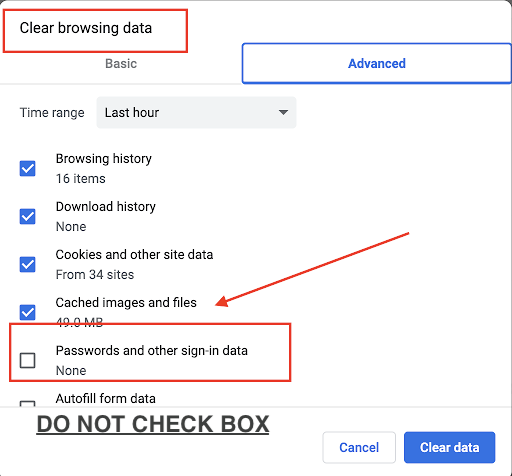
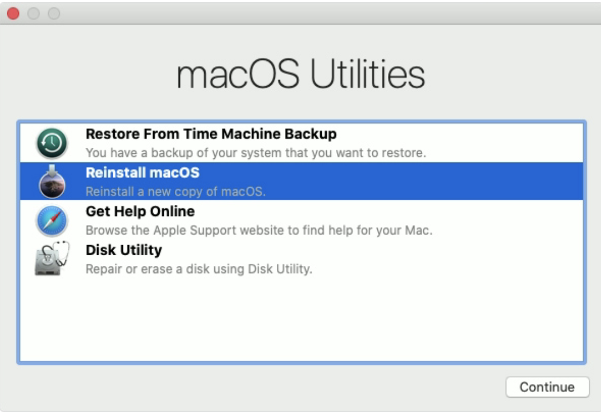
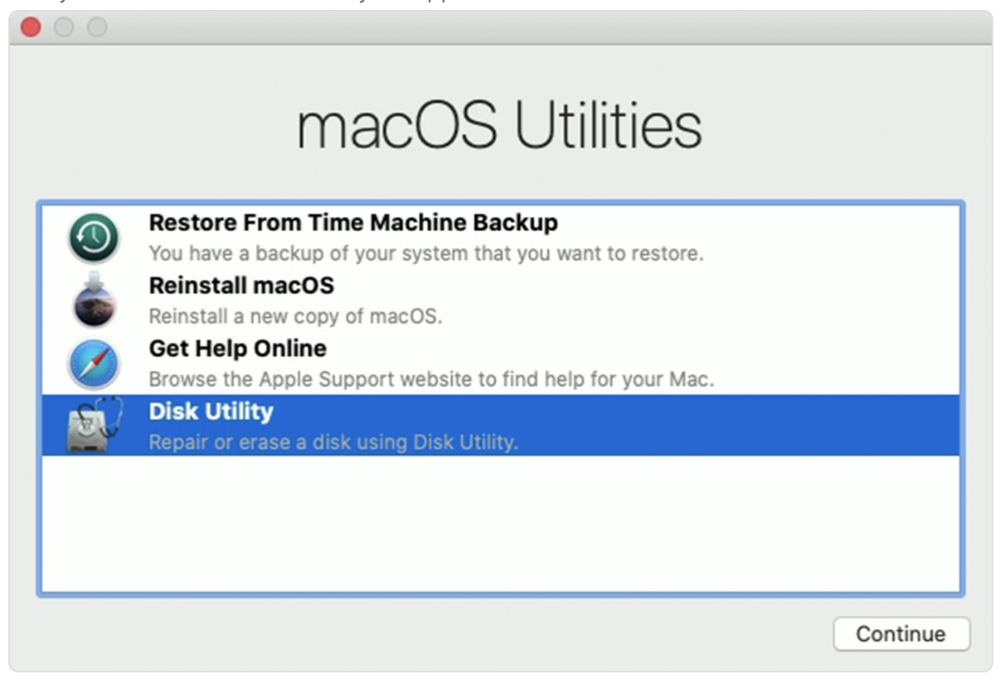
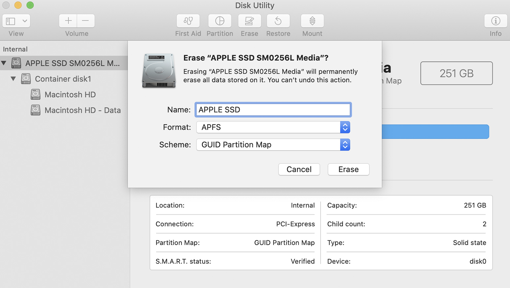
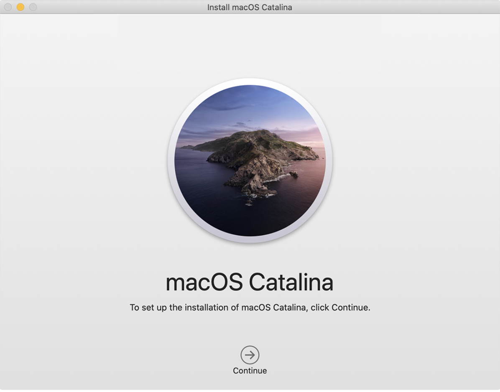

<link rel="stylesheet" type="text/css" href="/stylesheets/biztech.css" />

## On this page
{:.no_toc .hidden-md .hidden-lg}

- TOC
{:toc .hidden-md .hidden-lg}

{::options parse_block_html="true" /}

**This is a Controlled Document**
{: .panel-heading}

Inline with GitLab's regulatory obligations, changes to [controlled documents](https://about.gitlab.com/handbook/security/controlled-document-procedure.html) must be approved or merged by a code owner. All contributions are welcome and encouraged. 

## Purpose

Please read through this page to find the most common questions GitLab team members encounter. If you cannot find an answer to your question, please find more information on how to contact us at the bottom of the page. If the team has provided you with an answer that isn't listed here, please submit an MR to add it!

## Scope

### <i class="fas fa-question-circle" id="biz-tech-icons"></i> Frequently asked questions

## Roles & Responsibilities

| Role | Responsibility | 
|-----------|-----------|
| GitLab Team Members | Responsible for following the requirements in this procedure |
| Business Technology | Responsible for implementing and executing this procedure | 
| Business Technology Management (Code Owners) | Responsible for approving significant changes and exceptions to this procedure |

## Procedure

### Getting a new phone, lost/broken Yubikey or TouchID not working for Okta and Gitlab

#### Gitlab

- For 2FA related problems for your GitLab accounts, please use your backup codes or try generating [new ones](https://docs.gitlab.com/ee/user/profile/account/two_factor_authentication.html#generate-new-recovery-codes-using-ssh).
- If you are locked out completely reach out in `#it_help` Slack channel

#### Okta

WebAuthn is now required for all Okta users. Refer [to these instructions](https://about.gitlab.com/handbook/business-technology/okta/#i-want-to-add-touch-id--face-id--yubikey-to-okta) on how to configure

- If your TouchID, Yubikey or Mobile Authentication is not working make sure your OS and phone is updated to the latest version
- Try to login with different browsers (Chrome and Safari)
- Reach out in `#it_help` if all else fails
- 2FA resets will require a Zoom call with an IT team member who will ask you to hold your government ID with your address (ex. Drivers license) up to your webcam to have us verify your picture and postal address against your Workday postal address. This is for security verification

### Clearing Browsing Data in Advanced Settings Below Will Cause Issues With Your WebAuthN (Biometrics/Touch ID)

Do **not do** the following when clearing cache and cookies in Google Chrome as this will clear WebAuthN (Biometrics/Touch ID) browsing data and cause issues logging in:

- In Chrome ⇒ Click on 3 dots on top right corner
- Go to More Tools ⇒ Clear browsing data
- Under advanced ⇒  DO NOT Check box below
- This will clear your WebAuthN (Biometrics/Touch ID) and will need to be reset and configured again

If you cleared your cache and got locked out please do the following:

- Use Yubikey to login to Okta and reset WebAuthN (Biometrics/Touch ID) and configure again.
- If your phone is set up with a passkey, you may use your phone to get into OKTA and reset your WebAuthN (Biometrics/Touch ID)
- If you do not have a Yubi key or your phone set up; you will need to contact #it-help to reset your WebAuthN (Biometrics/Touch ID) in OKTA

Please check out the [following page](https://about.gitlab.com/handbook/business-technology/okta/#i-want-to-add-touch-id--face-id--yubikey-to-okta) for information and assistance on setting up WebAuthN (Biometrics/Touch ID)/Phone passkey and Yubikey

### Forgot my password

If you require IT to reset your password and it requires immediate access, please reach out on the slack #it_help channel and provide as much information as possible. Password resets to sensitive systems such as your Google Workspace account and Okta. They require a Zoom call with an IT Analyst to verify that it is you before doing the reset, this is required for security purposes.

### Using GMail app on phone with Okta log in

Please refer to our GitLab Accceptable Use Policy on [Personal Phones Mobile Phone and Tablet Usage](https://about.gitlab.com/handbook/people-group/acceptable-use-policy/#personal-mobile-phone-and-tablet-usage) prior to adding your GitLab GMail account to your personal device. 

**Please make sure you have your phone enrolled with WebAuthn in your Okta profile. Refer to [this page](https://docs.google.com/document/d/1VVEuNu7pZkNKo0ccLKy88AGonPW3ESYPG1JoFMkMts0/edit#bookmark=id.c85hcbk2nv4) for instructions**

To have Gmail on your phone now that it is controlled by Okta, you must use the actual Google Apps. 
- Download the official Gmail app made by Google LLC to your phone
    - iOS: [here](https://apps.apple.com/us/app/gmail-email-by-google/id422689480)
    - Android: [here](https://play.google.com/store/apps/details?id=com.google.android.gm&hl=en_CA&gl=US&pli=1)
- Add Google account
- Input your GitLab email
- Google will redirect to Okta login. Input your Okta username
- Input Okta password
- Accept 2FA prompt on your phone
- All set!

### New to Mac?

A lot of people coming onboard to GitLab have had some sort of exposure to macOS and Apple hardware, if you are one of those people the below link is probably not for you but you still might learn something!

- [Mac tips for Windows switchers](https://support.apple.com/en-us/HT204216)
- [Mac Keyboard Shortcuts](https://support.apple.com/en-us/HT201236) - great to help your productivity!
- [macOS : Ventura New Features](https://www.apple.com/au/macos/ventura/features/) - Apple's newest OS features
- [Got an iPad? - Check out Sidecar!](https://support.apple.com/en-afri/HT210380) - Apple iPad Sidecar
- [How to use multiple workspaces on Mac](https://support.apple.com/guide/mac-help/work-in-multiple-spaces-mh14112/mac)

### How to Erase a Disk for Mac

If you are keeping your GitLab machine [Laptop Buy Back Policy](/handbook/business-technology/team-member-enablement/onboarding-access-requests/#laptop-buy-back-policy) it is required that IT wipes the machine and restores it to base OS. We currently use 2 products to accomplish this task and you can read more about this here - [Remote Wipe procedure](https://about.gitlab.com/handbook/business-technology/team-member-enablement/onboarding-access-requests/#fleet-intelligence--remote-lockwipe).

#### Jamf (MacOS)

- Please schedule a time with an IT Analyst to have your laptop wiped. You can find their schedules[here](https://about.gitlab.com/handbook/business-technology/team-member-enablement/#laptop-wipe-schedules-for-it-analysts).
- Make sure all your data is backed up and laptop is powered on and connected to the internet
- Please refer to your refresh [issue](https://gitlab.com/gitlab-com/business-technology/team-member-enablement/issue-tracker/-/issues) which contains further instructions

#### Drivestrike (Linux)

- Please schedule a time with an IT Analyst to have your laptop wiped. You can find their schedules[here](https://about.gitlab.com/handbook/business-technology/team-member-enablement/#laptop-wipe-schedules-for-it-analysts).
- Please refer to your refresh [issue](https://gitlab.com/gitlab-com/business-technology/team-member-enablement/issue-tracker/-/issues) which contains further instructions

- We will send you an email which will contain install instructions for Drivestrike

#### Transferring of data to new mac

- We do NOT recommend the use of Migration Assistant to transfer your data to your new mac as this will break the connectivity of JAMF
- Please use GitLab's Google Drive function to back up what is needed and then you're able to download this onto your new mac

## Self-Help and Troubleshooting Tips

This section should provide some quick and easy troubleshooting tips anyone can do to possibly remedy an IT issue before reaching out.
This section will be expanding over time so keep an eye out or feel free to contribute if you think something belongs.

### Built-In MacBook Troubleshooting Commands

MacBooks are wonderful laptops, but no laptop is without faults.
You may come across a "wonky" situation with your Mac, so below are some pointers that may help fix common issues.

- Reset your [NVRAM and PRAM](https://support.apple.com/en-us/HT204063) - non-volatile random access memory and parameter RAM stores small amount of information on your Mac, if you experience issues related to what's in the Apple article resetting this might help out.

<iframe width="560" height="315" src="https://www.youtube.com/embed/LoUO1RwMg1w" title="YouTube video player" frameborder="0" allow="accelerometer; autoplay; clipboard-write; encrypted-media; gyroscope; picture-in-picture" allowfullscreen></iframe>

- Reset the [SMC](https://support.apple.com/en-us/HT201295) (INTEL ONLY) - System Management Controller handles some low-level functions like battery management and if you experience issues with fans or internal ports this could help resolve those issues.
    (Note: different models have different reset methods)

    <iframe width="560" height="315" src="https://www.youtube.com/embed/wlkGh2flbvI" title="YouTube video player" frameborder="0" allow="accelerometer; autoplay; clipboard-write; encrypted-media; gyroscope; picture-in-picture" allowfullscreen></iframe>

- Apple Diagnostics [Hardware Diagnostics](https://support.apple.com/en-us/HT202731)

### Password Reset for Your MacBook

Did you go out for a long well deserved vacation and come back to a completely blank memory on what your laptop password was?
It happens to the best of us!
Apple has you covered.

- Power down the Mac.
- Restart the Mac while also concurrently holding down the Command + R keys (to go to recovery mode); release the keys when Apple logo appears
- Once Mac is restarted select from the menu Utilities > Terminal
- At the window that opens, type `resetpassword`
- Follow onscreen instructions to reset

### Battery Cycle Count

Want to see the health of your battery? Generally the laptops that we use have a maximum battery cycle life of 1000, you can check it below

- Battery Cycle Count [Battery Cycle Count](https://support.apple.com/en-us/HT201585)

### Repair a Disk or Mac Storage Drive

Apple's Disk Utility tool can fix some problems such as applications unexpectedly quitting or crashing, corrupted files, and external drives not working.
You can also format drives with Disk Utility.

This is a quick walkthrough on how to check your MacBook's disk and run First Aid.

- If you don't want to reboot the laptop, open Spotlight and search `disk utility`
- In the Disk Utility App, select your disk (should be named Macintosh HD but you can change that too)
- At the top you will see `First Aid`, click that an hit `run`
- Your MacBook will run First Aid, report any issues, and correct them if it can

### How long is my MacBook in Warranty?

- Review your Apple Warranty Status [Service and Support](https://checkcoverage.apple.com/)

### Want to add different profiles for your different GitLab accounts?

It is recommended that you create different profiles in Chrome so you can manage your different GitLab accounts.
This way you can easily sign in without having to signout out of different accounts each time.
A lot easier if you've got `staging.gitlab.com` and `dev.gitlab.org` accounts.

- On your computer, open Chrome
- At the top right, click the `Profile Profile`
- Click `Add`
- Choose a name and a photo
- Click `Add`.
- A new window will open and ask you to turn on sync

### Is your Chrome browser acting a little weird?

If you are having issues that seemingly can't be explained the below steps might help resolve your issue.
Keep in mind this will reset chrome to default settings but its easy enough to restore and link data back.

- On your desktop, open Chrome
- At the top right, click `More` and then `Settings`
- At the bottom, click `Advanced`
- Linux, and Mac: Under `Reset Settings`, click `Restore settings to their original defaults` and then `Reset Settings`

### Does your Gmail account keep getting suspended?

This usually occurs when the emails you send out get reported for spam. Collect too many reports and Google will automatically suspend your account. Here is some more info on Google's [page](https://support.google.com/a/topic/28609).

**How do I get access to my account after suspension?**

Someone from IT will need to unlock your account. Please submit a [Team Member Enablement request](https://gitlab.com/gitlab-com/business-technology/team-member-enablement/issue-tracker/-/issues/new?issuable_template=General%20HelpDesk%20Request) or reach out to us on the #it-help slack channel.

**How do I prevent this from happening?**

Please look into the following mailing applications which may prevent this from happening in the future due to a different mailing method.

- MailGun: <https://www.mailgun.com/>
- MailChimp: <https://mailchimp.com/>

Both of those applications are listed in GitLab's tech stack meaning they can be used.

### Questions about Okta?

Want to know how as an organization we leverage Okta as a Single Sign On tool? Please click [here](/handbook/business-technology/okta/)

### Tools and Tips

Check out the GitLab Tools and Tips pages for recommended software and applications - [Tools and Tips](/handbook/tools-and-tips/)

Our security team also did an amazing write-up for Linux installations - [Linux Setup](/handbook/tools-and-tips/linux/)

### Installing OS Ventura

**Pre-requisites**

Before you install, please be sure to have the following:
25 GBs of HD space
The latest version of SentinelOne (22.2.3 or higher)

**Download and Installation**

The entire process will take a minimum of an hour depending on your internet speed. Please give yourself sufficient time to download and install the upgrade, avoid doing this upgrade before meetings. Once you are greeted with the login screen, the upgrade is complete. Be sure that you reboot a couple of times after the installation is complete.

There's 2 ways to upgrade to Ventura

**Self Service**

1. Head to Finder on your Mac and select Applications
2. Click on Self Service
3. On the left hand side you'll see OS Updates, click on that
4. From here you'll see the newest version of MacOS Big Ventura. Click on it to install. This will redirect you to the Apple Store where you can install the OS. 
5. This can take upwards of an hour, so please factor in that time when you are updating

**Check for Updates**

1. Click on the Apple in the top left hand corner of your mac and then click on System Preferences
2. Click on the general tab and then Software Updates > Check for updates
3. You'll then have the chance to install either Ventura or the next update that is needed to then install OS Ventura

### FAQ for issues with a new macOS update

**How can I tell if my MacBook is using an Intel or an Apple M1/M2 chip?**

Please refer to this [guide](https://support.apple.com/en-ca/HT211814#:~:text=To%20open%20About%20This%20Mac,as%20an%20Intel%2Dbased%20Mac)

**My external monitor is not working properly?**

Power cycle your [monitor](https://edu.gcfglobal.org/en/basic-computer-skills/how-to-power-cycle-a-device/1/)

Try the troubleshooting steps from macOS User [guide](https://support.apple.com/en-nz/guide/mac-help/mchl7c7ebe08/mac)

Reset your SMC if you’re using an Intel (i5, i7) [MacBook.](https://www.youtube.com/watch?v=wlkGh2flbvI)

Reset your NVRAM and PRAM if you’re using an Apple M1/M2 [MacBook](https://www.youtube.com/watch?v=LoUO1RwMg1w)

Replace your USB C hub for a Satechi Multi-Port Adapter, replace the cable that is connected from your monitor to your MacBook HDMI cable (higher end version)

**Zoom is not working after I updated to Ventura** 

You will need to uninstall and install Zoom again. Please follow this [guide:](https://support.zoom.us/hc/en-us/articles/201362983-Uninstalling-and-reinstalling-the-Zoom-application) 

**Some of my applications are not working properly, what can I do?***

Reinstall your specific applications that are not working properly.

### What is JAMF Self Service

With the installation of JAMF comes Self Service which can be found in Applications. Jamf Self Service for macOS allows users to browse and install applications, configuration profiles and update your OS easily. 

### Using Jamf Self Service to Update your OS

You can easily use JAMF's Self Service tool to update your Mac to the OS you need to update to. There are 2 ways to do this to do this

***Please make sure to backup your Mac before you commence any updates***

Update to the newest OS

1. Head to Finder on your Mac and select Applications
2. Click on Self Service
3. On the left hand side you'll see OS Updates, click on that
4. From here you'll see the newest version of MacOS Big Ventura. Click on it to install. This will redirect you to the Apple Store where you can install the OS. 
5. This can take upwards of an hour, so please factor in that time when you are updating

Update your existing OS to the most recent version

1. Head to Finder on your Mac and select Applications
2. Click on Self Service
3. On the left you'll see OS updates, click on that
4. From here you'll see 'Check for Apple Software Updates'. Click on that, and follow the instructions to update your OS
5. This can take upwards of an hour, so please factor in that time when you are updating

### Using Jamf Self Service to Erase your Mac 

macOS Monterey and newer includes Erase All Content and Settings, a way to quickly and securely erase all of your settings, data and apps, while maintaining the operating system currently installed. You can use Jamf's self service to do this for you. This functionality is only available when using macOS Monterey on a Mac with Apple silicon or a Mac with the Apple T2 Security Chip.

If you are needing to wipe a machine because you have received a new (refreshed) system for GitLab work, please [schedule a time](/handbook/business-technology/team-member-enablement/#laptop-wipe-schedules-for-it-analysts) with an IT Analyst to perform the wipe and decommission from Jamf management.

1. Head to Finder on your Mac and select Applications
2. Click on Self Service
3. On the left you'll see Utilities, click on that
4. From here, you'll see Erase Assistant. ***PLEASE ONLY CLICK ON THIS IF YOU WISH TO ERASE YOUR MAC. DATA WILL NOT BE RECOVERABLE***
5. You'll be required to enter your computer password at the next prompt
6. From here, your computer will be offline while the wipe commences for around 15-30 minutes
7. Setup is complete when you get the OS welcome screen again

### Reinstalling Mac OS after a JAMF wipe

We use JAMF to wipe laptops when you're either getting a new laptop, sending it back to our supplier 'Sell your Mac' or retaining your laptop after you have left the company (https://about.gitlab.com/handbook/business-technology/team-member-enablement/onboarding-access-requests/#laptop-buy-back-policy)

After we have initiated the wipe from our end. You will need to reinstall macOS so your computer can boot properly. Please follow the below instructions.

**Before you reinstall, DNS changes on your router can affect the connection to the Apple Servers. If you do have issues getting into recovery, or are stuck with selecting your network, please try defaulting back to your original DNS to fix this issue**

1. Start up from macOS Recovery
To start up from macOS Recovery, turn on your Mac and immediately press `Command + R` on your keyboard. Release the keys when you see an Apple logo or Spinning Globe.

When you see the utilities window, you have started up from macOS Recovery.

2. Install macOS
When you're ready to reinstall macOS, choose Reinstall macOS from the Utilities window. Then click Continue and follow the on-screen instructions. You will be asked to choose a disk on which to install.

- If the installer asks to unlock your disk, enter the password you use to log in to your Mac.
- If the installer can't see your disk, or it says that it can't install on your computer or volume, you might need to erase your disk first

You can do this by going back to the Utilities window and clicking on `disk utility`

Choose View > Show All Devices from the menu bar in Disk Utility. The sidebar now shows your disks (devices) and any containers and volumes within them. The disk your Mac started up from is at the top of the list. In this example, Apple SSD is the startup disk:

Select the disk you want to erase.
Click Erase, then complete these items:

Name: Type the name that you want the disk to have after you erase it.
Format: Choose APFS or Mac OS Extended (Journalled). Disk Utility shows a compatible format by default.
Scheme: Choose GUID Partition Map.

Click Erase to begin erasing your disk and every container and volume within it. You may be asked to enter your Apple ID. When it's finished, quit Disk Utility.

Once this is complete you can then install OS by clicking on Reinstall macOS from Utilities window again and selecting the disk you've just wiped. Follow the prompts and the OS will install

## Enrolling your Chromebook into GitLab Google Device Management

1. Turn on your Chromebook, connect it to a network and follow the on-screen instructions until you see the **Who's using this Chromebook** screen. Don't sign in yet. 
2. You should see an option at the bottom for **Enterprise Enrollment**: If you do not see this you can press **ctrl+alt+e** and it should bring you to the Enterprise Enrollment Screen. 
3. Enter the username and password from your Google admin welcome letter or for a Google Account that has eligibility to enroll. This is your GitLab username and password.
4. Once you successfully input your registered Gitlab email address a Okta prompt should appear. You should now enter the email address and password you use for Okta. Afterwards you should be prompted to input a 2FA code or verify a push notification
5. When you get a confirmation message that the device is successfully enrolled, click Done.
6. Lastly, you should be prompted one final time to **Sign in to your Chromebook**. Click next and repeat the steps above. (input Okta email and password + 2FA or push notification)
7. Congrats! You have now completed your sign in an enrollment. 

## Can't find what you are looking for?

Request for support should have an issue open at [IT Help Issues](https://gitlab.com/gitlab-com/business-technology/team-member-enablement/issue-tracker/-/issues/new?issuable_template=General%20HelpDesk%20Request).

### How to Contact Us or Escalate Priority Issues Outside of Standard Hours

We ask that all requests are made through an [IT Help Issue](https://gitlab.com/gitlab-com/business-technology/team-member-enablement/issue-tracker/-/issues/new?issuable_template=General%20HelpDesk%20Request). We will triage and address them as soon as we can. All issues created in the queue are public by default. Privileged or private communications should be sent to [it-help@gitlab.com.](mailto:it-help@gitlab.com.) Screenshots and videos are very helpful when experiencing an issue, especially if there is an error message.

As a distributed team, we have support around the clock with team members in North America, Europe and Australia.
High volumes of issues being triaged can dictate the delay in response within that window. If the issue is extremely time sensitive and warrants escalation, use judgement on whether or not it can wait until ‘business hours’.
Escalated issues should be made through the #it_help slack channel.
All other request should have an issue created.

## Exceptions
Exceptions to this procedure will be tracked as per the [Information Security Policy Exception Management Process](/handbook/security/#information-security-policy-exception-management-process).

## References
* Parent Policy: [Information Security Policy](/handbook/security/)
