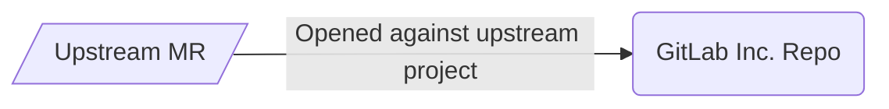
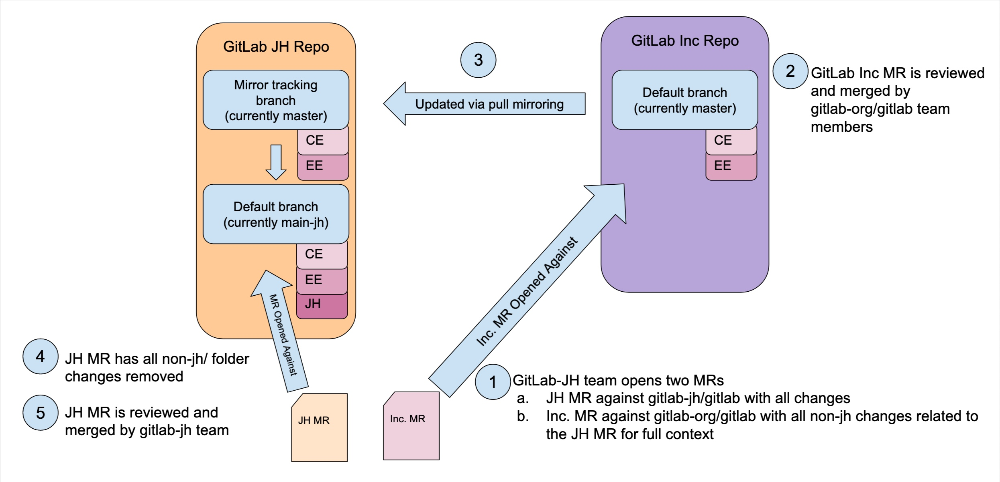

## On this page
{:.no_toc .hidden-md .hidden-lg}

- TOC
{:toc .toc-list-icons .hidden-md .hidden-lg}

{::options parse_block_html="true" /}

----

## Overview

As announced in the blog post [GitLab licensed its technology to new independent Chinese company](https://about.gitlab.com/blog/2021/03/18/gitlab-licensed-technology-to-new-independent-chinese-company/), GitLab Inc. has licensed its technology to JiHu. This page is outlines how the GitLab Inc. team provides support to JiHu.

## Brand

Please refer to our [guidelines](https://docs.google.com/document/d/1oJd_3SMHlTod6j3ThqhjpeCyyw8rqBM4WUeOfy7vYKs/edit?usp=sharing)

## Communications

Please refer to our [guidelines](https://docs.google.com/document/d/1SEBkJp0R-yjN654KTJjcSI55VGwWPHN2xTKLW5FNvUM/edit?usp=sharing). Invitations sent to GitLab Team members to join the `gitlab-jh.slack.com` Slack server are legitimate. This server is used for communications between GitLab Inc. and JiHu.

## Sales

Please refer to our [guidelines](https://docs.google.com/document/d/1JigQn7g8KUrY8N6WHuf248ARWHzCpIGhE2yXriuhI5c/edit?usp=sharing).

## Professional Services

Please refer to our guidelines (link to be added).

## Customer Support

Process to be added below.

## Engineering

### R&D Roles

| DRI | Role |
| --- | --- |
| [Mek Stittri](https://about.gitlab.com/company/team/#meks) | Engineering DRI |
| [Kevin Chu](https://about.gitlab.com/company/team/#kevinchu) | Product DRI |
| [Lin Jen-Shin](https://about.gitlab.com/company/team/#godfat) | Engineering Facilitator |

### Projects

JiHu team projects are located at <https://jihulab.com/gitlab-cn/>. Mirrored projects for `gitlab-org` tooling and compliance checks are available at <https://gitlab.com/gitlab-org/gitlab-jh-mirrors/>.

Even though most of the JiHu projects are moved to JiHuLab.com, some projects
are still under the [gitlab-jh](https://gitlab.com/gitlab-jh/) group.
To request access please reach out to [Kevin](https://about.gitlab.com/company/team/#kevinchu) or
[Mek](https://about.gitlab.com/company/team/#meks) to provision.

| GitLab Inc Project                                      | JiHu Project                                               |
|---------------------------------------------------------|------------------------------------------------------------|
| <https://gitlab.com/gitlab-org/gitlab>                    | <https://jihulab.com/gitlab-cn/gitlab>                       |
| <https://gitlab.com/gitlab-org/license-gitlab-com>        | <https://gitlab.com/gitlab-jh/license-gitlab-cn> (private)   |
| <https://gitlab.com/gitlab-org/customers-gitlab-com>      | <https://jihulab.com/jihulab/engineering/customers-jihulab-com> (private) |
|                                                         | <https://gitlab.com/gitlab-jh/cookbook-customers-gitlab-com> |
| <https://gitlab.com/gitlab-services/version-gitlab-com>   | <https://gitlab.com/gitlab-jh/version-gitlab-cn>             |
| <https://gitlab.com/gitlab-org/omnibus-gitlab>            | <https://jihulab.com/gitlab-cn/omnibus-gitlab>               |
| <https://gitlab.com/gitlab-org/gitaly>            | <https://jihulab.com/gitlab-cn/gitaly>               |
| <https://gitlab.com/gitlab-org/gitlab-environment-toolkit> | <https://gitlab.com/gitlab-jh/gitlab-environment-toolkit>    |
| <https://gitlab.com/gitlab-org/build/CNG>                 | <https://jihulab.com/gitlab-cn/build/cng-images>             |
| <https://gitlab.com/gitlab-org/charts/gitlab>             | <https://jihulab.com/gitlab-cn/charts/gitlab>                |
| <https://gitlab.com/gitlab-org/gitlab-docs>               | <https://jihulab.com/gitlab-cn/gitlab-docs-cn>           |
| <https://gitlab.com/gitlab-org/gitlab-runner>             | <https://jihulab.com/gitlab-cn/gitlab-runner>                |
| <https://gitlab.com/gitlab-org/gitlab-svgs>             | <https://jihulab.com/gitlab-cn/gitlab-svgs> |
| <https://gitlab.com/gitlab-org/gitlab-qa> | <https://jihulab.com/gitlab-cn/gitlab-qa> | 

### Merge Request Process

Contributions from the JiHu team will follow two methods depending on whether they have JiHu proprietary changes or not.

* Upstream method - start with a merge request in the GitLab Inc. repository.
* Proprietary and upstream method - start with a merge request with all changes against the GitLab JiHu project and a merge request with all non-proprietary changes against the upstream project.

To identify contributions from JiHu, the `~"JiHu contribution"` label is automatically applied to all upstream contributions coming from the JiHu team. To ensure the label is accurately applied, the `gitlab-jh` team must keep the direct members of [`gitlab-jh/jh-team`](https://gitlab.com/groups/gitlab-jh/jh-team/-/group_members?with_inherited_permissions=exclude) updated with current team members.

JiHu enablement efficiency age and review metrics are publicly accessible in this [dashboard](https://app.periscopedata.com/shared/f7af38e3-0cea-4219-a5d3-6f6b25f10244?).

The [Engineering Productivity](/handbook/engineering/quality/engineering-productivity/) team is the DRI for JiHu Engineering enablement efficiency tooling and metrics.

#### Guidelines for upstream contributions

Contributions that do not involve JiHu proprietary content will be opened against the upstream project.

#### Upstream feature contribution guidelines

For large initiatives, ones that take multiple MRs or have broad-range implications, upstream feature contributions are more efficient and predictable when there's joint upfront planning. In order to set up both teams for success they should follow these guidelines:

1. **At least one milestone prior to the milestone where implementation starts** - JiHu team creates an upstream feature planning issue that provides an overview of the feature scope in English, intended uses, and iterative implementation plan. JiHu will ask the relevant team's PM and EM for feedback on the issue and implementation plan. 
   - The relevant GitLab product group will provide feedback on the feature, the relevant iterative implementation plan and provide feedback to JiHu.
1. **During implementation start** - JiHu team will author MRs following the implementation plan and upstream guidelines below. The review will be done based on the agreement in the feature planing issue.

Example upstream planning issue: TBD

##### Guidelines for iterative contributions

Bigger product feature contributions should follow GitLab
[iteration strategies](/handbook/product/product-processes/#iteration-strategies).

[Iteration training](https://about.gitlab.com/handbook/engineering/development/onboarding/manager/#iteration-training) is available to coach on GitLab's value of iteration. This can be helpful to understand the expectations of GitLab product teams for feature iteration.

Not every features can follow the same strategy, but the first strategy we
try should be [crafting the minimal viable change](/handbook/product/product-processes/#crafting-an-mvc), and for creating
merge requests, always try to [keep merge requests small](/handbook/engineering/workflow/iteration/#how-to-keep-a-merge-request-small).

In the above guidelines to keep merge requests small, we mentioned:

* Horizontal slicing
* Vertical slicing

Given JiHu upstream contributions cannot easily slice horizontally due to lacking
developer permissions, always try to slice vertically first, that is,
reduce the scope of the feature. Only consider slicing horizontally if
it cannot be smaller, while it's still too large to fit inside a single
merge request.

Here are some examples for how we break down a feature in multiple iterations,
both horizontally and vertically:

| Feature | Merge requests (not an exhaustive list) | Slicing |
| --- | --- | --- |
| [GitLab Insights](https://gitlab.com/groups/gitlab-org/-/epics/725) | {::nomarkdown}<ul><li>{:/}[Introduce the Gitlab::Insights framework](https://gitlab.com/gitlab-org/gitlab/-/merge_requests/9912){::nomarkdown}</li><li>{:/}[Introduce the Insights controllers](https://gitlab.com/gitlab-org/gitlab/-/merge_requests/9776){::nomarkdown}</li><li>{:/}[Insights frontend](https://gitlab.com/gitlab-org/gitlab/-/merge_requests/9856){::nomarkdown}</li><li>{:/}[Move to supporting multiple charts per page for Insights](https://gitlab.com/gitlab-org/gitlab/-/merge_requests/10516){::nomarkdown}</li></ul>{:/} | Mixture with both. Horizontally for the base and vertically on top of it
| [Filter search results by state](https://gitlab.com/groups/gitlab-org/-/epics/4293) | {::nomarkdown}<ul><li>{:/}[Search UI add issue scope results filtering by state](https://gitlab.com/gitlab-org/gitlab/-/merge_requests/39881){::nomarkdown}</li><li>{:/}[Add issues/merge_requests filtering by state for search API](https://gitlab.com/gitlab-org/gitlab/-/merge_requests/41989){::nomarkdown}</li></ul>{:/} | Vertically that each merge request shipped a standalone feature

#### Guidelines for upstream contributions review process

Please refer to [JiHu Contribution Review Process](./jihu-contribution-review-process.html) for details.

#### Guidelines for proprietary and upstream contributions

Contributions in projects that have proprietary and upstream contributions will use the following guidelines to have a streamlined review.

1. The JiHu Engineering team will open two MRs:
   1. JiHu MR with all changes against the default branch in [JiHu project](https://jihulab.com/gitlab-cn/gitlab).
   1. GitLab Inc MR with all non-`jh/` changes against the default branch in [GitLab Inc project](https://gitlab.com/gitlab-org/gitlab).
1. The GitLab Inc MR will be reviewed by the GitLab Inc team members. Reviewers should follow the [guidelines for reviewing JiHu (JH) Edition related merge requests](https://docs.gitlab.com/ee/development/jh_features_review.html).
1. After merging, the updates will be mirrored to JiHu project via pull mirroring and synchronized via [code sync](https://jihulab.com/gitlab-cn/code-sync), merging into the default branch [`main-jh`](https://jihulab.com/gitlab-cn/gitlab/-/commits/main-jh) in the JiHu project.
1. The JiHu Engineering team will remove all non-`jh/` changes from the JiHu MR.
1. The JiHu Engineering team will review and merge the JiHu MR in the JiHu project.
1. A scheduled pipeline every 2 hours will run in [compliance-verification](https://gitlab.com/gitlab-org/gitlab-jh-mirrors/compliance-verification) against the [JiHu project pulling mirror](https://gitlab.com/gitlab-org/gitlab-jh-mirrors/gitlab) to verify that there are no code difference outside of `jh/` directory beside [agreed difference for `package.json` and `yarn.lock`](https://gitlab.com/gitlab-jh/gitlab-jh-enablement/-/issues/170#note_892043256).

#### Broken JiHu main branch resolution process

There are times where [`main-jh` branch](https://jihulab.com/gitlab-cn/gitlab) is broken and requires upstream merge requests to resolve. When this happens the following process will be enacted for a timely resolution within 2 business days of JiHu upstream MR creation. 

1. JiHu team will open an upstream MR with the resolution
1. JiHu Engineering DRI will notify GitLab Inc with a message in [#main-jh-broken](https://gitlab-jh.slack.com/archives/C026EBMTRRB) to identify that the MR is escalated to the GitLab maintainers 
1. GitLab Facilitator will apply `~"JiHu Broken Pipeline"` label to the merge request and solicit a review from the appropriate domain (backend, frontend). 
1. GitLab Facilitator will notify GitLab Inc team members in the #jihu-engineering channel. 
1. JiHu will add the MR and root cause of the failure to <https://gitlab.com/gitlab-jh/gitlab-jh-enablement/-/issues/215>

#### MR escalation

Please refer to our [guidelines](https://docs.google.com/document/d/1zEiPBZ1D90LJdxBJDl45B4N-umqtR0VGt3803OgHjMo/edit?usp=sharing).

#### Release Certification Process

The Application Security team performs a certification of each release that includes JiHu contributions. Please see [this documentation](./release-certification.html) for more information about this process.

Certification issues containing a report can be found in the [issue tracker](https://gitlab.com/gitlab-org/jh-upstream-report/-/issues/) of the [jh-upstream-report repository](https://gitlab.com/gitlab-org/jh-upstream-report).

### Security Release Process

JiHu is responsible for building and releasing the JiHu Edition each month including all patch and security releases. For security releases, GitLab Inc will continue to follow our existing [security release process](https://gitlab.com/gitlab-org/release/docs/blob/master/general/security/process.md) to publish our [security releases](https://about.gitlab.com/releases/categories/releases/). To enable JiHu to build their security releases in a timely manner, GitLab Inc will notify JiHu when a security release is in progress along so that their teams can be on stand by. GitLab Inc will not notify JiHu of the contents of the security release or of the vulnerability.

To notify JiHu of an upcoming security release, please simply post a comment in: https://gitlab.com/gitlab-jh/gitlab-jh-enablement/-/issues/112

### Vulnerability Disclosure Process

GitLab Inc will follow the [documented vulnerability disclosure process](https://about.gitlab.com/security/disclosure/#vulnerability-disclosure) and will not provide detailed information about vulnerabilities directly to JiHu. No information will be shared prior to or during an in-progress security release.

Only after a GitLab [security release](https://about.gitlab.com/handbook/security/#security-releases), GitLab Inc may provide JiHu with:

* A link to the public security release blog post
* A link to the GitLab issue describing the vulnerability, which will remain confidential until 30 days after the release in which the vulnerability was patched

This information will be communicated via Slack and the weekly engineering sync with JiHu.

For security vulnerabilities introduced by JiHu contributions, the GitLab Application Security team will share mitigation steps as long as they do not disclose vulnerability details or information that could result in the discovery of vulnerability details.
* If such mitigation steps exist, the GitLab Application Security team will notify JiHu by creating a confidential issue in the JiHu enablement project with the mitigation steps.
* If no mitigation steps exist, the vulnerability will be disclosed as per GitLab's regular security vulnerability disclosure process.

### Security Best Practices

GitLab can share security best practices with JiHu. This may include defense in depth measures, hardening techniques, and other information in the interest of keeping GitLab, JiHu, and their customers secure. This can not include vulnerability details or specific remediations that could expose information about an unpatched vulnerability or ongoing incident.

### Consulting Process

JiHu benefits from GitLab expertise, particularly around operating GitLab as a SaaS product. GitLab may charge JiHu for consulting on items that require engagement beyond a quick response on Slack. This way, GitLab can safeguard against unplanned work while JiHu builds its domain expertise. This is also agreed upon in GitLab's [Technical Services Agreement with JiHu - Internal](https://drive.google.com/file/d/19HXz1xxCS-BlDwMFUquw1Vl06SQ16Mgc/view).

#### Topics not in scope for consulting

- Reviewing MRs
- Roadmap alignment
- Management collaboration

## Product

### Role of the Product DRI

The [Product DRI](#rd-roles) has the following responsibilities:

* Provide product management practice guidance to the JiHu CTO and product counterparts
* Enable alignment between GitLab Product and JiHu Product
  * Provide regular updates and raise awareness of GitLab investment themes and roadmap
  * Disseminate JiHu plans and roadmap with the appropriate party
* Liaise with JiHu CTO on product data
* Work with stage groups to implement solutions that pertains to JiHu or China related requirements
* Partner with Engineering DRI and Engineering Facilitators to define and maintain processes that ensures the smooth functioning between GitLab and JiHu

### Product Manager responsibilities

JiHu contributions are similar to community contributions. The difference is they are higher in volume and frequency. As JiHu ramps up in the GitLab codebase, they are also eager to build understanding and learn where and how they might contribute to GitLab. Product Managers can share their public directions and work with the JiHu team to help JiHu become self-sufficient and efficient.

At times, product managers are asked to provide feedback or directly respond to specific proposals from JiHu. GitLab PMs should help facilitate collaboration between GitLab engineers and the JiHu team. This means if there's misalignment on product direction, call that out early so JiHu doesn't spend time working on things GitLab doesn't intend to merge.

If product managers need help connecting with JiHu counterparts, ping the [Product DRI](#rd-roles) in [#jihu-product](https://gitlab.slack.com/archives/C01S8CFF7HR).

#### Milestone Product Planning Process with JiHu

To facilitate collaboration and feedback, JiHu plans ahead of GitLab's milestone  planning process to give GitLab product groups time to provide feedback ahead of implementation. The following will happen every milestone:

1. JiHu will create a milestone planning issue in the [gitlab-jh-enablement project](https://gitlab.com/gitlab-jh/gitlab-jh-enablement), such as this [example](https://gitlab.com/gitlab-jh/gitlab-jh-enablement/-/issues/269). JiHu typically provides the plan 2 weeks before the 18th of the month. 
1. For any items which do not already have an issue in the Gitlab.org project, the JiHu team creates an issue. If there is an existing issue, it is linked to from the milestone planning issue. This helps the GitLab product group track JiHu contributions in the same place where other day to day work is tracked.
1. The Product DRI will facilitate awareness and encourage collaboration via the [JiHu Milestone Review Template](https://gitlab.com/gitlab-com/Product/-/blob/main/.gitlab/issue_templates/Monthly-JiHu-Milestone-Review.md)
1. Individual product manager and their engineering counterparts will provide feedback to JiHu as needed

##### Large Product Iniative Planning

In the interest of creating IP, JiHu will take on larger product initiatives that spans multiple milestones. This type of product initiatives take more coordination. JiHu and GitLab representatives regularly stay in sync regarding these product plans. The goal is to identify large initiatives early so that the appropriate DRIs can be looped in. One example of this type of product initiative is the [Visual Builder for the pipeline editor](https://gitlab.com/groups/gitlab-org/-/epics/4499).

#### What product managers are not responsible for

GitLab Product Managers are not responsible for JiHu product decisions, but collaboration and feedback with JiHu Product Managers is encouraged and appreciated.

- Just like [PMs aren't the arbiters of community contribution](/handbook/product/product-processes/#gitlab-pms-arent-the-arbiters-of-community-contributions), product managers are not the arbiter of what the JiHu team works on
- Product managers are not responsible for JiHu product decisions, such as tiering, pricing
- When reviewing JiHu milestone planning: 
   1. Be aware of JiHu's plans in your product area. 
   1. Provide guidance in accordance with GitLab's product direction. 
   1. Help avoid surprises and help JiHu be successful. If feedback will take some time, please provide a heads-up. 
   1. It is not necessary to provide feedback if there's no feedback to give. JiHu contribution can be the same as other community contributions

### Differentiating Proprietary JiHu Features

We differentiate proprietary features for JiHu distributions by including them in the `/jh` [directory](https://gitlab.com/gitlab-org/gitlab-jh-mirrors/-/tree/main-jh/jh). However, the majority of contributions from JiHu team members should be outside of the `/jh` directory signaling the expectation that most contributions are to GitLab Core and only certain specific features are exclusive to the /jh offering.

## Design

Process to be added below.

## Links

- [GitLab licensed its technology to new independent Chinese company](https://about.gitlab.com/blog/2021/03/18/gitlab-licensed-technology-to-new-independent-chinese-company/)
- [GitLab licensing technology to independent Chinese company FAQ](https://about.gitlab.com/handbook/faq-gitlab-licensing-technology-to-independent-chinese-company/)
- [China Service Working Group](https://about.gitlab.com/company/team/structure/working-groups/china-service/)
