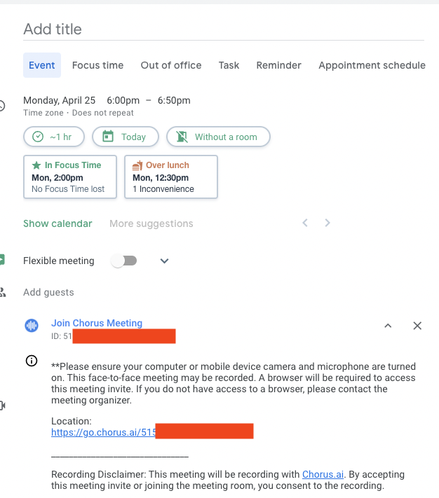
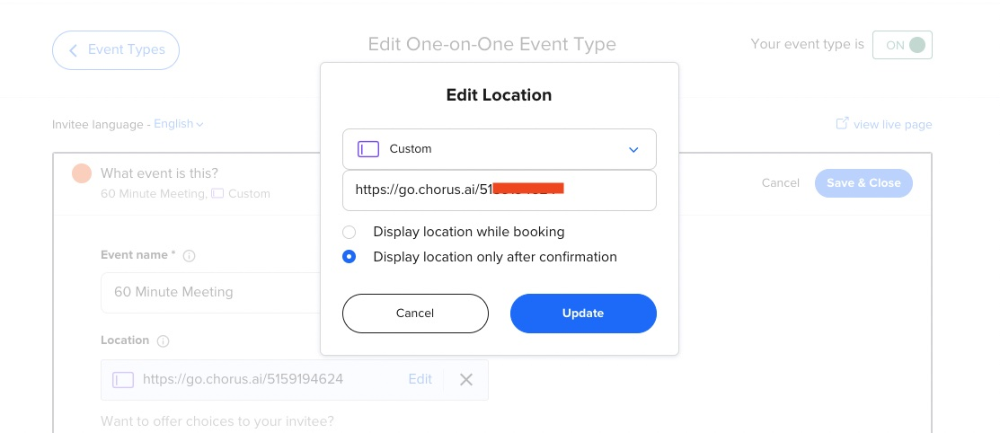

## On this page
{:.no_toc .hidden-md .hidden-lg}

- TOC
{:toc .hidden-md .hidden-lg}

View the [CSM Handbook homepage](/handbook/customer-success/csm/) for additional CSM-related handbook pages.

- - -

*For an overview of Chorus, the tool used to record our meetings please refer to the [Gainsight Overview Page](/handbook/sales/field-operations/sales-operations/go-to-market/chorus/).*

## Setup Calendly for Customer Success Managers

CSMs use Calendly to efficently manage customer requests for booking ad-hoc meetings.

To ensure that a CSM's Calendly is setup to comply with GDPR and similar privacy laws, all team members with a Recorder license in Chorus are required to use a feature called Chorus Scheduler when organizing meetings with customers. Below are the steps required to use Chorus Scheduler for your events booked via Calendly.

To start, login to calendly.com and [edit your event details](https://help.calendly.com/hc/en-us/articles/360000787673-Customize-Your-Event-Types) used for booking time with the following recommendations:

-   *Location*: Custom (Use a Static Link from Chorus Scheduler generated from your Zoom PMI)

    -   Visit [Learn How to Use Chorus.ai](/handbook/sales/field-operations/sales-operations/go-to-market/chorus/#chorus-scheduler) for instructions on how to create a Static Link from Chorus Scheduler.
    -   To create/view the Static Link
        -   Link your [Zoom PMI](https://support.zoom.us/hc/en-us/articles/203276937-Using-Personal-Meeting-ID-PMI-) in the Chorus Scheduler Settings (one time only)   
        -   Then create a test event on your Google calendar, click Add video conferencing, select Chorus Meeting. You will then be able to view the Chorus Go static link (Domain: go.chorus.ai).
        -   
    

    -   Next, add the go.chorus.ai link to your calendly event configuration Location field.  
        -   *Imporant Note*: Anyone booking through your calendly would use the same location link when booking an event instead of an automatically generated unique meeting ID per meeting. Please make sure your Zoom Personal Meeting follows GitLab’s best practices on [privacy and security](/handbook/tools-and-tips/zoom/#a-note-on-privacy-and-security).
    
        -   Make sure to select display location only after confirmation
        -   
    

-   *Description/Instructions* (add the following recommended text)
    > **This face-to-face meeting may be recorded. A browser will be required to access this meeting invite. If you do not have access to a browser, please contact the meeting organizer.
    > 
    > You will join a Zoom meeting via Chorus.ai
    > 
    > _______________________________
    > 
    > Recording Disclaimer: This meeting will be recording with [Chorus.ai](https://www.chorus.ai). By accepting this meeting invite or joining the meeting room, you consent to the recording.```

-   *When can people book this event?*
    -   Date range: 60
        -   _Best practice_: Always make sure your calendar is up to date with PTO, Holidays, busy blocks to ensure your personal time/focus time is protected.
    -   Duration: 60 minutes
    -   How do you want to offer your availability for this event type?
        -   Use an existing schedule
        -   Which schedule do you want to use for this event type?
            -   [Working hours](https://help.calendly.com/hc/en-us/articles/360055073694-How-to-set-up-and-edit-your-available-hours-)
-   Want to add time before or after your events?
    -   Before event: 15 min
-   (unfurl the Additional rules for your availability section/link)
    -   Start time increments: 60 minutes
    -   Scheduling conditions
        -   Invitees can’t schedule within: 2 days of an event start time
            -   Best practice notes: Gives you enough time to research the customer, review support tickets, GitLab issues and sync with the account team if needed. Also allows for buffer time if a customer happens to want to book time on the weekend so you don't have a call first thing on Monday morning for example.
    -   Maximum allowed events per day for this type of event: 2
        -   Best practice notes: Allows you to have the time and space to review your notes/recording and start research for a follow-up response, as well as handle other duties as a CSM (providing assistance to webinar Q&A, professional development, internal meetings, focus time, etc.)
    -   Time zone display: automatically detect
    -   Secret event: unchecked/disabled

