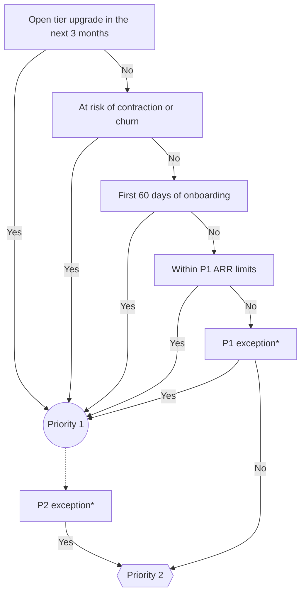

## On this page
{:.no_toc .hidden-md .hidden-lg}

- TOC
{:toc .hidden-md .hidden-lg}

View the [CSM Handbook homepage](/handbook/customer-success/csm/) for additional CSM-related handbook pages.

---

We are currently developing new account segmentation which will be implemented in the future. Please see the [Customer Segments](/handbook/customer-success/csm/customer-segments-and-metrics/) page for details.
{: .alert .alert-info}

There are three models currently offered for Customer Success Manager engagement. These are broken into tiers that currently use Annual Recurring Revenue as a metric for determining a manageable volume for a single Customer Success Manager and the depth of involvement during the engagement.

## Managing the Customer Engagement

Customer Success Managers will typically manage customer engagements via a GitLab project in the [`account-management` group](https://gitlab.com/gitlab-com/account-management/). This project will be based off the [Enterprise](https://gitlab.com/gitlab-com/account-management/customer-collaboration-project-template) or the [Commercial](https://gitlab.com/gitlab-com/account-management/commercial/templates/new-customer-project/) Customer Success Plan Template and customized to match the customer's needs as outlined above. The project is pre-loaded with milestones, issues, labels, and a README template to help kick off the project and outline a proof of concept, implementation, and customer onboarding. The following is a short [introduction video](https://youtu.be/b8D67EJjL9w) on GitLab's first iteration of the Customer Success Plan.

### Start a new customer engagement

1. Somewhere between step 3 and step 7 of the customer journey sequence, a Solutions Architect should create a project for the customer in GitLab and include a Professional Services Engineer and Customer Success Manager who are best aligned with the customer account. This typically only applies to Enterprise accounts.
2. After the Customer Success Manager has been aligned with the account, they will assign themselves to the “Customer Success Manager” field within Salesforce.
3. The Customer Success Manager confirms that a new customer project has been created based on the [Enterprise](https://gitlab.com/gitlab-com/account-management/customer-collaboration-project-template) or the [Commercial](https://gitlab.com/gitlab-com/account-management/commercial/templates/new-customer-project/) Customer Success Plan Template. If it hasn't, they need to create it and work with the Strategic Account Leader/Account Executive and/or Solutions Architect to complete it. This _should_ have been done prior to Customer Success Management involvement for all Enterprise accounts. For Commercial accounts, the CSM will create the project once they receive the account and determine it is beneficial to have a customer project.
4. Follow the steps in the PLEASE-READ-THESE-INSTRUCTIONS.md file.

### Start a customer upgrade engagement

1. After the Customer Success Manager has been aligned with the account, they will assign themselves to the “Customer Success Manager” field within Salesforce.
1. Provided that the customer is part of the [CSM-Assigned segment](/handbook/customer-success/csm/customer-segments-and-metrics/#csm-assigned-segment), confirm that the customer project has been created previously during the customer journey sequence, and if not available create a project for the customer in GitLab and include a Customer Success Manager who is best aligned with the customer account transition. For Commercial accounts, the CSM will determine if it is beneficial to have a customer project.
1. Verify that the project complies with the [Enterprise](https://gitlab.com/gitlab-com/account-management/customer-collaboration-project-template) or the [Commercial](https://gitlab.com/gitlab-com/account-management/commercial/templates/new-customer-project/) Customer Success Plan Template.
1. Follow the steps in the PLEASE-READ-THESE-INSTRUCTIONS.md file.

### Where does a Customer Success Manager fit in?

During the pre-sales process for Enterprise accounts, a Solutions Architect owns the project with assistance from the Strategic Account Leader and should include the Professional Services Engineer if there is one assigned. A Customer Success Manager is involved but only for visibility. Until the account becomes a paying customer the project remains in pre-sales. Once the customer has paid, the Strategic Account Leader will set up the "Welcome to GitLab" call along with the key GitLab employees (SAL, SA, PSE and Customer Success Manager) and the customer. There is a preloaded issue for this in the project template.

For Commercial accounts, the Account Executive owns the pre-sales process and [engages a Solutions Architect](/handbook/customer-success/solutions-architects/#commercial-engagement-model) as needed. Once the account becomes a paying customer, the Customer Success Manager will create a customer project if it will be useful to their relationship with the customer, and the Account Executive will schedule a "Welcome to GitLab" call with the customer and the Customer Success Manager.

The "Welcome to GitLab" call will introduce the customer to the Customer Success Manager and begin the handover process. The Customer Success Manager will then lead the rest of the call and own the customer project. If the project was created in the pre-sales project under the [`pre-sales account-management` group](https://gitlab.com/gitlab-com/account-management/pre-sales), then it is moved to a post-sales project under [`account-management` group](https://gitlab.com/gitlab-com/account-management).

### Customer Engagement Tips
1. Make use of the [account management projects](https://gitlab.com/gitlab-com/account-management)  ([Template](https://gitlab.com/gitlab-com/account-management/templates/customer-collaboration-project-template))
1. Whenever a customer asks a question via email/Slack, kindly prompt them to open a Support ticket or an issue in the collaboration project
  * Examples of a Support issue: Reporting GitLab downtime, errors or accessibility problems
  * Examples of a Collaboration Project Issue: General questions about product usage, best practices or recommendations, adoption or integration questions
1. Show customers the power of GitLab by using GitLab with them (ex: related issues, tracking milestones, threaded conversations, ability to interact directly with GitLab’s product/engineering teams)
1. Make sure you are responding in a timely manner to customer's open issues. When you are prompt to respond, the customer is more likely to continue using the account management projects
1. Have discussions in the public issues as much as possible. If there is a question/discussion point that requires interaction with the GitLab Engineering and Product teams, post it in the public issue, as it most likely benefits everyone reading the public issue.
1. When adding a SFDC link to a public issue, remember to [provide feedback](/handbook/product/how-to-engage/#a-customer-expressed-interest-in-a-feature) to the product managers using the [feedback template](/handbook/product/how-to-engage/#feedback-template)
1. In-person meetings are some of the most impactful and productive engagements, but they are also the most expensive in terms of time and money. To make sure both parties get the most out of an in-person meeting have an agenda planned well in advance and send the agenda to all parties attending the meeting. Also, if a GitLab E-group member is attending the meeting, an [Executive Briefing Doc](https://docs.google.com/document/d/1hyA12EN5iEwApAr_g4_-vhUQZohKxm5xkX9xxZ1JNog/edit) (internal link) will also be required (see the next section for more details on engaging with an e-group member).

### E-Group Customer Calls

Occassionally, a GitLab e-group member (VP or C-level) will be meeting with a customer, for example, as part of an executive briefing, escalation, etc. Please review the [EBA handbook page](/handbook/eba/) on guidance on how to schedule with the E-Group, specifically the section on [customer, prospect, and partner meetings with an E-Group member](/handbook/eba/#customer-prospect-and-partner-meetings-with-an-e-group-member). There will be a prep call prior to the customer call (typically the day before), and there is an [Executive Briefing Document](https://docs.google.com/document/d/1hyA12EN5iEwApAr_g4_-vhUQZohKxm5xkX9xxZ1JNog/edit) (internal doc link) that must be prepared and shared with the EBA in advance of the prep call, in addition to any materials that will be used during the customer call. Below are some tips to ensure a positive experience:

1. Work on the prep doc and call resources with your account team.
1. Be as thorough as possible about your customer's details (e.g. ARR, # of users, tier, renewal date, stages in use)
1. Ensure you answer the 5 W's (who,what,where,when,why) of the meeting and what should be the outcome of the meeting.
    - Make sure that we detail both what GitLab wants out of the meeting and what the customer wants out of the meeting. This is a collaborative partnership that benefits both parties.
1. Be prepared in advance of what you want the E-Group member to do, say, and ask.
1. Have an agenda for the call and ensure everyone knows what they're supposed to do (who will speak when and about what).
1. Add any topics you think the customer may bring up (positive or negative) and advice on how to approach it.
1. Provide links wherever possible (e.g. documentation, feature requests, blockers, etc.).
1. To add a deep-link to the Gainsight Success Plan, go to the CSM Portfolio dashboard, scroll down to the "Success Plans by Account" widget, expand the report (click the square on the top bar of the report), then click the link under the "Success Plan" (not the link in the account name column to the C360); copy and paste this link to the document. It's typically recommended to use the Gainsight direct login, rather than the Salesforce login, for this purpose.

For an example of a prep doc and additional materials that received positive feedback, please visit this **internal only** [Google doc](https://docs.google.com/document/d/1Ym7DUw4jfol3QHy4TaiDXlB__u5-oev85WiYrs5apGg/edit).

### Disengaging with a customer

There are situations when a CSM needs to disengage with a customer. Examples include:

- A customer downgrades or churns and is [below the CSM alignment threshold](/handbook/customer-success/csm/services/#csm-alignment)
- A CSM has been engaged with a customer [below the CSM alignment threshold](/handbook/customer-success/csm/services/#csm-alignment) for a strategic purpose such as a tier upgrade that was unsuccessful

When this happens, it is important to manage the disengagement so that the customer understands the reason, and is clear on who they should communicate with going forward. Here are some recommendations for how to have this conversation:

- Do it in person (or face-to-face via Zoom), and include the SAL/AE since they will retain the relationship.
- Be honest about the reason. Each situation will be different, and it's a good idea to talk it over with your manager.
- Go over their options for assistance going forward (below).
- Send a follow-up that summarizes what was discussed, including their assistance options.

Recommended options to review with the customer include:

- Troubleshooting, errors, outages, and basic "how to" technical questions should go to Support.
- Complex "how to" and workflow advice should be sent _in writing_ to the SAL/AE. Doing it in writing lets them work with the whole of Customer Success asynchronously to get the best solution.
- If disengagement is due to the customer downgrading/churning, identify the features they will lose access to with the [feature comparison](https://about.gitlab.com/pricing/feature-comparison/) page. 
- Online resources such as the GitLab documentation, blog, YouTube channels, [community forum](https://forum.gitlab.com/) and other relevant materials that they can for self-serve guidance.

## Customer Personas

Customer Success Managers focus on helping customers achieve business outcomes by advising and enabling customers on usage of GitLab features. We are able to do this most effectively when we are engaged with customer personas who are responsible for the capabilities that GitLab provides.

We have defined two key personas that CSMs should regularly engage with and align on outcomes and use cases:

### Development Lead

A member of the customer's development or engineering department, in a leadership role. This person is aware of and/or responsible for delivering on customer business objectives related to the customer's software production. They are able to speak to development workflows, and SDLC and DevOps practices and challenges.

### Software Security Lead

Has responsibility for the security of the software the customer develops. This person is able to speak to business requirements, objectives, compliance frameworks, etc. that the customer has related to the software they produce. They have knowledge of (and possibly own) the customer's current security scanning & management tools.

### Persona Enablement

We have [role-play scenarios to practice identifying and gaining access to the defined personas](/handbook/customer-success/csm/roleplays/#customer-personas).

### Capturing customer personas in Gainsight

Customer personas are attributed to individual contacts in Gainsight when viewing an account. To capture a customer persona, use the following steps:

1. Inside of the account view, click the `Contacts` link on the left.
1. Switch to List View by clicking the button next to the word "Contacts" at the top of the screen.
1. Search for the contact you would like to update, and click on their name.
1. In their contact record, edit the `GitLab Role` field and select the persona(s) that apply to them, and then save the field by clicking the check button to the right.

## Customer Prioritization

GitLab uses a customer prioritization model and [associated metrics](/handbook/customer-success/csm/customer-segments-and-metrics/) based on their customer segment (Strategic, Mid-Touch, Scale) to focus the CSM's efforts where they will have maximum value and impact. 

On the Gainsight Attributes section, the CSM can set the priority level per customer with levels 1 or 2, with 1 being the highest. A new CSM-assigned customer coming on to GitLab will default to Pr1 until their onboarding enablement is complete. Pr3 is solely for unmanaged child accounts, and Pr4 is only for our digital customers and not for the CSM-assigned segment, with the exception of the Public Sector that is trialing a CSM-assigned digital customer. Priority definitions vary by CSM segment.

 

Why do we use a prioritization system?

- To enable focus on customers that have an imminent opportunity for growth or that require near-term risk mitigation
- To ensure that their book of business does not overburden the CSMs
- To give CSM Managers more visibility into the potential workload of their team via more context on the makeup of the overall portfolio
- Used to further segment customers, beyond the [Sales Segmentation](/handbook/sales/field-operations/gtm-resources/#segmentation)

The `CSM Portfolio` Dashboard is used to help highlight and review each client, including their priority level.

### Strategic Accounts

Priority definitions are as follows:
1. **Priority 1**: 
    1. [CSM-led onboarding](/handbook/customer-success/csm/onboarding/)
    1. Biweekly check-in call 
    1. Yearly [EBR](/handbook/customer-success/csm/ebr/) (as minimum)
    1. Active [Account Growth Plan](/handbook/customer-success/csm/account-growth/)
    1. 1 active Stage Enablement playbook on customer's current use case
    1. 1 active [Stage Expansion](/handbook/customer-success/csm/stage-enablement-and-expansion/) playbook into new stage
    1. 2 [CSM led workshops](/handbook/customer-success/csm/workshops/) per year
1. **Priority 2**: 
    1. [CSM-led onboarding](/handbook/customer-success/csm/onboarding/)
    1. Monthly check-in call 
    1. Yearly [EBR](/handbook/customer-success/csm/ebr/) (as minimum)
    1. Renewal touch point no less than 3 months prior to renewal
    1. Customer attends 2 [Scale Webinars](/handbook/customer-success/csm/segment/scale/webinar-calendar/) per year
1. Priority 3: Non-managed child accounts only

CSM-assigned customers are segmented into two priority tiers: `Priority 1 (P1)` and `Priority 2 (P2)`. We use a series of "yes/no" parameters to evaluate a customer's prioritization, based on the key aspects of a CSM's responsibilities and value to the customer. There may be rare use of a `Priority 3 (P3)` tier, wherein an account is a child account that is not actively managed outside of its parent account but is still within the Strategic segment.

Each CSM should aim to have roughly one third (1/3) of their book of business listed as `Priority 1`, and the rest as `Priority 2`.

#### Determining priority

##### Parameters

The following parameters are considered when determining customer prioritization:

| Parameter                                                                     | Yes                                                                                                 | No                                                                                                               |
|-------------------------------------------------------------------------------|-----------------------------------------------------------------------------------------------------|------------------------------------------------------------------------------------------------------------------|
| **Open tier upgrade in the next 3 months**                                                         | Upgrade opportunity is open in Salesforce and actively being discussed with the customer            | No open opportunity in Salesforce, and/or no active upgrade discussion with the customer                         |
| **Contraction or Churn risk**                                    | Account in Triage process                                    | No contraction or churn risk identified                                      |
| **Onboarding**                                    | Within first 60 days of onboarding                                    | Not in onboarding phase                                      |
| **ARR limit**                                    | [Within ARR limits for P1](https://internal-handbook.gitlab.io/handbook/customer-success/csm/)                                    | Not within ARR limits for P1 phase                                      |

##### Prioritization model

Using the defined parameters and guidance on how to know whether they are applicable, we can use the following flowchart to evaluate priority:

<!-->
Online Mermaid editor: https://mermaid-js.github.io/mermaid-live-editor
<-->

A [working spreadsheet](https://docs.google.com/spreadsheets/d/12n3EvB_KpJJp_cz_bfKIhMWoQkjZcLlzggc7xN6De6k/edit#gid=438918120) was created to help determine customer priority.

_* Please see [priority exceptions](#priority-exceptions) for details._

##### New customer onboarding

When a [new customer is in onboarding](/handbook/customer-success/csm/onboarding/), they are automatically `Priority 1`. This is a key lifecycle event for a customer, which warrants high engagement from the CSM. Once onboarding is complete, the customer's prioritization should be reassessed.

#### Keeping prioritization updated

Since the parameters used to evaluate customer prioritization will change over time, each account's priority should be reviewed and updated **quarterly**, coinciding with [QBRs](/handbook/sales/qbrs/).

#### Priority exceptions

There are occasions that warrant a customer to be prioritized differently than the model indicates. In cases where the CSM and/or SAL believes this is true, an exception may be made.

Examples of when an exception may be appropriate include:

- A large, strategic customer with no [LAM](/handbook/sales/sales-term-glossary/)
- A customer with large [LAM](/handbook/sales/sales-term-glossary/) but no clear & active growth path
- A customer with [risk](/handbook/customer-success/csm/health-score-triage/) (which is not factored into the prioritization model) which requires higher engagement to address and mitigate the risk)

In order to make an exception, the CSM or SAL should discuss the details with the members of the [account team](/handbook/customer-success/account-team/#enterprise) and their respective managers. Exceptions will be addressed to the regional Sales Management team and documented in Gainsight.

### Growth Accounts

The Growth segment aims to have no more than 20% of a CSM's book of business to be Priority 1 at any given time.

For a customer to be Priority 1, they must meet at least one of the following parameters:
- Contraction or churn risk
- Onboarding
- Expansion opportunity with significant net ARR

#### Risk Prioritization

There are a few most-common types of risk we see: red DevSecOps adoption, low license utilization, low PTC score, and non-engagement.

The following two cases qualify a customer to be both red health and Priority 1 immediately:

1. **Red DevSecOps adoption**: If an account has low [DevSecOps adoption](/handbook/customer-success/product-usage-data/use-case-adoption/#devsecops) on Ultimate
2. **Red license utilization**: If an account has low license utilization (less than 60%)

The following two cases require further consideration and/or triage before automatically qualifying them for red health and P1:

1. **Low PTC score**: If an account has a 1 or 2 PTC score, this is an important indicator that we need to do discovery with the customer on potential risk as soon as possible. We receive PTC scores 6 months prior to renewal, so we need to act on it quickly and ask the soft renewal question. If the answer is not a clear "yes, we will renew flat or more", then the customer qualifies for red/P1. 
2. **Non-engagement**: If an account is new to GitLab and does not respond to our introduction or engage within 1 month of purchase, this qualifies them to be red/P1. If an account was previously engaged but doesn't show up to calls anymore, the CSM should send an email immediately after they miss a call, and if we don't hear back from the customer within 1 week, they then qualify for red/P1.
    - The CSM should attempt to reach out 2-3 times with the contacts they have available. If they are not successful, the Sales team should own the outreach going forward, whether that is the SAL, AE, or ISR. CS and Sales leadership can also be requested to reach out to the customer, if provided context and an email template.

#### Onboarding Prioritization

We [onboard](/handbook/customer-success/csm/onboarding/) customers that are both entirely new to GitLab, as well as customers that have been customers for a while but are new to having a CSM.

1. **New customers**: If an account is brand new to GitLab, the CSM should meet with them weekly for their first month to get them up to speed quickly. Their initial implementation and adoption of GitLab is crucial to their long-term success, and we want to ensure they have the support they need to onboard quickly.
2. **Existing customers**: If an account is not new to GitLab and only new to a CSM, the CSM should set them at P1 until they have their kickoff call. After that, the CSM should change them to P2 and set up a quarterly cadence, but provide the option for the customer to have an additional sync point within the first month. The CSM should also review the customer's renewal date, usage data, and PTC score, which could keep them in P1 and increase meeting frequency in order to mitigate any potential risk.

#### Expansion Prioritization

Customer growth is the pillar of what the Growth CSMs do. Much of that growth is a natural byproduct of our day-to-day engagement with customers, ensuring they are adopting and getting the resources they need. However, we do have large upsell opportunities as well that benefit from additional attention.

The CSM has the autonomy to review potential growth opportunities in their customer base and determine if the account would benefit from being classified as P1 with additional attention and sync calls.

If the growth opportunity is an uptier from Premium to Ultimate, [the SAL/AE and SA](/handbook/customer-success/#overlap-between-solution-architects-and-customer-success-managers) should be leading this engagement, as it's a pre-sales motion, but the CSM should be involved throughout the process, keeping up to date on requirements, feedback, etc. to ensure that when a customer does upgrade, there is a seamless transition from planning to implementation.

#### Prioritization Differences

The primary difference between Priority 1 and Priority 2 customers is the frequency of synchronous engagement:
- **Priority 1:**
   - Weekly cadence calls for at-risk and newly onboarding customers (for first 30 days)
   - Monthly cadence calls for customers with expansion opportunities
- **Priority 2:**
   - Quarterly cadence calls

Priority 1 customers will also have more focus on having EBRs to ensure alignment on use case adoption and future expansion.

#### Prioritizing Tasks

Even with the prioritization model, all customers require attention, which can be difficult to handle with a larger book of business.

Below is some guidance to help CSMs scale their workload:

- Ramped Growth CSMs are expected to give [3 workshops per quarter](/handbook/customer-success/csm/segment/mid-touch/#expand-and-renew-1); reduce the number of workshops that are for a single customer, and plan to do a single workshop where you invite several of your customers who could benefit. In this way, we are able to help drive adoption across our customer base more efficiently, and still keep the sessions small and interactive as only your customers are invited. We can also use cadence calls to dive into questions individual customers may have afterwards, allowing for a more personalized experience, without devoting the workshop to them. Setting up a quarterly (or other cadence) frequently of regularly giving particular workshop topics is one way to make planning for this simpler and ensure you continue to provide value to customers.
- Our guidance for at-risk customers is to create a [triage issue](/handbook/customer-success/csm/health-score-triage/#gitlab-account-triage-project), but this isn't always a good use of time. Growth CSMs are not required to open triage issues for every at-risk account. They should opened an issue if the risk is due to 1. product blockers 2. PS concerns 3. ongoing negative support experience 4. license & pricing conerns, or 5. sustained non-engagement where we need help from Sales.

#### FY24 Growth Prioritization

As GitLab moves into FY24, we are changing how we look at prioritization in order to be more efficient and continue to drive customer ROI. In line with the Growth team's goals of having a programmatic approach to grow a large customer base and aligning on and building success goals with each customer through usage reporting and strategic touchpoints, we will be pivoting to prioritizing customers based on use case adoption. The below information is a work in progress as we roll out this change.

- **0 or 1 use cases adopted**: Customers who have 0 or 1 use cases adopted (aka with green health score) should all be Priority 1. Our primary focus should be getting them to have at least 2 green use cases, in line with their desired business outcomes and reasons for purchase. This typically includes all onboarding customers as they begin to adopt the platform.
- **2 use cases adopted**: Customers who have 2 use cases adopted are prioritized on a case-by-case basis depending on the CSM's sentiment and which use cases have been adopted. For example, if an Ultimate customer has green SCM and CI but red DevSecOps, they should still be a Priority 1 until DevSecOps is adopted.
- **3 or more use cases adopted**: Customers who have 3 or more use cases adopted should be Priority 2. There is of course flexibility if a customer has extenuating circumstances, but this should be discussed with the CSM's manager to determine how much time the CSM should devote to the account.
- **Regardless of use cases adopted**: any Ultimate customer with red DevSecOps health score should be a Priority 1. Any exceptions need to be approved by the CSM's manager.

For any customers that do not have usage reporting available, the CSM should regularly ask the customer discovery questions about their usage to determine how well-adopted they are and where they may be gaps, as well as request a copy of the payload in order to get a snapshot in time of their adoption. The CSM should review any customers who do not have usage reporting or provide a payload with their manager to appropriately prioritize them.

Priority 1 customers will continue to have monthly cadence calls, with the exception of newly onboarding customers, who should have weekly syncs for their first 30 days. Priority 2 customers will continue to have quarterly cadence calls.

### Scale Accounts
The Scale Account prioritization model will be defined in FY23Q1.

