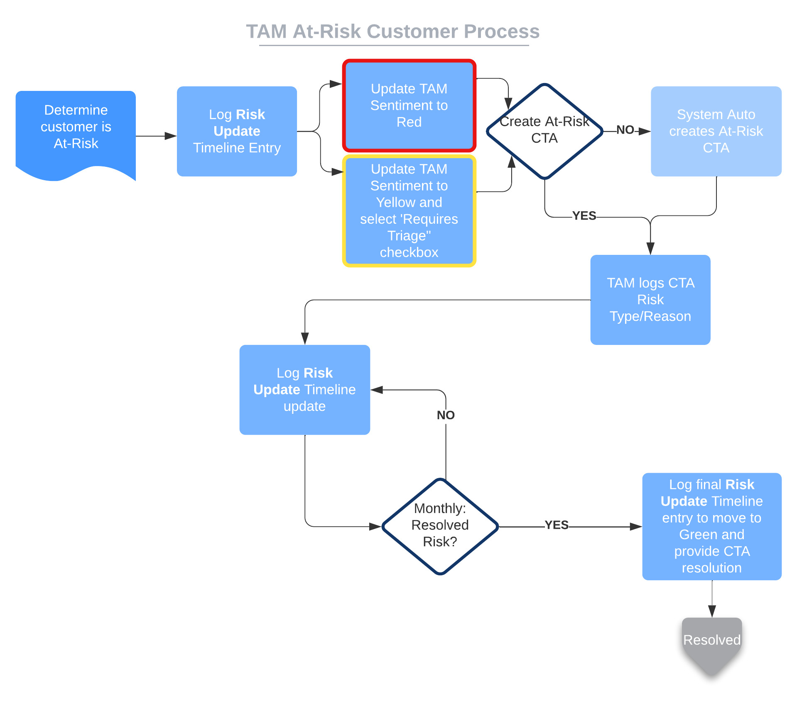

## On this page
{:.no_toc .hidden-md .hidden-lg}

- TOC
{:toc .hidden-md .hidden-lg}

View the [CSM Handbook homepage](/handbook/customer-success/csm/) for additional CSM-related handbook pages.

Link to [Commercial Renewal Process](/handbook/customer-success/comm-sales/renewals/)

## Overview

A key part of the customer relationship lifecycle is the renewal phase. CSMs must proactively track the renewal dates of their customers and align with their Strategic Account Manager (SAL) or Account Executive (AE) to ensure that a customer renewal takes place.

## Timeframe

4 months before the renewal date for a customer, a CTA will trigger in Gainsight to prompt the CSM to reach out to their aligned account team to discuss strategy and next steps for the renewal. The expectation is that the team will meet internally and speak with the customer regarding the renewal within the following 30 days. This leaves three months to execute any renewal strategy, such as an account triage.

## Renewal playbook steps

1. Renewal Review: Internal sync with SAL/AE and potentially SA as defined below
1. CSM asks 'Soft' Renewal Question
1. Update `CSM Sentiment` as appropriate

Once the above tasks are complete, the playbook and CTA can be closed out as all actionable items have been performed.

## Renewal review meeting - internal sync

A renewal review meeting should have the following attendees:

- Strategic Account Leader
- Customer Success Manager
- Solutions Architecht, if an upsell is being discussed

For CSMs with larger books of business, it is appropriate to update an AE or SAL async that they are going to ask the soft renewal question in their next sync, to ensure they are aligned with other conversations that are ensuing.  

## `Soft` renewal question

The CSM will ask the initial renewal question, this should be a ['soft'](https://www.mbaskool.com/business-concepts/marketing-and-strategy-terms/7214-soft-fact-questions.html) question to see if there is any risk in the account and to provide time to mitigate any risk.  An example of this soft question is, "I know you have your renewal coming up in the next few months - how are you feeling about the renewal currently, and are there any changes you are considering that we can prepare for?"

If the status of the renewal is already known (renewal conversation with SAL or AE has happened, negotiations or contract is in-flight), the CSM can close the renewal CTA selecting the appropriate close reason. 

## Renewal plan

The action items created from the “Renewal Review” meeting should be incorporated into the CSM customer cadence meetings and into any pending QBRs. The actual renewal plan will be documented by the SAL or AE in Salesforce.

## Tracking account health and risks

For greater predictability across the customer base for renewal, upselling, downgrade, and churn, tracking account health and risks is incorporated into Gainsight. This process creates tighter collaboration with the overall CRO Organization and the rest of GitLab.

Note: This was formerly at the opportunity level instead of account level. It was moved to account to be long-term oriented and as Sales owns the opportunity.

To learn the full process, watch the [At-Risk Customer Process](https://youtu.be/MQqfL3WT1zo) video.  

See the [At Risk Customers Dashboard](https://gitlab.gainsightcloud.com/v1/ui/gsdashboard#/8e0f5cb6-c8e1-4b06-8cd2-92af72d76615) for more information.

### At-risk process

CSMs can use Red, Yellow, and Green to reflect their sentiment of a customer's contraction or churn risk. Below is a brief explanation about how to think about colors in the At-Risk process. Links provide more detailed information.

- [Green](/handbook/customer-success/csm/health-score-triage/#green) - Healthy customer, no risk of contraction or churn. No risk follow-up required.
- [Yellow](/handbook/customer-success/csm/health-score-triage/#yellow) - Some low risk, or some admin hygiene needed. No risk follow-up required.
- Yellow with Requires Triage - Higher level of risk, including product risk. Indicates that CSM has started corrective actions on an account and follow - up from team members outside of the CSM group is needed, but it is not red yet.
- [Red](/handbook/customer-success/csm/health-score-triage/#red) - High risk of contraction or churn. Indicates that At-Risk Process is required.

### When a CSM has determined an account is red:

1. **Create Triage Issue**: CSM to [create triage issue](https://gitlab.com/gitlab-com/customer-success/account-triage/-/issues/new) in CSM Unhealthy Account Triage project
1. **Log Timeline: Risk Update**: log Account-level `At-Risk Update` Timeline post marking CSM Sentiment as Red and any context for the at-risk account
1. **Create CTA**:
   1. Immediate: CSM will create an `At-Risk` CTA to track the high level risks, OR
   1. Overnight: Gainsight will auto create the `At-Risk` CTA overnight for the CSM if `Requires Triage` box was checked
1. **Update CTA**: CSM to update Risk Impact and Risk Reason dropdown fields
1. **Weekly Timeline Update: Risk Update**: CSM logs Account-level `At-Risk Update` Timeline post. Update CTA as necessary
1. **At-Risk Conclusion**:
   1. Customer is won back:
      1. Log Account-level Timeline `At-Risk Update` type for CSM Sentiment as Green and final notes
      1. Change customer Lifecycle Stage to Adopting
      1. Close out CTA with success criteria (Closed-Won, win reasons)
   1. Customer is lost:
      1. Log Account-level Timeline `At-Risk Update` type with final update
      1. Change customer Lifecycle Stage to: Will Churn for a churning customer and Adopting for downgrade customer
      1. Close out CTA with success criteria (Closed-Lost, loss reasons)

**Tips**:

- **Keep the CTA open until fully resolved**. Resolved can mean the customer is won back, contraction has happened, or they will churn
- Use `closed-won` when we saved the customer AND had a flat or positive net ARR opportunity
- Use `closed-lost` when we churned the customer or had contraction

This can then be discussed with the [Account Team](/handbook/customer-success/account-team/) during account reviews.

#### When a CSM has determined an account is yellow and requires triage:

1. **Create Triage Issue**: CSM to [create triage issue](https://gitlab.com/gitlab-com/customer-success/account-triage/-/issues/new) in CSM Unhealthy Account Triage project
1. **Log Timeline: Risk Update**: log Account-level `At-Risk Update` Timeline post marking CSM Sentiment as Yellow and any context for the at-risk account 
1. **Create CTA**:
   1. Immediate: CSM will create an `At-Risk` CTA to track the high level risks, OR
   1. Overnight: Gainsight will auto create the `At-Risk` CTA overnight for the CSM if `Requires Triage` box was checked
1. **Update CTA**: CSM to update Risk Impact and Risk Reason dropdown fields
1. **Weekly Timeline Update: Risk Update**: CSM logs Account-level `At-Risk Update` Timeline post. Update CTA as necessary
1. **At-Risk Conclusion**:
   1. Customer is won back:
      1. Log Account-level Timeline `At-Risk Update` type for CSM Sentiment as Green and final notes
      1. Change customer Lifecycle Stage to Adopting
      1. Close out CTA with success criteria (Closed-Won, win reasons)
   1. Customer is lost:
      1. Log Account-level Timeline `At-Risk Update` type with final update
      1. Change customer Lifecycle Stage to: Will Churn for a churning customer and Adopting for downgrade customer
      1. Close out CTA with success criteria (Closed-Lost, loss reasons)

This can then be discussed with the [Account Team](/handbook/customer-success/account-team/) during account reviews.

## Fields

### Account health

When a CSM considers an account at-risk of contraction or churn, they should set the Account's `CSM Sentiment` to **red**. From there, the CSM can create an at-risk CTA on the account, or Gainsight will auto-create it during the nightly sync (within 24 hours). 

### Risk impact

* **Customer Churn** - fully churn the account
* **Tier Downgrade** - move down tiers
* **Seat Churn** - reduce license seat count
* **Customer Sentiment** (Impact Unknown) - customer is unhappy and the impact isn’t quantified
* **Competitor** - any competitive intelligence we might be up against
* **Stage Name** - stage impact, for example, product deficiencies, direction, or needs.

### Risk reasons

#### Lack of adoption

Customer never adopted the product or specific features so they did not get value. This can be because of organizational silos or lack of internal resources. If they didn't adopt because they didn't see / experience value, it should be Product Gap

#### Product Value / Gaps

Prospect or customer used the product and features (i.e., trial, POV, or purchased product), but did not see the value. The product did not meet requirements of the customer. This can also be a prospect where they did not experience perceived value

#### Product Quality / Availability

Prospect or customer used the product and features (i.e., trial, POV, or purchased product) though they did not meet the prospect or customer's needs or expectations. This can be defects, poor performance, or uptime/availability issues. Includes both self-managed and SaaS products

#### Lack of Engagement / Sponsor

We lost or were never able to get engagement with the prospect or customer team. The champion / sponsor left, changed responsibility, or became unresponsive. We were never able to re-establish connection with a new sponsor or champion

#### Loss of Budget

The prospect or customer lost budget due to business contraction, change of priorities, reduction of employees, or other. This was not a competitive loss.

#### Corporate Decision

Due to management decision or policy, the prospect or customer chose a different product but not because of product gaps, adoption, etc. This would be a top-down decision (e.g., ELA, decision to commit to a single provider)
* **Other** - other company issues that contribute to a blocker for the renewal
 
## Manually create an at-risk CTA

To create a CTA manually:

1. In the Cockpit, select `CTA`.
1. Enter the title for the CTA.
1. For Type select`Risk`.
1. For `Reason`, select the appropriate reason. See [Risk Reasons](#risk-reasons).
1. In Playbook select `Account Triage`.

## GitLab account triage project

An account risk issue should be created in the [Account Triage Project](https://gitlab.com/gitlab-com/customer-success/account-triage) if the customer health assessment is either yellow or red. These are also viewable in the [CSM Risk Account Issue Board.](https://gitlab.com/gitlab-com/customer-success/account-triage/-/boards/703769)

### Update frequency

When an account is in triage, keep the triage issue updated as follows:

- **Red:** All next steps should have an associated date and the update frequency needs to be ahead of expiring due dates.  The minimum update frequency on a red account should be bi-weekly to ensure that usage stats are fresh and focus is not lost.
- **Yellow:** At a minimum monthly, ahead of pending due dates and as new information is available

If nothing of note has occured since the last update, indicate that as well as the next steps you are taking.

### Issue template

When creating an issue in the [Account Triage](https://gitlab.com/gitlab-com/customer-success/account-triage) project, the default template will set up the details you should include. Follow the instructions laid out in the issue description by the template for what information should be documented in the issue.

### Issue labels

When creating triage issues, it's important to apply the correct labels to the issue, so that we can easily track, have a holistic view of the at risk accounts, and be able to triage regionally and/or by priority. It is expected for each issue to contain one of each of the below label categories. Please refer to the [issue template](#issue-template) for more details on how to use them.

### Risk labels

- `~HS::Green`: Green Health Rating
- `~HS::Yellow`: Yellow Health Rating
- `~HS::Red`: Red Health Rating

### Region labels

- `~US-WEST`
- `~US-EAST`
- `~EMEA`
- `~APAC`
- `~LACSM`
- `~Commercial`

### Issue classification labels

- `~E&A` Expected and Avoidable
- `~E&U` Expected and Unavoidable
- `~U&A` Unexpected and Avoidable
- `~U&U` Unexpected and Unavoidable

### Customer success risk reasons

- `~risk::lack of adoption`
- `~risk::product experience`
- `~risk::lack of engagement`
- `~risk::loss of sponsor or champion`
- `~risk::customer sentiment`
- `~risk::other organizational factors`
- `~risk::lack of budget`
- `~risk::competition`
- `~risk::covid-19`

### DevOps stage label

If the account is labeled with a Customer Success Risk Reason of "product experience",
CSMs are encouraged to add a DevOps stage label (i.e. `~devops::*`)
to the triage issue, and clearly identify any related issues that are blocking adoption or required
to improve the customer's product experience within the triage issue.

Identify the Product DRI by from our [product categories](/handbook/product/categories/#devops-stages)
page and ping them in the issue.
As the CSM responsible for the at-risk account, you are accountable for coordinating all resources.
Engage early and often with product and any other groups required to advocate for your customer's desired outcomes.

Because `devops::` labels are scoped; please choose the highest-impact stage label and apply it.

## Related Processes

[Customer Success Escalations Process](/handbook/customer-success/csm/escalations/)
