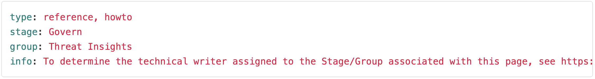

## On this page

{:.no_toc .hidden-md .hidden-lg}

- TOC
{:toc .hidden-md .hidden-lg}

View the [CSM Handbook homepage](/handbook/customer-success/csm/) for additional CSM-related handbook pages.

---

## Where to research customer questions
There are several ways you can research customer questions.

### Google Search
Often it's easiest to cast a wide net when searching customer questions by doing a Google (or another search engine) search. For example, if a customer is inquiring if GitLab does mobile application scanning, you can search "gitlab mobile application scanning" and see related blog posts, documentation, and GitLab issues related to the topic.

Even if you know the answer lies in GitLab's documentation, using the above search method is convenient to link you directly to where in the documentation to continue your research.

This method works amazingly due to GitLab's [Transparency](https://about.gitlab.com/handbook/values/#transparency) value, where we make as much information public as possible.

### Zendesk
Zendesk is a powerful avenue for researching customer questions because every support ticket has been archived and is searchable since GitLab implemented Zendesk many years ago.

If your customer is asking a question, likely, others have asked similar or the same question to our support team. Search Zendesk by keywords from your customer's question to review related tickets. You may need to play around with different keywords until you find support tickets that match your customer's inquiry. Often with a few minutes of researching prior support tickets, you can get a response to your customer quicker than them opening a new support ticket.

**Note:** If the customer requires troubleshooting, you should notify the customer to open a new support ticket, as each inquiry should be treated as unique. What fixed one customer's problem may not work for another, and the Support Team will perform their troubleshooting process.

### Product groups and direction pages
Sometimes it's best to get help from team members working directly in the product area of the question.

#### How to determine which product group is the right one?
There are a few ways to determine which product group works on which feature.

1. Search within the [Product Categories](https://about.gitlab.com/handbook/product/categories/) handbook page. On this page, you can do a Command ⌘ + F search for the feature in question. For example, if the question is on Review Apps, you can do a Command ⌘ + F search to see that the Review Apps feature is under the [Pipeline Insights](https://about.gitlab.com/handbook/product/categories/#pipeline-insights-group) group. If the question is related to our product roadmap, you can review the direction page associated with each product group.

1. Search within the documentation. Let's say you are wondering which product group could help with a question on [GitLab's Security Dashboard](https://docs.gitlab.com/ee/user/application_security/security_dashboard/). If you scroll to the bottom of the page and click `View page source`, you'll see which product Stage and Group the Security Dashboard rolls up to. In this case, it's the Threat Insights group.

1. You can also determine the right product group by reviewing epics/issues related to the feature. For example, when researching [Customizable Roles and Permissions](https://gitlab.com/groups/gitlab-org/-/epics/4035), you see on the right-hand side under labels that Authentication and Authorization is the appropriate group.

#### How do I contact the product group for help?
After finding the appropriate product group for your question, search Slack for the product group's public Slack channel and post your question. 

If it will help to connect your customer with someone in Product directly, provide as much detail as possible in a [Collaboration Project](https://about.gitlab.com/handbook/customer-success/csm/customer-collaboration-project/) issue and @ mention the Product Manager, whom you'll find on the [Product Categories](https://about.gitlab.com/handbook/product/categories/) page. Ask the Product Manager if someone on their team could assist with the inquiry.

**Note:** Before involving others, please do your due diligence to research the answer based on the methods provided on this page and remember as part of GitLab's values, we are [biased towards asynchronous communication](https://about.gitlab.com/handbook/values/#bias-towards-asynchronous-communication).

### Slack
Searching in Slack with keywords to your customer's question is helpful to see if there has been a recent discussion thread you can join. Before posting a new question, search to see if the question has already been answered recently.

### GitLab.com top-level group
Searching the GitLab.com top-level group is an excellent way to find related issues that will not appear in a Google search result, often within private collaboration projects.

First, start in the https://gitlab.com/gitlab-com/ top-level group. Then, use the top search bar to search for results. For example, if a customer asks questions about Gerrit, a framework for teams to review code, you will type `Gerrit` and filter on the left side by Issues. You will see discussions GitLab team members and customers have had on the topic to help your research.

### Highspot and Google Drive
[Highspot](https://gitlab.highspot.com/) provides access to approved customer-facing content, whether a presentation on GitLab Ultimate, competitive intelligence, whitepapers, and more.

Learn more about [Highspot at GitLab](https://about.gitlab.com/handbook/sales/field-communications/gitlab-highspot/).

Additionally, searching [Google Drive](https://drive.google.com/) will allow you to see Google Presentations and Google Docs related to your search.
