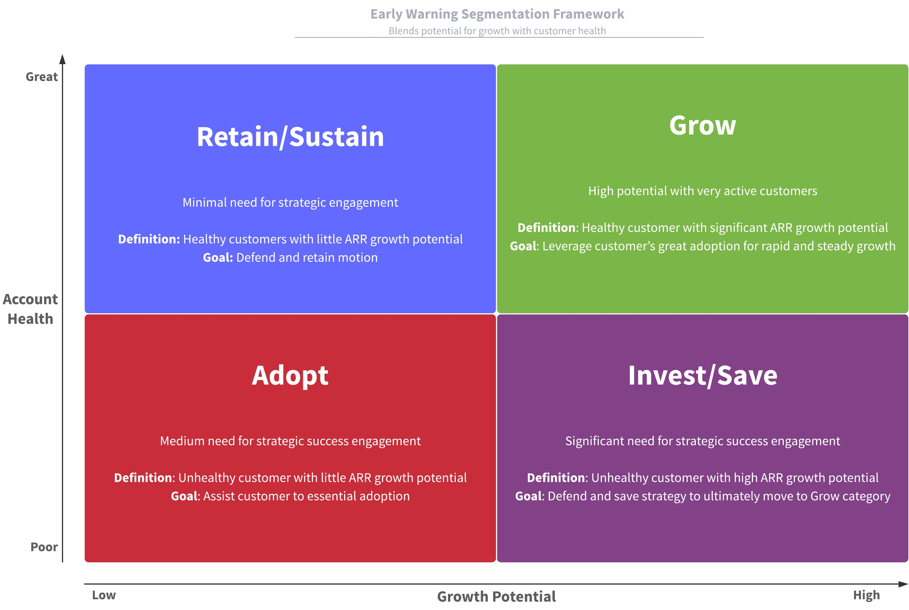
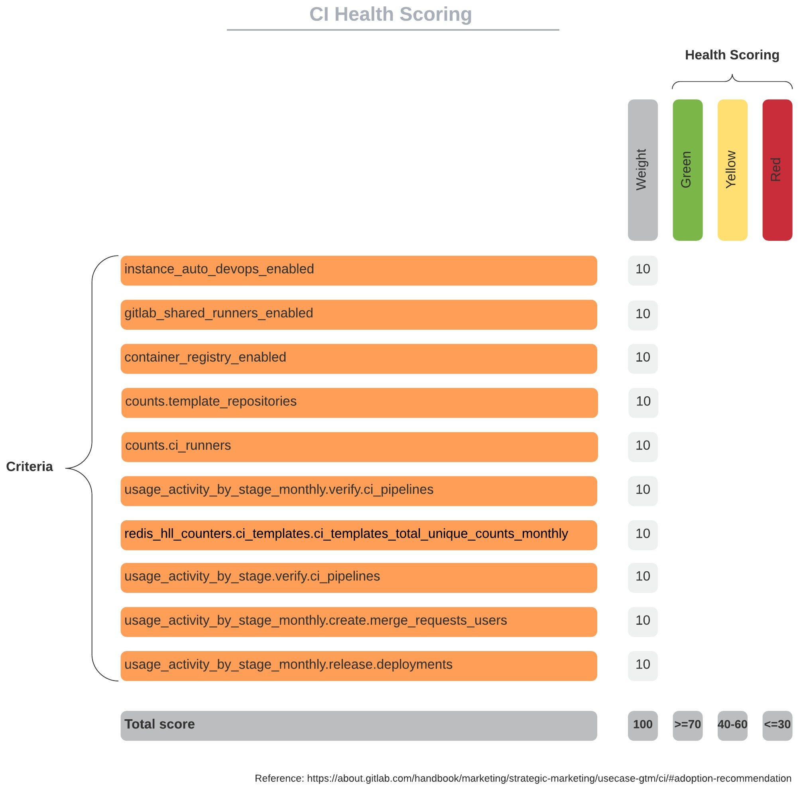

## On this page
{:.no_toc .hidden-md .hidden-lg}

- TOC
{:toc .hidden-md .hidden-lg}
{::options parse_block_html="true" /}

---

## Vision

The Customer Health Score assists GitLab Account Teams in understanding the relative health of customers for the purposes of predicting expansion, retention, and churn through understanding the customer's product adoption, risks, and engaging with GitLab. The initial versions will focus more on adoption. Over time, we will iterate to make them more predictive as we validate leading indicators.

## Customer health categories and risks

Health primarily considers the business impact to GitLab by evaluating the delivery of value and outcomes to customers. The following guideline will provide Customer Success Managers (CSMs) guidance to choose the right health assessment for their customer account. The following are the categories to assess and associated risks with each.

### Product adoption and utilization

There is a delayed, low, or materially reduced usage (i.e., drop in usage) as measured by license usage, features / use cases, product version (i.e., not adopting current versions - self-managed only), and/or GitLab stages. Value and outcome delivery to the customer misses expectations as defined by the customer. This may also be impacted by way the customer is using the product (i.e., processes, operations and/or policies) where the customer may not be leveraging GitLab best practices to maximize the value of the solution.

### Product experience

Customer has enhancements or defect fixes that are necessary for a customer and have not been delivered. The risk is determined according to the criticality of the request, severity of the issues, and/or number of enhancements and defects. Missed expectations for feature release can also impact product experience.

### Customer engagement

Customer contact(s) are not responsive, miss meetings and/or unwilling to engage in cadence calls or other engagements like [EBRs](/handbook/customer-success/csm/ebr/). This could indirectly mean the customer does not see value in the solution or the solution has been deprioritized.

### Executive sponsor or champion

Sponsor or champion leaves the company, moves to a different part of the organization, and/or has reduced scope of influence.

### Customer sentiment

The customer has expressed concerns and/or dissatisfaction with their experiences with GitLab (i.e., sales, professional services, support, product, etc.) through direct conversations, surveys (e.g., NPS), social media or other communication channels.

### Competitive threats

Prior to or during the renewal process it is learned that competitors are in play and the result could be a downgrade or churn as the customer is considering alternatives.

### Other organizational factors
The customer's business performance is materially impacted and declining. The company is acquired, merging with another company, divested or another structural change to customer's business.

## Health assessment guidelines

The items below serve as *guidelines* for the CSM to assess and record customer health and should consider where the customer is their lifecycle journey. Account health feeds into [open renewal opportunities](/handbook/customer-success/csm/renewals/#tracking-renewal-opportunity-health-and-risks).

Understanding how Gainsight calculates a measure score to be Red, Yellow, or Green: 

Gainsight scoring framework:
- Green: 75-100 points
- Yellow: 50-74 points
- Red: 0-49 points

[Link to Gainsight Calculation of Measure Group Scores and Overall Score](https://support.gainsight.com/Gainsight_NXT/05Scorecards/02Admin_Guides/Calculation_of_Group_Scores_and_Overall_Scores)

Calculation: ((Score * Weight) + (Score * Weight)... / (Max Potential Score * Weight)

To view the score, hover over the colored circle.
The weight is shown in the upper right corner of the metric. 

### Reporting and viewing health

Use the `Customer Health` (CSM Portfolio Dashboard) report to view the health of every measure for your customers in one single view.

To view Timeline entires where the CSM Sentiment was updated:

1. Go to Global Timeline
1. Filter by Sentiment = Green, Yellow, or Red
1. Apply any other specific filters (CSM Name, Timeline date, etc)

### Green

Customer is very likely to renew and/or expand with no known or assumed risk of downsell or churn. Customer's experience: engagement, adoption and experiences are as expected or better than expected, delivering value and outcomes as appropriate the customer's stage in their journey. Examples:

- Progressive adoption of GitLab use cases as defined by their success plan, considering their stage in their journey
- Alignment with stakeholders who can drive desired outcomes
- Regular communication and engagement in meetings
- Positive feedback on the product and experience and/or high scores on NPS surveys
- Leveraging support services as defined by creation of tickets (1-5 tickets per month)
- Interest in providing feedback and engaging with GitLab through other programs and events (e.g., Commit, CAB)

### Yellow & Yellow "Needs Triage"

Potential risk or significant lack of information leading to uncertainty. Indicates challenges to overcome, with a lower risk of churn or downsell. Customer's experience: engagement, adoption and/or experiences are lower than expected, risking GitLab's ability to deliver customer value and outcomes and/or drive future revenue growth. Examples:

- Slow, delayed, or blocked adoption of GitLab use cases in support of the customer's success plan
- Customer lacks definition of goals or success criteria
- High number of support cases, critical / blocker product issue(s), or poor experience based on the customer's expectations
- Lack of engagement, responsiveness or participation in meetings and/or events
- Loss of sponsor or champion due to change of role or organization or acquisition
- Lack of adoption of releases (self-managed only) where they are more than a major release behind the current release
- Not leveraging technical support services or has a large number of cases and/or high severity cases (6-15 tickets per month, or no ticket(s) opened after being advised by the CSM that Support is the best path to resolution for an issue(s))
- Poor experiences with Support, Professional Services or another part of GitLab
- Working with a single contact at a company (single-threaded).

There might be well understood reasons within the account team why a customer is flagged as Yellow within the current phase of the customer lifecycle. If the CSM decides that corrective actions and follow up from team members outside of the CSM group is required the CSM must follow the [At-Risk Customer Process](/handbook/customer-success/csm/renewals/#at-risk-process) and flag the account as Yellow "Requires Triage".

### Red

Specific, known risks to account retention or upcoming opportunity, or overwhelming lack of information, such as unresponsiveness leading up to renewal. Customer's experience: engagement, adoption and/or experiences are significantly lower than expected where issues are blocking GitLab's ability to deliver expected value, outcomes, or positive experiences as defined by the customer.
Examples:

- Lack of alignment with stakeholders who can drive outcomes... 
   - [Economic Buyer](https://about.gitlab.com/handbook/sales/meddppicc/#economic-buyer) 
   - [Champion](https://about.gitlab.com/handbook/sales/meddppicc/#champion)
   - Key [Personas](https://about.gitlab.com/handbook/product/personas/) 
      - [Cameron (Compliance Manager)](https://about.gitlab.com/handbook/product/personas/#cameron-compliance-manager)
      - [Delaney (Development Team Lead)](https://about.gitlab.com/handbook/product/personas/#delaney-development-team-lead)
- Product does not deliver expected value or outcomes as defined by success plan
- No or low product adoption with no progression
- Communication of poor sentiment
- Lack of any engagement
- Significantly poor experiences with Support or Professional Services
- Significant number of support tickets (16+ per month)

### Will Churn (Grey)

Very rarely, a customer reaches a point at which it is accepted by the account team and leadership that a customer will churn. As Gainsight does not support a 'grey' color (or any color outside of the standard green to red health scoring), the `will churn` lifecycle stage can be applied in 360º Attributes.  Applying this stage will remove the customer from health scoring reporting, so that at-risk reviews are spent productively.

In order for a customer to move to the `will churn` stage, the following must be completed:

- [ ] All options discussed in the triage issue and in at-risk reviews have been exhausted
- [ ] CSM discusses it with their manager and gets agreement on moving to `will churn`
- [ ] CSM opens a `Will Churn` issue ([`Will Churn` issue template](https://gitlab.com/gitlab-com/customer-success/account-triage/-/issues/new?issuable_template=Will%20Churn%20-%20ENT))
- [ ] CSM links from the triage issue to the newly created `Will Churn` issue and closes the triage issue
- [ ] Listed personas in the `Will Churn` issue provide feedback and approval
- [ ] SAL/AE marks the opportunity as `Will Churn`
- [ ] CSM updates the Lifecycle Stage in Gainsight C360 > Attributes > Lifecycle Stage to `Will Churn`

In line with GitLab's approach to blameless root cause analysis in both [Professional Services](/handbook/customer-success/professional-services-engineering/workflows/internal/root-cause-analysis.html) and [Engineering](/handbook/engineering/root-cause-analysis/), we follow a similar methodology in the form of a retrospective in the `Will Churn` issue to identify learnings from what went well and what didn't, what we could have done better to avoid this churn, and how we can change our approach in order to avoid future churn. This information is important and required to be included the issue in order to provide context to leadership prior to them approving. This retrospective and lessons learned should also be discussed in the next 1:1 between the CSM and their manager, as well as potentially lead to a handbook or process update shared with the broader team.

## Communication guidelines

The following are guidelines on who to notify when an account is yellow or red. This includes the [update frequency for the triage issue](/handbook/customer-success/csm/renewals/index.html.md#update-frequency). Please make sure the following people are notified with the respective customer health ratings.

### Yellow health rating

- Account Team (i.e., Strategic Account Leader or Account Executive, Solution Architect)
- Regional CSM Manager
- CSM Director (all non-Public Sector customers) or Director of Customer Success Public Sector (for Public Sector customers)

### Red health rating

- Include the list above as well as…
- Area Sales Manager and Regional Director
- Vice President of Customer Success

## Responsibilities

The CSM is responsible for coordinating with all relevant parties to develop a plan to address the risks. Typically, this will involve the account team and communication group (above), as well as other resources such as Product Managers, marketing, executive or engineering resources meeting to develop and deliver the plan to address the risks. The CSM then drives execution of the strategy and is responsible for regular updates to the triage issue. When the risks have been addressed bringing the customer to a healthy / green status, the triage issue can be closed.

## Gainsight

### CSM sentiment

CSMs update CSM Sentiment in determining overall account health. The guidelines are as follows:

- **CSM Sentiment**: Qualitative measure that the CSM updates to indicate their perceived sentiment of the customer. This should consider all the factors mentioned above and measured by the health assessment (green, yellow, red) criteria
- **CSM Sentiment Override of Overall Health Score**: When the CSM Sentiment score becomes red, the overall score will automatically become red. Once the CSM Sentiment moves back to a green or yellow score, the standard weighting of measures and groups will be reapplied as usual.

The CSM Sentiment score will be updated each time you [log a Timeline activity](/handbook/customer-success/csm/gainsight/timeline/) and select a value from the CSM Sentiment dropdown. Once you have logged the activity to Timeline, Gainsight will update the value of the CSM Sentiment scorecard measure and display the notes from the Timeline activity on the scorecard. The rule that sets the scorecard value runs every 2 hours.

There are a number of [enablement videos](/handbook/customer-success/csm/gainsight/#videos) you can watch to learn how to update customer health assessment and log activities that affect that assessment.

### Clearing stale health measures

**Product**
If usage data stops being received into Gainsight, the health measures will move to "NA" after 60 days. This is to prevent analysis and actions based on outdated data. In this case, we prefer to show nothing ("NA") over outdated data.

**CSM sentiment**
`CSM Sentiment` health scores become stale after 90 days of not being updated; this will be reflected on your health score dashboard by an exclamation point next to the score. If an account is marked as stale, but you've updated the `CSM Sentiment` within 90 days, please reach out in [gainsight-users](https://gitlab.slack.com/archives/C011ACG9MJB). Accounts with a stale `CSM Sentiment` will also be monitored via the CSM Burn-Down Dashboard in Gainsight and discussed in account planning meetings. Sentiment scores will be set to NA if they have not been updated in more than 120 days to remove outdated values.

**Support measures**
Support measures are considered stale if they have not been updated in more than 30 days. They will be automatically set to NA after 30 days without an update.

### Gainsight scorecard attributes and calculations

Health score criteria is either manually or automatically applied to determine the overall measure. If an individual measure is missing, the weighting is redistributed to the completed measures.

* Except for CSM Sentiment, all health measures will typically be NULL for the first 30 days of the customer's onboarding due to insufficient stats and inaccurate results, such as Engagement.
* In instances where a measure is N/A, the percentage weighting will be redistributed to the other health measures.
   * Example 1: If all product usage stats are missing, then it's entirely reallocated to the other measures (Engagement, ROI, CSM Sentiment...). Heavier weighter measures, such as CSM Sentiment, would receive a bigger allocation because it's already the largest.
   * Example 2: If we're receiving Product Usage Statistics but Continuous Delivery (CD) is NULL, that will be reallocated among Product Usage stats measures. So CI health would go from, say, 5% to 7%.

| Group (PROVE) | Measure | Description | Method | Calculation | Measure Weight | Group Weighting | Segmentation |
|---|---|---|---|---|---|---|---|
| **Product** |  | Scores the customer based on their depth and breadth of adoption, if Operational Metrics are available | Automatic | [See Customer Use Case Adoption](https://rgorbanescu-master-patch-65934.about.gitlab-review.app/handbook/customer-success/product-usage-data/use-case-adoption/) |  | 50% |  |
|  | License utilization |  |  |  | 30% |  | All |
|  | User Engagement |  |  |  | 10% |  | All |
|  | SCM adoption |  |  |  | 15% |  | All |
|  | CI adoption |  |  |  | 15% |  | All |
|  | DevSecOps adoption |  |  |  | 15% |  | All |
|  | CD adoption |  |  |  | 15% |  | All |
| **Risk** | [CSM sentiment](/handbook/customer-success/csm/health-score-triage/#gainsight) | Qualitative measure the CSM updates to indicate their perceived sentiment of the customer | Manual/Automatic | For all `CSM-owned` accounts, CSM manually determines red/yellow/green | 100% | 25% | N/A for Tech Touch |
| **Outcomes** | ROI | Does the customer have a Success Plan that has objectives and notes? | Automatic | For All `CSM Prioritization = 1` accounts AND all CSM-owned accounts that have an open Success Plan: - Green: Active Success Plan with 1 or more objectives and no Strategy/Highlight information - Yellow: Draft Success Plan OR Active Success Plan with 1 or more objectives and no Strategy/Highlight information - Red: No Success Plan or no objectives | 100% | 10% | N/A for Scale and Tech Touch |
| **Voice of the customer** |  |  |  |  |  | 5% |  |
|  | Support issues | Assess the health of our support interactions. Current version is MVC with [v2 coming](https://gitlab.com/gitlab-com/sales-team/field-operations/sales-operations/-/issues/1202). | Automatic | - Green: 1-5 tickets/month - Yellow: 5-15 tickets/month - Red: More than 15 tickets/month | 100% |  | All |
|  | Support emergency tickets | Based on the number of open/closed tickets. **Priority**: urgent tickets | Automatic | - Yellow: 1+ closed emergency ticket in the last 7 days - Red: 1+ open emergency ticket | 0% |  | All |
| **Engagement** |  |  |  |  |  | 10% |  |
|  | Meeting cadence | Based on recency of last call or meeting with the customer | Automatic | For `CSM Prioritization = 1` accounts: - Green: <= 35 days  - Yellow: > 35 days and <= 60 days  - Red: > 60 days   For `CSM Prioritization = 2` accounts: - Green: <= 65 days  - Yellow: > 65 days and <= 90 days  - Red: > 90 days | 50% |  | N/A for Scale and Tech Touch |
|  | **Persona engagement** | Are we meeting with the correct personas in the account? | Automatic | Persona Engagement is based on the roles of External Attendees added on timeline entries - Green: both Dev Lead and Security Lead are listed as external attendees on a timeline entry in the past three months - Yellow: one of the two personas attend  - Red: neither personas are listed as having attended a meeting | 50% |  | N/A for Growth, Scale and Tech Touch |

### License Usage health table

|        | 2-6 Months                               | 6-9 Months                               | > 9 Months                             |
|--------|------------------------------------------|------------------------------------------|----------------------------------------|
| < 10%  | Red       | Red       | Red     |
| 10-50% | Yellow | Red       | Red     |
| 51-75% | Green   | Yellow | Red     |
| > 75%  | Green   | Green   | Green |

 

## Scoring methodologies

Product usage statistics inform three different scores. They each have a distinct and separate purpose, are meant for different audiences, and use different metrics.

| Name | Purpose | Audience | Metrics | Notes |
| ----- | ----- | ----- | ----- | ----- |
| **Customer Health Score**        | To enable the team in understanding the relative health of customers, identify risks, manage renewal likelihood, and identify expansion opportunities and why | Internal GitLab Teams                   | Account Health is an aggregation of key metrics for a multi-perspective view of the customer. For detail, see [Account Health Predictor](/handbook/customer-success/customer-health-scoring/#account-health-predictor) above |                                                              |
| **Platform Value Score**         | Each customer will have a single Platform Value Score used to understand how much value the customer is currently receiving from Gitlab as a Platform | Internal GitLab Teams                   | 3–7 product usage metrics per Use Case, using Red/Yellow/Green scoring. The metrics will roll up into a score for each Use Case, and the Use Case scores will roll up to the Platform Value Score | [Platform Value Scoring](/handbook/customer-success/product-usage-data/platform-value-score/) |
| **Use Case Adoption Scorecards** | Each customer will have a scorecard per use case (SCM, CI, CD...) to highlight their adoption progress to celebrate wins and identify areas for improvement | Internal GitLab Teams **and** customers | 3–7 product usage metrics per Use Case, using Red/Yellow/Green scoring. These are then used to create a deck highlighting the level per use case adoption | [Use Case Adoption Scoring](https://about.gitlab.com/handbook/customer-success/product-usage-data/maturity-scoring/) |
| **DevOps Score**                 | For the customer to understand their DevOps status compared to top-performing instances (self-managed only) | GitLab customers                        | 10 metrics across Use Cases, displayed as a % of users who have utilized a feature in the past month, compared to how top-performing instances utilized that feature (self-managed only - [GitLab features](https://about.gitlab.com/features/)) | [Handbook Link](https://about.gitlab.com/blog/2021/12/15/devops-adoption/#devops-score) |
| **DevOps Adoption**              | DevOps Adoption shows you how groups in your organization adopt and use the most essential features of GitLab. | GitLab customers                        | Specific metrics across Dev, Sec, and Ops to show a customer's overall adoption. requires configuration (group and project level for SaaS, whereas instance for self-managed - [GitLab features](https://about.gitlab.com/features/)) | [Docs Link](https://docs.gitlab.com/ee/user/group/devops_adoption/) |

## Account health

Account Health is an aggregation of key metrics to provide insights to assist with identifying:

- Expansion opportunities — revenue related, product use cases, and within different teams
- Risks — identify product adoption weaknesses, lack of communication, or missed customer outcomes
- Adoption journey — identify areas where the customer could be coached on best practices for better utilizing GitLab
- EBRs and discussion topics — highlight areas of focus for EBRs and customer cadences such as usage reporting

For instance, the customer may have deployed all their subscription licenses but aren’t actively using them; or they may be using them, but all their Support tickets are very negative.

Looking through just one lens provides a limited view. In a happier example, a customer may have deployed most of their licenses, be heavily using all the current tier’s high end features,
and achieving positive business outcomes (PBOs). In this case, metrics indicate expansion opportunities. We will need to **PROVE** value to the customer and ourselves:

**P.R.O.V.E.**

* **Product**: License activation + User engagement + Use Case: 50% weighting
* **Risk**: CSM Sentiment + Opportunity Renewal risks: 0-50%
* **Outcomes**: Success Plan + Verified Outcomes: 20%
* **Voice of the customer** (VoC): Support + Surveys: 10%
* **Engagement**: Customer Engagement + Executive Sponsorship + Events + Certifications: 20%

  

## PROVE Components

| **Category**   | **Health Measure**         | **Example**                                                  | **Why?**                                                     | **Metrics**                                                  | **Account Type** | **Maturity** |
| -------------- | -------------------------- | ------------------------------------------------------------ | ------------------------------------------------------------ | ------------------------------------------------------------ | ---------------- | ------------ |
| **Product**    | License Activation         | The customer has assigned all licenses                                            | Has the customer deployed their licenses? This is an indicator of seat reduction / expansion                      | License utilization                                          | All              | 100%          |
| **Product**    | User Engagement            | 73% of users are Monthly Active Users                                         | Are users logging in and using the product?                  | Unique Monthly Active Users / billable_user_count               | All              | 100%; [in progress](https://gitlab.com/gitlab-com/sales-team/field-operations/customer-success-operations/-/issues/387)          |
| **Product**    | Adoption (Use Case)        | Use Case adoption                                            | Is the customer adopting use cases and progressing into “stickier” areas of GitLab? | SCM —> CI —> DevSecOps adoption                              | All              | 100%          |
| **Risk**       | CSM Sentiment              | The sentiment as determined by the CSM, if applicable        | What has the CSM determined from cadence calls?              | CSM Sentiment                                                | CSM owned        | 100%         |
| **Outcomes**   | ROI Success Plan           | Ensure the ROI Success Plan is aligned to customer           | A missing or poorly constructed Success Plan highlights a lack of alignment between GitLab and customer desired outcomes. | Green Success Plans Delivered EBRs                           | CSM owned        | 100%         |
| **Outcomes**   | Positive Business Outcomes (PBOs) | Completed Success Plan Objectives                            | Failed or missed PBOs can be a sign of distress; successful PBOs can highlight renewal expansion | Successfully completing at least one PBO each year            | CSM owned        | Not started  |
| **VoC**        | Support - Escalations      | Emergency support tickets                                      | Emergency support tickets can indicate unhappiness or frustration | Measure if there are Emergency support tickets in the last 90 days | All              | 100%  |
| **VoC**        | Support - Engagement       | Customer sends in tickets                                    | Determining if the customer is engaged with Support          | Retain existing methodology, but tweak to allow more tickets as a good thing | All              | 70%         |
| **VoC**        | Support - CSAT             | Customer completes CSAT surveys and provides feedback        | Is the customer giving feedback and what are the scores (response + outcomes) | Benchmark a minimum XX% response rate for green health and provide CSAT results to CSM | All              | Not started  |
| **VoC**        | NPS Surveys                | The customer responds to and provides high scores            | Because surveys are a good indicator of the customer’s perception of the product and company; this can | Survey responses rates + survey scores                       | All              | Not started  |
| **Engagement** | Engagement                 | Recency of CSM cadence call                                  | Lack of customer engagement                                  | Date of last CSM cadence call                                | CSM owned        | 100%         |
| **Engagement** | Executive Sponsorship      | Are stakeholders aligned and communicating?                  | Lack of alignment and communication can indicate a disconnect between execs and ROI | Recency of aligned stakeholder communication                 | CSM owned        | Not started  |
| **Engagement** | Events                     | Is the customer attending GitLab events?                     | Event attendance indicates customer engagement, dialogues with team members, and face-to-face interactions | TBD                                                          | All              | Not started  |
| **Engagement** | Certifications             | Are users within the account taking certifications? Are they maintaining their certifications? | Obtaining GitLab certifications is a positive for us and the customer; it also indicates their involvement in GitLab, knowledge of using GitLab, and provides an inference as an internal champion | TBC                                                          | All              | Not started  |

### Health Score Commentary and Uses

The Account Health Score does and will include many factors with different weightings per group and per individual measure with the goal being a multi-perspective approach, measuring what matters to the customer, and measuring the features that they have access to and can utilize. 

<u>Note</u>: if stats are missing for any health measure, it is counted as `NULL` instead of a value (i.e., red).

<u>Tier-based Product Usage Stats</u>: will evaluate the customer’s usage based on their current tier and feature access. For example, if a customer is on Premium, we will base their health on Premium-level features to understand their level of adoption. If their health is red or yellow, it signifies risk. If green, it can signify expansion or flat renewal.

<u>Leading and lagging indicators</u>: Some metrics are more leading or lagging indicators. While we will lean toward a predictive solution, lagging metrics are incorporated to assess past performance.

The following graph (Early Warning Segmentation Framework) is used to provide a framework for which strategy to use and which resources to leverage. Customers are grouped by their Account Health and growth potential. Renewal Operations Analysts will support the Field in triaging accounts to identify where to spend their time.

 

 

## FY23

- Advanced metrics and methodology to move from reactive to proactive account management
- Identify protect/expand initiatives based on usage. If certain customers are underutilizing features, launch a protect CTA. If a customer is heavily using features, create an expand CTA.
- Enhanced renewal forecasting capabilities for SMB and potentially Mid-Market segments where reps have a view 2+ quarters out into their renewals with product usage insights and ability to select which levers to pull for a better customer experience

# Methodology 

## Health scoring

### Starting point

The first approach was a calculation of multiple metrics to create a “black box” approach. This was neither helpful to the end user (CSMs, SAs, sales reps), it was not easy to understand the calculation, the Gainsight logic was inadequate, and was not action-oriented to know *which* aspects of the use case were great and which needed improvement.

### Next iteration

The next iteration is a model where each use case incorporates X number of metrics and each metric is valued from 0-1.0. Then, the individual scores can then be summed to an aggregated score for that use case. Below is an *example* of what *could* be done for transparently measuring health.
 

 

Example: CI has ten individual features with one metric per feature and each metric is equally weighted at 10. Each metric can score between 0-10 with some being zero, some being 5, and others being 10. The aggregate score would be 65 out of 100. The CSM could then evaluate each metric to see which features are being adopted and which ones need improvement.

While the product usage health will be summarized, a separate health view will allow users to view each individual component. This allows users to quickly skim overall health and, when applicable, to look into the details to see which features are not being utilized.

## Predictive Analytics

Predictive Analytics is not a silver bullet. It will not cure all that ails you. Instead, this methodology is probabilistic and incorporates health measures to correlate the typical journey of “healthy” customers (expand and renew) with “unhealthy” customers (downgrade and churn). For example, a healthy sales pipeline has few pushes (moving the close date) and progressively moves through stages (not stale). Conversely, an opportunity with multiple pushes and stuck in stages for long periods of time is an indicator of risk.

| Prediction Type | Model Name | Status | Description | 
| :--: | :--: | :--: | :--: | 
| Expansion | [Propensity To Expand (PTE)](https://internal-handbook.gitlab.io/handbook/sales/propensity_models/) | Active | Predicts whether an account is likely to expand (increase ARR) |
| Churn and Contraction | [Propensity To Churn or Contract (PTC)](https://internal-handbook.gitlab.io/handbook/sales/propensity_models/) | Active | Predicts whether an account is likely to churn or contract (decrease ARR) |  

### Appetite and Ability to Expand (Seats, Uptier)

Triggers will be used for different events: 

- A call to action to prevent downgrade because of lack of license utilization
- Heavy CI usage indicates they are meeting their business outcome and are ready to talk about the next stage, or 
- The customer has very little growth but is successful and we should aim for a flat renewal. 

Each of these metrics will be used to guide the account team in knowing when a customer is approaching the next or has met their milestone. The items listed below are examples of what an account team could look at to glean insights for a productive customer conversation.

#### Seat Expansion

##### License Utilization

1. Rapidly consuming licenses (measuring growth rates)
2. 90% license utilization

##### User Activity

1. High UMAU (above 80%)

#### Uptier

1. Desire for guest users
   1. They purchased a high number of Premium licenses but could move many to Guest
1. Consuming Free/Premium features that lead to Ultimate
   1. DevSecOps
   1. Agile Planning
1. Success Plan objectives are aligned with Ultimate-level feature sets
   1. DevSecOps
   1. Agile Planning

#### Seat Reduction

1. Less than 75% license utilization (excludes onboarding customers)
2. Consistent reduction in activated user count (number of deactivated users M-o-M)
3. CSM renewal risk == Seat Loss

#### Downtier

1. Not using Ultimate-level features
   1. DevSecOps
   1. Agile Planning
1. Success Plan objectives not aligned with Ultimate-level feature sets
1. CSM renewal risk == downtier

#### Churn

Indicators from Seat Reduction or Downtier above plus:

##### Customer Experience

1. Customer has gone dark
2. Loss of internal champion/stakeholder
3. CSM renewal risk == churn

##### Renewal Opportunities

1. Stages not progressing
2. Pushes
3. Lack of Oppty customer activity

## Segmentation

Segmentation will primarily follow the level of service (CSM Priority 1, 2, 3), and secondarily other factors as listed below.

1. CSM-managed vs. non CSM-managed
2. Segmentation: Enterprise, Mid-Market, SMB
3. Geographical
4. Divisional (WW or Public Sector)

# References

- [MVC Early Warning System epic](https://gitlab.com/groups/gitlab-com/sales-team/field-operations/-/epics/25)
- [Customer Analytics Roadmap (internal-only document)](https://docs.google.com/presentation/d/1_v4hxKdbL6--UjpjVdveGEGD_MjmUnBg0-OIU1R14m8/edit#slide=id.gb3e6c0a32e_0_5) (slide deck)
- [Customer Success Services](https://about.gitlab.com/services/customer-success-services/) (client facing)
- [Operational Data Vision](/handbook/customer-success/product-usage-data/)
- [Cloud Licensing Documentation](https://internal-handbook.gitlab.io/handbook/product/fulfillment/cloudlicensing/cloud-licensing/) (internal handbook)
- [Strict Cloud Licensing](https://internal-handbook.gitlab.io/handbook/product/fulfillment/cloudlicensing/strictcloudlicensing/) (internal handbook)
- [Service Ping Metrics list](https://metrics.gitlab.com/) (subscription, operational, and optional)
- [Operational Service Data](https://internal-handbook.gitlab.io/handbook/product/fulfillment/archive/operational-service-data/#register) (internal handbook)
