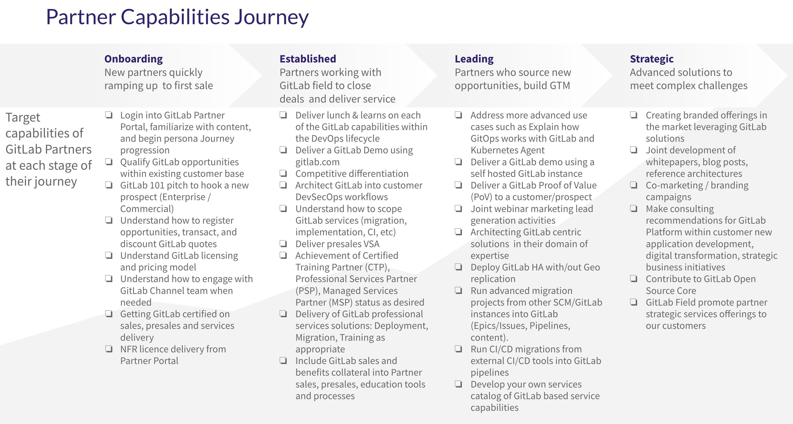

## On this page
{:.no_toc .hidden-md .hidden-lg}

- TOC
{:toc .hidden-md .hidden-lg}

## Objective

Create a partner success approach, providing a framework for partners to integrate their DevSecOps practice with GitLab go to market.

## Goals

- help partners to get up and running with GitLab capabilities 
- drive joint customer success with GitLab partners
- provide a mechanism to record learned best practices for a partner's journey with GitLab
 
## Partner Categories

GitLab Channel Partner Program recognizes four primary partner types
- Direct Market Resellers (DMR)
- Global System Integrator (GSI)
- Regional System Integrator (RSI)
- Federal System Integrator (FSI)

GitLab Channel Partner Program partners are encouraged to achieve any or all of these [Services Partner Certifications](https://about.gitlab.com/handbook/resellers/services/)
- Professional Services Partners (PSP)
- Managed Services Partners (MSP)
- Certified Training Partners (CTP)

## High-Level Visual of Partner Capabilities Journey

## Partner Capabilities Journey

The following capabilities roadmap shows the high-level view of the capabilities that our partners should develop to mature their GitLab practices organized into four (4) stages of maturity.

#### 01 - Onboarding (Stand)
New partners to GitLab ramping up their capabilities and achieving first-customer orders as quickly as possible.
- Login into GitLab Partner Portal, familiarize yourself with content, and begin the persona Journey progression.
- Qualify GitLab opportunities within your existing customer base.
- GitLab 101 pitch to hook a new prospect (Enterprise / Commercial).
- Understand GitLab licensing and pricing model.
- Understand how to register opportunities, transact, and discount GitLab quotes.
- Understand how to engage with the GitLab Channel team when needed.
- Getting GitLab certified in sales, presales, and service delivery.
- NFR license delivery from Partner Portal.

#### 02 - Enabling (Walk)
Established GitLab partners working with GitLab field account teams to close resale business, deliver GitLab Professional Services projects, and/or GitLab branded training.
- Deliver lunch & learns about each of the GitLab capabilities within the DevOps lifecycle.
- Deliver a GitLab Demo using gitlab.com.
- Competitive differentiation.
- Architect GitLab into customer DevSecOps workflows.
- Understand how to scope GitLab services (migration, implementation, CI, etc)
- Deliver presales Value Stream Assessment (VSA).
- Achievement of Certified Training Partner (CTP), Professional Services Partner (PSP), and Managed Services Partner (MSP) status as desired.
- Delivery of GitLab professional services solutions: Deployment, Migration, and Training as appropriate.
- Include GitLab sales and benefits collateral into Partner sales, presales, education tools, and processes.

#### 03 - Partner Leading (Run)
Mature GitLab partners sourcing their own customer opportunities, registering new deals, and collaborating with GitLab field sales teams as needed.
- Address more advanced use cases such as explaining how GitOps works with GitLab and Kubernetes Agent.
- Deliver a GitLab demo using a self-hosted GitLab instance.
- Deliver a GitLab Proof of Value (PoV) to a customer/prospect.
- Joint webinar marketing lead-generation activities.
- Architecting GitLab-centric solutions in their domain of expertise.
- Deploy GitLab HA with/without Geo-replication.
- Run advanced migration projects from other SCM/GitLab instances into GitLab (Epics/Issues, Pipelines, content).
- Run CI/CD migrations from external CI/CD tools into GitLab pipelines.

#### 04 - Strategic (Sprint)
Developing advanced solutions to meet complex customer challenges leveraging the GitLab Platform.
- Creating branded offerings in the market leveraging GitLab solutions.
- Joint development of whitepapers, blog posts, and reference architectures
- Co-marketing / branding campaigns.
- Make consulting recommendations for GitLab Platform within customer new application development, digital transformation, and strategic business initiatives.
- Contribute to GitLab Open Source Core.
- GitLab Field promotes partner strategic service offerings to our customers.

## GSI Specific Aspects

The above model applies to Global System Integrators (GSI) in general, but the approach taken by our team is more tailor-made. There are some notable differences to be taken into account:
- GSIs are typically driven by service revenue much more than license revenue.
- In order to be working together we need to demonstrate that GitLab can make their services more efficient or more attractive to their clients and prove that with a joint win.
- GSI is a large organization typically organized by practice, where each practice has its own independent sales motions and GitLab value perception.
- The joint win is a champion-building activity that unlocks commitment to start working with a particular practice.
- Subsequent wins increase visibility, help find higher-level sponsors, and unlock scaling.

## Partner Channel Solutions Architect Activities

To achieve our [Goals](https://gitlab.com/-/ide/project/gitlab-com/www-gitlab-com/tree/partner-journey-maturity-model/-/sites/handbook/source/handbook/customer-success/partners/vision/index.html#goals), the Partner Channel Solutions Architect (CSA) ensures that partners get the most value possible out of their relationship with GitLab through their sales and delivery of GitLab's products and services. CSA's organize their activities to mature GitLab partners quickly in their ability to deliver customer value. See the [Channel SA Engagement Model](https://about.gitlab.com/handbook/customer-success/solutions-architects/processes/channel/) for more details on the role of the Channel SA enabling partners to succeed.

