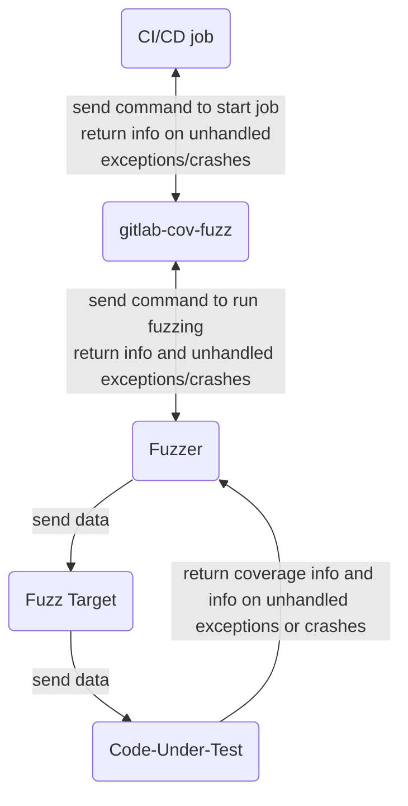

{:.no_toc}


## LAB 5: Enable, configure, and run Coverage-Guided Fuzz Testing

This lab demonstrates coverage-guided fuzz testing, which looks for bugs in a single function in your code. Web API fuzz testing works similarly, but is not covered here.


### A. Fuzz testing overview

Fuzz testing tries to cause unexpected behaviors in your code. Any unexpected exceptions or crashes could indicate bugs or potential security issues that may need to be addressed. Fuzz testing often catches problems that other QA processes miss.

A fuzz test sends data to a function in your code. It uses program instrumentation to trace which lines of your code are exercised by that input, and uses this information to make informed decisions about how to mutate future inputs in order to exercise as much of the function's code as possible.

You must define a separate CI/CD pipeline job for each function you want to fuzz test. That said, if the function in your code-under-test calls other functions, the fuzz test will catch problems that occur anywhere in the call stack. In this lab you'll fuzz test just 1 function.

Here's a high-level description of the fuzz testing workflow in GitLab:

1. A CI/CD job runs `gitlab-cov-fuzz`, a GitLab commandline utility, which in turn, runs a fuzzer. The fuzzer generates data and sends it to the fuzz target. The fuzz target sends that data to the code-under-test. The collection of all data sent to the fuzz target is called a "corpus."
1. If the code-under-test processes the data successfully (i.e., without throwing unexpected errors or crashing), the fuzzer tracks which lines of the code-under-test were exercised by that input. The fuzzer then generates mutatations of the data in the corpus to exercise different parts of the code-under-test. It sends that new, mutated input to the fuzz target, repeating the cycle.
1. If any input data causes an unexpected error or crash in the code-under-test, that problem is sent back to the fuzzer, which reports it to the `gitlab-cov-fuzz` utility, which passes it to the CI/CD pipeline as a potential bug in the code-under-test. That problem then appears in the GitLab GUI, under the **Security** tab on the pipeline details page.  

Here's a picture of the same workflow:




### B. Setup

1. Return to the **Security Labs** project you used in the previous labs.
1. **OPTIONAL:** Follow the instructions at the start of [Lab 2](secessentialshandson2.html) for speeding up your pipeline by disabling scanners that you enabled in previous labs.


### C. Write the code-under-test

1. This is the code that the fuzz tester will scan for bugs. Paste this Python function into a new file called `codeundertest.py` in the root of your project.

    ```python
   def is_third_byte_zero(my_bytes):
       """Return True if and only if the third byte passed in is 0."""
       return my_bytes[2] == 0  # start counting from 0, so "2" refers to the 3rd byte
    ```

   This code-under-test defines a function that expects to be passed a list of bytes. If the third byte in that list is 0, the code returns the value `True`.

   **There's a bug in this code-under-test:** it doesn't check to make sure you passed in at least 3 bytes. If you pass it fewer than 3 bytes, an error will occur when the code looks for, but can't find, the third byte. Different languages will do different things in this situation, but Python will throw an unexpected `IndexError`. That error could cause problems in whatever code calls this function, so this behavior is considered to be a bug. Fuzz testing is a great tool to find this bug.
1. Commit the new file with an appropriate commit message.


### D. Write the fuzz target

Fuzz testing is the only type of GitLab scanning that requires you to write code: the fuzz target. The fuzz target you see below only works with the specific code-under-test for this lab. Fuzz targets for different code-under-test would look slightly different.

1. Paste this Python fuzz target code into a new file called `FuzzTarget.py` in the root of your project. The comments explain each line of the fuzz target code.

    ```python
   from codeundertest import is_third_byte_zero  # import function to be tested
   from pythonfuzz.main import PythonFuzz        # import fuzz test infrastructure
   
   # The fuzz engine calls a function called `fuzz` in the fuzz target and
   # passes it random bytes, so we need to define a function with that name,
   # and that function must accept 1 parameter.
   
   @PythonFuzz                           # Python decorator required by fuzz test infrastructure
   def fuzz(random_bytes):               # Accept random data...
       is_third_byte_zero(random_bytes)  # ...and pass it on to the code-under-test.
   
   if __name__ == '__main__':            # required by fuzz test infrastructure
       fuzz()
    ```

   > **TIP:** This fuzz target is typical for Python-based fuzz testing. See the [GitLab documentation](https://docs.gitlab.com/ee/user/application_security/coverage_fuzzing/#supported-fuzzing-engines-and-languages) for instructions on writing fuzz targets for other languages.

1. Commit the new `FuzzTarget.py` with an appropriate commit message.


### E. Enable and configure coverage-guided fuzz testing

1. Define a new stage called `fuzz` by pasting this line at the end of the existing `stages:` section of `.gitlab-ci.yml`. Be sure to indent it correctly.

    ```yml
   - fuzz
    ```
1. Enable fuzz testing by pasting this template into the existing `include:` section of `.gitlab-ci.yml`. Be sure to indent it correctly.

    ```yml
   - template: Coverage-Fuzzing.gitlab-ci.yml
    ```

1. Configure fuzz testing by defining a new job in `.gitlab-ci.yml`.

    ```yml
   fuzz-test-is-third-byte-zero:
       extends: .fuzz_base  # This anchor is defined in the template included above.
       image: python:3.6    # This image must be able to run the code-under-test.
       script:
           # Install the fuzz engine from a GitLab-hosted PyPi repo.
           - pip install --extra-index-url https://gitlab.com/api/v4/projects/19904939/packages/pypi/simple pythonfuzz==1.0.8
   
           # Run a language-agnostic binary, specifying the type of fuzz engine, 
           # the root of the project, and the fuzz target.
           - ./gitlab-cov-fuzz run --engine pythonfuzz --project-path ./ -- FuzzTarget.py
    ```

   > **TIP:** Fuzz test job definitions, like fuzz targets, look a little different depending on what language they're testing. See the [GitLab documentation](https://docs.gitlab.com/ee/user/application_security/coverage_fuzzing/#configuration) for instructions on writing fuzz test job definitions for other languages.

1. Commit the edits to `.gitlab-ci.yml` with an appropriate commit message.


### F. Review the results

1. Watch the pipeline run after you've committed changes to `.gitlab-ci.yml`. It might take up to 3 minutes to finish.
1. When the pipeline completes, look at the `Security` tab on the pipeline details page to see if fuzz testing found the index-out-of-bounds bug in the code-under-test.
1. Select the entry under the **Vulnerability** column to learn more about the bug and see where it happened in the call stack.
1. In the left navigation pane, select **Security & Compliance > Vulnerability Report** to see another view of the fuzz test results. It might help to set the **Tool** filter to **Coverage Fuzzing**.


## Suggestions?

If you'd like to suggest changes to the *GitLab Security Essentials Hands-On Guide*, please submit them via merge request.
