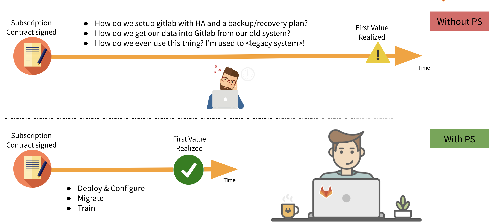

# Positioning Professional Services
{:.no_toc}

## On this page
{:.no_toc .hidden-md .hidden-lg}

- TOC
{:toc .hidden-md .hidden-lg}

## Where to position PS in the Customer Journey
Most professional service engagements happen during the onboarding, implementation, and adoption phases of the [customer journey](/handbook/customer-success/vision/).

When opportunities are approaching closed/won and planning for these stages is occurring, its a good idea to consider bringing in professional services to help expedite the customer's transition to using gitlab to enable them to [realize value faster](/handbook/customer-success/vision/#time-to-value-kpis).

This page aims to help the ISR/SAL understand the services that certain types of customers typically engage in and how to position those services when building out a success plan.

## Value of GitLab Professional Services

<!-- ### Elevator Pitch

**The Problem - Customer Perspective**

The customer has decided that GitLab is their tool of choice going forward, but has concerns about realizing the value of GitLab quickly and seamlessly.  These concerns can be in various areas:

* Lack of subject matter expertise on the GitLab technology stack
* Lack of adequate resources to promptly stand up GitLab
* Lack of sufficient resources to stand up GitLab in a highly-available or geographically dispersed way
* Concern around a large number of users coming off of legacy systems
* Concerns about change management for new processes
* Lack of confidence in the ability to deliver on the transformative promise of adopting "all" of GitLab

**Solution** -->

### Single Sentence

With PS engagement, customers start leveraging the full capabilities of GitLab earlier with improved proficiency, reduced risk, and increased competitive advantage. 

### Short Message

"The whole is greater than the sum of its parts" - and this is particularly true in modern software development. GitLab makes the collaboration around software delivery as efficient as possible. We provide services to minimize the transition period to gitlab and help you get back to peak efficiency quickly. We provide specialized training to educate users in these software development and delivery practices using gitlab.

### Long Message

Adopting GitLab gives you the only single DevOps platform on the market. GitLab Professional Services will help you align your people and processes to match.

Our Professional Services team is made up of not only GitLab subject matter experts but seasoned DevOps professionals who have experience in deploying and maintaining both large-scale applications as well as creating and teaching best practices throughout the SDLC.  Our experts help lead DevOps Transformations, providing direct support to our customer’s strategic business initiatives.  Their experience with other Fortune 500 enterprises allows you to crowd-source your enterprise’s digital transformation.

GitLab's Professional Services team exists to enable you to realize the full value of your GitLab installation.  We can provide direct implementation support to ensure your GitLab installation is resilient and secure.  We also offer migration services to facilitate your transition to GitLab by delivering a clean dataset to resume operations at once.   Our education and specialized training provide training in best practices, such as CI/CD, version control, metrics, and more.

## Customer Archetypes

### Mid-Market to Enterprise coming from non-gitlab SCM

These customers are adopting gitlab usually for a number of reasons, but typically use SCM as their entry point. They have source code management happening in their company but it might not be standardized into a single process or tool. This means they will need to migrate data and users to (sometimes git and) gitlab.

The larger the company, the higher likelihood they will be opting for gitlab self-managed. If this is the case, they will need to deploy gitlab typically with aspirational requirements of system High Availability, Disaster Recovery and performance and might not have the technical expertise in their current staff.

They have a team that manages the current tooling at the highest level, and are often competing against shadow IT from setting up their own (less restrictive) instances of SDLC tools. This team has probably never managed a large migration and needs help with the rollout plan. Their engineering teams (end users of gitlab) are on the continuum of knowledge about latest git and gitlab best practices.

To get to [first value](/handbook/customer-success/vision/#time-to-value-kpis) as soon as possible, you should consider:
 - [Implementation](/services/implementation/) (infrastructure deployment and gitlab configuration)
 - [Migration](/services/migration/) (SCM Data and user migration)
 - [Education](/services/education/) (Basics, CI/CD and Admin)

### SMB to Mid-Market moving to gitlab.com

These customers typically move to gitlab for the benefits of an all-in-one SDLC platform to reduce toolchain tax.

They will likely have a small team responsible for transformation that will be managing this transition. Its unlikely they have the expertise or time to manage a data and user migration without slowing down their business significantly. They will also probably want to integrate with other systems like LDAP, Jira, or Jenkins. Finally, their users will probably need upskilling on the basic and advanced features of gitlab to ensure they're getting the most value out of the gitlab.

To get your customer the most [value](/handbook/customer-success/vision/#time-to-value-kpis) as soon as possible, you should consider:
 - [Migration](/services/migration/) (SCM and/or CI/CD based on entry point)
 - [Integration](/services/implementation/integration/) (LDAP/SSO, Jira, Jenkins)
 - [Education](/services/education/) (Basics and/or CI/CD)

### SMB or Mid-Market without migration needs
Some customers have a team of git ninjas who can manage migration and setup quickly, but the rest of the engineers might not be as skilled. Its always a good idea to suggest education services because the customer end users will be more likely to push for later stage adoption. This type of grassroots motivation will go a long way when investigating conversion opportunities.

For these customers consider our [Education Services](/services/education/) (Basics, CI/CD, Devops Fundamentals)

## Sales Collateral

### Internal Testimonials
The PS team has been building maturity and repeatability to its services over the later part of 2019 and early part of 2020. We have captured some recent wins with internal testimonials in [this internal document](https://docs.google.com/document/d/1TMZe6yNbvdz9Sfq4pz-i0DHMLnai2Kjqw7HKkqzwpSo/edit?usp=sharing).

### Pitch Deck

To discuss our services offerings with prospects, it is often helpful to have a few slides to describe the role of the professional services team.  Feel free to use this deck directly - however if you'd like to modify it please first make a copy.

[Professional Services Pitch Deck](http://bit.ly/psslides)

### Data Sheets

Professional Services Data Sheets are available as subpages to the marketing site. You can find them through the [Professional Services portal](/services/).

### Services Calculator

The goal of the services calculator is to provide the sales team a starting point to scope more complex services requests with the PS Engagement manager.  You can get access to the service calculator [here](https://services-calculator.gitlab.io/).

### Other Collateral

 - Check other collateral documentation in the [Professional Services Sales Enablement folder](https://drive.google.com/drive/u/0/folders/1vLhSdmlwClou_16I1SU9d3X0oG1EtBHv) on Google Drive.
- [How to sell professional services](/handbook/customer-success/professional-services-engineering/selling/)
- General Guidelines for [working with professional services](/handbook/customer-success/professional-services-engineering/working-with/)
