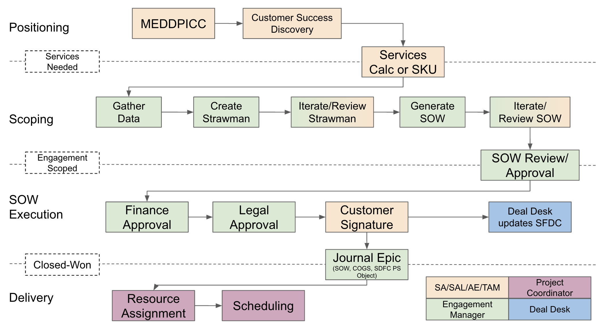
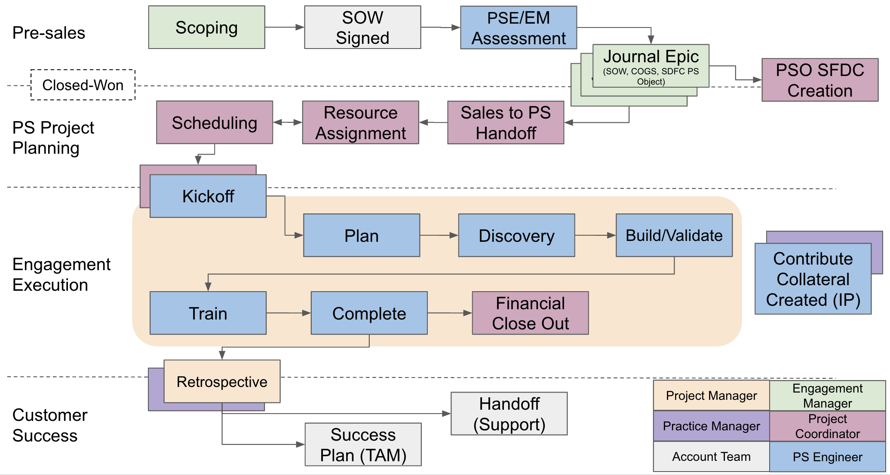

# Processes and Methodology
{:.no_toc}

## On this page
{:.no_toc .hidden-md .hidden-lg}

- TOC
{:toc .hidden-md .hidden-lg}

## PS Process & Methodology Mapped to the Customer Journey
The professional services process and methodology fits within the [customer journey that is supported by Customer Success](/handbook/customer-success/vision/#high-level-visual-of-customer-journey) and shows how the [PS team interacts with other teams in GitLab](/handbook/sales/#supporting-teams). Professional Services contributes to the customer journey from the point of **Consideration** through the **Adopt and Optimize** phase. See the below graphic (slide 1) for a mapping of PS processes and methodology to the GitLab & Customer Journey.

<!--change the below link to the official source once we copy the PS stuff into that deck https://docs.google.com/presentation/d/e/2PACX-1vQNYu_4jB3j3i_fYukM3yMtcbhgbpKbivbaaiKnuih3X6pdn-oI9ic0k6TqtwP2qjqVAaC-HXIC0uD7/embed?start=false&loop=false&delayms=3000 -->
<figure class="video_container">
<iframe src="https://docs.google.com/presentation/d/e/2PACX-1vQNYu_4jB3j3i_fYukM3yMtcbhgbpKbivbaaiKnuih3X6pdn-oI9ic0k6TqtwP2qjqVAaC-HXIC0uD7/embed?start=false&loop=false&delayms=3000" frameborder="0" width="1536" height="893" allowfullscreen="true" mozallowfullscreen="true" webkitallowfullscreen="true"></iframe>
</figure>

<!---->

[Source, GitLab Team Members Only](https://docs.google.com/presentation/d/1VQXESMods5HRIOADC95i9q6lq_AFe2FLj6BO45C3rnY/edit?usp=sharing)

## PS Process Methodology Stages
The above diagram (slide 4) is meant to describe the Directly Responsible Individuals (DRIs), Activities, Outcomes, and Tools/Collateral for each sage of the methodology. We can also see clear categorization of stages in pre-sales and post-sales phases.

In the linked pages below, you can see a detailed drill down into the steps within each stage that individuals use to perform activities to deliver desired outcomes per each stage. These pages are split by the Phase of the selling process (Pre-sales vs Post-sales).

### Scoping (Pre-Sales)
For a more detailed explanation of the steps that comprise each stage of the scoping phase, check out the [Scoping (Pre-Sales)](pre-sales-methodology) page. In this page, we drill down into- and describe- specific steps in each phase of the pre-sales scoping process. 

### Delivery (Post-Sales)
For a more detailed explanation of the steps that comprise each stage of the delivery phase, check out the [Delivery (Post-Sales)](post-sales-methodology) page. In this page, we drill down into- and describe- specific steps in each phase of the post-sales delivery process. 

