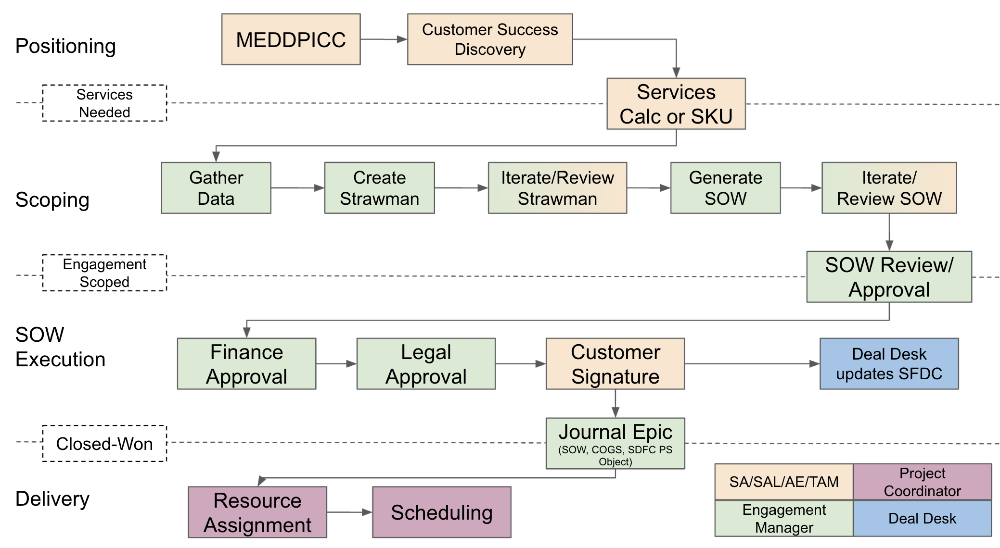

## On this page
{:.no_toc .hidden-md .hidden-lg}

- TOC
{:toc .hidden-md .hidden-lg}

## Overview
The purpose of this page is to document the sales-assisted selling motion used by Professional Services Engagement Managers and Regional Delivery Managers. If you're on a GitLab sales account team looking for information, try these pages on [positioning professional services](/handbook/customer-success/professional-services-engineering/positioning) or [selling professional services](/handbook/customer-success/professional-services-engineering/selling/#custom-scoped-services).

This page will help outline the when and how to get involved with positioning and scoping services, how to estimate, how to use SOW generation software, and the processes to gain approval.

> *Note: Services engagements can take [two forms](/handbook/customer-success/professional-services-engineering/selling). This will focus on the **custom SOW scoping** process, not the Standard SKU process.*

For custom SOWs, the [workflow for SOW creation](/handbook/customer-success/professional-services-engineering/selling/#custom-scoped-services) involves a partnership between the Account Team and the Professional Services Team.


[Source](https://docs.google.com/presentation/d/1TOI2aoseBoyWYQC6-xpJVMknEncCNreSFfMvOHO7EBA/edit#slide=id.gbfb62d0c00_0_58) (GitLab Team Members Only)

## 1. Positioning
- **DRI**: Account Team (SAL/AE, SA, CSM)
- **Supported By**: Engagement Manager

### MEDDPICC
Professional services can be positioned when a prospect becomes a customer (e.g. the Land of a new deal) or when an already existing customer is growing their staff or interesting in adopting new features of GitLab (e.g. expansion). The SA, SAL, AE, or CSM (e.g. "Account Team") is primarily responsible for this process, following the [Command of the Message](/handbook/sales/command-of-the-message/) and [MEDDPICC](/handbook/sales/meddppicc/) messaging frameworks.

For the larger, more strategic customers PS Engagement Managers tend to get involved earlier in the selling process to help with discovery and provide lessons learned on rollout from past engagements. For the medium sized customers, Engagement managers tend to get involved with account teams when the SFDC stage 4 (Proposal) is achieved.

### Customer Success Discovery
The Account team should be encouraged to use the [Customer Terrain Mapping templates](/handbook/customer-success/customer-terrain-mapping/#catalog-of-customer-terrain-mapping-engagements) to help the customer to start thinking about *how* they will achieve their longer term success. This typically results in conversations about services to aide them in their journey. 

### Services Needed
Once its identified that the customer will likely want to engage with professional services, its the responsibility of the Account Team to [get in touch with the Engagement Manager](/handbook/customer-success/professional-services-engineering/engagement-mgmt/#how-to-contact-or-collaborate-with-us).

## 2. Scoping
- **DRI**: Engagement Manager
- **Supported By**: PS Practice, Account Team (SAL/AE, SA, CSM)

### Gather Data
After the [services calculator](https://services-calculator.gitlab.io/) is run by the Account Team, scoping issues and Project Scheduling Intake issues are automatically created and land in the [PS Plan](https://gitlab.com/gitlab-com/customer-success/professional-services-group/ps-plan/-/issues) Project. Using this customer scoping issue and Project Scheduling Intake issue, the engagement manager gathers data asynchronously from the account team. Questions about the potential engagement can sometimes be answered by the Account Team from the discovery that was done already. We want to make sure we avoid asking duplicate questions to the customer. In some cases when the account team cannot provide the level of detail to create an egagement, the EM will meet with the Account team and Customer to ask additional discovery questions to get to a level of detail needed. Once the data has been gathered, the EM will populate the answers to the Project Scheduling Intake issue.

### Create Engagement Estimate
A PS Engagement Estimate spreadsheet used for scoping services. The Engagement Manager uses the [PS engagement estimate spreadsheet](https://docs.google.com/spreadsheets/d/1wkmKhhGyLoxqWCXFtiI99tNgVaEJ-hTQJRwTOsU0j_Y/edit#gid=1815139260) to define the services in scope and estimate the amount of time for each activity. There is a catalog of activities in the [SOW generation automation](https://gitlab.com/services-calculator/services-calculator.gitlab.io) project or a list of services can be found at our [offerings framework](/handbook/customer-success/professional-services-engineering/framework) page.

### Iterate / Review Engagement Estimate
After the first iteration of building detail into the straw-man, the Engagement manager posts a request for review in the [professional services slack channel](/handbook/customer-success/professional-services-engineering/working-with/#slack) to the Account team. Often the Engagement Manager will get on a zoom call with the customer and provide context and gather feedback from the customer. 

### Generate SOW
Once the Engagement Manager can get buy in from the account team and/or customer on the size and activities included in the services engagement, the [SOW generation automation](https://gitlab.com/services-calculator/services-calculator.gitlab.io) can be run using the straw-man as an input.  The engagement manager is responsible for running this automation which can be done by following the instructions on the readme in the above project.

### Iterate/Review SOW Data
Once the SOW is generated, it is ready for review by the account team. Iteration can occur here but should be minimized if the proper iteration was done on the Straw-man Steps.

### SOW Review/Approval
After one or more rounds of iteration on feedback from the account team, the SOW will be ready for Review and Approval by Sr. Director of Professional Services. The review processes are signaled in the [professional services slack channel](/handbook/customer-success/professional-services-engineering/working-with/#slack) and **at-mention** the GitLab engagement stakeholders.

## 3. SOW Execution/Close
- **DRI**: Engagement Manager
- **Supported By**: PS Leader, Sr. PSE, SAL/AE, Legal, Finance, Deal Desk

### Finance Approval
The engagement manager can kick off the finance approval process in Salesforce. TODO: Add more details. 

### Legal Approval
The Engagement Manager is responsible for creating a Legal Approval Case in Salesforce from the associated opportunity. This process often involves reviewing and accepting redlines from the customer and from our legal team. The source of truth for the latest SOW is managed in the SFDC legal case. The EM should coordinate who "holds the pen" to ensure we maintain version control of the SOW with the latest redlines. 

### Customer Signature
Once the SOW has been approved by PS leadership, Legal and Revenue, the account team is owns the process of executing the SOW. They should take the approved SOW from the legal case and route it for signature with the customer. 

### Deal Desk updates SFDC
Once the SOW is fully executed, the deal desk team updates the Salesforce PS-Only opportunity to `closed-won`.

### Journal Epic (Delivery Kit)
TODO: update this with documents and delivery kits that are organized to help the delivery team be successful with the engagement. 

## 4. Delivery Handoff 
- **DRI**: Project Manager
- **Supported By**: EN, PM, PSE, Account Team

Typically, once the engagement goes `closed-won` in salesforce, the project manager schedules a handoff meeting to discuss resource assignment, schedule, and technical details of discussions that occurred before the sale closed.

Check out the PS Delivery methodology to understand the details around pre-sales handoff to the delivery team.


<!--This page provides scoping questions designed to collect details and uncover the customer's required capabilities. This ensures alignment of the SOW and PS delivery with the positive business outcomes the customer is looking for.  While not an exhaustive list, these questions and suggestions will help spark the discovery conversations.

## Migration scoping questions
Migrations are one of the most complex types of services in any technical field.  Systems store data in a variety of ways that evolves.  Also, customers and users often use the same data model and system to represent completely different logical units to their teams.  To ensure a transition that meets the customer's needs, we want to make sure we understand their usage of their current systems.

### GitLab to GitLab scoping questions
The following questions are about bringing multiple GitLab instances together into a single "parent" instance:

1. How many instances need to be migrated together?
1. Breakdown of repositories per instance (and total git storage space)
1. Breakdown of users per instance
1. Breakdown of groups per instance
1. Breakdown of disk space per instance
1. Do any of the users use SSO (LDAP, SAML, etc.) to log in users?
1. What is the version of every GitLab instance involved?
1. What integrations are used on each instance?
1. For each instance, how is artifact, upload, container registry and Git LFS storage handled?
 
### SVN to Git scoping questions

SVN to Git Questions:

1. What is the structure of the SVN repos and subprojects? Do they follow the "standard" of:
    ```
        Repository
            Project 1
                branches/trunks/tags
            Project 2
                branches/trunks/tags
    ```
    1. Any other variations? Example:
        ```
            Trunk
                Project 1
                Project 2
            Tags
                tag name
                    Project 1
                    Project 2
            Branches
                Branch name
                    Project 1
                    Project 2
        ```
1. How many SVN repositories are there? How are they broken up?
1. What is the overall size of the SVN repos?
1. How much history (e.g. tags, branches, etc.) should be migrated?
1. Are any binary files stored in SVN?
1. How are you currently using SVN externals? Do you have some example use cases?
1. Which migration/conversion environment (local, VM, cloud) and OS (Windows, Linux, macOS) is preferred?

### GitLab self-managed to GitLab.com scoping questions

Self-Manged to GitLab.com questions:

1. How many repositories are there?
1. What is the average size of the repositories? What is the size of the largest repositories?
1. How many groups are there?
1. How many users?
1. Do we want the same structure of groups/projects/user access? Do we want it to be restructured?
1. Do you use other tools with GitLab. If so, which ones?
1. How are the runners currently set up?
  1. Where are they hosted?
  1. How many specific runners do you have and what are the details of these runners?
  1. Are you looking to make any changes to the runner strategy at your organization or will it stay the same?
1. GitLab.com uses SAML for authorization. What SAML tool would your organization be using?

## Implementation scoping questions
For scoping infrastructure implementation, we have several questions that can help us understand the scope. To get started, make a copy of the spreadsheet below and fill in the answers. If there are questions you want to add, ping the `@ps-team` in Slack channel #[professional-services](https://gitlab.slack.com/archives/CFRLYG77X). Then you can attach this document to the issue created by the [GitLab Services (SoW) Calculator](https://services-calculator.gitlab.io/).

[Implementation Infrastructure Scoping Questions](https://docs.google.com/spreadsheets/d/1TsCUNLuWdpX1V_dTn5MMXIUqnAYKm9Megu5MO9S8eGM/edit?usp=sharing)

**Note:** This document contains tabs for various public and private cloud providers - AWS, GCP, Azure, OpenShift and other on-prem deployments - you should only have to fill out the tab(s) relative to your customer. -->

