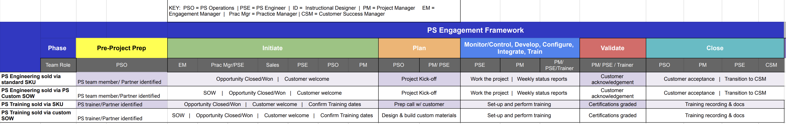

## On this page
{:.no_toc .hidden-md .hidden-lg}

- TOC
{:toc .hidden-md .hidden-lg}

GitLab takes our customer's success very seriously. In Professional Services (PS) we strive to provide a first class experience for all engagements.

- [Process Flow - trim (above)](https://docs.google.com/spreadsheets/d/1uRoB73lZtvNhkk-Z9eQS3_Ys4yX8vVUXXqQUO7Nm1ss/edit?usp=sharing)
- [Process Flow - full](https://docs.google.com/spreadsheets/d/1Y8wWj5g8T6HuPGEnHaWUfdtI7LPmathGaMwfiA2b_Ks/edit?usp=sharing)

Given the close collaboration between the PS Project Management and PS Operations [team functions](https://about.gitlab.com/handbook/customer-success/professional-services-engineering/#team-functions), please refer to the [PS Operations Wiki](https://gitlab.com/gitlab-com/customer-success/professional-services-group/ps-leadership-team/ps-operations/-/wikis/home) for details on processes related to scheduling, reporting, billing, partner processes, and more.  

### Project plan
 
Each PS Engagement will include a Project Plan based on the activities outlined in the Statement of Work (SOW). The Project Plan starts in Kantata but may be supplemented by a more detailed Gantt chart, tasks list, or another form of documented plan. This plan will follow the process listed above.
 
### Project workflow

#### Pre-Project Prep

1. PS Operations: Once a project has moved into SFDC Phase 5 – “Negotiating”, SOW is reviewed and a PS team member is identified for the project, working with Sr. PSE and/or Technical Architect. Choice is based on several aspects:
   - PSE technical skillset/experience
   - PSE personality match with the customer
   - PSE technical growth path opportunity
   - PSE time zone
   - PSE availability
2. PS Operations: Reviews team member availability and adds a soft-allocation to the Kantata project schedule.
3. PS Operations: Research an appropriate Partner if it is determined that a GitLab team member is not available to work the project.
   - See the PS Ops [Partner Process](https://gitlab.com/gitlab-com/customer-success/professional-services-group/ps-leadership-team/ps-operations/-/wikis/home?_gl=1*8ixlcw*_ga*MTE1NzU1OTg3MS4xNjQ2MjQzNjU3*_ga_ENFH3X7M5Y*MTY2MjU2MjExNS4yMy4xLjE2NjI1NjIxNzIuMC4wLjA.#handshake-partner-process)

#### Initiate

4. PS Operations: Once a project has moved to Closed/Won in Salesforce, a project is updated to “in set-up” status in Kantata.
   - A Project Lead is assigned: this can be a Project Manager, or Professional Services staff member
5. PS Operations: Send [Welcome email](https://docs.google.com/document/d/1je9dqVJpFFMv7aw9WhPeQ8aufx6Sj3OZveqaHHd212w/edit?usp=sharing) and [existing customer initiation email](https://docs.google.com/document/d/1eNPXLmstMLoatpOBIhxrJgnPFgqYByPaJoFQRd2kz9U/edit?usp=sharing)
6. Project Lead: Begins planning the project 
   - Internal PS Project Alignment meeting (includes Engagement Mgr, Project Coordinator, PSE)
   - [Project Preparation call](https://docs.google.com/document/d/1fOmBxXf9MqYHQ8LZD5nIepu5WcFeTiwss59RJbd3BWE/edit?usp=sharing) (PM, PSE and/or Technical Architect and customer Project Lead counterpart)
   - Account team to PS Transition meeting (PM to complete the issue template in the customer Epic)
   - If a CSM is assigned, follow [these steps](https://about.gitlab.com/handbook/customer-success/csm/engaging-with-ps/) outlining the engagement guidelines, throughout the customer project

#### Plan

7. Project Lead:
    - External [Customer Project Kickoff](https://docs.google.com/presentation/d/1HtVIE64N94Rcc774ujllClGmYZ5y1_ApE4-O3pazR6k/edit?usp=sharing): Actions and meeting minutes are added directly to the Project Definition Template (attendees include the entire project teams on both sides)
    - Submit resource request via Kantata to match the customer-confirmed project schedule
    - Weekly project check-in meeting: Notes documented in the [Project Definition](https://docs.google.com/spreadsheets/d/1tBO5wyQ-lMkHJMSHkpq8rwzDsKXPcIxURaGrYi_HX9Q/edit#gid=1659103486)
    - Provide Weekly Status Report: Using the template in the [Project Definition](https://docs.google.com/spreadsheets/d/1tBO5wyQ-lMkHJMSHkpq8rwzDsKXPcIxURaGrYi_HX9Q/edit#gid=1659103486)
  
#### Monitor/Control, Develop, Configure, Integrate, Train

8. PS Engineer: Complete work per the SOW
9. Project Lead:
    - Keep Kantata up to date: project schedule, project health/pulse report, milestone acceptance, update project tasks via task-tracker, timesheet approvals
    - Provide Weekly Status Report to customer using the template in the [Project Definition](https://docs.google.com/spreadsheets/d/1tBO5wyQ-lMkHJMSHkpq8rwzDsKXPcIxURaGrYi_HX9Q/edit#gid=1659103486) using the template in the Project Definition
       - Kantata schedule snapshot of the schedule (or other alternative view)
       - Kantata hours burn-down report (for T&M only)
       - Open Action Items [Project Definition](https://docs.google.com/spreadsheets/d/1tBO5wyQ-lMkHJMSHkpq8rwzDsKXPcIxURaGrYi_HX9Q/edit#gid=1659103486)
       - Issues & Escalations [Project Definition](https://docs.google.com/spreadsheets/d/1tBO5wyQ-lMkHJMSHkpq8rwzDsKXPcIxURaGrYi_HX9Q/edit#gid=1659103486)
       - Planned Out of Office [Project Definition](https://docs.google.com/spreadsheets/d/1tBO5wyQ-lMkHJMSHkpq8rwzDsKXPcIxURaGrYi_HX9Q/edit#gid=1659103486)

#### Validate

10. Project Lead:
   - Send [activity-based acceptance requests](https://docs.google.com/document/d/1RiS5TY5484nQuDTW8YMiB-CibVfoni7NJ8IUG2osUD0/edit?usp=sharing) to the customer for approval upon complete of each milestone
11. Customer:
   - Approves completion for each activity, deliverable, or milestone via email

#### Deploy & Close

12. Project Owner:
    - Complete this [sign off workflow](https://about.gitlab.com/handbook/customer-success/professional-services-engineering/workflows/project_execution/sign-off.html)
    - Schedule [Project closure meeting](https://docs.google.com/document/d/1Cw5eLe8VKFtHG9xGqUiCua8Pbu52reMzHujcPWq3ofQ/edit?usp=sharing)
    - Schedule [Project Retrospective](https://docs.google.com/document/d/1CXfnCzjF_hwapy0R-89txiFUmSmvX7jvlEqWn48zN8A/edit?usp=sharing)  
    - Regional Manager to provide a closeout report including estimated hours, actual hours, deliverable documents, and lessons learned to broader team. Post this in [#ps-project-leadership](https://gitlab.slack.com/archives/GR4A7UJSF) and make sure to mention the Engagement Manager team `@em`.  

### Project Management Process Templates

#### Work Exception

A Work Exception is used by a PM when seeking approval for a project to go over the alloted time/budget. Use the [Work Exception issue template](https://gitlab.com/gitlab-com/customer-success/professional-services-group/ww-consulting/ps-plan/-/issues/new?issue%5Bmilestone_id%5D=&issuable_template=work-exception) to gain approvals from PS leadership. 

#### Change Order

Change orders are common elements of Professional Services engagements that can modify the scope, duration, or cost of an ongoing project.  A change order is typically created by the PM, with assistance of the EM when there is a change in scope.  Common scenarios for change orders are:
- the start and end dates of a project are different than what's reflected in the SOW - a $0 change order reflects the new project estimated start and end dates
- part of the scope of the project changes - the scope change might be handled within the original SOW duration and budget, in which case a $0 change order is created, or it might increase the original scope, and the customer will pay for the additional work.  The change order in the latter case would be associated with a new PS opportunity for the amount of the increase in scope.  A new Kantata project will then be created to work through the additional scope.
- an existing project will be extended, with similar project activities and deliverables as the original scope, and the customer agrees to use the original SOW as the contract vehicle for the added work.  In this case, a change order is created and associated to a new PS opportunity that refects the amount of the PS extension.  Note: if the extension of work is for a different project, i.e. has different activities and deliverables, is not contiguously delivered with the original project, and/or will be staffed with different people, then in most cases, a new SOW should be used rather than creating a change order against the original SOW.  The new SOW will have its own scoping issue, be linked to the appropriate PS opportunity, and will create a new project in Kantata for staffing and tracking the engagement process.

Apply the following steps to create a change order issue for tracking and approval purposes
* Note the engagement Epic number and the scoping issue number
* [Create a Change Order type issue in PS Plan](https://gitlab.com/gitlab-com/customer-success/professional-services-group/ww-consulting/ps-plan/-/issues/new?issue%5Bmilestone_id%5D=&issuable_template=change-order&issue%5Btitle%5D=Change%20Order)
   * Use this [Change Order document template](https://docs.google.com/document/d/1zed5AsEpjzwII0HaIjsmXYaRAp5qHY-BGJfVCISVGcM/edit) and attach to the Change Order Issue
* Replace `<!-- ADD CUSTOMER EPIC NUMBER HERE, e.g. &65-->` at the bottom of the description under **Quick Actions** with the epic number e.g. `&65` 
* Replace `<!-- ADD SCOPING ISSUE NUMBER HERE, e.g. #1234-->` at the bottom of the description under **Quick Actions** with the scoping issue number e.g. `#1234` 

#### Work At Risk

Work at Risk (WAR) is used when seeking approval from PS leadership to staff or start work on a project proior to paperwork being fully executed. Work at risk approvals should be sought in all cases where we need to commit to project start dates for a project (consulting or training) before we have a fully closed opportunity, whether or not the project work actually starts before the opportunity closes.  The WAR should be created by an EM, Regional Manager, or Project Coordinator at the appropriate time in the pre-sales process to effectively manage the staffing of the project.  When work at risk is sought, apply the following steps to create a work at risk issue, which describes the work at risk process.
* Note the engagement Epic number and the scoping issue number (for new SOW not yet closed) or change order number (for scope change/addition)
* [Create a Work at Risk type issue in PS Plan](https://gitlab.com/gitlab-com/customer-success/professional-services-group/ww-consulting/ps-plan/-/issues/new?issue%5Bmilestone_id%5D=&issuable_template=work-at-risk&issue%5Btitle%5D=Work%20at%20Risk)
* Replace `<!-- ADD CUSTOMER EPIC NUMBER HERE, e.g. &65-->` at the bottom of the description under **Quick Actions** with the epic number e.g. `&65` 
* Replace `<!-- ADD ISSUE NUMBER OF SCOPING OR CO ISSUE HERE, e.g. #1234-->` at the bottom of the description under **Quick Actions** with the scoping/change order issue number e.g. `#1234` 

