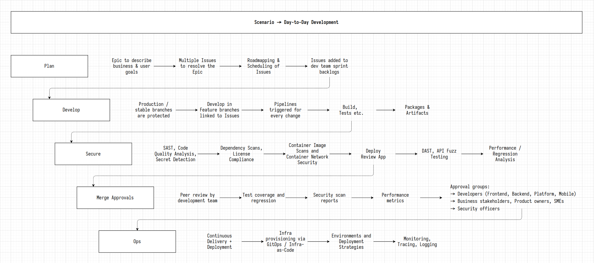
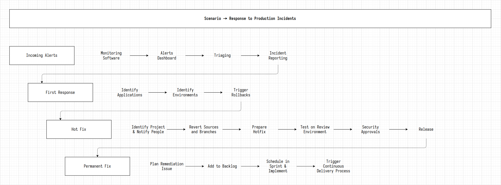
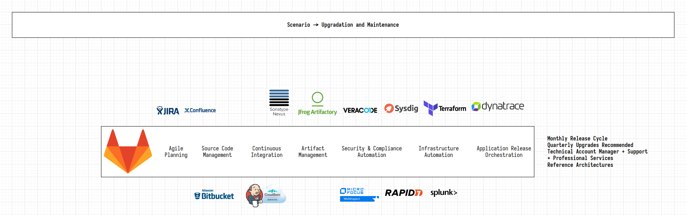

## On this page
{:.no_toc .hidden-md .hidden-lg}

- TOC
{:toc .hidden-md .hidden-lg}

[**SA Practices**](/handbook/customer-success/solutions-architects/sa-practices/) - [**Sales Plays**](/handbook/customer-success/solutions-architects/sales-plays/) - [**Tools and Resources**](/handbook/customer-success/solutions-architects/tools-and-resources/) - [**Career Development**](/handbook/customer-success/solutions-architects/career-development/) - [**Demonstration**](/handbook/customer-success/solutions-architects/demonstrations/) - [**Processes**](/handbook/customer-success/solutions-architects/processes/) - [**Education and Enablement**](/handbook/customer-success/education-enablement/)

# Value Stream Assessments
{:.no_toc}

When working with GitLab, many prospects and customers have software delivery performance improvement as a critical business outcome. Unfortunately, due to the inherent and increasing complexity in the software delivery process, an organization's software delivery value stream often consists of dozens, if not hundreds, of manual configuration touch points and handoffs. Usually, there is a lack of understanding and visibility into the current process, making it challenging to identify and measure software delivery improvements. Without understanding the current value stream, organizations risk slower progress in improving their software delivery performance.

Where applicable, GitLab account teams should assist prospects and customers by providing an assessment of their value stream. The content on this page outlines the approaches, tools, and artifacts used to conduct a value stream assessment for our prospects and customers. By creating a better understanding of the current process by identifying bottlenecks and establishing a baseline measurement of software delivery performance, GitLab can ensure our prospects and customers can realize improvements more quickly and continuously.

## Process

1. [Qualify the Opportunity for a value stream assessment](#qualify)
1. [Educate potential participants and obtain commitment to the workshop](#education-and-commitment)
1. [Prepare for the Value Stream Workshop](#prepare)
1. [Initial customer pitch](#pitch)
1. [Plan the Value Stream Workshop](#planning-meeting-with-customer)
1. [Facilitate the Value Stream Workshop](#value-stream-workshop)
1. [Executive Briefing - Summarize the findings](#executive-briefing---summarize-the-findings)
1. [Contribute back to this framework](#how-to-contribute)

### Qualify

Value stream assessments require a non-trivial investment of time by both the GitLab field teams and our prospects and customers. To ensure the appropriate return on this investment of time, the opportunities should meet the following criteria:

- We have a strong relationship with an executive sponsor
- The opportunity has a Net ARR value of over $500k
- The account has a total addressable market of at least 1000 GitLab users
- The prospect or customer is focused on improving their software delivery performance
- We have a relationship with the [economic buyer](https://about.gitlab.com/handbook/sales/meddppicc/#economic-buyer)
- We have identified and established a relationship with the [champion](https://about.gitlab.com/handbook/sales/meddppicc/#champion)
- We suggest pitching a Value Stream Assessment prior to POVs (Proof of Value) to understand bottlenecks, key metrics important to stakeholder. This also gives us an opportunity to agree to the success criterias before starting the POV as value drivers for deal closure.

In case a Value Stream Assessment is conducted by a customer success manager (CSM), the following criteria should be met:
- We have a strong relationship with the executive sponsor
- We have identified and established a relationship with the champion
- The account has a total addressable market of at least 1000 GitLab users
- The customer has expressed a strong desire to improving their software delivery performance

Key indicators that the opportunity is well-suited include:

- There is a specific initiative to accomplish one or more of the following by a specific date
    - Modernize a specific application or applications
    - Deliver a new critical application to the market
    - Transform or objectively improve their ability to deliver software
    - Modernize their DevOps capabilities
- The customer is currently using some features of GitLab and is interested in how leveraging more of the platform will drive software delivery outcomes
- For customer success, a value stream assessment should help uncover opportunities to expand into new use cases or improve current adoption by identifying bottlenecks in the current software delivery value stream
- An existing customer shows interest in adopting our value stream analytics feature to drive software delivery performance

The scope of a value stream assessment should always be clearly defined. A clearly defined scope ensures that the correct people are being included in the team and reduces the risk of time lost agreeing what should be focussed on. For this reason, the scope of a GitLab facilitated assessment must always be within the DevSecOps space.

### Education and Commitment

A successful Value Stream Assessment requires a commitment to the workshop by the software delivery stakeholders and the personnel experienced with the various processes that constitute their value stream. Without understanding the assessment process and its value to their organization, key participants will lack the commitment to ensure a successful value stream assessment. Educate the prospect or customer on the benefits, process details, and the required commitment. Leverage the [Value Stream Assessment Pitch Deck](https://docs.google.com/presentation/d/1R8RMrXDIaP9Mz3P0_xcevjDQROtvVpSwtEBJgxdsNbw/edit?usp=sharing) by customizing it for the prospect or customer to assist with this step.

_While a Value Stream Assessment is an advanced discovery workshop, it's expected that initial [opportunity discovery](/handbook/sales/playbook/discovery/) and [technical discovery](/handbook/customer-success/solutions-architects/processes/technical-discovery/) have been conducted._

#### Key Benefits

- Discovery and documentation of the software delivery value stream or "path to production" currently in place
    - Establish an agreed upon baseline from which to measure the progress of software delivery performance
    - Identify manual configuration touchpoints and handoffs and other value stream bottlenecks
    - Create a process improvement roadmap
    - Understand the return on investment of a value delivery platform
    - Promote collaboration amongst traditionally siloed functions within the DevSecOps lifecycle

After the prospect or customer understands the process and its benefits, confirm commitment from the stakeholders and workshop participants by scheduling the facilitated workshop and/or interviews. Estimate the duration of the assessment and set the expectation that the documented value stream, recommendations, and readout will be delivered.

#### What is The Required Time Commitment?

Focusing on the goals and benefits listed above, the time required to complete a minimally viable value stream assessment will vary from organization to organization. The workshop should NOT require exhaustive discussion and research. Depending on the availability and commitment of the various value stream participants and stakeholders, the practice could take as little as 4 hours to complete or up to 15 hours spread out through multiple sessions over multiple days.

### Prepare

#### Value Stream Assessment Tracking Issue

The **very first step** when considering a Value Stream Assessment is to notify the Value Stream Assessment team of the intent, and provide as much information as possible regarding the prospect/customer. To do so:

- Please create a new issue in [value stream assessment project](https://gitlab.com/gitlab-com/customer-success/value-stream-assessment)
- Use the template labeled `request_value_stream_assessment`

This gives the team at GitLab the ability to both track the progress of the Value Stream Assessment and allocate team members to the effort, a key requirement for the next preparation steps.

#### Internal Preparation Meeting

It is extremely important to have an internal preparation meeting (can be async) prior to pitching a Value Stream Assessment to the customer. The goal of the meeting is to be able to discuss:
- The opportunity (should include SFDC link for SA engagement)
   - The opportunity for a CSM lead Value Stream Assessment could be to expand into a new stage, rather than it being a financial opportunity in SFDC.
- The key players & their roles
- What metrics are these key players measured by
- Any OKRs for these key players that the account team is aware of
- What will be the succesful outcome from a Value Stream Assessment
- Pick key slides to deliver to customer
- Pick key discovery questions to be asked during pitch & customer planning session
- Important chorus recordings to review

### Pitch

The initial customer pitch allows us to pitch value stream assesment to our key stakeholders & get their buy in. The customer pitch should include:
- What is a Value Stream Assessment?
- What does a Value Stream Assessment entail?
- Who are the key participants involved in the Value Stream Assessment?
- What are some of the expected outcomes of a Value Stream Assessment for them?

It is important to identify a project or few projects as next step for the planning meeting with customer.

Here are some resources that can be used as starting point for the pitch:  
[Customer pitch deck](https://docs.google.com/presentation/d/1EzPC1dI5DKoyTdI4ZUVnd3GExtAaYjxR2wHKPD-FWnw/edit?usp=sharing)  
[Internal pitch deck](https://docs.google.com/presentation/d/1kWqXBbBC2BZ1w9dWEUe4hVJdcXMcO6tXNK9dFY-5XF0/edit#slide=id.gef34d4c13c_1_636)  

### Planning meeting with customer

Planning a Value Stream Workshop can generally be done within an hour, given the right expectation, focus and people involved.

It is recommended that when planning a Value Stream Workshop, a [Value Stream Transformation Charter](https://docs.google.com/spreadsheets/d/1uiJtMRWvm4DVI_h8pOqRZPwuvCcQhohpk1Vl71PHbtc/edit) should be used.

#### Define Value Stream

- What is the value stream that is to be mapped?
- Where does the mapping process start and end?
- What context or conditions are being considered?
- What triggering event initiates the work flowing through the value stream?
- What is the demand rate? (The volume of incoming work per day, week, month, etc. relating to this value stream)
- (Optionally) Which team, project, feature, etc. is being mapped?
- Define boundaries and limitations
    - When looking at desired future state, it is very likely there will be certain limitations that the team needs to operate within (financial, systems, customer, organisational, physical, etc)
    - This is critical to avoid creating an unrealistic desired future state, or one that's simply not achievable in the defined time frame
- Define the time frame (How quickly do they need to realise the future state?)

Without the answers to these questions we risk spending significant time and energy trying to understand each possible variation and often will end up with metrics that are hard to define (the "it depends" trap). As such, it's critically important that these definitions are confirmed and agreed upon prior to the workshop (generally as part of the planning meeting).

### Value Stream Workshop

- People
- Process
- Tools
- Workflows
- Questions

#### People

In order to help facilitate a Value Stream Assessment, a number of GitLab team members will be required to take part. The roles of these members generally fall into the following:

- **Facilitator** - A team member fully versed in the Value Stream Mapping process who is responsible for leading the session; ensuring that discussion is staying on-topic, at the right level and at the required pace.
- **Account Leader** - The account leader's responsibility is to ensure that the long term strategic vision for the customer/prospect is considered when discussing desired future state and they can also provide additional context to the current state.
- **Scribe** - A team member who's primary purpose is to document the session, capture key metrics as they emerge which will later be used to create a Value Stream Map.

#### Process

The process which we will go through, at a high level, is as follows:

1. Why we are here? (Exec sponsor led)
1. Re-iterate expectations set in the planning meeting
    1. Start and end points for the value stream
1. Current state
    1. Initial process "walk-through"
        1. Capture people, processes and technology
    1. 2nd process "walk-through"
        1. Metrics gathering (Lead Time, Process Time, Percent Complete and Accurate)
    1. Anylse metrics and identify bottlenecks and improvement areas
1. Design future state
    1. Review the expectations again, to align the team on the target they are aiming to create
    1. Determine "right work" (which processes and steps are required for the value stream to be optimal)
        1. Remove processes and process steps when they are truely unnecessary
        1. Add processes and process steps when they can increase **overall** process time and lead time
    1. Making work flow
        1. Aim to reduce the lead time (LT), process time (PT) and achieve a higer percent complete and accurate (%C&A) for every process block where prossible
        1. Use Lean countermeasures and improvement tools
    1. Managing the work
        1. How will we measure if the value stream is performing as we intended? (KPIs)
        1. Who will monitor and manage the value stream performance?
1. Develop transformation plan (likely completed async)
    1. For the transformation plan as a whole, we capture accountable parties and progress review dates
    1. For each process block transformation, capture the measurable target, proposed countermeasures, execution method, owner and timeline (later, status as well)       

#### Tools

- Remote:
    - [Google Sheets - Lite Value Stream Mapping Template](https://docs.google.com/spreadsheets/d/1ioMIf_wV95mGUwjHezjT3zOTkEeG_gEnKanVS4hJB0k/edit?usp=sharing)
    - Zoom, MS Teams, or Google Meet
    - LucidChart for Value Stream Map visulization
      - LucidChart is an IT-managed application. If you are unsure if you have LucidChart access, go to the Okta interface in your browser, then select "Search Your Apps" and see if `LucidChart SSO` is available. If yes, LucidChart has been assigned to you and you can launch it from Okta and collaborate on any LucidChart Documents your team has shared with you. If no, then `LucidChart SSO` has not been assigned to you yet.
      - If you do not have `LucidChart SSO` assigned to you in Okta, please navigate to the ["access-requests" Project](https://gitlab.com/gitlab-com/team-member-epics/access-requests/-/issues/) and submit an Issue requesting "Lucid Chart". Assign the Issue to your Manager and add the `IT::to do` label. An example Access Request Issue may be found [here](https://gitlab.com/gitlab-com/team-member-epics/access-requests/-/issues/19341).
      - If your Access Request is urgent, paste the link to your Access Request Issue into the #it_help Slack channel and @ mention `it-help` with a note on why it is urgent.
- Onsite:
    - Stickies
    - Pens
    - Large whiteboard

#### Example Workflows

1. Idea to Production
1. Response to Production Incident
1. Toolchain Upgrading and Maintenance

##### Idea to Production

##### Response to Production Incident

##### Toolchain Upgrading and Maintenance

### Executive Briefing - Summarize the Findings

The final meeting as part of the Value Stream Assessment process is the findings and next steps presentation (though it's called an executive presentation, it's expected to be a two-way discussion). The high level topics of this meeting are:

1. Summary of planning outcomes; what process was to be mapped and what target goals were created
1. Summary of the current state mapping (with VSM diagram)
1. Summary of the proposed future state mapping (with VSM diagram)
1. Highlight the key differences, expected process and business benefits
1. Walkthrough of recommendations
1. Walkthrough and gain agreement for the transformation plan. The transformation plan should be built in conjunction with professional services to yield best results. Please read how to position professional services in an opportunity [here](https://about.gitlab.com/handbook/customer-success/solutions-architects/processes/#positioning-professional-services)
1. Define next steps and suggest a review date

Example template of the executive briefing can be found [here](https://docs.google.com/presentation/d/133mECaV2vfUQGIn03mixXSI6ENrc4T-R_vRwXBRManA/edit?usp=sharing). Please modify accordingly to suit your customer's need.

It is recommended to review the executive briefing with your champion, key stakeholder before the final meeting to collect additional feedback. The goal is to then deliver it jointly to the broader team to gain agreement.

## FAQs from customers/prospects

1. What's in it for me - the customer?

    - Free, hands-on consultative analysis of their software delivery lifecycle, including their current state, future state, and areas of improvements.
    - Competitive analysis of where they are compared to their peers in the industry. This report contains the most recent benchmark values for the four DORA metrics    (widely regarded as good measures of DevOps performance) [State of Devops Report 2021](https://services.google.com/fh/files/misc/state-of-devops-2021.pdf).
    - Recommendations on how to overcome visible or invisible challenges with a strategic plan to help them reach their future state.

1. What are typical outcomes for a customer?

    - For one medical device company in Silicon Valley, doing a Value Stream Assessment provided them with a tangible adoption plan to decrease their release cycle from 6 months to 1 months. It was specific, actionable, and realistic. 
    - For a financial service bank, doing a Value Stream Assessment provided them with a comparison of their process with their peers, and the clear path forward to improve their processes, and ultimately allowed them to achieve a desired ROI of releasing software faster while increasing quality.

    - Financial Services customers have realized the below outcomes when coupling a Value Stream Assessment with GitLab investment: 
        - Faster time to market
        - Increase deployment frequency
        - Reduced lead time to change
        - Improved change failure rate
        - Necessary capabilities obtained to drive transformation change (e.g., digital, devOps, software delivery, modern applications)
1. Which teams are typically involved?

    - We start with application development team, quality engineering team, devops then application security.

1. What's the best place to start?

    - Pick the most business critical application or a representative application that has faster time to market requirement.

1. That's a lot of time investment from our teams Or Our teams are busy with other projects.

    - It takes 1 or 1.5 hr per team to do focused discovery for a Value Stream Assessment. We interviewed 4 different teams for our silicon valley customer in 4.5 hrs. We can start with the least busy team if you don't want it to be pursued in a group setting.

1. Can you interview 1 team at a time?

    - Yes. We would like to start with application development team if so. This helps us understand an overview of their development process(idea-production) process.

## Training and Enablement

### Value Stream Assessment Overview

This course provides an overview of how GitLab account teams should assist prospects and customers by providing an assessment of their value stream. The course outlines the approaches, tools, and artifacts used to conduct a value stream assessment for our prospects and customers.

- [EdCast Pathway](https://gitlab.edcast.com/pathways/vsa-overview)

### Past Enablement
- [Past Field Enablement](https://youtu.be/jfM3AG6dBFY)
- [Sales Kick Off - Delivering strategic customer outcomes by partnering with your SAs](https://drive.google.com/file/d/1-sKdoGU9sj5KnVxEzmo6kDZ1CTZkZNrv/view?usp=sharing)
- [Sales Kick Off (SA breakout) - Value Stream Mapping - Origins, Assessments and Iterations](https://drive.google.com/file/d/1M4FVNZYuWBJhkLM4JQU7wUkX-Dot9BQG/view?usp=sharing)

## How to Contribute

In the spirit of collaboration and iteration, please help to continuously improve this framework. Ways to contribute include:

- Create a merge request to improve this page
- Add feedback or tasks to the [Value Stream Assessment Issue](https://gitlab.com/gitlab-com/customer-success/solutions-architecture-leaders/sa-initiatives/-/issues/44)
- Share your experiences in the **#customer-success** and **#solutions-architects** slack channels
- Provide feedback and/or updates to the pitch deck or provide links to your own variations
- Provide links to your facilitation recordings, summary documentation, and/or other artifacts to this page
- Collaborate in the **#value-stream-discovery** slack channel
