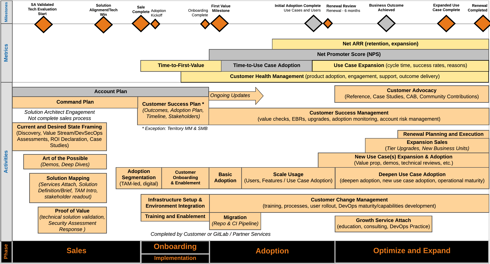
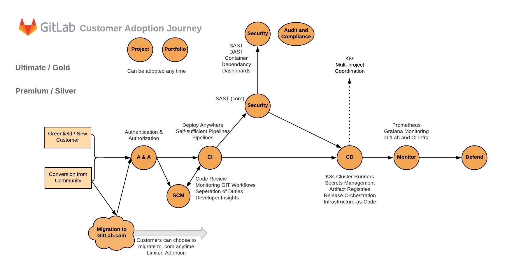
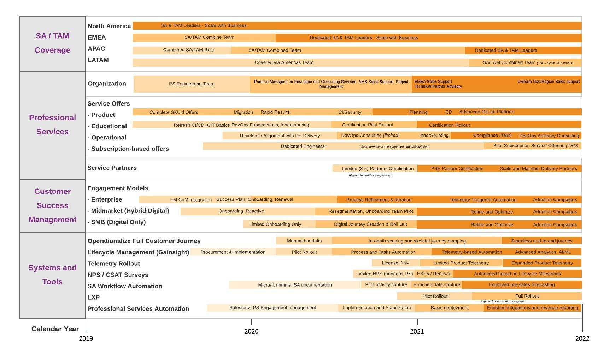
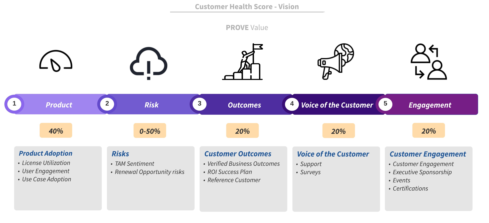
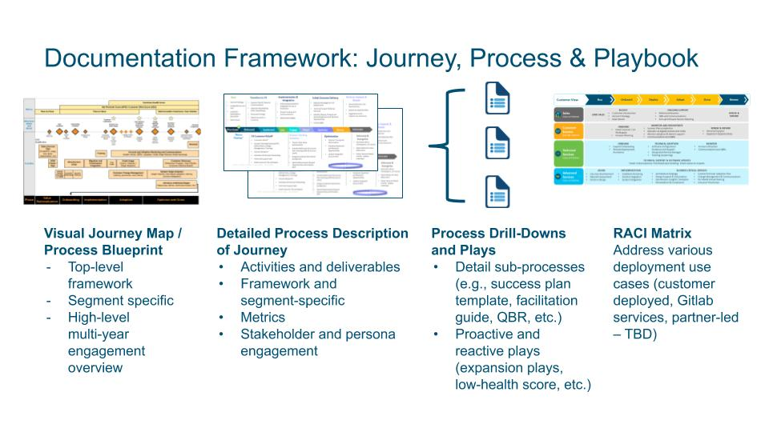

## On this page
{:.no_toc .hidden-md .hidden-lg}

- TOC
{:toc .hidden-md .hidden-lg}

_"Customer Success is when customers achieve their desired outcome through interactions with your company with the appropriate experience."_ - Lincoln Murphy

## Objective

Create a company-wide customer success approach, providing an engagement framework for the Customer Success organization and integrating related programs and operations from GitLab operations (i.e., marketing, sales, customer success, product / engineering and support).

## Goals

Deliver faster time-to-value and customer-specific business outcomes with a world class customer experience, leveraging the full capabilities of the GitLab application. Increase net dollar retention as well as lifetime value (LTV).

## High-Level Visual of Customer Journey

### Video Introduction 
[Video Introduction to Customer Journey and Process Framework](https://youtu.be/LIroDgZOWLc)

[A pdf of Customer Journey](images/gitlab-customer-journey.pdf)

## High-Level Visual of GitLab Adoption Journey

## Capabilities Roadmap

The following shows the high-level view of the capabilities that we will be developing as mature our customer success team, processes and systems. [A pdf version for viewing.](images/gitLab_customer_success_capabilities_roadmap.pdf)

## Strategy and Priorities Page
The [Strategy and Priorities Page](https://docs.google.com/document/d/1XYzHiwvGj4ylKvjDq6uZK--0miSlaTK4HhBwZHf4MDw/edit) (internal only) will show updates on our strategy and priorities for the given period.

## Product Usage Data 

Product usage data is key to driving customer and GitLab outcomes by providing visibility to customers' adoption of licenses, use cases, and capabilities. For more about how we use and plan to use this data, please see our ["Product Usage Data Vision" page](/handbook/customer-success/product-usage-data/). 

## Lifecycle Stages

Each customer deployment will go through the following lifecycle stages.

**Onboarding**: The objective is to prepare the customer for a successful customer journey with GitLab, meaning they can achieve their business outcomes with a great experience. This includes success planning, expectation setting on engagement approach and tools, and education on GitLab resources, programs and support services. Onboarding is completed when all the tasks are completed or closed (i.e., not applicable).

**Implementation**: The objective is to ensure the customer has the right infrastructure to support GitLab solution operations. For self-managed customers, this could include setting up on-premises equipment and/or cloud infrastructure. For customers leveraging GitLab.com, this includes integration of the GitLab cloud service with the customers environment (e.g., SAML SSO integration). This is considered complete when production infrastructure is ready for use.

**Adoption**: The objective is to support our customer's utilization of the GitLab solution to address the customer's original purchase intent (i.e., use case(s) and capabilities, licenses). Adoption is complete when:

1. 80% of the licenses from the original purchases are activated
1. the customer is successfully adopting the capabilities or use cases from their original purchase intent.

These will be measured according to product analytics (if available) or through agreement with the customer.
We define the adoption of a use case using the criteria established in our [Customer Use Case Adoption](/handbook/customer-success/product-usage-data/use-case-adoption/) page.

**Optimize and Grow**: The objective is to enable the customer to get additional value from the GitLab platform. This is achieved through the adoption of additional features, use cases and/or stages, deeper process and operational integration in a customer's environment, optimization of application performance and availability, expansion into additional teams, and additional application of GitLab and DevOps best practices. The customer will remain in this stage as long as the customer continues to renew. The maturity of the customer will be tracked by product analytics (if available) or by collecting feedback from the customer on use cases adopted.

## Measurement and KPIs

### Time-to-Value KPIs

As part of our customer journey, we highly value the customer's initial experience and measure time-to-value. Specifically, we will measure the time in calendar days from the initial transaction to:

- **Engagement**: Represents our time to engage the customer. Completion defined when the CSM has their first meeting with the customer.
- **Onboarding**: Completion is defined when all the onboarding tasks are done.
- **Infrastructure Ready**: Completion is defined as either 1) production implementation is complete for on-premises installations 2) GitLab.com is integrated into a customer's environment or 3) Cloud and on-premises environments ready for a hybrid deployment
- **First Value**: Represents a small subset of users are using the product in a Production environment. This is achieved when a customer activates 10% of their licenses.
- **Outcome Achieved**: Represents delivery to original purchase intent. We want to capture the delivery of outcomes against their original purchase intent. New and changed goals will continue to be tracked with the engagement, but not included in this milestone.

### Customer Health 

To improve the customer experience, deliver on customer outcomes, and increase net ARR, GitLab is focused on measuring and improving Customer Health. Customer Health includes multiple health measures that, when aggregated, gives a holistic view into the customer and allows drill-down into specific areas. We have created and adopted the PROVE Value approach:

* **Product**: License + User Engagement + Use Case
* **Risk**: CSM Sentiment + Opportunity Renewal risks
* **Outcomes**: Success Plan + Verified Outcomes
* **Voice of the Customer**: Support + Surveys
* **Engagement**: Customer Engagement + Executive Sponsorship + Events + Certifications

The intention, both of the P.R.O.V.E. components and overall philosophy, is that we need to "prove value" to the customer.

For a detailed description of Customer Health and Early Warning System methodology, see [Customer Health Scoring](/handbook/customer-success/customer-health-scoring/). This will include the methodology around how we score the health of accounts, along with how we enable the team toward a proactive renewal approach. 

### Retention and Reasons for Churn

We measure customer success through Gross and Net Retention.

#### Reasons for Churn / Expansion, Dollar Weighted

A measure of the causes for retention (compared to the same time period for the previous year) MRR decreases (churn) or increases (expansion). Churn is specified as Cancellation or Downgrades. Expansion is specified as Seat Expansion, Product Change, Product Change/Seat Change Mix, or Discount/Price Change. These are reported as a percentage using the change in MRR for the given reason over the total MRR change for all types in either the Churn or Expansion category. Trueups are excluded from these metrics.

## Professional Services Standard Cost

We use a standard cost estimate to project margin on PS Statements of Work. The standard rate is calculated by dividing the average annual OTE plus benefits by the estimated annual billable hours. For this calculation, we assume 1,880 billable hours annually. We update the standard cost estimate on a quarterly basis.

To standardize the cost estimate for projects, make a copy of the [SOW Cost Estimate Calculator](https://docs.google.com/spreadsheets/d/16KFNRFe4E_oaqU7_ZGivoO7eU3-65dkMgVvK5Jvb7ZQ/edit#gid=158441360) and attach it to the issue for the SOW in question. This calculator will be updated to reflect any changes to the standard cost estimate.

If you need help with determining the standard cost rate or if it is applicable to your project, please contact your [Finance Business Partner](/handbook/finance/financial-planning-and-analysis/#finance-business-partner).

## Scope

- Processes, procedures, metrics and tools / systems for the Customer Success team
- Integration of the related processes and operations for other GitLab business groups

## Deliverables

1. Provide a process blueprint for the customer success engagement processes, including:
    - High-level customer journey (i.e., single stage and stage expansion)
    - High-level multi-year engagement summary
    - Processes, procedures and detailed flowcharts
    - Customer and GitLab-centric metrics
1. Framework structure that will address specific differences and needs based on:
    - Customer segmentation (Large, SMB, Commercial)
    - Product differences (e.g., stage-specific, use case and/or feature playbooks)
    - Customer personas (e.g., executive sponsor, tools/infrastructure executive, development executive, etc.)
1. Integrate processes and operations for direct customer engagement processes such as:
    - **Marketing**: messaging alignment and consistency, journey integration with marketing stages (e.g., awareness), customer advocacy, advisory boards, collateral development, digital journey (i.e., tech touch, hybrid digital/CSM engagement)
    - **Sales**: account planning and strategy, POC, success planning, IACV, renewal forecasting and execution, training and enablement
    - **Product / Engineering**: Product analytics and data insights, UX journey map alignment, in-app adoption (e.g., product-led onboarding), application/stage/use case/feature adoption, "voice of customer" reporting, escalations and defect and enhancement requests
    - **Support**: Customer health, escalation processes
    - **Finance**: Financial metrics and targets (e.g., margins), budget and forecasting
    - **People Operations**: Job types, grades and families
    - **Information Technology**: Customer and operational dashboards, workflow management capabilities (i.e., SFDC, customer success platform), journey automation

## Process Framework

