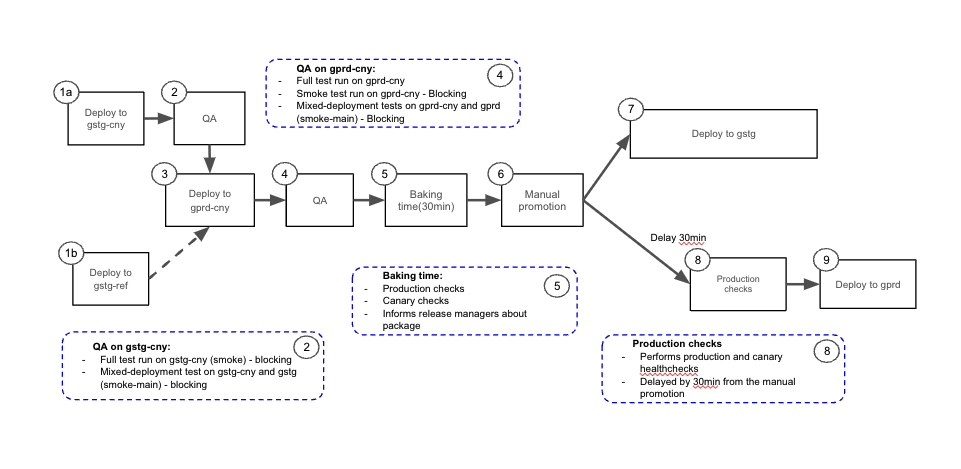
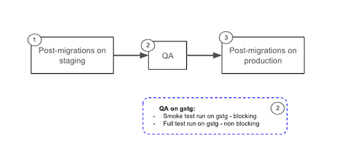

## On this page
{:.no_toc .hidden-md .hidden-lg}

- TOC
{:toc .hidden-md .hidden-lg}

## Overview and terminology
This page describes the individual steps involved in deploying application changes to GitLab.com. Guidance on how to follow the deployment process are also described. For a high-level view of the overall deployment and release approach please see the [Deployments and Releases handbook page](/handbook/engineering/deployments-and-releases/).  

### GitLab.com deployments process

GitLab.com receives updates multiple times a day with new deployment branches currently created at **00:00, 03:00, 06:00, 8:00, 11:00, 13:00, 15:00, 18:00 and 21:00 UTC** from Monday through Friday.

* [Source](https://docs.google.com/presentation/d/1YRjA1dYCXNXp06VltDYlik1MdFyzUvaeXKk69mMPcA4/edit?usp=sharing)

Once a new branch is created, only commits that pass the CI tests are eligible for deployments ("green build"). This means that if specs are failing in
[gitlab-org/gitlab], the deployments cannot progress further.

Automated tasks in the [release-tools] project are setup to drive the next steps:

- Twice every hour, a task runs to cherry-pick merge requests labeled with `~"Pick into auto-deploy"` (See [Labels of importance]).
- Twice every hour, a task searches for the latest "green build" in the auto-deploy branch.
  - If it finds a commit that has not been previously deployed, it will start the process of creating a new package.
  - If the commit has already been deployed, the task will not take any actions.

A package is deployed to GitLab.com in the following steps:
1. 1a. When a new package is built, it is automatically deployed to gstg-cny, [the canary stage of staging.gitlab.com](/handbook/engineering/infrastructure/environments/#staging-canary). 1b. In parallel, the same package is deployed to the [Staging-ref environment, gstg-ref](/handbook/engineering/infrastructure/environments/#staging-ref)
2. A set of automated QA end-to-end/integration tests are run. Note that two sets of blocking QA tests are executed, one targeting gstg-cny and the other targeting staging (gstg). This is designed to assist with exposing issues arising in mixed deployment environments, where multiple versions of GitLab components are deployed that share services such as the database
3. After passing, the package is automatically deployed to gprd-cny, [the canary stage of gitlab.com](/handbook/engineering/infrastructure/environments/#production-canary), where [canary testing](/handbook/engineering/#canary-testing) can take place. This means that specific projects (like `gitlab-org/gitlab`) as well as a small amount of end user traffic will be using the new package. 
4. Like with deployment to staging-canary above, two sets of automated QA end-to-end/integration tests are run. One targets the canary stage of production, the other targets the main stage (to ensure the new and old code are still functional).
5. After 30 minutes in the [canary stage of gitlab.com](/handbook/engineering/infrastructure/environments/#production-canary), and provided no new exceptions or alerts are reported, the package is considered to be ready for deployment to [gitlab.com](/handbook/engineering/infrastructure/environments/#production) and [staging.gitlab.com](/handbook/engineering/infrastructure/environments/#staging)
6. The promotion to [gitlab.com](/handbook/engineering/infrastructure/environments/#production) and [staging.gitlab.com](/handbook/engineering/infrastructure/environments/#staging) is triggered manually by the release
managers. Ongoing incidents or Change Requests with the `blocks deployments` label will prevent a package from being deployed to gstg (staging) and gprd (production). Note that deployments to canary (both gstg-cny and gprd-cny)
will not be blocked. Migrations will also not be blocked since they are executed during canary deployments. However, post deploy migrations will be blocked.
7. Deployment to the staging envionment
8. Production checks are performed to asses the health of the environment. If considered to be healthy the pipeline will automatically continue
9. Deployment to the production environment runs delayed to staging
Each deployment will trigger a notification in the Slack channel [#announcements](https://gitlab.slack.com/archives/C8PKBH3M5).
As part of the deployments, a QA issue is created in [release/tasks] issue tracker to inform the people who are
involved in the process that their change is going through environments

### Post-deploy migration (PDM) execution

To make GitLab.com packages rollbackable, the [post-deploy migrations] are independent from the GitLab.com deployment process. These migrations
are run in staging and production environments through the post-deploy migration pipeline that is triggered on a daily basis at the discretion of
the release managers.

* [Source](https://docs.google.com/presentation/d/1YRjA1dYCXNXp06VltDYlik1MdFyzUvaeXKk69mMPcA4/edit?usp=sharing)

When a release manager executes the post-deploy migration pipeline:

1. Post-deploy migration scripts run on staging
2. QA tests execute against staging
3. Following a successful QA verification, post-deploy migration scripts run on production.

Details of this pipeline can be found in the [post-deploy migration pipeline documentation].

To determine if a post-deploy migration has been executed [please see this guide](https://gitlab.com/gitlab-org/release/docs/-/blob/master/general/post_deploy_migration/readme.md) for more information.

### Deployment blockers

Anyone can **halt or block a deployment to Production** by:
1. Declaring a [incident](/handbook/engineering/infrastructure/incident-management/#reporting-an-incident)
2. Applying the `blocks deployments` label. This prevent automated deployments to the Production environment from starting.
3. Alerting the Release Managers in the [#releases] channel. 

In addition, automated deployments to **any production environment** (including [canary]), are
halted during the change lock period. Currently, the change lock period is between every **Friday 23:00 UTC and Monday 06:00 UTC** as well as during any [scheduled Production Change periods](/handbook/engineering/infrastructure/change-management/#production-change-lock-pcl).

During the change lock period, manual deployment can be triggered through GitLab ChatOps if the deployment fixes **a severity::1 availability or security issue**.

Deployments to production will be blocked by the following events:

1. An [active incident with the `blocks deployment` label](/handbook/engineering/infrastructure/incident-management/#labeling).
1. Ongoing [change issues with the `blocks deployment` label](/handbook/engineering/infrastructure/change-management/#change-criticalities).

Release Managers may decide, with input from the [EOC](/handbook/engineering/infrastructure/incident-management/#roles-and-responsibilities) to override a block and continue with the deployment. 

## Labels of importance

### GitLab.com pick label

For code that needs to be deployed to GitLab.com with higher priority than the
regular cadence, we have `~"Pick into auto-deploy"` label. Note that branches are regularly created throughout the day, inclusion in a scheduled deployment does not require this label. 

The automated systems that create a new GitLab.com release will look for this label
specifically, and any merge request with this label and a severity::1/severity::2 severity label will be automatically cherry-picked
into the active auto-deploy branch. In case the merge request cannot be picked,
which can happen if there is a conflict in the files being picked, the message
will be posted in the merge request asking the author to create a new merge request
targeting the currently active release branch.

The label should be only used under the following circumstances, when the merge
request is especially urgent. For example: 

- Resolves or mitigates a severity::1/severity::2 incident
- Resolves a regression that can lead to a severity::1/severity::2 problem
- Urgent performance or availability fix that can improve the stability of
GitLab.com

If this label is added because a merge request is blocking further deploys,
consider leaving a note in [#releases] Slack channel to raise awareness of the status.

**For new features or non-urgent fixes**, the label **should not be used** because
the new release is only days or hours away.

Directions on how to know whether a MR is deployed to GitLab.com are in the [release/docs](https://gitlab.com/gitlab-org/release/docs/blob/master/general%2Fdeploy%2Fauto-deploy.md#auto-deploy-status).

## Frequently Asked Questions

### When will my merge request be deployed?

We currently create an auto-deployment branch at a [specific
timeline](/handbook/engineering/deployments-and-releases/deployments/#gitlabcom-deployments-process). The current Mean Time To Production time and target can be seen on the [Infrastructure performance indicators page](/handbook/engineering/infrastructure/performance-indicators/#mean-time-to-production-mttp).

For a merge request with [the pick label](/handbook/engineering/deployments-and-releases/deployments/#gitlabcom-pick-label), the
process is different.

### How can I determine what environment my merge request is currently in?

See [this](https://gitlab.com/gitlab-org/release/docs/-/blob/master/general/deploy/auto-deploy.md#status-of-a-merged-mr-or-a-commit)
guide for more information.

### I found a regression in the QA issue, what do I do next?

If you've found a regression with a potentially high [severity], immediately follow the steps in [Deployment blockers] to halt the deployment.

If a regression is found in a new feature, and only that feature is affected, follow the directions in the QA issue created in the [release/tasks] project for a regular regression.

For high severity bugs found in the lead up to the 22nd of the month please also alert the Release Managers in [#releases].

## Resources

| Description        | Location            |
|--------------------|---------------------|
| Deployment orchestration | [Link](https://gitlab.com/gitlab-org/release-tools/) |
| Deployment documentation | [Link](https://gitlab.com/gitlab-org/release/docs) |
| Release related tasks issue tracker | [Link](https://gitlab.com/gitlab-org/release/tasks/) |
| Delivery group issue tracker | [Link](https://gitlab.com/gitlab-com/gl-infra/delivery/issues) |
| Release manager schedule | [Link](https://about.gitlab.com/community/release-managers/) | 
| Maintenance Policy | [Link](https://docs.gitlab.com/ee/policy/maintenance.html) |

[semver]: https://semver.org
[Deployment and Release process overview]: /handbook/engineering/deployments-and-releases/#deployment-and-release-process-overview
[canary]: /handbook/engineering#canary-testing
[development month]: /handbook/engineering/workflow/#product-development-timeline
[auto deploy transition]: https://gitlab.com/gitlab-org/release/docs/blob/21cbd409dd5f157fe252f254f3e897f01908abe2/general/deploy/auto-deploy-transition.md#transition
[maintenance policy]: https://docs.gitlab.com/ee/policy/maintenance.html
[gitlab-org/gitlab]: https://gitlab.com/gitlab-org/gitlab
[release-tools]: https://gitlab.com/gitlab-org/release-tools
[release/tasks]: https://gitlab.com/gitlab-org/release/tasks/
[labels of importance]: #labels-of-importance
[creating patch release]: https://youtu.be/lHag9jARbIg
[auto-deploy]: https://www.youtube.com/watch?v=_G-EWRpCAz4
[severity]: /handbook/engineering/quality/issue-triage/#severity
[#releases]: https://gitlab.slack.com/archives/C0XM5UU6B
[#f_upcoming_release]: https://gitlab.slack.com/archives/C0139MAV672
[process-monthly-release]: https://gitlab.com/gitlab-org/release/docs/blob/master/general/monthly/process.md
[process-auto-deploy-release]: https://gitlab.com/gitlab-org/release/docs/blob/master/general/deploy/auto-deploy.md
[process-security-release-critical]: https://gitlab.com/gitlab-org/release/docs/blob/master/general/security/process.md#critical-security-releases
[process-security-release-non-critical]: https://gitlab.com/gitlab-org/release/docs/blob/master/general/security/process.md#non-critical-security-releases
[process-patch-release]: https://gitlab.com/gitlab-org/release/docs/blob/master/general/patch/process.md
[Security Release process as Developer]: https://gitlab.com/gitlab-org/release/docs/-/blob/master/general/security/developer.md
[Security Releases How to video]: https://www.youtube.com/watch?v=ixtUDxM3nWA
[GitLab Security]: https://gitlab.com/gitlab-org/security/
[security issue template]: https://gitlab.com/gitlab-org/security/gitlab/issues/new?issuable_template=Security+developer+workflow
[security release backports]: https://gitlab.com/gitlab-org/release/docs/-/blob/master/general/security/developer.md#backports
[Hot patch]: https://gitlab.com/gitlab-org/release/docs/blob/master/general/deploy/post-deployment-patches.md
[Deployment blockers]: /handbook/engineering/deployments-and-releases/deployments/#deployment-blockers
[pre.gitlab.com]: /handbook/engineering/infrastructure/environments/#pre
[release.gitlab.net]: /handbook/engineering/infrastructure/environments/#release
[How to fix a broken stable branch]: https://gitlab.com/gitlab-org/release/docs/-/blob/master/general/how-to-fix-broken-stable-branch.md
[post-deploy migrations]: https://docs.gitlab.com/ee/development/database/post_deployment_migrations.html
[post-deploy migration pipeline documentation]: https://gitlab.com/gitlab-org/release/docs/-/tree/master/general/post_deploy_migration

