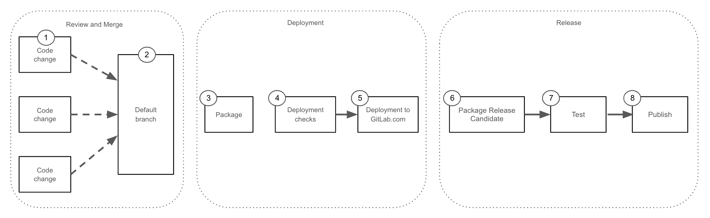

## On this page
{:.no_toc .hidden-md .hidden-lg}

- TOC
{:toc .hidden-md .hidden-lg}

## Overview and terminology
This page describes the deployment and release approach used to deliver changes to users. The overall process consists of two significant parts:  
* **Monthly self-managed release**: GitLab version (XX.YY.0) [published every month on the 22nd][process-monthly-release]. From this monthly release, [patch][process-patch-release], [non-critical][process-security-release-non-critical], and [critical][process-security-release-critical] security releases are created as needed
* **GitLab.com deployment**: A Continous Delivery process to deploy [branches created from master branch][auto-deploy], on regular intervals. 

For more details on the individual processes and how to use them please see the [Deployments page](/handbook/engineering/deployments-and-releases/deployments) for GitLab.com changes and the [Releases page](/handbook/engineering/releases/) for changes for self-managed users. 

**The main priority** of both deployments and releases **[is GitLab availability & security](/handbook/engineering/development/principles/#prioritizing-technical-decisions)**
as an application running on both GitLab.com and for users running GitLab
in their own infrastructure.

### Deployment and Release Process overview

For testing purposes, all changes are deployed to GitLab.com before being considered for a self-managed release. Deployment and release cadences operate on different timelines with changes deploying to GitLab.com multiple times per day, and packages being released for self-managed users several times a month. 

This overview shows how the two processes are connected: 

* [Diagram source](https://docs.google.com/presentation/d/1YRjA1dYCXNXp06VltDYlik1MdFyzUvaeXKk69mMPcA4/edit?usp=sharing)

1. Engineer creates features or bug fixes. Changes reviewed by Maintainers
2. Validated changes merged into the default branch
3. A scheduled pipeline packages all new changes into an "auto-deploy package" for deployment to GitLab.com. Multiple packages are created each day at the [listed times](/handbook/engineering/deployments-and-releases/deployments/#gitlabcom-deployments-process)
4. If deployments are allowed the auto-deploy pipeline starts. Production Change Locks, unhealthy environments, or other ongoing deployments are examples of events that would prevent a deployment 
5. The auto-deploy package is deployed to GitLab.com. For more details [see the deployment process](/handbook/engineering/deployments-and-releases/deployments/#gitlabcom-deployments-process)
6. Changes that have been successfully deployed to GitLab.com can be considered for packaged release for self-managed users. A new release candidate package is created for these changes
7. The release candidate is deployed to a test environment and automated QA tests execute
8. Release Candidate is officially tagged and published for release

For a more detailed explaination of the processes see the [deployments page](/handbook/engineering/deployments-and-releases/deployments/) and the [releases page](/handbook/engineering/releases/)

## Release Managers
The overall coordination and operation of the deployment and release process is the responsibility of the release managers. 

See the GitLab [Release Managers schedule] to find out who the current release managers are.

### How to contact a Release Manager

You can contact the current Release Managers:
1. On GitLab issues and epics by using `@gitlab-org/release/managers` handle 
2. On Slack by using the `@release-managers` handle

We use the `#releases` and `#f_upcoming_releases` channels to discuss and coordinate deployments and releases. Automated deployment status announcements are made to the `#announcements` channel. 

If you need to escalate a request, please use the [release management escalation process](/handbook/engineering/infrastructure/team/delivery/#release-management-escalation)

## Resources

| Description        | Location            |
|--------------------|---------------------|
| Release documentation | [Link](https://gitlab.com/gitlab-org/release/docs) |
| Release related tasks issue tracker | [Link](https://gitlab.com/gitlab-org/release/tasks/) |
| Delivery team issue tracker | [Link](https://gitlab.com/gitlab-com/gl-infra/delivery/issues) |
| Release manager schedule | [Link](https://about.gitlab.com/community/release-managers/) | 
| Deployment process | [Link](/handbook/engineering/deployments-and-releases/deployments/) |
| Release process | [Link](/handbook/engineering/releases/) |
| Maintenance Policy | [Link](https://docs.gitlab.com/ee/policy/maintenance.html) |

[auto-deploy]: https://www.youtube.com/watch?v=_G-EWRpCAz4
[process-monthly-release]: https://gitlab.com/gitlab-org/release/docs/blob/master/general/monthly/process.md
[process-patch-release]: https://gitlab.com/gitlab-org/release/docs/blob/master/general/patch/process.md
[process-auto-deploy]: https://gitlab.com/gitlab-org/release/docs/blob/master/general/deploy/auto-deploy.md
[process-security-release-critical]: https://gitlab.com/gitlab-org/release/docs/blob/master/general/security/process.md#critical-security-releases
[process-security-release-non-critical]: https://gitlab.com/gitlab-org/release/docs/blob/master/general/security/process.md#non-critical-security-releases
[Release Managers schedule]: https://about.gitlab.com/community/release-managers/

