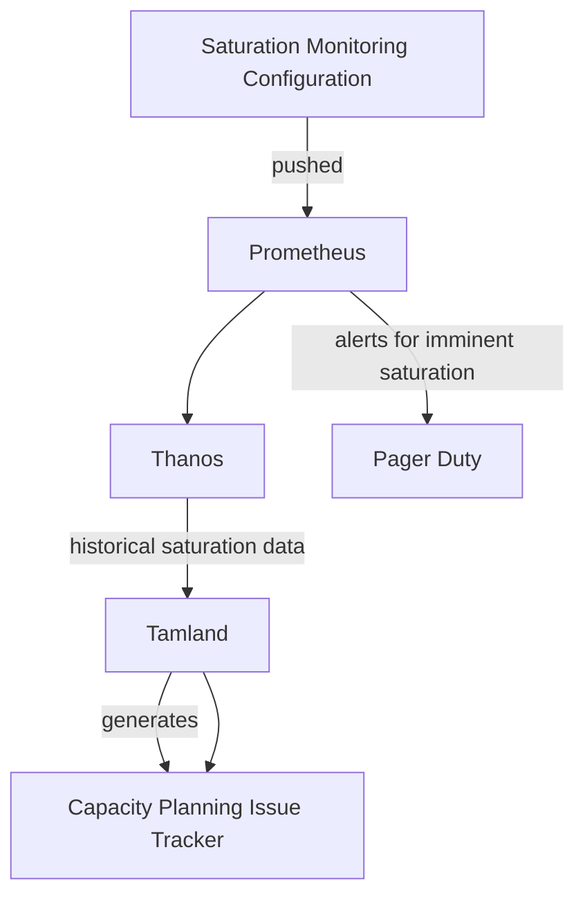

## On this page
{:.no_toc .hidden-md .hidden-lg}

- TOC
{:toc .hidden-md .hidden-lg}

## Introduction

GitLab.com's capacity planning is based on a forecasting model which is populated with the same saturation and utilization data
that is used for short-term monitoring of GitLab.com. 

The forecasting tool generates warnings which are converted to issues and these issues are raised in various status meetings. 

## Tools

At present, we use Facebook's Prophet library for forecasting. The model is used to generate a report, which is published weekly to [https://gitlab-com.gitlab.io/gl-infra/tamland](https://gitlab-com.gitlab.io/gl-infra/tamland).

GitLab's Capacity Planning strategy is based on the following technologies:

1. **[Saturation Monitoring Jsonnet Configuration](https://gitlab.com/gitlab-com/runbooks/-/tree/master/metrics-catalog/saturation)** - for saturation monitoring definition, recording rule generation, short term alerting configuration generation.
1. **Prometheus** - capturing and processing utilization and saturation metrics over the short-term.
1. **[Thanos](https://thanos.gitlab.net/)** - long-term storage of utilization and saturation metrics.
1. **[Tamland](https://gitlab.com/gitlab-com/gl-infra/tamland)** - the forecasting program.
1. **GitLab CI** - running weekly forecast reports.
1. **[Jupyter Book](https://jupyterbook.org/)** - static site generation for generating forecast content from Python based notebooks.
1. **[Facebook Prophet](https://facebook.github.io/prophet/)** - forecasting.
1. **[GitLab Pages Tamland Report Site](https://gitlab-com.gitlab.io/gl-infra/tamland)** - static site hosting of the generated forecasts.
1. **Prometheus Pushgateway** - accepting key metrics from Tamland forecasts.
1. **[GitLab Capacity Planning Issue Tracker](https://gitlab.com/gitlab-com/gl-infra/capacity-planning/-/issues)** - GitLab project used for tracking capacity planning forecast warnings. Issues are created by Tamland directly.
1. **GitLab Slack Integration** - Slack notifications of new issues in the capacity planning project, to the [#infra_capacity-planning](https://gitlab.slack.com/archives/C01AHAD2H8W) channel.

### Source Data

The forecasting model uses the same saturation and utilization data model that we use
to monitor GitLab.com over the short-term. This ensures that anything that we feel is worth monitoring as a potential
saturation point will automatically be included in the forecasting model.

Because of this, all services used on GitLab.com are automatically included in the model.

The short-term saturation metric model used on GitLab.com models each resource as a percentage, from 0% to 100%, where 100% is completely saturated. Each resource has an alerting threshold. If this threshold is breached, alerts will fire and the engineer-on-call will be paged.

The thresholds are decided on a case-by-case basis and vary between resources. Some are near 100% while others are much lower, depending on the nature of the resource, the failure modes on saturation of the resource and the required time-to-mediation. Resources are classed as being either horizontally scalable or not. Horizontally scalable resources are generally considered lower priorities from a capacity planning point-of-view, whereas non-horizontally scalable resources (such as CPU on the primary Postgres instance, for example) require much longer-term strategies for remediation and are therefore considered higher priorities in the capacity planning process.

### Forecasting with Tamland

Tamland relies on Facebook Prophet for generating a forecasting model. Prophet performs analysis of hourly, daily, weekly and monthly trends to forecast a future trend in the data.

Even the most skilled engineer would struggle to predict future saturation, so it's unlikely that a model could do it either. We do not expect it to be totally accurate. Instead, with hundreds of resources on GitLab.com that could potentially become saturated, Tamland's forecasts are a bellweather for changes in trends, particularly upward changes, drawing the attention of engineers who review the data to specific issues.

Tamland will attempt to predict a range of outcomes. For saturation, we focus on the median prediction (50th percentile) and only the upper 80th percentile prediction. The lower 80th percentile is not as important for saturation purposes.

The forecast process, Tamland, runs as a GitLab CI job on `ops.gitlab.net`. This job will run on a schedule defined [in the scheduled pipeline](https://ops.gitlab.net/gitlab-com/gl-infra/tamland/-/pipeline_schedules) (set to weekly). The process starts by reading the historical short-term saturation metric data from Thanos, up to 1-year period, using an hourly resolution.

## Workflow

### Reviewing Tamland Data

1. The Tamland report is generated.
1. If Tamland predicts that a resource will exceed its alerting threshold ([as defined in the metrics catalog](https://gitlab.com/gitlab-com/runbooks/-/tree/master/metrics-catalog/saturation)) within the next 90 days, it creates an issue.
1. On a weekly basis, an engineer reviews all open issues in the [Capacity Planning](https://gitlab.com/gitlab-com/gl-infra/capacity-planning/-/issues) tracker following the [process described on the Scalability:Projections team page](/handbook/engineering/infrastructure/team/scalability/projections.html#triage-duties).
   1. Not all forecasts are always accurate: a sudden upward trend in the resource saturation metric may be caused by a factor that is known to be temporary - for
example, a long running migration. The engineer will evaluate based on all information on-hand and determine whether the forecast is accurate and if the issue
requires investigation.
1. If the engineer observes an unexplained trend they will note down their findings and find an appropriate DRI to investigate further and remediate. We use the
[Infradev Process](/handbook/engineering/workflow/#infradev) and the [Engineering Allocation meeting](/handbook/engineering/#engineering-allocation) to assist with the prioritization of these capacity alerts.
   1. These issues can be the catalyst for other issues to be created in the 'gitlab-org/gitlab' tracker by the stage groups for further investigation. These
issues must be connected to the capacity planning issues as related issues.
1. Any issue concerning resource saturation or capacity planning in any tracker should have the "GitLab.com Resource Saturation' label applied.

### Due Dates

We use the `due date` field to track when the next action is due. For example: the date we expect the issue to drop off the report, or the date we expect the DRI to have taken action. We do this because we want to use the 
[capacity planning issue board](https://gitlab.com/gitlab-com/gl-infra/capacity-planning/-/boards) as the single source of truth. 
The due date is visible on this board and it is easy to see which issues need attention.

The DRI is responsible for maintaining the due date and adding status information each time the due date is adjusted.

### Workflow Status Labels

Capacity Planning issues are created without a state. After the initial assessment, one of the following labels should be applied. 

1. `capacity-planning::investigate` - this alert requires further active assessment before deciding on a course of action
1. `capacity-planning::monitor` - we need to wait for time to pass to gather further data on this issue to make a decision on how to proceed
1. `capacity-planning::in-progress` - there is a mitigation in progress for this alert
1. `capacity-planning::verification` - we have completed work on this issue and are  verifying the result

### Saturation Labels

Each issue has saturation labels, indicating which thresholds it exceeds and how. An issue can have multiple saturation labels; for instance, any issue with `saturation` will, by definition, also have the other three.

1. `saturation` - this issue is predicted (by the median line) to reach 100% saturation in the next 90 days.
1. `violation` - this issue is predicted (by the median line) to reach the saturation threshold (which varies by component) in the next 90 days.
1. `saturation-80%-confidence` - this issue is predicted (by the upper end of the 80% confidence interval) to reach 100% saturation in the next 90 days.
1. `violation-80%-confidence` - this issue is predicted (by the upper end of the 80% confidence interval) to reach the saturation threshold (which varies by component) in the next 90 days.

### Capacity Planning is a shared activity

The Scalability:Projections team owns the Capacity Planning process and we aim to enable others to take responsibility for the 
capacity demands of their features and services. 

### Prioritization Framework

The Scalability:Frameworks team uses capacity planning issues to drive prioritization. By taking saturation data as an input into the planning process, Frameworks team can identity potential projects to balance proactive and reactive work streams.

The prioritization framework uses an [Eisenhower Matrix](https://todoist.com/productivity-methods/eisenhower-matrix), a 2x2 matrix based on _urgency_ and _importance_:

|---|---|
| **Quadrant 1: Do** _Urgent, Important_ Reactive: Non-horizontally scalable resources forecasted to saturate 100% in 90 days. | **Quadrant 2: Decide** _Less Urgent, Important_ Proactive: Non-horizontally scalable resources forecasted to violate hard SLO in 90 days. |
| **Quadrant 3: Delegate** _Urgent, Less Important_ Reactive: Horizontally scalable resources forecasted to saturate 100% in 90 days. | **Quadrant 4: Deny** _Less Urgent, Less Important_ Proactive: Horizontally scalable resources forecasted to violate hard SLO in 90 days. |

 **Urgent** is based on forecast threshold (e.g. `100% saturation` vs. `hard SLO violation`) and **important** is based on scalable resources (e.g. `non_horizontal` vs. `horizontal`). The following resources are available for prioritization:

 * [Quadrant board](https://gitlab.com/gitlab-com/gl-infra/capacity-planning/-/boards/5273449)
 * [Issues sorted by priority](https://gitlab.com/gitlab-com/gl-infra/capacity-planning/-/issues/?sort=label_priority&state=opened)
 * [Scoped prioritized labels](https://gitlab.com/gitlab-com/gl-infra/capacity-planning/-/labels?subscribed=&search=capacity-planning%3A%3Apriority)

### Relaying Capacity Incidents to Engineering

The forecasts are reviewed in the weekly [Engineering Allocation meeting](/handbook/engineering/engineering-allocation) and any required corrective actions are prioritized according to the timeframes for saturation predicted by the forecast, and the criticality of the resources.

Practically, this is done by:
1. From the previous week's agenda, review all new and carry-on items listed. 
   1. For each item, confirm the latest status with the DRI and update the agenda to match.
   1. If there is not movement on an issue, confirm the urgency of the problem and raise awareness in the meeting. Another approach is to ask the DRI for when the next update will be available.
1. In the current week's agenda, add all newly created issues with the purpose of raising awareness and finding a DRI. 

Actions described above can also take place asynchronously at any time - we should not wait for the Engineering Allocation meeting to update issue status or find
DRIs for issues. 

The Scalability:Projections team will triage the capacity alerts by labeling them with the relevant [severity/priority labels](/handbook/engineering/quality/issue-triage/#severity-slos) and 
assign them to the appropriate owner. We rely on the [Infradev Process](/handbook/engineering/workflow/#infradev) to assist with prioritization of these capacity issues. 
We remain available for guidance and review support.

#### Identifying the DRI for a Capacity Issue
There are three scenarios that can occur:

1. Wholly-owned component: An alert fires for a component that is owned by a specific group. Projections will triage the issue, and assign the alert to the Engineering Manager of that group. Tracking of the issue forms part of the Infradev Process. (Where Infrastructure owns the issue, the motivation for addressing the problem comes from wanting to prevent alerts to the on-call engineers).
1. Shared-ownership but clear cause: An alert fires for a general component. During triage, the Projections team can identify a single cause and a clear owner. Projections will triage the issue and assign the alert to the relevant Engineering Manager. Tracking of the issue forms part of the Infradev Process. 
1. Shared-ownership, alert caused by multiple factors: The Projections team will remain the DRI for these issues and may also own the remediation tasks unless a specific DRI can be identified during the investigation. 

The severity and priority assigned to these Infradev issues will be based on the alert information. If the alert continues to fire, the severity and priority
will be raised appropriately. 

When the DRI has been identified, the issue will be assigned to them and a comment will be added to describe how we identified them as the owner as well as what is expected from them to resolve the issue.
The DRI should keep the issue updated by maintaining the due date and adding status information each time the due date is adjusted. 

If the issue belongs to a specific team, the team label will also be applied.

## Examples of Capacity Issues

In this section, we discuss a few capacity planning issues and describe how we applied the process above when addressing them. 

### monitoring / go_memory potential saturation

[gitlab-com/gl-infra/capacity-planning#42](https://gitlab.com/gitlab-com/gl-infra/capacity-planning/-/issues/42)

- The Tamland report showed that this component would likely saturate within the next 30 days. 
- The engineer reviewing the issue saw that the trend lines indicated a problem.
- The engineer contacted the Engineering Manager for the team responsible for this component. 
- The responsible team worked to correct the problem. 
- When the team was satisfied with their changes, we confirmed that this component was no longer showing in the report.
- We also confirmed through source metrics that this component was no longer likely to saturate. 

### redis-cache / redis_memory potential saturation

[gitlab-com/gl-infra/capacity-planning#45](https://gitlab.com/gitlab-com/gl-infra/capacity-planning/-/issues/45)

- The Tamland report showed that this component might saturate in the next few months. 
- The engineer reviewing the issue determined that this saturation point was an artificial limit. It is expected for this component to hover around its maximum without causing problems. 
- The team worked to [exclude these components from the Tamland process](https://gitlab.com/gitlab-com/gl-infra/scalability/-/issues/1746).
- The issue was resolved. 

### redis-cache / node_schedstat_waiting potential saturation

[gitlab-com/gl-infra/capacity-planning#144](https://gitlab.com/gitlab-com/gl-infra/capacity-planning/-/issues/144)

- The Tamland report showed potential saturation.
- The engineer reviewing this problem could see that outliers in the data (due to an incident) impacted the forecast.
- The engineer silenced the alerts and explained why this issue could be closed. 

### git / kube_pool_max_nodes potential saturation

[gitlab-com/gl-infra/capacity-planning#31](https://gitlab.com/gitlab-com/gl-infra/capacity-planning/-/issues/31) and [gitlab-com/gl-infra/capacity-planning#108](https://gitlab.com/gitlab-com/gl-infra/capacity-planning/-/issues/108)

- The Tamland report showed potential saturation.
- The responsible team was contacted and they made changes to address the problem. 
- They believed they had done enough to prevent the saturation from occuring so they closed the issue. 
- When Tamland produced its next report, [the item was still included](https://gitlab.com/gitlab-com/gl-infra/capacity-planning/-/issues/108).
- The responsible team picked up the issue again and found that the metrics reporting the problem had been broken with the previous change.
- The team confirmed that the saturation problem was definitely fixed and corrected the metrics to reflect the change.
- This example shows that Tamland will continue to notify us of a capacity issue until the metrics show that it is resolved. 
