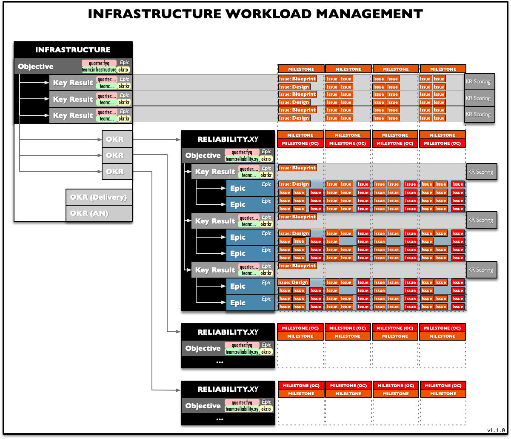

## On this page
{:.no_toc .hidden-md .hidden-lg}

- TOC
{:toc .hidden-md .hidden-lg}

## [Reliability] Workload Workflow

The **workload workflow** plots the overall approach to planning and managing our workload across all levels in the department, from the director through managers to individual contributors. 

In terms of **planning**, the director and the managers use OKRs to define objectives and priorities in a top-down fashion. The managers and individual contributors take said OKRs as inputs to define epics to break down the work into well-defined blocks. These epics can be broken into additional epics or individual issues as necessary. In terms of **execution**, bi-weekly milestones are used to manage sprints of work.

### OKRs

OKRs outline our quarterly objectives, and, by implication, our priorities. Starting with FY20Q1, OKRs in Infrastructure are managed in GitLab. Each OKR **Objective** is represented as an **epic** in the [_GitLab Infrastructure Team_ ](https://gitlab.com/gitlab-com/gl-infra), as is each **Key Result**. Key Result epics are child epics of the Objective epic. Each team in infrastructure, in turn, creates a similar structure for their OKRs. The teams' objective epics are then made children of the department's objective epic.

At this level, each team manager and the team's ICs create the normal themed epics to define and scope a project or phase thereof, and these epics can contain additional epics and/or the issues relevant to said epic.

Thus, epics are linked to create an OKR tree:

| Department        | Team             | Objective                                                              | KR [`A`]                                                               | KR [`P`]                                                               | KR [`I`]                                                                 |
| -----------------:| ---------------- | ----------------------------------------------------------------------:| ---------------------------------------------------------------------- | ---------------------------------------------------------------------- | ---------------------------------------------------------------------- |
| `infrastructure`  |                  | [`infra/33`](https://gitlab.com/groups/gitlab-com/gl-infra/-/epics/33) |
|                   |                  |                                                                 `⤷`    | [`infra/34`](https://gitlab.com/groups/gitlab-com/gl-infra/-/epics/34) | [`infra/35`](https://gitlab.com/groups/gitlab-com/gl-infra/-/epics/35) | [`infra/36`](https://gitlab.com/groups/gitlab-com/gl-infra/-/epics/36) |
|             `⤷`   | `reliability.as` | [`infra/37`](https://gitlab.com/groups/gitlab-com/gl-infra/-/epics/37) |
|                   |                  |                                                                 `⤷`    | [`infra/37`](https://gitlab.com/groups/gitlab-com/gl-infra/-/epics/37) | [`infra/38`](https://gitlab.com/groups/gitlab-com/gl-infra/-/epics/38) | [`infra/38`](https://gitlab.com/groups/gitlab-com/gl-infra/-/epics/38) |
|             `⤷`   | `reliability.ds` | [`infra/38`](https://gitlab.com/groups/gitlab-com/gl-infra/-/epics/38) |
|                   |                  |                                                                 `⤷`    | [`infra/37`](https://gitlab.com/groups/gitlab-com/gl-infra/-/epics/37) | [`infra/38`](https://gitlab.com/groups/gitlab-com/gl-infra/-/epics/38) | [`infra/38`](https://gitlab.com/groups/gitlab-com/gl-infra/-/epics/38) |
|             `⤷`   | `reliability.jf` | [`infra/38`](https://gitlab.com/groups/gitlab-com/gl-infra/-/epics/38) |
|                   |                  |                                                                 `⤷`    | [`infra/37`](https://gitlab.com/groups/gitlab-com/gl-infra/-/epics/37) | [`infra/38`](https://gitlab.com/groups/gitlab-com/gl-infra/-/epics/38) | [`infra/38`](https://gitlab.com/groups/gitlab-com/gl-infra/-/epics/38) |

Each of those OKRs have their corresponding KRs linked to them, which are also represented as epics. The KR epics have their corresponding projects' epics linked to them. Project epics contain issues relevant to said project.

#### Blueprints and Designs
It is expected that KRs have blueprints associated with them that scope the KR and define the KR deliverable. Epics that create new architecture or change the current architecture in significant ways are expected to include a design.

### Milestones

Milestones are used as time-boxes to organize work on two-week sprints. ICs work off these milestones. An additional, special-purpose milestone is used to track on-call work.
