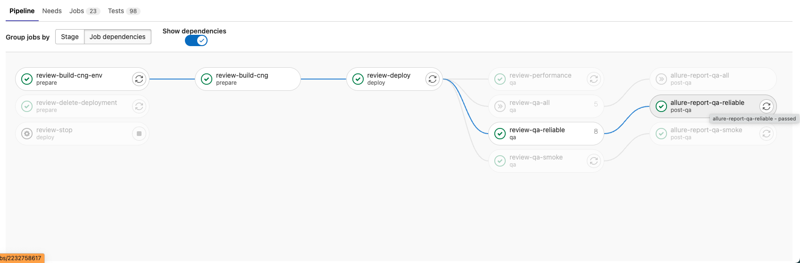
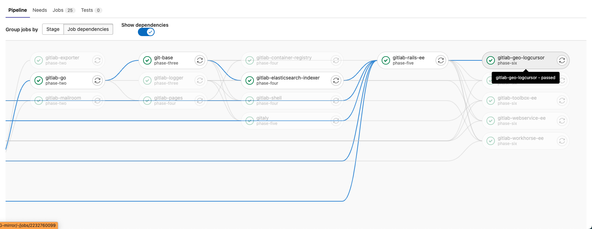

- TOC
{:toc}

## Make review apps faster

This process is here to guide people on how to make the review apps CI/CD pipelines faster.

This is a process followed by the Engineering Productivity team, and it can be used by anybody interested in improving the review apps cycle time (e.g. GitLab employees, community members, [Hackathons](https://about.gitlab.com/community/hackathon/), internships, ...).

### Process overview

1. **Find the *critical path*** of the review app CI/CD pipeline.
1. **Pick a job to analyze** which is *on the critical path*.
1. **Choose a potential improvement** to focus on, or *find a new one* and add it to the table.
1. **Make an experiment** based on your chosen *potential improvement*.
1. **Report the results**.
1. **Repeat** from 1.

### Find the critical path

We have done that step for you:

1. [review-build-cng-env](jobs.html#review-build-cng-env)
2. review-build-cng (child pipeline)
   1. [gitlab-ruby](jobs.html#gitlab-ruby)
   2. [gitlab-go](jobs.html#gitlab-go)
   3. [git-base](jobs.html#git-base)
   4. [gitlab-elasticsearch-indexer](jobs.html#gitlab-elasticsearch-indexer)
   5. [gitlab-rails-ee](jobs.html#gitlab-rails-ee)
   6. [gitlab-workhorse-ee](jobs.html#gitlab-workhorse-ee)
3. [review-deploy](jobs.html#review-deploy)
4. [review-qa-reliable](jobs.html#review-qa-reliable) (a tie with [review-qa-smoke](jobs.html#review-qa-smoke))
5. [allure-report-qa-reliable](jobs.html#allure-report-qa-reliable) (a tie with [allure-report-qa-smoke](jobs.html#allure-report-qa-smoke))

#### How did we compute the critical path?

Pro-tip: To verify whether you made the actual critical path, **add the duration of all jobs on the critical path**: it should **match the pipeline duration**.

1. Pick a review apps pipeline ([an example](https://gitlab.com/gitlab-org/gitlab/-/pipelines/497841797))
2. Enable the `show dependencies` toggle
3. Pick one of the final jobs of the pipeline, and see what other previous jobs **need to be done** for it to start (example: the job `review-deploy` is needed, and all of the jobs that `review-deploy` need to start)
4. Add each job on that trail to your critical path

**Example 1:**

[pipeline](https://gitlab.com/gitlab-org/gitlab/-/pipelines/497841797)

`review-deploy` is on the critical path, because it is needed by all of the `review-qa-*` jobs, which are needed to generate reports.

All of the jobs that are needed for `review-deploy` to start are also part of the critical path.

**Example 2:**

[pipeline](https://gitlab.com/gitlab-org/build/CNG-mirror/-/pipelines/497842091)

`gitlab-rails-ee` is needed by every job after it, so it must be on the critical path. Every job that are needed for `gitlab-rails-ee` are also on the critical path.

The question remains: which jobs should be on the critical path _after_ `gitlab-rails-ee`? Here, simply pick the longest job (which is `gitlab-workhorse-ee` in this pipeline).

Also note that we haven't considered any other dependencies other than `gitlab-rails-ee`, simply because `gitlab-rails-ee` takes around 12 minutes in this pipeline. All the jobs before are around 1-2 minutes, and will therefore finish before.

### Pick a job to analyze

There are several strategies: at random, by your preferences/expertise, the longest job first.

Any improvement on the critical path will help make review apps faster!

You can click on the job in [the critical path section above](#find-the-critical-path) to see the potential improvements & experiments that have been made for that job.

### Choose a potential improvement, or find one

If nothing in the table is inspiring you, go ahead and look at the job output in the pipeline to see whether there are potential improvements you can spot!

Whether you know how to act on them or not, please add the potential improvements you find to the table for the job. It will help the next person wanting to improve the job ([#writeThingsDown](https://about.gitlab.com/handbook/values/#write-things-down)).

### Make an experiment

Once you have selected a potential improvement, it is time to make an experiment that will attempt to improve the speed of the job!

Create an issue with your hypothesis, create an MR to run some tests in your experiment pipeline, and make the job you are focusing on blazingly fast!

TODO: Important - Add instructions on how to efficiently make experiments. We want the fastest feedback loop possible -> can we isolate the job in a pipeline by providing whatever it would require from previous jobs? docker images, artifacts, assets, etc. We could provide an "archive" that would provide all of the pre-requisites, so that we don't have to build them every time when testing!

Whether you have successful results or not, please add the experiment you made to the table for the job ([#writeThingsDown](https://about.gitlab.com/handbook/values/#write-things-down)). It will help the next person wanting to improve the job to know that your experiment has already been tried, how it was conducted, etc.

### List of jobs

[We have a separate page for jobs on the critical path](jobs.html).
